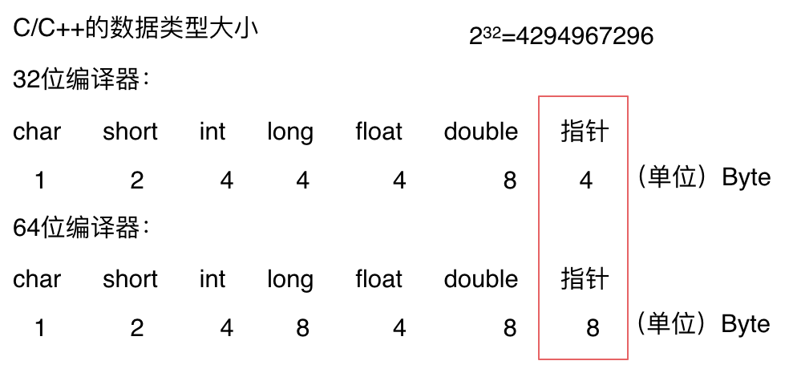
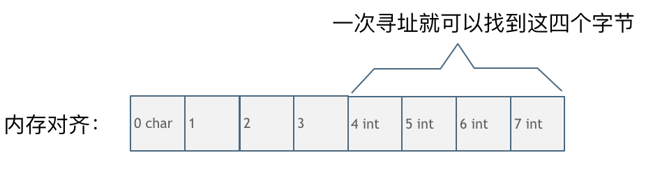

# Analysis of Algorithms

- [Analysis of Algorithms](#analysis-of-algorithms)
  - [Order of Growth](#order-of-growth)
    - [什么是时间复杂度与大 O](#什么是时间复杂度与大-o)
    - [不同数据规模的差异](#不同数据规模的差异)
    - [对数阶以什么为底](#对数阶以什么为底)
    - [一个例子](#一个例子)
  - [递归算法的时间复杂度](#递归算法的时间复杂度)
    - [题目：求 x 的 n 次方](#题目求-x-的-n-次方)
  - [空间复杂度](#空间复杂度)
  - [递归算法的时间与空间复杂度分析举例](#递归算法的时间与空间复杂度分析举例)
    - [递归求斐波那契数列的性能分析](#递归求斐波那契数列的性能分析)
      - [时间复杂度分析](#时间复杂度分析)
      - [空间复杂度分析](#空间复杂度分析)
    - [递归二分法的性能分析](#递归二分法的性能分析)
  - [不同编程语言的内存管理](#不同编程语言的内存管理)
    - [C++ 的内存管理](#c-的内存管理)
    - [计算程序占用的内存](#计算程序占用的内存)
    - [内存对齐](#内存对齐)
      - [为什么需要对齐](#为什么需要对齐)
  - [References](#references)

## Order of Growth

> 增长量级，或者叫复杂度。
>
> The letter O was chosen by Bachmann to stand for Ordnung, meaning the order
> of approximation.

### 什么是时间复杂度与大 O

时间复杂度是一个函数，它定性描述该算法的运行时间。

假设算法的问题规模为 n，那么操作单元数量便用函数 $f(n)$ 来表示。
随着数据规模 n 的增大，算法执行时间的增长率和 $f(n)$
的增长率相同，这称为算法的渐近时间复杂度，简称时间复杂度，记为 $O(f(n))$。

- 大 O 是用来表示上界的，即最坏情况下的运行时间，通常忽略常数项；
- 在谈论算法复杂度时，通常指一般情况，而不是最坏情况，比如
  - 插入排序：
    - 一般情况: $O(n^2)$
    - 最好情况: $O(n)$
    - 最坏情况: $O(n^2)$
  - 快速排序：
    - 一般情况: $O(n\log n)$
    - 最好情况: $O(n\log n)$
    - 最坏情况: $O(n^2)$

### 不同数据规模的差异

- 选择算法时，除了考虑时间复杂度，还要考虑数据规模，如果数据规模很小，用 $O(n^2)$ 有可能比用
  $O(n)$ 更合适。
- 常见复杂度排序：
  - $O(1)$ 常数阶
  - $O(\log n)$ 对数阶
  - $O(n)$ 线性阶
  - $O(n\log n)$ 线性对数阶
  - $O(n^2)$ 平方阶
  - $O(n^3)$ 立方阶
  - $O(2^n)$ 指数阶级

### 对数阶以什么为底

$$
\log_2 n = \log_2 10 \times \log_{10}n
$$

$$
O(\log_2 n) = \log_2 10 \times O(\log_{10}n)
$$

一般化：

$$
O(\log_i n) = \log_i j \times O(\log_j n)
$$

忽略常数项：

$$
O(\log_i n) = O(\log_j n)
$$

因此，在大 O 场景下，对数具体是什么底并不重要。

### 一个例子

题目：找出 n 个字符串中相同的两个字符串（假设这里只有两个相同的字符串）。

如果是暴力枚举的话，时间复杂度是多少呢，是 $O(n^2)$ 么？

这里并不像 int 型数字比较那么简单，除了 $n^2$ 次的遍历次数外，字符串比较还要消耗 m
次操作（m 是字母串的长度），所以时间复杂度是 $O(m \times n \times n)$。

其他解题思路：

先排对 n 个字符串按字典序排序，排序后两个相同的字符串挨在一起，然后再遍历一遍 n 个字符串，这样就找到两个相同的字符串了。

快速排序时间复杂度为 $O(n\log n)$，依然要考虑字符串的长度是 m。快速排序每次的比较都要有 m
次的字符比较的操作，就是 $O(m \times n \times \log n)$。

之后再遍历这 n 个字符串找出两个相同的字符串，遍历的时候依然要比较字符串，所以总共的时间复杂度是
$O(m \times n \times \log n + n \times m)$。

对 $O(m \times n \times \log n + n \times m)$ 进行简化，得到
$O(m \times n \times (\log n + 1))$，再省略常数项，最后的时间复杂度是
$O(m \times n \times \log n)$。

$O(m \times n \times \log n)$ 显然优于 $O(m \times n \times n)$！

因此先把字符串集合排序再遍历一遍找到两个相同字符串的方法比直接暴力枚举的方式更快。

通过分析两种算法的时间复杂度，可以得到更好的结果。

⚠️ 这不是这道题目的最优解。

## 递归算法的时间复杂度

### 题目：求 x 的 n 次方

最直接的解法: $O(n)$

```c
int function1(int x, int n) {
  int result = 1;
  for (int i = 0; i < n; i++) {
    result = result * x;
  }
  return result;
}
```

$O(n)$ 的递归解法：

```c
int function2(int x, int n) {
  if (n == 0) {
    return 1;
  }
  return function2(x, n - 1) * x;
}
```

递归算法的时间复杂度 = **递归次数** * **每次递归中的操作次数**

进一步分解的递归算法：

$$
x^n = x^\frac n 2 \times x^\frac n 2
$$

```c
int function3(int x, int n) {
  if (n == 0) return 1;
  if (n == 1) return x;

  if (n % 2 == 1) {
    return function3(x, n / 2) * function3(x, n / 2) * x;
  }
  return function3(x, n / 2) * function3(x, n / 2);
}
```

递归层数为: $\log_2 n$

递归调用次数: $2 \times 2^{\log_2 n} - 2$

乘法次数: $2^{\log_2 n} - 1$

因此总的运算次数（算上除法次数）为：

$2 \times 2 \times 2^{\log_2 n} - 2 + (2^{\log_2 n} - 1)$

最后依然得到: $O(n)$

```c
int function4(int x, int n) {
  if (n == 0) return 1;
  if (n == 1) return x;

  int t = function4(x, n / 2);
  if (n % 2 == 1) {
    return t * t * x;
  }
  return t * t;
}
```

递归层数为: $\log_2 n$

递归调用次数: $\log_2 n$

乘法次数: $\log_2 n$

因此总的运算次数（算上除法次数）为：

$2 \times \log_2 n$

最后得到: $O(\log n)$

## 空间复杂度

> Space Complexity

即程序运行时占用内存的大小。

$O(1)$ 的例子：

```c
int j = 0;
for (int i = 0; i < n; i++) {
  j++;
}
```

$O(n)$ 的例子：

```cpp
int* a = new int(n);
for (int i = 0; i < n; i++) {
    a[i] = i;
}
```

## 递归算法的时间与空间复杂度分析举例

### 递归求斐波那契数列的性能分析

```c
int fibonacci(int i) {
  if (i <= 0) return 0;
  if (i == 1) return 1;

  return fibonacci(i - 1) + fibonacci(i - 2);
}
```

#### 时间复杂度分析

这个算法每层递归都会有 $\times 2$ 次递归调用，因此时间复杂度为 $O(2^n)$

优化版本：

```c
int fibonacci(int first, int second, int n) {
  if (n <= 0) {
    return 0;
  }
  if (n < 3) {
    return 1;
  }
  else if (n == 3) {
    return first + second;
  }
  else {
    return fibonacci(second, first + second, n - 1);
  }
}
```

每层只有一次递归调用，因此时间复杂度是 $O(n)$。

#### 空间复杂度分析

递归空间复杂度 = **每次递归的空间复杂度** * **递归深度**

每次递归所需的空间都被压到调用栈里，这个栈最大的长度就是递归深度。
而每次递归所需的空间是常量 $O(1)$，递归第 n 个斐波那契数时的深度为 n，因此空间复杂度为
$O(n)$（第一种解法每层有两个递归分支，但是执行时并没有同时展开，因此空间并不会指数膨胀）。

总结：

| 斐波那契数   | 时间复杂度 | 空间复杂度 |
| ------------ | ---------- | ---------- |
| 非递归算法   | $O(n)$     | $O(1)$     |
| 递归算法     | $O(2^n)$   | $O(n)$     |
| 优化递归算法 | $O(n)$     | $O(n)$     |

### 递归二分法的性能分析

```c
int binary_search(int arr[], int l, int r, int x) {
  if (r >= l) {
    int mid = l + (r - l) / 2;
    if (arr[mid] == x)
      return mid;
    if (arr[mid] > x)
      return binary_search(arr, l, mid - 1, x);
    return binary_search(arr, mid + 1, r, x);
  }
  return -1;
}
```

递归深度: $O(\log n)$。空间复杂度时 $O(1) \times O(\log n) = O(\log n)$

如果编程语言在传数组时是拷贝整个数组，则空间复杂度是 $O(n\log n)$

## 不同编程语言的内存管理

- C/C++ 内存堆空间的申请和释放完全靠程序员自己管理；
- Java 依赖 JVM 做内存管理，如果不了解 JVM 内存管理机制，可能会因为错误的写法导致内存泄漏；
- Python 内存是由私有堆空间管理的，所有的 Python 对象和数据结构都存储在私有堆空间中。
  程序员没有访问堆的权限，只有解释器才能操作。
  Python 万物皆对象，基本数据类型所用的内存会要远大于存放纯数据类型所占的内存。
  例如，存储 int 型数据需要四个字节，但是使用 Python 申请一个对象所用空间要远大于四个字节。

### C++ 的内存管理

- 固定部分
  - 代码区：存储二进制代码
  - 数据区：全局变量、静态变量、常量等等
- 可变部分
  - 栈区：函数的实参、局部变量、返回值以及递归栈所需空间，自动分配和回收。
  - 堆区：动态开辟的空间，存放 new 出来的对象在堆区中的真实数据，需要手动管理。

一个由 C/C++ 编译的程序占用的内存分为以下几个部分：

- 栈区 (Stack)：由编译器自动分配释放，存放函数的参数值，局部变量的值等，其操作方式类似于数据结构中的栈。
- 堆区 (Heap)：一般由程序员分配释放，若程序员不释放，程序结束时可能由 OS 收回。
- 未初始化数据区 (Uninitialized Data)：存放未初始化的全局变量和静态变量。
- 初始化数据区 (Initialized Data)：存放已经初始化的全局变量和静态变量。
- 程序代码区 (Text)：存放函数体的二进制代码。

代码区和数据区所占空间都是固定的，而且占用的空间非常小，所以看运行时消耗的内存主要看可变部分。

在可变部分中，栈区间的数据在代码块执行结束之后，系统会自动回收；而堆区间数据需要程序员自己回收，这正是内存泄漏的发源地。

而 Java、Python 的话则不需要程序员去考虑内存泄漏的问题，虚拟机自动解决了这部分问题。

### 计算程序占用的内存



对于 32 位的编译器，4 bytes 可存放的数据大小为 $2^32$，也就是 4GB 空间大小，即寻址空间为 4GB。

对于 64 位的编译器，4 bytes 的指针大小不足以为 4GB 以上的内存寻址，因此指针大小是 8 bytes。

### 内存对齐

**可以跨平台的编程语言都需要做内存对齐，Java、Python 都是一样的**。

#### 为什么需要对齐

1. 平台原因：不是所有的硬件平台都能够访问任意内存地址上的任意数据，某些硬件平台只能在某些地址处取某些特定类型的数据，否则抛出硬件异常。为了同一个程序可以在多平台运行，需要内存对齐。
2. 硬件原因：经过内存对齐后，CPU 访存速度大大提升。
   CPU 访存不是一次读取单个字节，而是一块一块地读取，块大小可以是 2, 4, 8, 16, ...
   字节，具体多少取决于硬件。

```c
struct node{
  int num;
  char cha;
}st;

int main() {
  int a[100];
  char b[100];
  cout << sizeof(int) << endl;
  cout << sizeof(char) << endl;
  cout << sizeof(a) << endl;
  cout << sizeof(b) << endl;
  cout << sizeof(st) << endl;
}

// 4
// 1
// 400
// 100
// 8
```




对齐一定程度上浪费了内存空间，但能提高运行速度。

**编译器一般都会做内存对齐的优化，也就是说在考虑程序真正占用的内存大小的时候，也需要认识到内存对齐的影响**。

## References

- [x] 算法性能分析
  - [x] [时间复杂度分析](https://programmercarl.com/%E5%89%8D%E5%BA%8F/%E5%85%B3%E4%BA%8E%E6%97%B6%E9%97%B4%E5%A4%8D%E6%9D%82%E5%BA%A6%EF%BC%8C%E4%BD%A0%E4%B8%8D%E7%9F%A5%E9%81%93%E7%9A%84%E9%83%BD%E5%9C%A8%E8%BF%99%E9%87%8C%EF%BC%81.html)
  - [x] [算法为什么会超时](https://programmercarl.com/%E5%89%8D%E5%BA%8F/On%E7%9A%84%E7%AE%97%E6%B3%95%E5%B1%85%E7%84%B6%E8%B6%85%E6%97%B6%E4%BA%86%EF%BC%8C%E6%AD%A4%E6%97%B6%E7%9A%84n%E7%A9%B6%E7%AB%9F%E6%98%AF%E5%A4%9A%E5%A4%A7%EF%BC%9F.html)
  - [x] [递归算法的时间复杂度](https://programmercarl.com/%E5%89%8D%E5%BA%8F/%E9%80%9A%E8%BF%87%E4%B8%80%E9%81%93%E9%9D%A2%E8%AF%95%E9%A2%98%E7%9B%AE%EF%BC%8C%E8%AE%B2%E4%B8%80%E8%AE%B2%E9%80%92%E5%BD%92%E7%AE%97%E6%B3%95%E7%9A%84%E6%97%B6%E9%97%B4%E5%A4%8D%E6%9D%82%E5%BA%A6%EF%BC%81.html)
  - [x] [算法性能分析系列一](https://programmercarl.com/%E5%91%A8%E6%80%BB%E7%BB%93/20201210%E5%A4%8D%E6%9D%82%E5%BA%A6%E5%88%86%E6%9E%90%E5%91%A8%E6%9C%AB%E6%80%BB%E7%BB%93.html)
  - [x] [空间复杂度分析](https://programmercarl.com/%E5%89%8D%E5%BA%8F/%E5%85%B3%E4%BA%8E%E7%A9%BA%E9%97%B4%E5%A4%8D%E6%9D%82%E5%BA%A6%EF%BC%8C%E5%8F%AF%E8%83%BD%E6%9C%89%E5%87%A0%E4%B8%AA%E7%96%91%E9%97%AE%EF%BC%9F.html)
  - [x] [递归算法的性能分析](https://programmercarl.com/%E5%89%8D%E5%BA%8F/%E9%80%92%E5%BD%92%E7%AE%97%E6%B3%95%E7%9A%84%E6%97%B6%E9%97%B4%E4%B8%8E%E7%A9%BA%E9%97%B4%E5%A4%8D%E6%9D%82%E5%BA%A6%E5%88%86%E6%9E%90.html)
  - [x] [代码的内存消耗](https://programmercarl.com/%E5%89%8D%E5%BA%8F/%E5%88%B7%E4%BA%86%E8%BF%99%E4%B9%88%E5%A4%9A%E9%A2%98%EF%BC%8C%E4%BD%A0%E4%BA%86%E8%A7%A3%E8%87%AA%E5%B7%B1%E4%BB%A3%E7%A0%81%E7%9A%84%E5%86%85%E5%AD%98%E6%B6%88%E8%80%97%E4%B9%88%EF%BC%9F.html)
