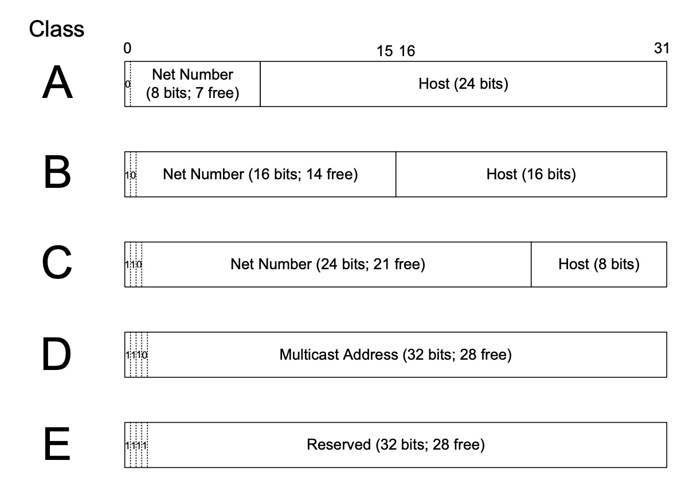

# The Internet Address Architecture

- [The Internet Address Architecture](#the-internet-address-architecture)
  - [1. Introducion](#1-introducion)
  - [2. Expressing IP Addresses](#2-expressing-ip-addresses)
  - [3. Basic IP Address Structure](#3-basic-ip-address-structure)
    - [3.1 Classful Addressing](#31-classful-addressing)
    - [3.2 Subnet Addressing](#32-subnet-addressing)

## 1. Introducion

- ISPs: Internet Service Providers

## 2. Expressing IP Addresses

- IPv4: `[0,255].[0,255].[0,255].[0,255]`
- IPv6:
  `[0,ffff]:[0,ffff]:[0,ffff]:[0,ffff]:[0,ffff]:[0,ffff]:[0,ffff]:[0,ffff]`
  1. Leading zeros of a `block` need not be written.
  2. Blocks of all zero can be ommited and replaced by the notation `::`.
      `0:0:0:0:0:0:0:1` -> `::1`. To avoid ambiguities, the `::` notation may be
      used only once in an IPv6 address.
  3. Embedded IPv4 addresses represented in the IPv6 format can use a form of
      hybrid notation in which the block immediately preceding the IPv4 portion
      of the address has the value `ffff` and the remaining part of the address
      is fomatted using dotted-quad. For example, the IPv6 address
      `::ffff:10.0.0.1` represents the IPv4 address `10.0.0.1`. This is called
      an **IPv4-mapped** IPv6 address.
  4. A conventional notation is adopted in which the low-order 32 bits of the
      IPv6 address can be written using dotted-quad notation. The IPv6 address
      `::0102:f001` is therefore equivalent to the address `::1.2.240.1`.
      This is called an **IPv4-compatible IPv6 address**. This type of
      addressing was originally required for transition plans between IPv4 and
      IPv6 but is **now no longer required** [RFC4291].

In some circumstances the colon delimiter in an IPv6 address may be confused
with another separator. In such circumstances, bracket characters, `[]` are used
to surround the IPv6 address.

```txt
http://[2001:0db8:85a3:08d3:1319:8a2e:0370:7344]:443/
```

The flexibility provided by [RFC4291] resulted in unnecessary confusion due to
the ability to represent the same IPv6 address in multiple ways. To remedy this
situation, [RFC5952] imposes some rules to narrow the range of options while
remaining compatible with [RFC4291]. They are as follows:

1. Leading zeros must be suppressed.
2. If multiple blocks contain equal-length runs of zeros, the first is replaced
   with `::`.
3. The hexadecimal digits a through `f` should be represented in lowercase.

## 3. Basic IP Address Structure

IP cast types:

- unicast
- broadcast
- multicast
- anycast

### 3.1 Classful Addressing

1. When the Internet's address structure was originally defined, every unicast
   IP address had a ***network*** portion and a ***host*** portion.
   Thus, some number of contiguous bits in the address became known as the
   ***net number***, and remaining bits were known as the ***host number***.
2. With the realization that different networks might have different numbers of
   hosts, a partitioning was devised wherein different-size allocation units of
   IP address space could be given out to different sites, based on their
   current and projected number of hosts.

The partitioning of the address space involved 5 classes:



| Class | Head | Use             | Total | Nets      | Hosts      |
| ----- | ---- | --------------- | ----- | --------- | ---------- |
| A     | 0    | Unicast/Special | 1/2   | 128       | 16,777,216 |
| B     | 10   | Unicast/Special | 1/4   | 16,384    | 65,536     |
| C     | 110  | Unicast/Special | 1/8   | 2,097,152 | 256        |
| D     | 1110 | Multicast       | 1/16  | N/A       | N/A        |
| E     | 1111 | Reserved        | 1/16  | N/A       | N/A        |

Address Range:

- A: `0.0.0.0-127.255.255.255`
- B: `128.0.0.0-191.255.255.255`
- C: `192.0.0.0-223.255.255.255`
- D: `224.0.0.0-239.255.255.255`
- E: `240.0.0.0-255.255.255.255`

The above Hosts numbers are not exact. Several addresses are not generally
available for use as unicast addresses.

In particular, the first (N.0.0.0) and last (N.255.255.255) addresses of the
range are not generally available.

The classful approach to Internet addressing lasted mostly intact for the first
decade of the Internet's growth (to about the early 1980s).

### 3.2 Subnet Addressing

>>>>> progress
