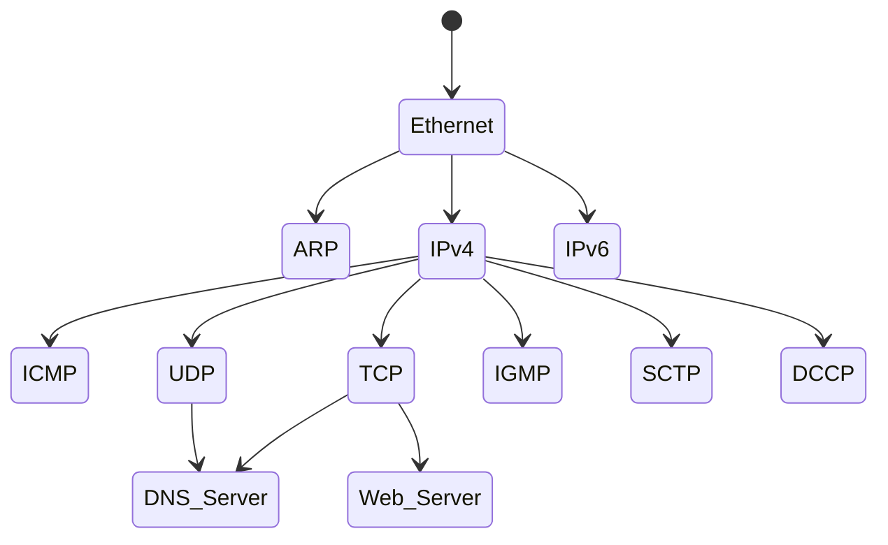

# Introduction

- [Introduction](#introduction)
  - [1. Architectural Principles](#1-architectural-principles)
    - [1.1 Packets, Connections, and Datagrams](#11-packets-connections-and-datagrams)
    - [1.2 The End-to-End Argument and Fate Sharing](#12-the-end-to-end-argument-and-fate-sharing)
    - [1.3 Error Control and Flow Control](#13-error-control-and-flow-control)
  - [2. Design and Implementation](#2-design-and-implementation)
    - [2.1 Layering](#21-layering)
    - [2.2 Multiplexing, Demultiplexing, and Encapsulation in Layered Implementations](#22-multiplexing-demultiplexing-and-encapsulation-in-layered-implementations)
  - [3. The Architecture and Protocols of the TCP/IP Suite](#3-the-architecture-and-protocols-of-the-tcpip-suite)
    - [3.1 The ARPANET Reference Model](#31-the-arpanet-reference-model)
    - [3.2 Multiplexing, Demultiplexing, and Encapsulation in TCP/IP](#32-multiplexing-demultiplexing-and-encapsulation-in-tcpip)
    - [3.3 Port Numbers](#33-port-numbers)
    - [3.4 Names, Addresses, and the DNS](#34-names-addresses-and-the-dns)
  - [4. Internets, Intranets, and Extranets](#4-internets-intranets-and-extranets)
  - [5. Designing Applications](#5-designing-applications)
    - [5.1 Client/Server](#51-clientserver)
    - [5.2 Peer-to-Peer](#52-peer-to-peer)
    - [5.3 Applications Programming Interfaces (APIs)](#53-applications-programming-interfaces-apis)
  - [6. Standardization Process](#6-standardization-process)
    - [6.1 Request for Comments (RFC)](#61-request-for-comments-rfc)
    - [6.2 Other Standards](#62-other-standards)
  - [7. Implementations and Software Distributions](#7-implementations-and-software-distributions)
  - [8. Attacks Involving the Internet Architecture](#8-attacks-involving-the-internet-architecture)
  - [9. Summary](#9-summary)

The first definition of a protocol, according to the *New Oxford American
Dictionary*, is

> The official procedure or system of rules governing affairs of state or
> diplomatic occasions.

A collection of related protocols is called a ***protocol suite***.

The design that specifies how various protocols of a protocol suite relate to
each other and devide up tasks to be accomplished is called the
***architecture*** or ***reference model*** for the protocol suite.

TCP/IP is a protocol suite that implements the Internet architecture and draws
its origins from the ***ARPANET Reference Model*** (ARM).

## 1. Architectural Principles

- WAN: wide area network

**The Internet vs. the World Wide Web:**

- We refer to the Internet in terms of its ability to provide basic
  communication of messages between computers.
- We refer to WWW as an application that uses the Internet for communication.

**The goals of the Internet Architecture:**

The primary goal: **develop an effective technique for multiplexed utilization
of existing interconnected networks**.

The second-level goals are:

- Internet communication must continue despite loss of networks or gateways.
- The Internet must support multiple types of communication services.
- The Internet architecture must accommodate a variety of networks.
- The Internet architecture must permit distributed management of its resources.
- The Internet architecture must be cost-effective.
- The Internet architecture must permit host attachment with a low level of
  effort.
- The resource used in the Internet architecture must be accountable.

### 1.1 Packets, Connections, and Datagrams

- **packets**
  - *statitical multiplexing*
    - FCFS/FIFO: first-come-first-served/first-in-first-out
  - *time-division multiplexing* (TDM)
  - *static multiplexing*
- **connection-oriented** networks
  - *virtual circuits* (VCs)
    - *X.25*
      - *logical channel identifier* (LCI)
      - *logical channel number* (LCN)
  - *digital subscriber line* (DSL)
- **datagrams**: a datagram is a special type of packet in which all the
  identifying information of the source and final destination resides inside the
  packet itself.
  - *message boundaries/ record markers*
    - Most datagram protocols preserve message boundaries.
    - Applications need to implement their own methods to indicate a sender's
      message boundaries if this capability is required.

### 1.2 The End-to-End Argument and Fate Sharing

One of the most important principles that influenced the design of the TCP/IP
suite is called the *end-to-end argument*:

> The function in question can completely and correctly be implemented only
> with the knowledge and help of the application standing at the end points of
> the communication system. Therefore, providing that questioned function as a
> feature of the communication itself is not possible. (Sometimes an incomplete
> version of the function provided by the communication system may be useful as
> a performance enhancement.)

It argues that correctness and completeness can be achieved ***only*** by
involving the application or ultimate user of the communication system. This
principle argues that important functions (e.g., error control, encryption,
delivery acknowledgment) should usually not be implemented at low levels (or
layers) of large systems.

The TCP/IP took the design to which the end-to-end argument tends to support
with a "dumb" network and "smart" systems connected to the network. Its many
functions (e.g., methods to ensure that data is not lost, controlling the rate
at which a sender sends) are implemented in the end hosts where the applications
reside.

*Fate sharing* suggests placing all the necessary state to maintain an active
communication association (e.g., virtual connection) at the same location with
the communicating endpoints. With this reasoning, the only type of failure that
destroys communication is one that also destroys one or more of the endpoints,
which obviously destroys the overall communication anyhow. Fate sharing is one
of the design philosophies that allows virtual connections (e.g., those
implemented by TCP) to remain active even if connectivity within the network
has failed for a (modest) period of time. Fate sharing also supports a "dumb
network with smart end hosts" model, and one of the ongoing tensions in today's
Internet is what functions reside in the network and what functions do not.

### 1.3 Error Control and Flow Control

- *error control*: it can be implemented in the systems constituting the network
  infrastructure, or in the systems that attach to the network, or some
  combination.
- *best-effort delivery*: the network does not expend much effort to ensure that
  data is delivered without errors or gaps.
- *flow control*: operate outside the network and at higher levels of the
  communication system.
  - This is consistent with the end-to-end argument: TCP, which resides at the
    end hosts, handles rate control.
  - It is also consistent with fate sharing: the approach allows some elements
    of the network infrastructure to fail without necessarily affecting the
    ability of the devices outside the network to communicate as long as some
    communication path continues to operate.

## 2. Design and Implementation

### 2.1 Layering

Layers are beneficial because a layered design allows developers to evolve
different portions of the system separately, often by different people with
somewhat different areas of expertise.

- *Open Systems Interconnection* (OSI) model
  - Hosts
    - `7` Application
    - `6` Presentation
    - `5` Session
    - `4` Transport
  - All Networked Devices
    - `3` Network (or Internetwork)
    - `2` Link (or Data-Link)
    - `1` Physical
- The TCP/IP architecture is normally considered to consist of five.
  - Hosts
    - `5` Application
    - `4` Transport
  - All Networked Devices
    - `3` Network (or Internetwork)
    - `2` Link (or Data-Link)
    - `1` Physical

### 2.2 Multiplexing, Demultiplexing, and Encapsulation in Layered Implementations

A layered architecture has natural ability to perform *protocol multiplexing*.
This form of multiplexing allows multiple different protocols to coexist on the
same infrastructure. It also allows multiple instantiations of the same
protocol object to be used simultaneously without being confused.

When an object, called a *protocol data unit* (PDU), at one layer is carrried
by a lower layer, it is said to be *encapsulated* by the next layer down. Thus,
multiple objects at layer `N` can be multiplexed together using encapsulation
in layer `N - 1`.

The essence of encapsulation is that each layer treats the
data from above as opaque, uninterpretable information.

```diagram
Layer Number          Encapsulated Object

N                                       [Layer N PDU.....]
                                        |                |
                                        v                v
N-1                   [Layer N-1 Header][PDU from Layer N]...[Layer N-1 Trailer]
                      |                 [Treated as Opaque Data at Layer N-1]  |
                      v                                                        v
N-2 [Layer N-2 Header][PDU from Layer N-1......................................]
                      [Treated as Opaque Data at Layer N-2]
```

Encapsulation takes place at each sender, and decapsulation takes place at each
receiver.

A router, by definition, has two or more network interfaces (because it connects
two or more networks). Any system with multiple interfaces is called *multihomed*.

## 3. The Architecture and Protocols of the TCP/IP Suite

There are many protocols beyond TCP and IP in the collection or family of
protocols used with the Internet.

### 3.1 The ARPANET Reference Model

The TCP/IP suite Layering inspired by the ARPANET reference model (real
implementations include a few specialized protocols that do not fit cleanly
into the conventional layers):

- Hosts
  - `5` Application (e.g., HTTP, DNS, DHCP)
  - `4` Transport (e.g., TCP, UDP, SCTP, and DCCP)
- All Internet Devices
  - `3.5` Network (Adjunct, unofficial "layer". e.g., ICMP, IGMP, IPsec)
  - `3` Network (e.g., IP and IPv6 protocols)
  - `2.5` Link (Adjunct, unofficial "layer". e.g., *Address Resolution Protocol*
    (ARP))

### 3.2 Multiplexing, Demultiplexing, and Encapsulation in TCP/IP

At each layer there is an identifier that allows a receiving system to determine
which protocol or data stream belongs together.



### 3.3 Port Numbers

*Port numbers* are 16-bit nonnegative integers (`0`~`65535`). Each IP address
has 65,536 associated port numbers for each transport protocol that uses port
numbers, and they are used for determining the correct receiving application.

Standard port numbers are assigned by the Internet Assigned Numbers Authority
(IANA).

The set of numbers is divided into special ranges:

- *well-known*: `0`~`1023`
  - `20/21`: FTP
  - `22`: SSH
  - `23`: Telnet
  - `25`: SMTP
  - `53`: DNS
  - `80`: HTTP
  - `143`: IMAP
  - `161/162`: SNMP
  - `389`: LDAP
  - `443`: HTTPS
  - `993`: IMAPS
- *registered*: `1024`~`49151`
- *dynamic/private*: `49152`~`65535`
  - also called *ephemeral* port numbers on clients

> Most well-known port numbers are odd numbers. This is because they are derived
> from the NCP (Network Control Protocol, preceded TCP as a transport-layer
> protocol for the ARPANET) port numbers. NCP was simplex, not full duplex, so
> each application required two connections, and an even-odd pair of port
> numbers was reserved for each application.

### 3.4 Names, Addresses, and the DNS

The DNS is a **distributed database** that provides the mapping between host
names and IP addresses.

## 4. Internets, Intranets, and Extranets

- The lowercase *internet* means multiple networks connected together, using a
  common protocol suite.
- The uppercase *Internet* refers to the collection of hosts around the world
  that can communicate with each other using TCP/IP.
- The Internet is an internet, but the reverse is not true.
- An *intranet* is the term used to describe private internetwork.
- An *extranet* is the term used to describe network that contains servers
  accessible to certain partners of an enterprise or business using the
  Internet.

> Historically *IP routers* are called *gateways*. Today the term gateway is
> used for an *application-layer gateway* (ALG), a process that connects two
> different protocol suites for one particular application.

## 5. Designing Applications

### 5.1 Client/Server

We can categorize servers in to two classes:

- *iterative*:
  - process:
    - I1. Wait for a client request to arrive.
    - I2. Process the client request.
    - I3. Send the response back to the client that sent the request.
    - I4. Go back to step I1.
  - disadvantage: if I2 takes a long time, during the time no other clients are
    serviced.
- *concurrent* (mostly are today)
  - process:
    - C1. Wait for a client request to arrive.
    - C2. Start a new server instance to handle this client's request.
      Meanwhile, the original server instance continues to C3.
      - This may involve creating a new process, task, or thread, depending on
        what the underlying operating system supports.
      - This new server handles one client's entire request.
      - When the requested task is complete, the new server terminates.
    - C3. Go back to step C1.

### 5.2 Peer-to-Peer

Also called p2p.

Each application acts both as a client and as a server, sometimes as both at
once, and is capable of forwarding requests. e.g., Skype, BitTorrent.

A concurrent p2p application may receive an incoming request, determine if it is
able to respond to the request, and if not forward the request on to some other
peer. Thus, the set of p2p applications together form a network among
applications, also called an *overlay network*.

One of the primary problems in p2p networks is called the *discovery problem*.
This is usually handled by a bootstrapping procedure whereby each client is
initially configured with the addresses and port numbers of some peers that are
likely to be operating.

### 5.3 Applications Programming Interfaces (APIs)

The most common API for TCP/IP networks is called *sockets*.

## 6. Standardization Process

- Internet Engineering Task Force (IETF)
- Internet Architecture Board (IAB)
  - Internet Research Task Force (IRTF)
- Internet Engineering Steering Group (IESG)
- Internet Society (ISOC)
- Standard-Defining Organizations (SDOs)

### 6.1 Request for Comments (RFC)

> <http://www.rfc-editor.org/>

All RFCs are not standards. Only so-called *standard-track* category RFCs are
considered to be official standards.

Other categories include *best current practice* (BCP), *informational*,
*experimental*, and *historic*.

⚠️ It is important to realize that just because a document is an RFC does not
mean that the IETF has endorsed it as any form of standard.

### 6.2 Other Standards

The most important of these groups include the *Institute of Electrical and
Electronics Engineers* (IEEE), the *World Wide Web Consortium* (W3C), and the
*International Telecommunication Union* (ITU).

In their activities relevant to this text, IEEE is concerned with standards
below layer 3 (Phisical and Link layers), and W3C is concerned with
application-layer protocols. ITU standardizes protocols used within the
telephone and cellular networks.

## 7. Implementations and Software Distributions

This historical de facto standard TCP/IP implementations were from the
Computer Systems Research Group (CSRG) at the University of California,
Berkeley.

## 8. Attacks Involving the Internet Architecture

The Internet Architecture delivers IP datagrams based on destination IP
addresses. As a result, malicious uses are able to insert whatever IP address
they choose into the source IP address field of each IP datagram they send, an
activity called *spoofing*. The resulting datagrams are delivered to their
destinations, but it is difficult to perform *attribution*. That is, it may be
difficult or impossible to determine the origin of a datagram received from the
Internet.

*Denial-of-Service* (Dos) attacks usually involve using so much of some
important resource that legitimate users are denied service. For example,
sending so many IP datagrams to a server that it spends all of its time just
processing the incoming packets and performing no other useful work is a type
of DoS attack. A Distributed DoS (DDoS) attack sends so much traffic that no
other packets can be sent by using many computers.

*Unauthorized Access* attacks involve accessing information or resources in an
unauthorized fashion.

## 9. Summary

Packet switching using datagrams was chosen for its robustness and efficiency.
Security and predictable delivery of data were secondary concerns.
