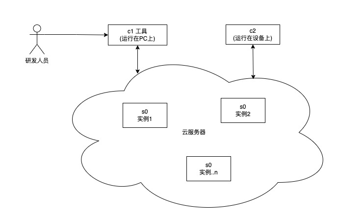
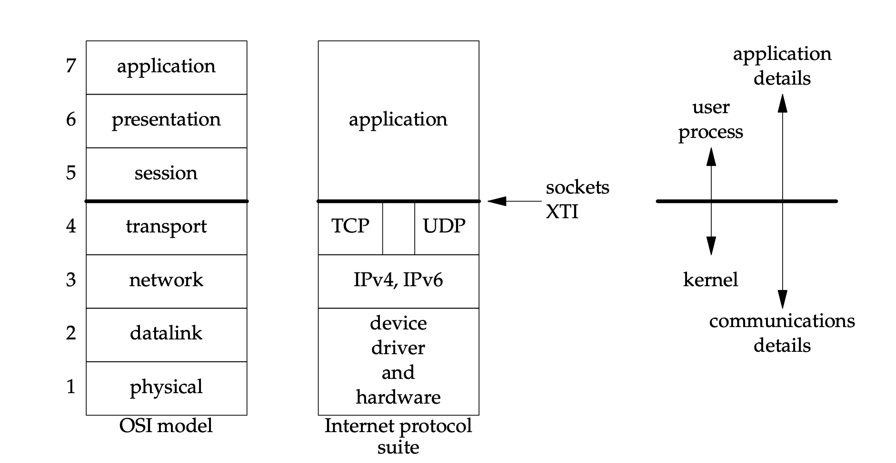
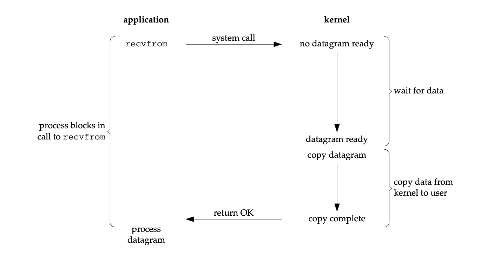
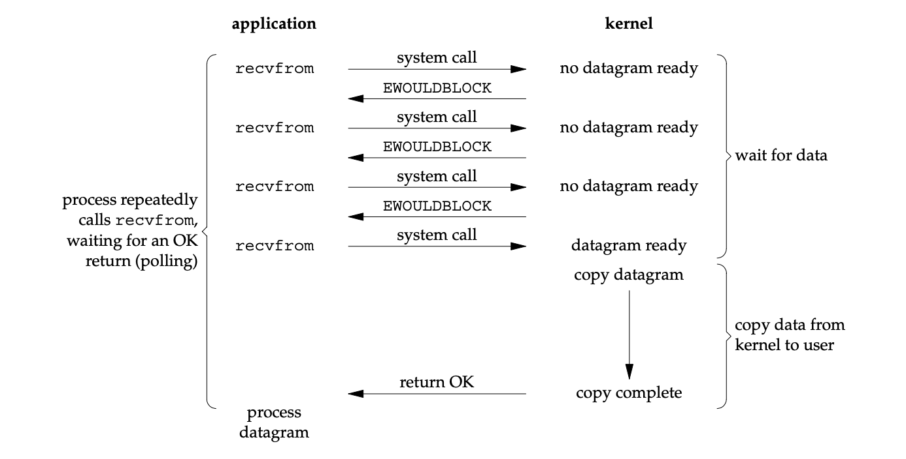
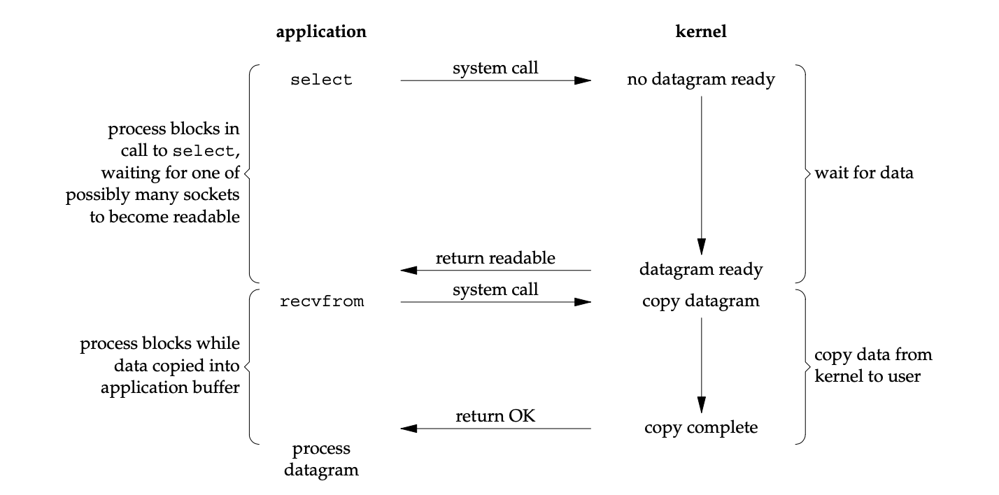
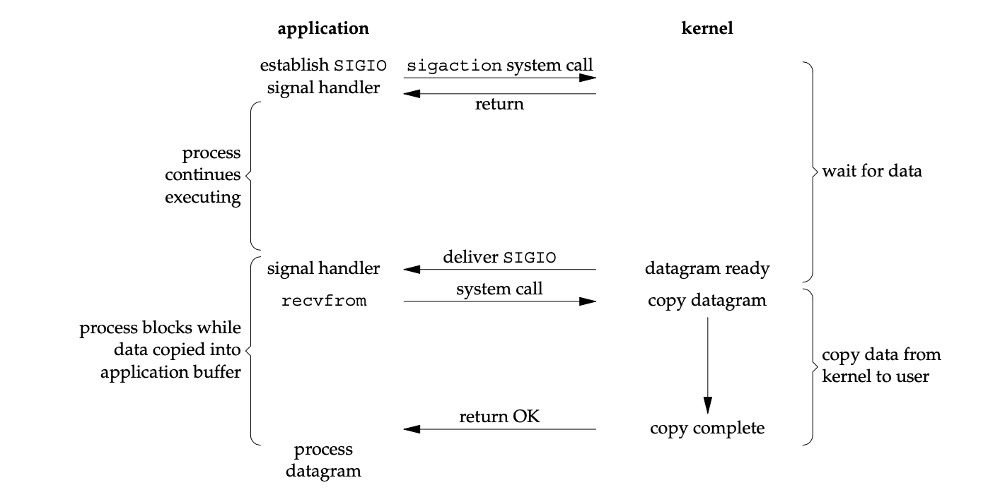
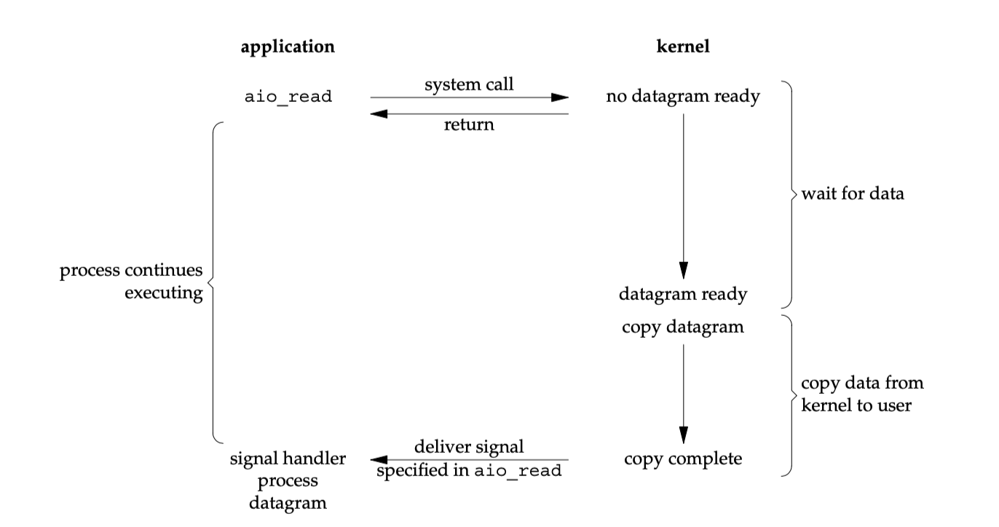
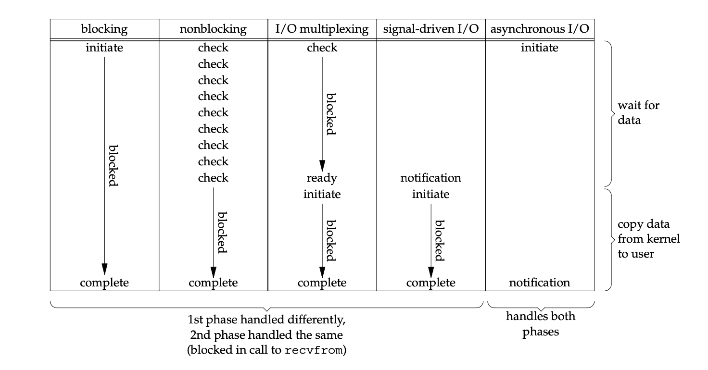

<!-- class: lead invert -->

# 从 C10K 问题到高并发服务器开发

`2021.12.24`

---

<!-- class: invert -->

## 1. The C10K Problem

## 2. 并发策略

## 3. Demo: 简陋 HTTP Server

~~4. 现在与未来~~

## 5. 参考资料

---

<!-- class: invert lead -->

## 1. The C10K Problem

---

<!-- class: invert -->

## 1. The C10K Problem

### 1.1 "C10K"?

单机并发处理 10,000 (10K) 个客户端 (C 代表 Clients, 有些文章使用 "Connections" 一词)。

---

<!-- class: invert -->

### 1.2 背景

Dan Kegel (`/dæn 'keɡəl/`) 于 1999 年在其 [个人站点](http://www.kegel.com) 提出了 [C10K 问题](http://www.kegel.com/c10k.html)。


---

### 1999 年互联网用户数

<!-- class: invert lead -->


<https://ourworldindata.org/internet>

---

> You can buy a 1000MHz machine with 2 gigabytes of RAM and an 1000Mbit/sec Ethernet card for $1200 or so. Let's see - at 20000 clients, that's 50KHz, 100Kbytes, and 50Kbits/sec per client. It shouldn't take any more horsepower than that to take four kilobytes from the disk and send them to the network once a second for each of twenty thousand clients. (That works out to $0.08 per client, by the way. Those $100/client licensing fees some operating systems charge are starting to look a little heavy!) So `hardware is no longer the bottleneck`.

---

<!-- class: invert -->

### 处理“请求”与“连接”的区别

- 大量请求：需要高吞吐率，更关心每个请求的处理速度
- 大量连接：无论连接上的数据交互繁忙与否都需要高效的网络连接管理

---

<!-- class: lead invert -->

### S0 服务



---

<!-- class: invert -->

> 早期的腾讯QQ也同样面临 C10K 问题，只不过他们是用了 UDP 这种原始的包交换协议来实现的，绕开了这个难题，当然过程肯定是痛苦的。

在 2000 年前后一段时间，C10K 是实实在在的难题。

Dan Kegel 对这个问题进行系统的归纳和总结，并提出解决方案。

---

<!-- class: invert -->

### 1.3 主要内容

> Here are a few notes on how to **configure operating systems** and **write code** to support thousands of clients.

-> *The C10K Problem (pdf)*

---

<!-- class: lead invert -->

# 先体验一下网站不响应的感觉

## Django `runserver`

---

<!-- class: invert lead -->

## 2. 并发策略 & 3. Demo: 简陋 HTTP Server

---

## 先实现一个无并发 HTTP Server

`Demo`

---

<!-- class: invert -->

## 3. Demo: 简陋 HTTP Server

### `Demo 1`: 单进程(线程) HTTP Server 实现

1. 监听本地地址并接收 TCP 连接
2. 按照 HTTP 协议解析请求字节流
3. 实现业务
4. 按照 HTTP 协议返回字节流
5. 关闭 TCP 连接

---

<!-- class: lead invert -->

#### 操作系统维护的两个 TCP 队列


---

<!-- class: invert -->

#### 操作系统维护的两个 TCP 队列

数量限制 (Linux):

- syns queue: `/proc/sys/net/ipv4/tcp_max_syn_backlog`
- accept queue: `/proc/sys/net/core/somaxconn`

---

<!-- class: lead invert -->

#### 传输层及以下由操作系统管理



---

<!-- class: invert -->

## 2. 并发策略

### 2.1 从 I/O 角度: 是否在单个进程/线程内处理多个客户端

1. 进程/线程内只处理一个客户端，并完全使用阻塞/同步调用，结合多进程或多线程实现并发；
2. 使用非阻塞调用启动 I/O，结合就绪通知 (如 `poll()`) 来进行后续操作，通常只能用于网络 I/O；
3. 使用异步调用 (如 `aio_write()`) 启动 I/O，结合完成通知 (如信号 (`signals`), [IOCP](https://en.wikipedia.org/wiki/Input/output_completion_port) ) 来进行后续操作，可用于网络 I/O 与磁盘 I/O。

---

### 2.2 从进程/线程角度: 用什么控制单元去处理客户端

- 每个进程处理一个客户端（经典 Unix 做法，始于 1980 年）
- 每个系统级 (OS-level，或内核级 kernel-level) 线程处理多个客户端，每个客户端使用如下方式处理
  - 用户级 (user-level) 线程
  - ~~状态机 (state machine): "线程是为不懂状态机的程序员准备的"~~
  - ~~[Continuation](https://en.wikipedia.org/wiki/Continuation)~~
- 每个系统级线程处理一个客户端 (Java 原生多线程)
- 每个系统级线程处理一个活跃客户端 (IOCP, 线程池)

---

### 2.3 从操作系统角度: 是否要使用标准系统服务？魔改内核？自己写驱动？

---

### 2.4 几种组合方案

1. **每个线程服务多个客户端，并使用非阻塞和水平触发 (level-triggered) 就绪通知**
2. **每个线程服务多个客户端，并使用非阻塞和边沿触发 (edge-triggered) 就绪通知**
3. *每个线程服务多个客户端，并使用异步 I/O*
4. **每个线程服务单个客户端，并使用阻塞 I/O**
5. *把服务器做到操作系统内核*
6. 把 TCP 协议栈带到用户空间

---

<!-- class: lead invert -->

### 一个 Server 进程理论上能同时接受多少 TCP 连接？

---

<!-- class: invert -->

### 一个 Server 进程理论上能同时接受多少 TCP 连接？

#### 1. 文件句柄限制

a. 进程限制

```sh
ulimit -n
ulimit -n 10086
```

b. 全局限制

```sh
cat /proc/sys/fs/file-nr
```

---

#### 2. 端口号范围限制？

概念：**TCP Socket Pair** 是一个四元组，它定义了一个连接的两端：

- Local IP, Port
- Foreign IP, Port

一个 Socket Pair 可以唯一标识一个 TCP 连接。

对于服务器来说，由于监听了本地地址，所以相当于只有 Foreign IP & Port 可变。

最大连接数 = 2^32 (IP数) * 2^16 (Port 数) `?`

---

## 3. Demo: 简陋 HTTP Server

### `Demo 2`: 同步 + 阻塞的多进程 vs. 多线程

---

### 2.4 几种组合方案

1. **每个线程服务多个客户端，并使用非阻塞和水平触发 (level-triggered) 就绪通知**
2. **每个线程服务多个客户端，并使用非阻塞和边沿触发 (edge-triggered) 就绪通知**
3. *每个线程服务多个客户端，并使用异步 I/O*
4. **每个线程服务单个客户端，并使用阻塞 I/O**
5. *把服务器做到操作系统内核*
6. 把 TCP 协议栈带到用户空间

---

### 2.5 五种 I/O 模型

1. 阻塞 (blocking) I/O
2. 非阻塞 (nonblocking) I/O
3. I/O 多路复用 (multiplexing)
4. 信号驱动 (signal driven) I/O
5. 异步 (asynchronous) I/O

#### 网络 I/O 步骤 (以读取为例):

1. 等待数据: 网络包到达并存储在内核缓冲区 (就绪状态)
2. 复制数据: 将数据从内核缓冲区复制到用户进程的内存空间

---

#### 2.5.1 阻塞 (blocking) I/O



---

#### 2.5.2 非阻塞 (nonblocking) I/O



---

#### 2.5.3 I/O 多路复用 (multiplexing)



---

#### 2.5.3 I/O 多路复用 (multiplexing) (就绪通知)

如 Linux 上的 `select`, `poll`, `epoll`。

##### 就绪通知类型

- 水平触发 (level-triggered): 满足某个状态即触发
- 边沿触发 (edge-triggered): 状态发生改变才触发

---

#### 2.5.4 信号驱动 (signal driven) I/O



---

#### 2.5.4 信号驱动 (signal driven) I/O

系统调用: `sigaction()` + `fcntl()`

Python: [signal](https://docs.python.org/3.10/library/signal.html) (暂未找到和 IO 相关的信号 `SIGIO`，不确定是否可用)

---

#### 2.5.5 异步 (asynchronous) I/O (完成通知)



---

#### 2.5.5 异步 (asynchronous) I/O

系统调用: `aio_*()`

Python: [asyncio](https://docs.python.org/zh-cn/3.10/library/asyncio-llapi-index.html) (暂未尝试)

---

#### 2.5.6 比较五种 I/O 模型



---

#### 2.5.6 比较五种 I/O 模型

##### 同步 I/O 与异步 I/O

POSIX (Portable Operating System Interface) 定义了这两个术语:

- *同步 I/O* 操作使调用者进入阻塞状态直到 I/O 完成。
- *异步 I/O* 操作**不会**使调用者进入阻塞状态。

根据以上定义，阻塞 I/O、非阻塞 I/O、I/O 多路复用、信号驱动 I/O 都是同步的，因为实际的 I/O 操作 (`recvfrom()`) 会阻塞进程；只有异步 I/O 模型符合异步 I/O 的定义。

---

## 3. Demo: 简陋 HTTP Server

### `Demo 3`: 非阻塞 + 水平触发就绪通知 (`select`/`poll`)

---

## 2. 并发策略

### 2.6 `select` vs. `epoll`

#### 2.6.1 `select()` 调用的内部步骤

1. 从用户空间拷贝 `fd_set` 到内核空间；
2. 注册回调函数 `__pollwait`；
3. 遍历所有 fd， 对全部指定设备做一次 poll（这里的 poll 是一个文件操作，它有两个参数，一个是文件 fd 本身，一个是当设备尚未就绪时调用的回调函数 `__pollwait`，这个函数把设备自己特有的等待队列传给内核，让内核把当前的进程挂载到其中）；

---

#### 2.6.1 `select()` 调用的内部步骤

4. 当设备就绪时，设备就会唤醒在自己特有等待队列中的所有节点，于是当前进程就获取到了完成的信号，poll 文件操作返回的是一组标准的掩码，其中的各个位指示当前的不同的就绪状态（全0为没有任何事件触发），根据 mask 可对 fd_set 赋值；
5. 如何所有设备的返回的掩码都没有显示任何的事件触发，就去掉回调函数的函数指针，进入有限时的睡眠状态，再回复和不断做 poll，直到其中一个设备有事件触发为止；
6. 只要有事件触发，系统调用返回，将 fd_set 从内核空间拷贝到用户空间，回到用户态，用户可以对相关的 fd 作进一步的度或者写操作。

---

#### 2.6.2 `epoll()` 调用的内部步骤

1. 调用 epoll_create 时
    a. 内核帮我们在 epoll 文件系统里建了个 file 结点；
    b. 在内核 cache 里建了个红黑树用于存储以后 epoll_ctl 传来的 socket；
    c. 建立一个 list 链表，用于存储准备就绪的事件；

---

#### 2.6.2 `epoll()` 调用的内部步骤

2. 调用 epoll_ctl 时
    a. 把 socket 放到 epoll 文件系统里 file 对象对应的红黑树上；
    b. 给内核中断处理程序注册一个回调函数，告诉内核如果这个 fd 的中断到了，就把它放到准备就绪 list 链表里；

3. 调用 epoll_wait 时
    a. 观察 list 链表里有没有数据，有数据就返回，没有数据就 sleep，等到 timeout 时间后即使链表没数据也返回。

---

### 2.6 `select` vs. `epoll`

| /          | `select`            | `epoll`                            |
| ---------- | ------------------- | ---------------------------------- |
| 机制       | 遍历注册的所有 `fd` | 使用中断回调                       |
| fd 数量    | 1024                | `sysctl fs.epoll.max_user_watches` |
| 触发模式   | 水平触发            | 水平/边沿触发                      |
| 时间复杂度 | O(N)                | O(1)                               |

---

## 3. Demo: 简陋 HTTP Server

### `Demo 4`: 非阻塞 + 水平触发就绪通知 (`epoll`)

---

<!-- class: invert -->

## 4. 现在与未来

### 4.1 了解 NGINX 架构

[The Architecture of Open Source Applications (Volume 2): nginx](https://www.aosabook.org/en/nginx.html)

### 4.2 C10M?

> [下一个10年，是时候考虑C10M并发问题了](http://www.52im.net/thread-568-1-1.html)

---

## 5. 参考资料

<!-- class: invert -->

### 文章

- [The C10K Problem](http://www.kegel.com/c10k.html) by Dan Kegel
- [C10k problem](https://en.wikipedia.org/wiki/C10k_problem) (Wikipedia)
- [Thread (computing)](https://en.wikipedia.org/wiki/Thread_(computing)) (Wikipedia)
- [C10K问题系列文章](http://www.52im.net/thread-561-1-1.html) (JackJiang, 即时通讯网)
- [How does asyncio actually work?](https://stackoverflow.com/questions/49005651/how-does-asyncio-actually-work) ()

---

### 书籍

- [Operating Systems: Three Easy Pieces](http://www.ostep.org/) by Remzi H. Arpaci-Dusseau Andrea C Arpaci-Dusseau (2018)
- [UNIX Network Programming](http://www.unpbook.com/), Volume 1: The Sockets Networking API, 3rd Edition by W. Richard Stevens, Bill Fenner, Andrew M. Rudoff (2003)
