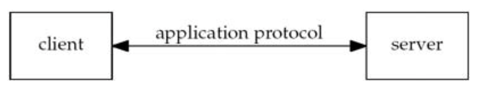
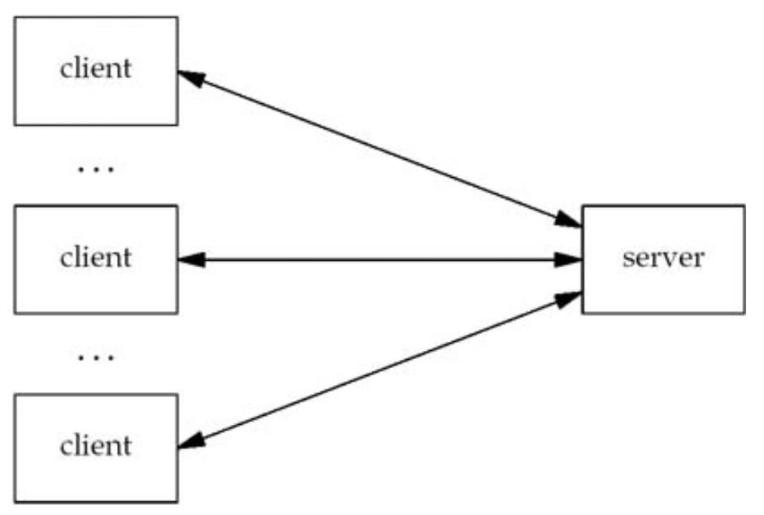
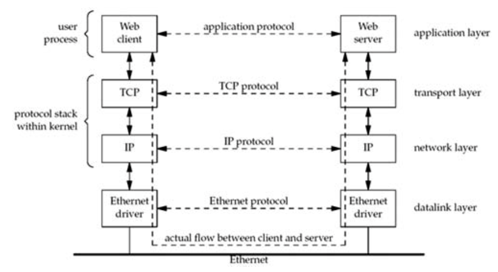
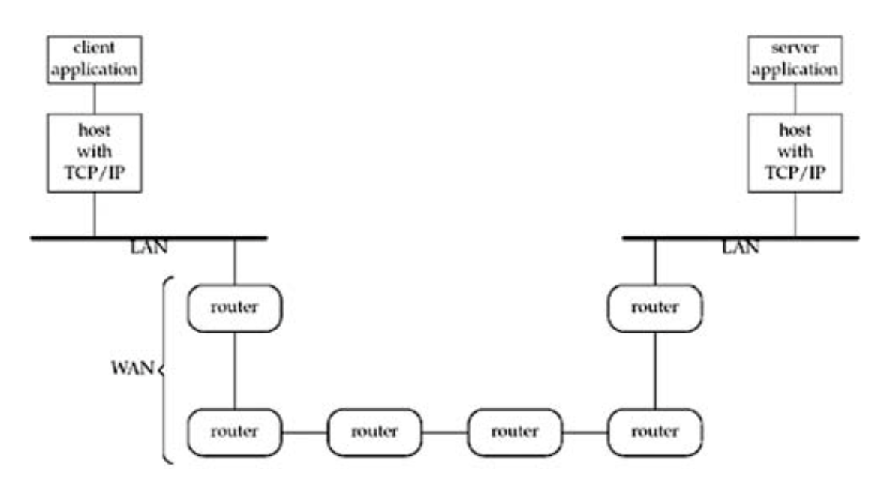

# Chapter 1. Introduction

## 1.1 Introduction

### Network application: client and server.



### Server handling multiple clients at the same time.



### Client and server on the same Ethernet communicating using TCP.



The actual flow of information between the client and server goes down the
protocol stack on one side, across the network, and up the protocol stack on the
other side. And the client and server are typically user processes, while the
TCP and IP protocols are normally part of the protocol stack within the kernel.

### Client and server on different LANs connected through a WAN.



*The largest WAN today is the Internet.*

## 1.2 A Simple Daytime Client

`intro/daytimetcpcli`: should make & run `intro/daytimetcpsrv` first.

### Include our own header

### Command-line arguments

### Create TCP socket

```c
#include "unp.h"

int main(int argc, char **argv)
{
    int sockfd, n;
    char recvline[MAXLINE + 1];
    struct sockaddr_in servaddr;

    if (argc != 2)
        err_quit("usage: a.out <IPaddress>");

    if ((sockfd = socket(AF_INET, SOCK_STREAM, 0)) < 0)
        err_sys("socket error");

    bzero(&servaddr, sizeof(servaddr));
    servaddr.sin_family = AF_INET;
    servaddr.sin_port = htons(13); /* daytime server */
    if (inet_pton(AF_INET, argv[1], &servaddr.sin_addr) <= 0)
        err_quit("inet_pton error for %s", argv[1]);

    if (connect(sockfd, (SA *)&servaddr, sizeof(servaddr)) < 0)
        err_sys("connect error");

    while ((n = read(sockfd, recvline, MAXLINE)) > 0)
    {
        recvline[n] = 0; /* null terminate */
        if (fputs(recvline, stdout) == EOF)
            err_sys("fputs error");
    }
    if (n < 0)
        err_sys("read error");

    exit(0);
}
```

### Specify server's IP address and port

- `bzero`: initialize memory to zero
- `htons`: host to network short
- `inet_pton`: presentation to numeric of internet
- `inet_addr`: to convert an ASCII dotted-decimal string into the correct format

### Establish connect with server

The `connect` function, when applied to a TCP socket, establishes a TCP
connection with the server specified by the socket address structure pointed to
by the second argument.

### Read and display server's reply

TCP is a *byte-stream* protocol with no record boundaries. With that, data can
be returned in numerous ways. With larger data sizes, we cannot assume that the
server's reply will be returned by s single `read`. Therefore, when reading from
a TCP socket, we *always* need to code the `read` in a loop and terminate the
loop when either `read` returns 0 (i.e., the other end closed the connection) or
a value less than 0 (an error).

The important concept here is that TCP itself provides no record markers: If an
application wants to delineate the ends of records, it must do so itself and
there are a few common ways to accomplish this.

### Terminate program

Unix always closes all open descriptors when a process terminates.

## 1.3 Protocol Independence

## 1.4 Error Handling: Wrapper Functions

In any real-world program, it is essential to check *every* function call for
error return.

Capilize the name of the error handling wrapper function:

```c
sockfd = Socket(AF_INET, SOCK_STREAM, 0);

int Socket(int family, int type, int protocol)
{
    int n;

    if ((n = socket(family, type, protocol)) < 0)
        err_sys("socket error");

    return (n);
}
```

To avoid cluttering the code with braces:

```c
int n;

if ((n = pthread_mutex_lock(&ndone_mutex)) != 0)
    errno = n, err_sys("pthread_mutex_lock error");

// better way
Pthread_mutex_lock(&ndone_mutex);

void Pthread_mutex_lock(pthread_mutex_t *mptr)
{
    int n;

    if ((n = pthread_mutet_lock(mptr)) == 0)
        return;
    errno = n;
    err_sys("pthread_mutex_lock error");
}
```
