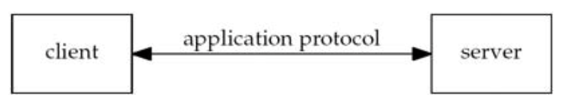
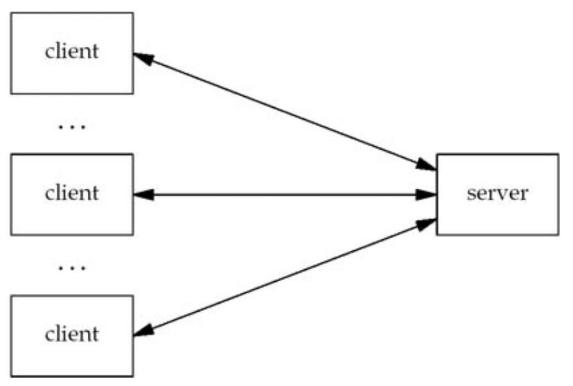
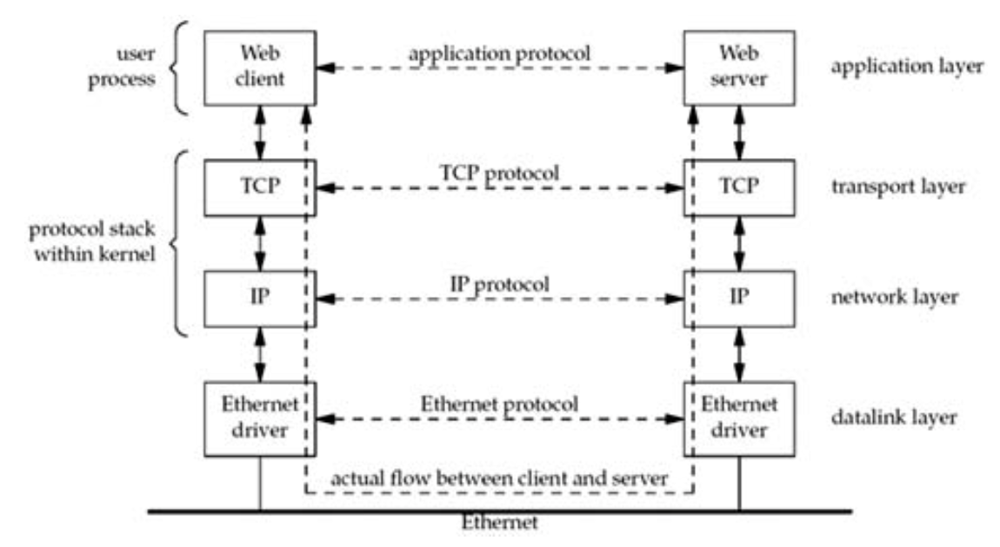
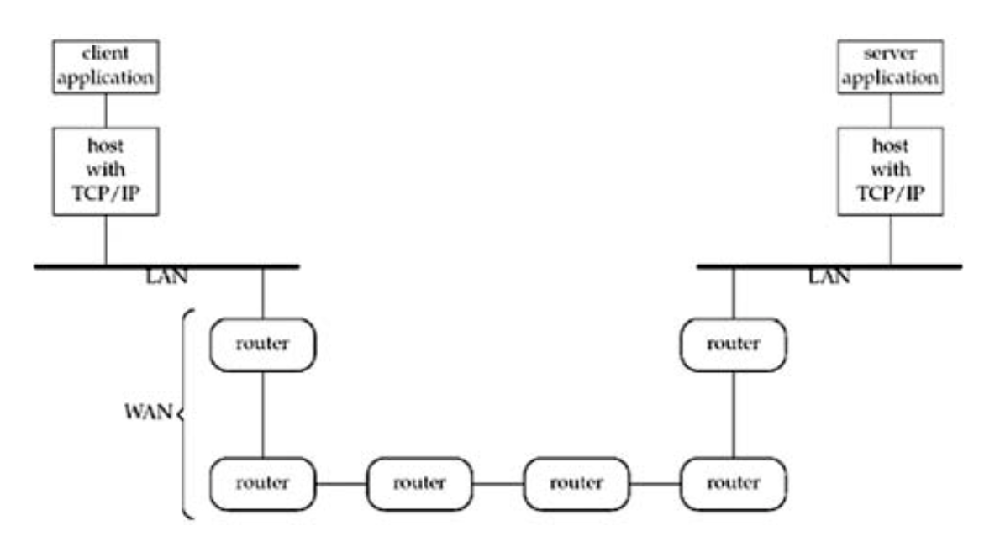

# Chapter 1. Introduction

## 1.1 Introduction

### Network application: client and server.



### Server handling multiple clients at the same time.



### Client and server on the same Ethernet communicating using TCP.



The actual flow of information between the client and server goes down the
protocol stack on one side, across the network, and up the protocol stack on the
other side. And the client and server are typically user processes, while the
TCP and IP protocols are normally part of the protocol stack within the kernel.

### Client and server on different LANs connected through a WAN.



*The largest WAN today is the Internet.*

## 1.2 A Simple Daytime Client

`intro/daytimetcpcli`: should make & run `intro/daytimetcpsrv` first.

```c
#include "unp.h"

int main(int argc, char **argv)
{
    int sockfd, n;
    char recvline[MAXLINE + 1];
    struct sockaddr_in servaddr;

    if (argc != 2)
        err_quit("usage: a.out <IPaddress>");

    if ((sockfd = socket(AF_INET, SOCK_STREAM, 0)) < 0)
        err_sys("socket error");

    bzero(&servaddr, sizeof(servaddr));
    servaddr.sin_family = AF_INET;
    servaddr.sin_port = htons(13); /* daytime server */
    if (inet_pton(AF_INET, argv[1], &servaddr.sin_addr) <= 0)
        err_quit("inet_pton error for %s", argv[1]);

    if (connect(sockfd, (SA *)&servaddr, sizeof(servaddr)) < 0)
        err_sys("connect error");

    while ((n = read(sockfd, recvline, MAXLINE)) > 0)
    {
        recvline[n] = 0; /* null terminate */
        if (fputs(recvline, stdout) == EOF)
            err_sys("fputs error");
    }
    if (n < 0)
        err_sys("read error");

    exit(0);
}
```

1. Include our own header
2. Command-line arguments
3. Create TCP socket
4. Specify server's IP address and port

    - `bzero`: initialize memory to zero
    - `htons`: host to network short
    - `inet_pton`: presentation to numeric of internet
    - `inet_addr`: to convert an ASCII dotted-decimal string into the correct
        format

5. Establish connect with server

    The `connect` function, when applied to a TCP socket, establishes a TCP
    connection with the server specified by the socket address structure
    pointed to by the second argument.

6. Read and display server's reply

    TCP is a *byte-stream* protocol with no record boundaries. With that, data
    can be returned in numerous ways. With larger data sizes, we cannot assume
    that the server's reply will be returned by s single `read`. Therefore,
    when reading from a TCP socket, we *always* need to code the `read` in a
    loop and terminate the loop when either `read` returns 0 (i.e., the other
    end closed the connection) or a value less than 0 (an error).

    The important concept here is that TCP itself provides no record markers:
    If an application wants to delineate the ends of records, it must do so
    itself and there are a few common ways to accomplish this.

7. Terminate program

    Unix always closes all open descriptors when a process terminates.

## 1.3 Protocol Independence

## 1.4 Error Handling: Wrapper Functions

In any real-world program, it is essential to check *every* function call for
error return.

Capilize the name of the error handling wrapper function:

```c
sockfd = Socket(AF_INET, SOCK_STREAM, 0);

int Socket(int family, int type, int protocol)
{
    int n;

    if ((n = socket(family, type, protocol)) < 0)
        err_sys("socket error");

    return (n);
}
```

To avoid cluttering the code with braces:

```c
int n;

if ((n = pthread_mutex_lock(&ndone_mutex)) != 0)
    errno = n, err_sys("pthread_mutex_lock error");

// better way
Pthread_mutex_lock(&ndone_mutex);

void Pthread_mutex_lock(pthread_mutex_t *mptr)
{
    int n;

    if ((n = pthread_mutet_lock(mptr)) == 0)
        return;
    errno = n;
    err_sys("pthread_mutex_lock error");
}
```

Using `C` macros instead of functions providing a little runtime efficiency, but
these wrapper functions are rarely the performance bottleneck of a program.

### Unix `errno` Value

When an error occurs in a Unix function (such as one of the socket functions),
the global variable `errno` is set to a positive value indicating the type of
error and the function normally returns -1.

All of the positive error values are constants with all-uppercase names
beginning with "E", and are normally defined in the `<sys/errno.h>` header. No
error has a value of 0.

Storing `errno` in a global variable does not work with multiple threads that
share all global variables.

## 1.5 A Simple Daytime Server

```c
#include "unp.h"
#include <time.h>

int main(int argc, char **argv)
{
    int listenfd, connfd;
    struct sockaddr_in servaddr;
    char buff[MAXLINE];
    time_t ticks;

    listenfd = Socket(AF_INET, SOCK_STREAM, 0);

    bzero(&servaddr, sizeof(servaddr));
    servaddr.sin_family = AF_INET;
    servaddr.sin_addr.s_addr = htonl(INADDR_ANY);
    servaddr.sin_port = htons(13); /* daytime server */

    Bind(listenfd, (SA *)&servaddr, sizeof(servaddr));

    Listen(listenfd, LISTENQ);

    for (;;)
    {
        connfd = Accept(listenfd, (SA *)NULL, NULL);

        ticks = time(NULL);
        snprintf(buff, sizeof(buff), "%.24s\r\n", ctime(&ticks));
        Write(connfd, buff, strlen(buff));

        Close(connfd);
    }
}
```

The style used throughout the book for an infinite loop is

```c
for (;;)
{
    //...
}
```

`snprintf` is better than `sprintf` because it checks for overflow by requiring
the 2nd argument be the size of the destination buffer.

### Functions that should be carefully dealt with, and better functions

- `sprintf`: `snprintf`
- `gets`: `fgets`
- `strcat`: `strncat`: `strlcat`
- `strcpy`: `strncpy`: `strlcpy`

1. Create a TCP socket
2. Bind server's well-known port to socket

    The server's well-known port (13 for the daytime service) is bound to the
    socket by filling in an Internet socket address struture and calling `bind`.
    `INADDR_ANY` allows the server to accept a client connection on any
    interface.

3. Convert socket to listening socket

    By calling `listen`, the socket is converted into a listening socket, on
    which incoming connections from clients will be accepted by the kernel.
    These three steps, `socket`, `bind`, and `listen`, are the normal steps for
    any TCP server to prepare what we call the *listening descriptor*
    (`listenfd` in this example).

    The constant `LISTENQ` is from our `unp.h` header. It specifies the maximum
    number of client connections that the kernel will queue for this listening
    descriptor.

4. Accept client connection, send reply

    Normally, the server process is put to **sleep** in the call to `accept`,
    waiting for a client connection to arrive and be accepted. A TCP connection
    uses what is called a *three-way handshake* to establish a connection. When
    this handshake completes, `accept` returns, and the return value from the
    function is a new descriptor (`connfd`) that is called the *connected
    descriptor*. This new descriptor is used for communication with the new
    client. A new descriptor is returned by `accept` for each client that
    connects to our server.

5. Terminate connection

    The server closes its connection with the client by calling `close`. This
    initiates the normal TCP connection termination sequence: a FIN is sent in
    each direction and each FIN is acknowledged by the other end.

This server is called an *iterative server* because it iterates through each
client, one at a time. There are numerous techniques for writing a *concurrent
server*, one that handles multiple clients at the same time. The simplest
technique for a concurrent server is to call the Unix `fork` function, creating
one child process for each client. Other techniques are to use threads instead
of `fork`, or to pre-fork a fixed number of children when the server starts.

## 1.6 Roadmap to Client/Server Examples in the Text

- A daytime client/server
- An echo client/server

## 1.7 OSI Model

OSI: Open Systems Interconnection.

### Layers in OSI model and Internet protocol suite

```diagram
7   application
----------------                                            application details
6   presentation    application
----------------                               user process
5   session
--------------------------------<-sockets XTI  ---------------------------------
4   transport       TCP|  ↕  |UDP
----------------    -------------
3   network         IPv4, IPv6                 kernel
----------------    -------------
2   datalink        device driver                        communications details
----------------    and
1   physical        hardware
----------------    -------------
OSI model           Internet protocol
                    suite
```

It is possible for an application to bypass the transport layer and use IPv4 and
IPv6 directly. This is called *raw socket*.

Why do sockets provide the interface from the upper three layers of the OSI
model into the transport layer? There are two reasons for this design:

1. The upper three layers handle all the details of the application (FTP,
    Telnet, HTTP, etc.) and know little about the communication details.

    The lower four layers know little about the application, but handle all the
    communication details: sending data, waiting for ackowledgment, sequencing
    data that arrives out of order, calculating and verifying checksums, and so
    on.

2. The upper three layers often form what is called a *user process* while the
    lower four layers are normally provided as part of the operating system
    kernel. Unix provides this separation between the user process and the
    kernel, as do many other contemporary operating systems. Therefore, the
    interface between layers 4 and 5 is the natural place to build the API.

## 1.8 BSD Networking History
