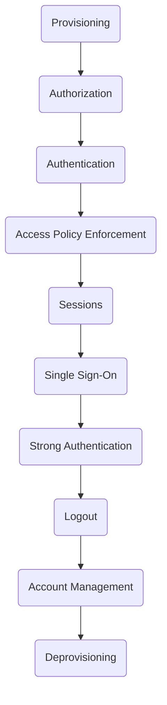

# Chapter 2: The Life of an Identity

> That it will never come again is what makes life so sweet.
>
> —Emily Dickinson in “That it will never come again” (1741)

- [Chapter 2: The Life of an Identity](#chapter-2-the-life-of-an-identity)
  - [Terminology](#terminology)
  - [Events in the Life of an Identity](#events-in-the-life-of-an-identity)
    - [Provisioning](#provisioning)

## Terminology

- We use the term “identifier” to refer to a single attribute whose purpose is
to uniquely identify a person or entity, within a specific context.
  - passport numbers,
  - driver's license numbers
  - ...
- The term “identity” is defined as a collection of attributes associated with
  a specific person or entity in a particular context.
  - Human identities may include attributes such as
    - name
    - age
    - address
    - phone number
    - ...
  - Nonhuman identities may include attributes such as
    - an owner
    - IP address
    - ...
- An identity is associated with an account in each such context. We define an
  account as a local construct within a given application or application suite
  that is used to perform actions within that context.
  - An account is uniquely identified by an identifier.
  - An account may have its own, internal identifier in addition to that of the
    identity associated with it.
  - Having an account identifier separate from the identity associated with the
    account provides a useful degree of separation.
  - The internal account identifier can be used in application records, which
    makes it easier for users to change the username or other identifiers
    associated with their account without impacting all the application records.

An identity management (IdM) system is a set of services that support the
creation, modification, and removal of identities and associated accounts, as
well as the authentication and authorization required to access resources.

Identity management systems are used to protect online resources from
unauthorized access and comprise an important part of a comprehensive security
model.

## Events in the Life of an Identity

### Provisioning

>>>>> progress
