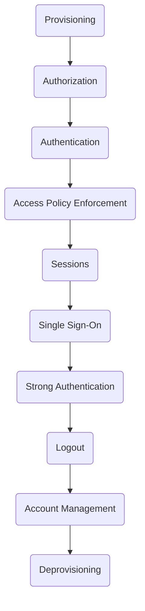

# Chapter 2: The Life of an Identity

> That it will never come again is what makes life so sweet.
>
> —Emily Dickinson in “That it will never come again” (1741)

- [Chapter 2: The Life of an Identity](#chapter-2-the-life-of-an-identity)
  - [Terminology](#terminology)
  - [Events in the Life of an Identity](#events-in-the-life-of-an-identity)
    - [Provisioning](#provisioning)
    - [Authorization](#authorization)
    - [Authentication](#authentication)
    - [Access Policy Enforcement](#access-policy-enforcement)
    - [Sessions](#sessions)
    - [Single Sign-On (SSO)](#single-sign-on-sso)
    - [Stronger Authentication](#stronger-authentication)
    - [Logout](#logout)
    - [Account Management and Recovery](#account-management-and-recovery)
    - [Deprovisioning](#deprovisioning)
  - [Summary](#summary)
    - [Key Points](#key-points)

## Terminology

- We use the term “identifier” to refer to a single attribute whose purpose is
to uniquely identify a person or entity, within a specific context.
  - passport numbers,
  - driver's license numbers
  - ...
- The term “identity” is defined as a collection of attributes associated with
  a specific person or entity in a particular context.
  - Human identities may include attributes such as
    - name
    - age
    - address
    - phone number
    - ...
  - Nonhuman identities may include attributes such as
    - an owner
    - IP address
    - ...
- An identity is associated with an account in each such context. We define an
  account as a local construct within a given application or application suite
  that is used to perform actions within that context.
  - An account is uniquely identified by an identifier.
  - An account may have its own, internal identifier in addition to that of the
    identity associated with it.
  - Having an account identifier separate from the identity associated with the
    account provides a useful degree of separation.
  - The internal account identifier can be used in application records, which
    makes it easier for users to change the username or other identifiers
    associated with their account without impacting all the application records.

An identity management (IdM) system is a set of services that support the
creation, modification, and removal of identities and associated accounts, as
well as the authentication and authorization required to access resources.

Identity management systems are used to protect online resources from
unauthorized access and comprise an important part of a comprehensive security
model.

## Events in the Life of an Identity

### Provisioning

The act of creating an account and associated identity information is often
referred to as ***provisioning***. Provisioning might be done by

- having users register
- importing identity information from a legacy system
- leveraging an external identity service

The objective of the provisioning phase is to establish an account with
associated identity data.

This involves obtaining or assigning a unique identifier for the identity,
optionally a unique identifier for the account distinct from that of the
identity, creating an account, and associating identity profile attributes with
the account.

*Identity proofing* is the process of collecting, authenticating, and
validating identity information to ensure an account holder is who they claim
to be and the owner of the identity is a person who can be held liable for
actions taken using an account issued to them.

### Authorization

When an account is created, it is often necessary to specify what the account
can do, in the form of privileges. We use the term ***authorization*** for the
granting of privileges that govern what an account is allowed to do.

This type of authorization for an account is typically done at the time an
account is created and may be updated over time.

Another form of authorization may happen later in a user’s interaction with an
application or service. One example is a more complex use case that involves
more than one application domain.

- If a user invokes a feature in one application which requires data owned by
  the user in a third-party application in another domain, the user may be
  asked by that third-party application to authorize the first application to
  programmatically access the user’s data in the third-party domain. In this
  case, the authorization grant is for an application to act on the user’s
  behalf.

### Authentication

Authentication with one or more credentials demonstrates to some degree of
confidence, a user’s right to use an account to access protected resources.

### Access Policy Enforcement

Once a user has been authenticated and associated with an account, it is
necessary to enforce access policy to ensure any actions taken by the user are
allowed by the privileges they have been granted. We use the term
***access policy enforcement*** for the enforcement of access policy specified
by authorization.

In other words, authorization specifies what a user or entity is allowed to do
in a particular context such as within a banking application, and access policy
enforcement checks that a user’s requested actions are allowed by the
privileges they’ve been authorized to use and any other relevant policy.

### Sessions

A ***session*** tracks information such as whether the user has been
authenticated and, if so, typically also the authentication mechanism and/or
strength level of the authentication mechanism used, when authentication
occurred, and the IP address, in addition to a user identifier. This enables an
application to decide when the user should be prompted to reauthenticate.

The length of time a user is allowed to remain active before reauthentication
is known as a *session limit* or *session timeout*.

There are additional scenarios where security tokens obtained by an application
during a user’s session have expired. These tokens usually have a short
expiration time to reduce the risk impact if they are compromised. When they
expire, an application can request new tokens from the entity that issued the
original tokens, and there are scenarios where this can be done without any
interaction with the user. This is sometimes called **silent reauthentication**
and occurs when the entity issuing the security tokens has sufficient knowledge
about the user’s activity and the security context to warrant issuing new
tokens without requiring the user to actively reauthenticate.

### Single Sign-On (SSO)

***Single sign-on (SSO)*** is the ability to log in once and then access
additional protected resources or applications with the same authentication
requirements, without having to reenter credentials.

Single sign-on is possible when a set of applications has delegated
authentication to the same entity. An authenticated session in that entity can
be used to access multiple resources via single sign-on and is often called an
SSO session.

The use of single sign-on can result in multiple layers of sessions for a user
because there may be a session for a user maintained in each application as
well as in an entity to which the applications delegate authentication. In this
case, the design of session handling is important for security and a good user
experience.

### Stronger Authentication

Step-up authentication and multi-factor authentication (MFA) both involve
authenticating a user with stronger forms of authentication.

- Authentication that requires multiple factors at the same time is known as
***multi-factor authentication***.
- ***Step-up authentication*** is the act of elevating an existing
  authentication session to a higher level of assurance by authenticating with
  a stronger form of authentication.

### Logout

At a minimum, the act of logging out should terminate the user’s application
session.

In situations where single sign-on is used, there may be multiple sessions to
terminate, and it is a design decision as to which sessions should be
terminated when the user logs out of one application.

The act of logging out is slightly different than a session timing out. In the
former case, the user explicitly requests that their session be terminated.
When a session times out, an application may elect to keep the session in a
suspended state and reconstitute the session if the user authenticates again.

In a scenario where Alice has logged in to her bank’s website and viewed her
bank balance as well as a recent investment newsletter, she would have a
session in the retail banking application, in the investment newsletter
application, and in the bank’s SSO service.

- If she is idle for a few minutes to take a phone call, her session in the
  retail banking application may time out. When she finishes her phone call,
  she would have to reauthenticate to continue. When she finishes viewing her
  account, she would click a “Logout” link to terminate all of her open
  sessions.

### Account Management and Recovery

***Account management*** consists of features or processes which enable users
and administrators to view and update user profile attributes associated with
an account and to remove accounts, when appropriate.

***Account recovery*** is a mechanism to validate a user is the legitimate
owner of an account through some secondary means before allowing the user to
establish new credentials.

### Deprovisioning

***Deprovisioning*** may take the form of completely deleting the account and
associated identity information or simply disabling the account, to preserve
information for audit purposes.

## Summary

### Key Points

- **Provisioning** creates an account and associated identity.
  - Provisioning may include an identity proofing process to validate the owner
    of an account is who they say they are.
- **Authentication** validates a user is entitled to use an account.
- **Authorization** specifies the privileges granted for an account.
- **Access policy enforcement** checks that requests are within the privileges
  granted by authorization.
- A **session** and **session limit** are used to govern how long a user can
  remain active without reauthenticating.
- **Single sign-on** allows a user to log in once and then access additional
  protected resources without reentering credentials.
- **Multi-factor authentication** requires authentication by multiple forms of
  authentication, such as *something the user knows* (a password), *something
  the user has* (such as a device), and/or *something the user is* (such as a
  fingerprint or facial scan).
- **Step-up authentication** is the elevation of an existing authentication
  session to a higher authentication assurance level when a user authenticates
  with a stronger form of authentication.
- **Logout** terminates an authenticated session, requiring reauthentication to
  access a protected resource again.
- Account management features allow a user or administrator to update account
  and identity profile attributes.
- **Account recovery** is required when a user loses the ability to
  authenticate using previously established credentials.
- **Deprovisioning** is the removal or disabling of an account and associated
  identity information.
