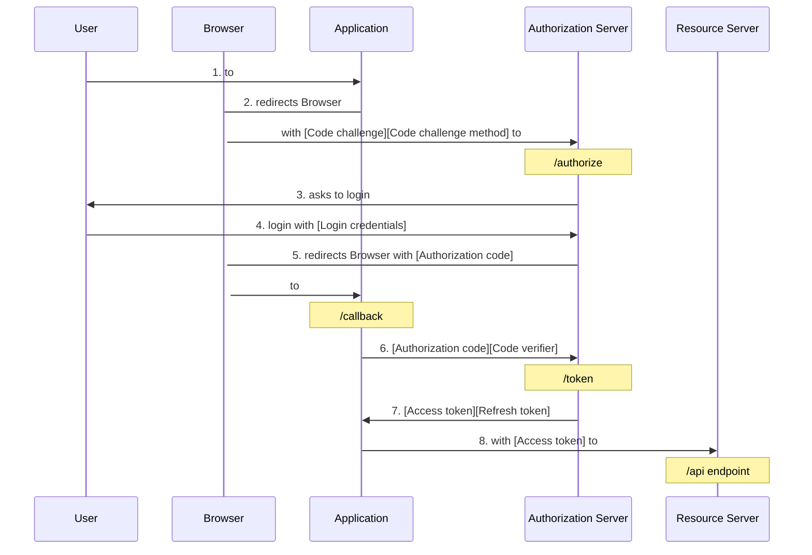
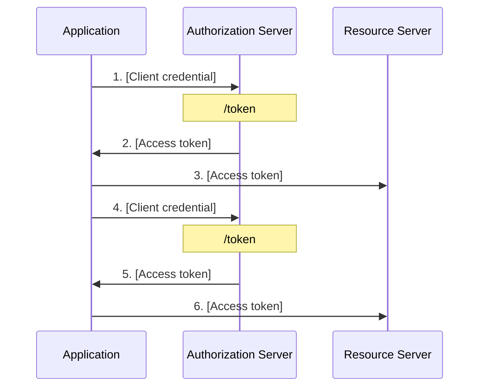
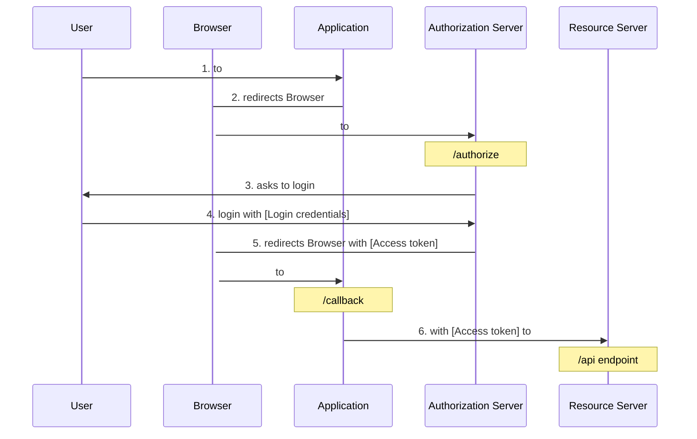
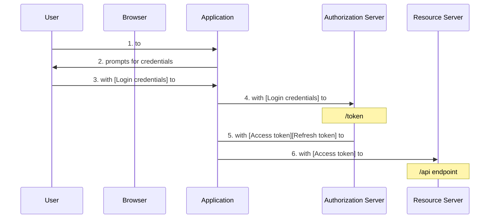
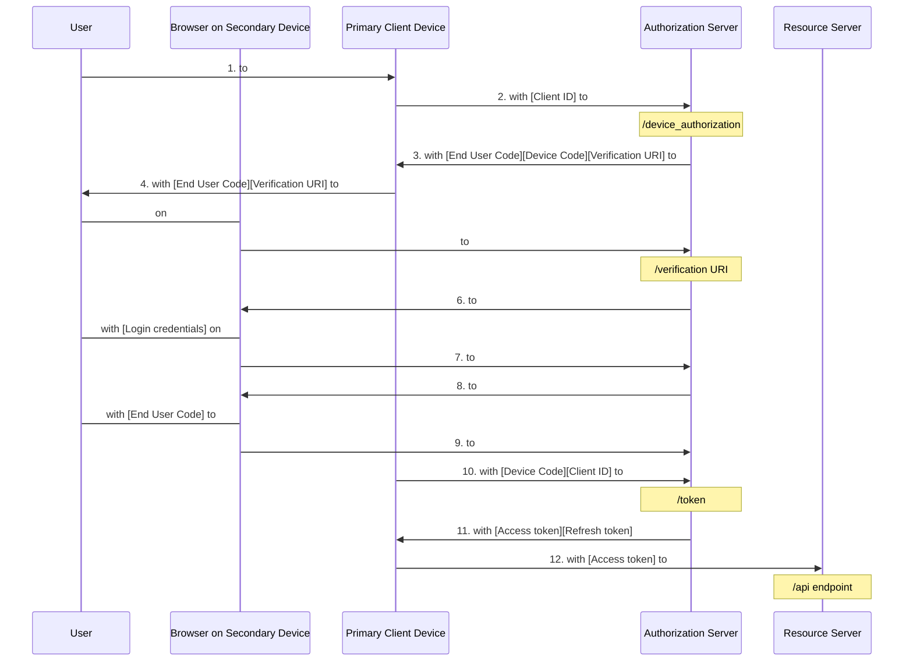

# Chapter 5: OAuth 2 and API Authorization

> The possession of great power necessarily implies great responsibility.
>
> —William Lamb, British Member of Parliament, Home Secretary, and Prime
> Minister. From a speech in the House of Commons, 1817

- [Chapter 5: OAuth 2 and API Authorization](#chapter-5-oauth-2-and-api-authorization)
  - [API Authorization](#api-authorization)
  - [OAuth 2](#oauth-2)
  - [Terminology](#terminology)
    - [Roles](#roles)
    - [Confidential and Public Clients](#confidential-and-public-clients)
    - [Client Profiles](#client-profiles)
    - [Tokens and Authorization Code](#tokens-and-authorization-code)
  - [How It Works](#how-it-works)
    - [Authorization Code Grant](#authorization-code-grant)
    - [Authorization Code Grant Type + PKCE](#authorization-code-grant-type--pkce)
      - [The Authorization Request](#the-authorization-request)
      - [Response](#response)
      - [Calling the Token Endpoint](#calling-the-token-endpoint)
    - [Client Credentials Grant](#client-credentials-grant)
      - [Client Credentials Grant: The Authorization Request](#client-credentials-grant-the-authorization-request)
    - [Implicit Grant (Removed in OAuth 2.1)](#implicit-grant-removed-in-oauth-21)
    - [Resource Owner Password Credentials Grant (Removed from OAuth 2.1)](#resource-owner-password-credentials-grant-removed-from-oauth-21)
    - [Device Authorization Grant](#device-authorization-grant)
      - [Device Authorization Grant: The Authorization Request](#device-authorization-grant-the-authorization-request)
      - [Authorization Response](#authorization-response)
      - [Polling the Authorization Server](#polling-the-authorization-server)
    - [Calling an API](#calling-an-api)
    - [Refresh Tokens](#refresh-tokens)
  - [Token Usage Guidance](#token-usage-guidance)
    - [Access Tokens](#access-tokens)
    - [Token Usage Guidance: Refresh Tokens](#token-usage-guidance-refresh-tokens)
    - [Confidentiality and Integrity](#confidentiality-and-integrity)
    - [Token Revocation](#token-revocation)
  - [Further Learning](#further-learning)
    - [Advanced Use Cases](#advanced-use-cases)
  - [Summary](#summary)
    - [Key Points](#key-points)
  - [Notes](#notes)

If an application wants to call an API on a user’s behalf to access resources
owned by the user, it needs the user’s consent. In the past, a user often had
to share their credentials with the application to enable such an API call on
their behalf. This gave the application an unnecessary amount of access, not to
mention the responsibility of safeguarding the credential.

## API Authorization

An application may need to call an API on behalf of a user, to access content
owned by the user, or on its own behalf if the application owns the desired
content:

- User-Based Flow: the request must be made on behalf of the user.
- Client-Based Flow: the application only needs to be a registered client
  authorized to call the API.
  
## OAuth 2

The OAuth 2 Authorization Framework was designed to enable an application to
obtain authorization to call third-party APIs. With OAuth 2, an application can
obtain a user’s consent to call an API on their behalf, without needing the
user’s credentials for the API site. An application can also obtain
authorization to call an API on its own behalf if it owns the content to be
accessed.

The primary use case involves a user, called a `resource owner`, who wishes to
allow an application to access a protected resource, owned by the resource
owner, at a logically separate site, known as the `resource server`.

Before OAuth 2, the usual solution involved some risks. The user had to give the
application their credentials at the `resource server` so the application could
retrieve their data at the `resource server`. There was no way for the user to
restrict what the application could do.


> <https://commons.wikimedia.org/wiki/File:Without-oauth.svg>

If the application were compromised, and the password decryption key or
cleartext passwords stolen, the user’s data at the `resource server` would be at
risk.

The user also had no way of revoking the application's access to the
`resource server` except by changing their credentials. Unfortunately, changing
credentials to revoke one application’s access would effectively revoke access
for any other applications using the credentials to access `resource server` on
their behalf.

With OAuth 2, when an application needs to call an API on behalf of a user, it
sends an authorization request to an `authorization server` for the API. An
authorization server handles access requests for an API and returns a security
token that can be used by the application to access the API.


> <https://commons.wikimedia.org/wiki/File:Mediawiki_oauth_2_flow_with_pkce.svg>


> <https://commons.wikimedia.org/wiki/File:Abstract-flow.svg>

1. In the authorization request, the application gives an indication of what it
   wants to request from the API.
2. The `authorization server` evaluates the request and, if authorized, returns
   a token to the application.
3. If the application asks for content owned by the user, the API’s
   authorization server authenticates the user and then asks the user to give
   their consent for the application to access the requested data.
4. The authorization server uses details in the application’s authorization
   request to prompt the user for their consent.
5. If the user consents to the requested access, the application receives a
   token to call the API on the user’s behalf. The token is called an
   `access token`, and it enables the application to make API requests within
   the scope of what the user authorized when they gave their consent for the
   request.

This solution eliminates the need for the user to share credentials with the
application and gives the user more control over what the application can
access.

The OAuth 2 access token is only intended for API access and not to convey
information about the authentication event or the user. The use of OAuth 2 is
therefore appropriate for authorizing API calls but not as an authentication
solution.

## Terminology

### Roles

OAuth 2 defines four roles involved in an authorization request:

- `Resource Server`: A service (with an API) storing protected resources to be
  accessed by an application.
- `Resource Owner`: A user or other entity that owns protected resources at the
  `resource server`.
- `Client`: An application which needs to access resources at the
  `resource server`, on the resource owner’s behalf or on its own behalf.
- `Authorization Server`: A service trusted by the `resource server` to
  authorize applications to call the `resource server`. It authenticates the
  `application` or `resource owner` and requests consent from the
  `resource owner` if the `application` will make requests on the
  `resource owner`’s behalf. With OAuth 2, the `resource server` (API) is a
  relying party to the `authorization server`. The `authorization server` and
  resource server may be operated by the same entity.

### Confidential and Public Clients

OAuth 2 defines two client types:

- `Confidential Client` (removed from OAuth 2.1): An application that can
  securely store confidential secrets with which to authenticate itself to an
  `authorization server` or use another secure authentication mechanism for
  that purpose. `Confidential clients` typically execute primarily on a
  protected server.
- `Public Client`: An application that can neither securely store a secret or
  credentials to authenticate itself to an `authorization server` nor use
  another secure authentication mechanism for that purpose. `Public clients`
  typically execute primarily on the user’s client device or in the client
  browser.

### Client Profiles

OAuth 2 defines three profiles for client applications based on application
topologies:

- `Web Application`: A `confidential client` with code executing on a
  protected, back-end server. The server can securely store any secrets needed
  for the client to authenticate itself as well as any tokens it receives from
  the authorization server. Such credentials and tokens are not exposed to the
  `resource owner`.
- `Browser-Based Application`: Assumed to be a `public client` with code
  executing in the user’s browser. Such an application is assumed to be
  incapable of adequately securing credentials with which to authenticate
  itself to an authorization server.
- `Native Application`: Assumed to be a `public client` that is installed and
  executed on the user’s device, such as a mobile application or desktop
  application.

### Tokens and Authorization Code

OAuth 2 defines two security tokens and an intermediary authorization code:

- `Authorization Code`: An intermediary, opaque code returned to an application
  and used to obtain an `access token` and optionally a `refresh token`. Each
  authorization code is used once.
- `Access Token`: A token used by an application to access an API. It
  represents the application’s authorization to call an API and has an
  expiration.
- `Refresh Token`: An optional token that can be used by an application to
  request a new `access token` when a prior access token has expired.

## How It Works

The OAuth 2 Authorization Framework defines different methods by which an
`application` interacts with an `authorization server` to obtain authorization
to call an API. Each method uses a credential to represent the authorization.
These credentials are known as `authorization grants` and are used by an
application to obtain an `access token` with which to call an API. The type of
`authorization grant` to use depends on the use case.

The following authorization grant types are defined:

- `Authorization code`
- `Client credentials`
- `Refresh token`

In OAuth 2.0, there were two additional authorization grant types that were
removed in OAuth 2.1. These obsolete grant types are

- `Implicit` (removed)
- `Resource owner password credentials` (removed)

An additional authorization grant type has been designed for devices which have
limited capabilities for user interaction. This grant type is not part of the
core OAuth 2.1 specification (at the time of writing) but is useful to include
as it is designed for scenarios involving devices that make up the Internet of
Things (IoT). This grant type is

- `Client device`

### Authorization Code Grant

The `authorization code grant` type uses two requests from the application to
the `authorization server` to obtain an `access token`.

- In the first request, the user’s browser is redirected to the authorization
  endpoint at the `authorization server` with a request to authorize an API
  call to be made on the user’s behalf.
  - The browser redirect enables the `authorization server` to interact with the
    user to authenticate them and obtain their consent for the authorization
    request.
- After obtaining the user’s consent, the `authorization server` redirects the
  user’s browser back to the `application` with an `authorization code`.
- The `application` uses the authorization code to send a second, back-channel
  request to the `authorization server`’s token endpoint to obtain an
  `access token`.
- The `authorization server` responds with an `access token` issued to the
  `application` which it can use to call the API.



1. The user (`resource owner`) accesses the `application`.
2. The `application` redirects the browser to the `authorization server`’s
   authorize endpoint (defined in the OAuth 2 specification) with an
   authorization request.
3. The `authorization server` prompts the user for authentication and consent.
    - The mechanism by which a user is authenticated to provide consent is
      outside the scope of the OAuth 2 specifications.
4. The user authenticates and provides consent for the request.
5. The `authorization server` redirects the user’s browser back to the
   `application`’s callback URL (defined in the OAuth 2 specification) with an
   `authorization code`.
6. The `application` calls the `authorization server`’s token endpoint (defined
   in the OAuth 2 specification), passing the `authorization code`.
    - `Code verifier` works with `PKCE`
7. The `authorization server` responds with an `access token` (and optionally a
   `refresh token`).
8. The `application` calls the `resource server` (API), using the
   `access token`.

The `authorization code grant` type was originally optimized for
`confidential clients`.

- The first (authorization) request redirects the user to the authorization
  server so it can interact with the user.
- The second request (`6.`) could be made by the application’s back end
  directly to the `authorization server`’s token endpoint.
  - This enables an `application` back end, which is assumed to be capable of
    securely managing an authentication secret, to authenticate itself to the
    `authorization server` when exchanging the `authorization code` for the
    `access token`.
  - It also means that the response with the `access token` can be delivered to
    the `application` back end, which will make the subsequent API calls.
  - An added side benefit is that the tokens are returned via secure
    back-channel response.
  - However, while originally optimized for `confidential clients`, the
    addition of PKCE enables other client types to use this grant type as well.

### Authorization Code Grant Type + PKCE

The `authorization code` grant type diagram shows the use of
`Proof Key for Code Exchange (PKCE)`. PKCE is a mechanism that can be used with
authorization and token requests to prevent a malicious process, especially on
mobile devices and with `public clients`, from intercepting an
`authorization code` and using it to get an `access token`.

`PKCE` does not authenticate clients. Rather, it ensures that the application
that requested an authorization code is the same application that uses the
`authorization code` to obtain an `access token`.

`PKCE` was defined after OAuth 2.0, but has been incorporated into the core
OAuth 2.1 specification for use with the `authorization code grant` type.

- To use `PKCE`, the application creates a cryptographically random string,
  called a `code verifier`, that is long enough to provide sufficient protection
  against guessing.
- The application then computes a derived value, called a `code challenge`, from
  the `code verifier`. This derived value is typically a hash of the
  `code verifier`. It should not be possible to compute the `code verifier`
  from the derived value in a time period that would enable compromising the
  transaction.
- When the application sends an authorization request in step 2 in the diagram,
  it includes the `code challenge`, along with the `method` used to derive it.
- When the application sends the `authorization code` to the
  `authorization server`’s token endpoint to get the `access token` in step 6,
  it includes the `code verifier`.
- The `authorization server` transforms the `code verifier` value using the
  `code challenge method` received in the authorization request and checks that
  the result matches the `code challenge` sent with the authorization request.
- This enables an `authorization server` to detect if a malicious application
  is trying to use a stolen `authorization code`.
- Only the legitimate application will know the `code verifier` to pass in step
  6 that will match the `code challenge` passed in step 2.

The `PKCE` specification lists two transform methods that can be used to derive
the `code challenge` from the `code verifier`, namely, `“plain”` and `“S256.”`
With the `“plain”` method, the `code challenge` and `code verifier` are
identical, so there is no protection against the `code challenge` being
compromised. Applications using the `authorization code` grant with `PKCE`
should use the `S256` transform method which uses a base64 URL encoded `SHA256`
hash of the `code verifier` to protect it.

#### The Authorization Request

A sample application’s API authorization request with `PKCE`. It would be
directed to an `authorization server`’s authorization endpoint:

```http
GET /authorize?
response_type=code
& client_id=<client_id>
& state=<state>
& scope=<scope>
& redirect_uri=<callback uri>
& resource=<API identifier>
& code_challenge=<PKCE code_challenge>
& code_challenge_method=S256 HTTP/1.1
Host: authorizationserver.com
```

- `response_type`: Indicates the OAuth 2 grant type. `“code”` is used for the
  `authorization code grant` type.
- `client_id`: Identifier for the application, assigned when it registered with
  the `authorization server`.
- `state`: A nonguessable string, unique for each call, opaque to the
  `authorization server`, and used by the client to track state between a
  corresponding request and response to mitigate the risk of CSRF attacks.
  - It should contain a value that associates the request with the user’s
    session.
  - This could be done by including a hash of the session cookie or other
    session identifier concatenated with an additional unique-per-request
    component.
  - When a response is received, the client should ensure the state parameter
    in the response matches the state parameter for a request it sent from the
    same browser. This parameter should not include any sensitive information
    in plain text.
- `scope`: Indicates the scope of access privileges for which authorization is
  requested. For example: `“get:documents”`. This parameter should not include
  any sensitive information in plain text.
- `redirect_uri`: The `authorization server` sends its response with the
  `authorization code` to this callback URL at the application. The specified
  URI must exactly match the callback URI previously registered at the
  `authorization server` for the client application.
  - An exception to the exact match requirement is noted for the port number in
    local host redirect URLs in native applications.
- `resource`: Identifier for a specific API registered at the
  `authorization server` for which the `access token` is requested. Some
  implementations may use other names, such as `“audience”`. Primarily used in
  deployments with custom APIs. This parameter isn’t needed unless there are
  multiple possible APIs.
- `code_challenge`: `PKCE` `code challenge` derived from the `PKCE`
  `code verifier` using the `code challenge method` specified in the
  `code_challenge_method` parameter.
- `code_challenge_method`: `“S256”` or `“plain”`. Applications capable of using
  `S256` must use it.

While OAuth 2.0 allowed the URI registered with the `authorization server` to
contain wildcards, OAuth 2.1 now disallows the use of wildcards in the redirect
URI registered for a client `application`. This change reduces the possibility
of open redirect attacks.

The `resource` parameter was not in the original OAuth 2.0 specification. Since
that time, `authorization servers` have been written to handle requests for
multiple APIs and, in such cases, may support an additional parameter to
indicate a specific API for an authorization request. This parameter is defined
in the `Resource Indicators` for OAuth 2.0 extension. This parameter may be
called the `“resource”` or `“audience”` depending on the `authorization server`
implementation.

#### Response

The `authorization server` sends a response to the application’s callback,
specified in the `redirect_uri` parameter of the authorization request:

```http
HTTP/1.1 302 Found
Location: https://clientapplication.com/callback?
code=<authorization code>
& state=<state>
```

- `code`: The `authorization code` to be used by the `application` to request
  an `access token`.
- `state`: The state value, unmodified, sent in the authorization request. The
  `application` must validate that the state value in the response matches the
  state value sent with the initial request.

#### Calling the Token Endpoint

After receiving an `authorization code`, the application uses it in a second
request to the `authorization server`’s token endpoint to obtain the
`access token`.

```http
POST /token HTTP/1.1
Host: authorizationserver.com
Authorization: Basic <encoded application credentials>

Content-Type: application/x-www-form-urlencoded
grant_type=authorization_code
& code=<authorization_code>
& client_id=<client id>
& code_verifier=<code verifier>
& redirect_uri=<callback URI>
```

- `grant_type`: Must be `“authorization_code”` for the authorization code grant.
- `code`: The `authorization code` received in response to the authorization
  call.
- `client_id`: Identifier for the application, assigned when it registered with
  the `authorization server`.
- `code_verifier`: The `PKCE` `code verifier` value from which the
  `code challenge` was derived. It should be an unguessable, cryptographically
  random string between `43` and `128` characters in length, inclusive, using
  the characters A–Z, a–z, 0–9, “-”, “.”, “_”, and “~”.
- `redirect_uri`: The callback URI for the `authorization server`’s response.
  Should match the `redirect_uri` value passed in the authorization request to
  the authorize endpoint.

The response from the token endpoint will be similar:

```http
HTTP/1.1 200 OK
Content-Type: application/json;charset=UTF-8
Cache-Control: no-store
Pragma: no-cache
  {
    "access_token":"<access_token_for_API>",
    "token_type":"Bearer",
    "expires_in":<token expiration>,
    "refresh_token":"<refresh_token>"
  }
```

- `access_token`: The `access token` to use in calling the API. Different
  `authorization servers` may use different formats for `access tokens`.
- `token_type`: Type of token issued. `“Bearer”` for example.
- `expires_in`: How long the token will be valid.
- `refresh_token`: A `refresh token` is optional. It is up to an
  `authorization server`’s discretion whether to return a `refresh token` or
  not.

An `authorization server` may include an additional parameter `“scope”` to
indicate the actual scope of access granted with the issued `access token`.

- This is necessary when an `authorization server` issues an `access token` for
  a more restrictive scope than requested by the client.

There are different types of `access tokens` in use. Some
`authorization servers` issue an opaque `access token` in the form of an
encoded string. A `resource server` receiving such an `access token` can call a
token introspection endpoint at the issuing `authorization server` to obtain
information about the token, such as

- the client that requested the token
- the intended audience (`resource server`) for the token
- the token expiration
- whether the token has been revoked
- the scopes included in the token

The OAuth 2.0 Token Introspection specification defines the token introspection
endpoint and how `resource servers` can use it to obtain information about
opaque tokens issued by `authorization servers`.

Another common format for `access tokens` is a JSON Web Token (JWT). This is a
structured format that is cryptographically signed and contains various claims
about the token such as

- the client that requested the token
- the intended audience (`resource server`)
- when the token expires
- the scopes authorized for the token

With self-contained tokens, a `resource server` can obtain the claims directly
from the token without having to call a token endpoint at an
`authorization server`. The JSON Web Token (JWT) Profile for OAuth 2.0 Access
Tokens defines this type of token along with a set of mandatory and optional
claims.

The documentation for your authorization server should indicate the type of
`access token` it issues and the steps a `resource server` should take to
validate the token and obtain the claims represented by the token.

### Client Credentials Grant

The `client credentials grant` type is used when an application calls an API to
access resources the `application` owns. The application uses the
`client credentials grant` type and authenticates to the `authorization server`
with its own credentials to obtain an `access token`. The use of this grant
type requires that the `application` have the ability to maintain confidential
secrets (or use another secure mechanism) to authenticate itself.



1. The `application` sends an authorization request including the application’s
   credentials to the `authorization server`.
2. The `authorization server` validates the credentials and responds with an
   `access token`.
3. The `application` calls the `resource server` using the `access token`.
4. The steps repeat if the `access token` has expired by the next time the
   `application` calls the API.

No end-user interaction with the `authorization server` is required for this
flow. The application credentials serve as the authorization for the
`application` and are used to request an `access token` from the token
endpoint. Usually it uses a `client ID` and `client secret` obtained when the
application registered with the `authorization server`.

#### Client Credentials Grant: The Authorization Request

A sample token request for the client credentials grant type follows, with
parameter definitions the same as those for the previous grant type but with
the `grant_type` set to `“client_credentials”`.

```http
POST /token HTTP/1.1
Host: authorizationserver.com
Authorization: Basic <encoded application credentials>
Content-Type: application/x-www-form-urlencoded
grant_type=client_credentials
& scope=<scope>
& resource=<API identifier>
```

A successful `client credentials grant` request will result in a response from
the token endpoint with an `access token`.

### Implicit Grant (Removed in OAuth 2.1)

OAuth 2.0 defined an `implicit grant` type which was optimized for use with
`public clients` such as single-page applications. The use of this grant type
returned an `access token` to an `application` in one request. It was designed
at a time when the **CORS (Cross-Origin Resource Sharing)** standard was not
widely supported in browsers so that web pages could only “phone home.” In
other words, they could only make calls to the domain from which the page was
loaded which meant they couldn’t call an `authorization server`’s token
endpoint. To compensate for this limitation, the `implicit grant` type had the
`authorization server` respond to an authorization request by returning tokens
to the `application` in a redirect with a URL hash fragment.



1. The user (`resource owner`) accesses the `application`.
2. The `application` redirects the browser to the `authorization server`’s
   authorize endpoint with an authorization request.
3. The `authorization server` prompts the user to authenticate and provide
   consent.
4. The user authenticates and provides consent for the authorization request.
5. The `authorization server` redirects back to the `application`’s callback
   URL with an `access token`.
6. The `application` uses the `access token` to call the `resource server`
   (API).

Since the OAuth 2.0 specification was originally published, CORS has become
supported by most browsers. Consequently, the `implicit grant` type isn’t
needed anymore for its original purpose. Furthermore, returning an
`access token` in a URL hash fragment exposes the `access token` to potential
leakage via browser history or referer headers. The OAuth 2.0 `implicit grant`
type has therefore been removed from OAuth 2.1. The `authorization code` grant
type with `PKCE` should be used instead.

New applications should avoid the use of the `implicit grant` type. Existing
applications should migrate to the `authorization code grant` type with `PKCE`
to reduce the risk from leaked tokens and align with OAuth 2.1.

### Resource Owner Password Credentials Grant (Removed from OAuth 2.1)

With the OAuth 2.0 `resource owner password credentials grant type`, the
application collected the user’s credentials directly instead of redirecting
the user to the `authorization server`. The `application` passed the collected
credentials to the `authorization server` for validation as part of its request
to get an `access token`. This grant type was intended to support situations
where an `application` was trusted to handle end-user credentials and no other
grant type was possible.



1. The user (`resource owner`) accesses the `application`.
2. The `application` prompts the user for their credentials.
3. The `user` provides their credentials to the `application`.
4. The `application` sends a token request to the `authorization server`’s
   token endpoint, with the user’s credentials.
5. The `authorization server` responds with an `access token` (and optionally a
   `refresh token`).
6. The `application` calls the `resource server`, using the `access token`.

The use of this grant type was not actively encouraged for several reasons.

1. it exposed the user’s credentials to the application.
2. there was also no specification for how to extend this grant to provide
    multi-factor authentication, so applications might have added multi-factor
    authentication capabilities in custom ways that might not have received
    adequate security review.
3. this grant type did not involve a user consent step, so an application could
   request any access it wished using the user’s credentials. The user had no
   way to prevent abuse of their credentials.

This grant type has been used for mobile apps, legacy embedded login pages, and
user migration scenarios. Some mobile applications used this grant type when
calling first-party APIs. This was often done because login flows that
redirected via browsers on mobile devices were originally perceived as
cumbersome.

OAuth 2.1 has incorporated the guidance of RFC 8252, OAuth 2.0 for Native Apps
to use the `authorization code grant`, combined with `PKCE`, for native
applications using the system browser.

This grant type was also used when login fields were embedded within an
application page. This was often done to conform to corporate user interface
standards or simply a desire to have an embedded login screen rather than the
disruption of a browser redirect.

For this grant type has been removed from OAuth 2.1, Applications should
redirect users to the `authorization server` using the
`authorization code grant type` with `PKCE`, rather than collect user
credentials themselves.

Another scenario for this grant type was user migration use cases. When users
needed to be migrated from one identity repository to another with incompatible
password hashes, the new system could prompt a user for their credentials, use
the `resource owner password grant` to validate them against the old system,
and, if valid, retrieve the user profile from the old system and store it and
the credentials in the new system. This avoided the necessity for large-scale
forced password resets when migrating identity information.

To mitigate some of the risk associated with this grant type, the client was
supposed to throw away the user credentials as soon as it had obtained the
`access token`, to reduce the possibility of compromised credentials. This
guidance, however, only addresses one aspect of the risk associated with this
grant type. With other risks remaining, the
`resource owner password credentials grant type` has been removed from
OAuth 2.1.

New applications should avoid the use of this grant type. Existing applications
should migrate to the `authorization code grant type` with `PKCE` to reduce the
risk from credentials exposed to client applications.

### Device Authorization Grant

As with applications, the functionality of IoT devices can be greatly enhanced
by calling APIs. The OAuth 2 `authorization code grant` requires user
interaction on the client device for authentication and authorization, yet a
digital picture frame and many IoT devices have very limited facilities for
user interaction.

The OAuth 2.0 Device Authorization Grant provides a mechanism for the user
interaction to occur on another device. With this grant, the user triggers an
action on the `primary device` (an IoT device) that requires an API call. In
response to the action, the `primary device` initiates an authorization request
to the `authorization server` for the API. The `authorization server` responds
with a URL and code that the `primary device` displays to the user, along with
instructions.

The user follows the instructions and accesses the URL on a secondary device,
such as a mobile phone. The user interacts with the `authorization server` on
the secondary device to authenticate, input their code, and provide their
authorization for the requested action. While the user is doing this, the
primary device polls the `authorization server`. Once the user has completed
the interaction on the secondary device, the `primary device`’s next polling
request will result in a successful response with an `access token` and,
optionally, a `refresh token`. The `primary device` can then use the
`access token` to make an API call on the user’s behalf.



1. The user (`resource owner`) accesses the `primary device`.
2. The `primary device` sends an `authorization request` to the
   `authorization server` for the API. This request includes the device’s
   `client ID`.
3. The `authorization server` responds with a `device code`, `end-user code`,
   and a user `verification URI`.
4. The `primary device` displays or communicates to the user the `URI` and
   `end-user code`.
5. The user accesses the `verification URI` on a `secondary device` such as a
   phone.
6. The `authorization server` interacts with the user on the `secondary device`
   to authenticate them.
7. The user supplies their `login credentials` to the `authorization server`.
8. The `authorization server` prompts the user for their `end-user code` and for
   authorization of the API call.
9. The user supplies their `end-user code` and approves the authorization
    request.
10. The `primary device` continually polls the `authorization server`.
11. When the user approves the request, the `authorization server` responds to
    the next polling request with an `access token` and optionally a
    `refresh token`.
12. The `primary device` can then use the `access token` to call the API on the
    user’s behalf.

#### Device Authorization Grant: The Authorization Request

It would be directed via `HTTP-POST` to an `authorization server`’s
`device_authorization` endpoint.

```http
POST /device_authorization HTTP/1.1
Host: authorizationserver.com
Content-Type: application/x-www-form-urlencoded
client_id=<client id>
& resource=<API identifier>
& scope=<scope>
```

- `client_id`: Identifier for the `primary device`, assigned when it registered
  with the `authorization server`.
- `scope`: The scope of access privileges for which authorization is requested.
  For example: `“get:photos”`.
- `resource`: Identifier for a specific API registered at the
  `authorization server` and for which the `access token` is requested. Some
  implementations may use other names, such as `“audience”`. Primarily used in
  deployments with custom APIs. This parameter isn’t needed unless there are
  multiple possible APIs.

An `authorization server` may support a parameter to indicate a specific API
for an authorization request as defined in the `Resource Indicators` for OAuth
2.0 extension. This parameter may be called the `“resource”` or `“audience”`.

#### Authorization Response

The `authorization server` responds to the `primary device`’s
`authorization request` with a `device code`, a `user code`, and a
`verification URI`, as well as an `expiration` and `polling interval`.

```http
HTTP/1.1 200 OK
Content-Type: application/json;charset=UTF-8
Cache-Control: no-store
Pragma: no-cache
{
  "device_code": <code issued for device>,
  "user_code": <code issued for end user>,
  "verification_uri": "https://authorizationserver.com/device",
  "expires_in": 600,
  "interval": 5
}
```

- `device_code`: A code generated by the `authorization server` for the
  `primary device`, to be used by the `device` when it makes the subsequent
  token request.
- `user_code`: A code generated by the `authorization server` for a particular
  end user’s device authorization session, to be used when the user
  subsequently interacts with the `authorization server` on a `secondary device`
  to authorize the `primary device`’s request.
- `verification_uri`: A URI to be displayed or communicated to the user by the
  `primary device`, along with instructions for the user to access that URI
  from a `secondary device` to consent to the `authorization request`.
- `expires_in`: Validity period for the `device_code` and `user_code`.
  Specified in `seconds`.
- `interval`: Minimum time, specified in seconds, that the `primary device`
  should wait between polling requests.

The primary device communicates the `verification URI` and `user code` to the
user ***in any format*** suitable for the device and which facilitates the
user’s interaction. For example, the primary device could display a text URL or
a QR code. The `primary device` also provides instructions for the user to
navigate to the `verification URI` on a `secondary device` and enter the
`user code` when prompted.

#### Polling the Authorization Server

The `primary device` polls the `authorization server` by repeatedly posting an
`access token` request to the `authorization server`’s `token endpoint`.

The precise mechanism by which the `primary device` authenticates itself for
the request may vary by `authorization server` and configuration settings
chosen when the `primary device` registers at the `authorization server`.

The `interval` between polling requests should be governed by the `“interval”`
parameter returned by the `authorization server`.

```http
POST /token HTTP/1.1
Host: authorizationserver.com
Content-Type: application/x-www-form-urlencoded grant_type=urn:ietf:params:oauth:grant-type:device_code
& device_code=<device code>
& client_id=<client id>
```

- `grant_type`: Indicates the type of grant requested. For this scenario, it
  must be set to `“urn:ietf:params:oauth:grant-type:device_code”`.
- `device_code`: A code generated by the `authorization server` for the
  `primary device` and used by the device when it makes the token request.
- `client_id`: Identifier for the `primary device`, assigned when it registered
  with the `authorization server`.

The `client ID` and `device code` are used by the `authorization server` to
associate the polling request with the `primary device`’s initial
`authorization request`. The `primary device` should make polling requests no
more frequently than the number of seconds specified in the `interval`
parameter from the `authorization server` response. The `primary device`
continues polling while the user interacts with the `authorization server`.

- If the user has not yet completed the interaction, the `primary device` will
  receive either an `“authorization_pending”` status or a `“slow_down”` status.
  - The `slow_down` status indicates the `primary device` should send subsequent
    polling requests less frequently.
- If the user does not approve the request, a status of `“access_denied”` will
  be returned.
- If too much time passes, a status of `“expired_token”` may be returned,
  indicating the `device code` is no longer valid.
  
These error codes are in addition to the general OAuth 2 error responses for
conditions such as `invalid requests`, `client IDs`, `grants`, `grant_types`,
and `scopes` or `unauthorized requests`.

### Calling an API

Once an application receives an `access token` via one of the grant types, it
can call the `resource server`, sending the `access token` with its request.

OAuth 2.1 specifies that an `access token` must be sent in either the
`HTTP Authorization request header` or `HTTP request payload`. OAuth 2.1
specifically prohibits the `access token` from being sent in a URI query
parameter.

A common approach has been to send the `access token` as a `bearer token`,
using the `HTTP “Authorization” request header` field with an authentication
token type of `“Bearer”` followed by the `access token` as shown in the
following snippet:

```http
GET /api-endpoint HTTP/1.1
Host: api-server.com
Authorization: Bearer <access_token>
```

A drawback with a `bearer token` is that it can be used by anyone that
possesses the token. If an `access token` is stolen, an unauthorized party
could use it to make a request to the API for which the token was issued.

OAuth 2.1 recommends several measures, including short-lived `access tokens`,
to mitigate the risk of `access tokens` being captured and used in an
unauthorized manner.

### Refresh Tokens

When an `access token` expires, an `application` could make a new
`authorization request`, but with short-lived `access tokens`, this could
result in frequent consent requests for users which would be cumbersome. OAuth
2 defines an alternative approach called a `refresh token`.
`Authorization servers` may, at their discretion, return a `refresh token`
along with an `access token`. If an `application` receives a `refresh token`
from an `authorization server`, it can use it to obtain a new `access token`
when a previous `access token` expires.

The use of a `refresh token` to obtain a new `access token` does not require
user interaction, so an `application` can use a `refresh token` to obtain a new
`access token` when the user is offline.

OAuth 2 does not include a mechanism for `applications` to request
`refresh tokens`, leaving the issuance up to `authorization servers`. The
handling of `refresh tokens` may therefore vary across individual
`authorization servers`. Some issue `refresh tokens` automatically, and others
expect an `application` to explicitly request a `refresh token` via a
proprietary mechanism. (The OIDC specification includes a mechanism for an
`application` to request a `refresh token` for one specific use case.) The
documentation of the `authorization server` should explain the
implementation-specific details for `refresh tokens`.

A sample call with a refresh token to an `authorization server`’s token
endpoint to request a new `access token` is shown in the following sample. The
client must authenticate itself for the request.

```http
POST /token HTTP/1.1
Host: authorizationserver.com
Authorization: Basic <encoded application credentials>
Content-Type: application/x-www-form-urlencoded
grant_type=refresh_token
& refresh_token=<refresh_token>
```

The `access token` will be returned in a response similar to that described in
"Calling the Token Endpoint". The `scope` parameter is optional and, if used,
must be equal to, or lesser than, the `scope` in the original authorization
request, and the `client credentials` passed must be those of the
`application` which made the original authorization request.

The use of `refresh tokens` applies primarily to authorization flows where a
user is the `resource owner`. There is no need for a `refresh token` with the
`client credentials grant` because an `application` can simply request an
`access token` programmatically at any time, without a need for user
interaction.

## Token Usage Guidance

### Access Tokens

An `access token` is intended to be consumed by a `resource server` API. An
`application` should not depend on using data in the `access token` (in the
absence of proprietary extensions). Depending on the `authorization server`
implementation, the format of an `access token` may be an opaque token or a
`JSON Web Token (JWT)`.

- In the case of an opaque token, a `resource server` calls the
  `authorization server`’s token introspection endpoint to obtain the relevant
  information associated with the token.
- In the case of a `JWT`, the token is self-contained and a `resource server`
  can view the JWT attributes in the token.
  
In either case, a `resource server` that receives an `access token` must
validate it before processing the request it accompanies. The process for
validating a token may vary by `authorization server` implementation.

`Access tokens` have an expiration time, it is recommended that `access token`
duration be short-lived and a new `access token` obtained only when needed.

- In keeping with the principle of least privilege, it is better to only
  refresh an `access token` when it is needed, rather than always keeping a
  current `access token` on hand.
- The `access token` `expiration` should be determined based on the sensitivity
  of the resources to be accessed.

`Access tokens` can be cached, for a period of time less than or equal to their
`expiration`, as a performance optimization. Caching `access tokens` can also
reduce the risk of hitting rate limits via excessive calls to an
`authorization server`.

An `access token` must have been granted the appropriate scope of privileges
for an `application`’s API calls.

Scopes should typically be used to model the coarse-grained privileges that an
`application` can request of an API on a user’s behalf, such as “get:documents”
rather than granular privileges involving specific resources.

- Baking specific resources into scopes can cause the number of scopes to
  become unwieldy to administer as the number of resources grows.
- In an enterprise scenario, baking user profile attributes or organization
  attributes used for access control into scopes will result in rework when the
  inevitable reorganizations occur.
- In addition, when the scope parameter is sent via URL, it can hit a length
  limitation.

Where possible, applications should request `access tokens` restricted to a
particular `resource server` via a `“resource”` or `“audience”` parameter. This
can prevent an `access token` issued for one `resource server` from being used
at another `resource server`.

### Token Usage Guidance: Refresh Tokens

`Refresh tokens` facilitates the use of `access tokens` with a short duration,
which minimizes risk if an `access token` is compromised.

However, the use of `refresh tokens` introduces a different risk, namely, the
risk of a stolen `refresh token`. Secure storage for single-page applications
executing in browsers is limited. This means that use of static, long-lived
`refresh tokens` is problematic, especially for public clients that lack
mechanisms for securely storing sensitive tokens.

There are solutions to reduce the risk of compromised `refresh tokens`.

The OAuth 2.0 Threat Model and Security Considerations document proposed the
notion of `refresh token rotation` to detect if a `refresh token` has been
stolen and is being used by two or more clients.

- This scheme has the `authorization server` return a new, single-use
  `refresh token` with each `access token` renewal request.
- If a `refresh token` is stolen and used twice, once by the legitimate client
  and again by a second, malicious client, the `authorization server` is
  supposed to detect it as an anomalous situation and invalidate the
  `refresh token`.

Another approach is the use of sender-constrained tokens, which can be used
with both `access tokens` and `refresh tokens`.

- With this approach, the `authorization server` binds a token it issues to the
  authorized client `application` which requested it.
- If an unauthorized client `application` steals a token and attempts to use
  it, the `authorization server` or API will detect that the client attempting
  to use the token is not the client to which the token was issued.
  
Several approaches for sender-constrained tokens have been defined.

- One approach for sender-constrained tokens leverages Mutual-TLS. For this
  scheme, a client `application` authenticates to an `authorization server`
  using Mutual-TLS authentication, so that the `authorization server` can bind
  an `access token` or `refresh token` to the client certificate used in the
  Mutual-TLS authentication. When the client wants to use the token, it must
  authenticate to the `resource server`, again using Mutual-TLS, proving that
  it possesses the private key associated with the certificate bound with the
  token.
  - This scheme is defined in the OAuth 2.0 `Mutual-TLS Client Authentication`
    and `Certificate-Bound Access Tokens` specification.
  - This specification has moved out of draft status but may result in a
    confusing user experience in some cases, if users are prompted to select an
    appropriate certificate to use.
- Another scheme for sender-constrained tokens is defined in the draft OAuth
  2.0 `Demonstrating Proof-of-Possession` at the `Application Layer` (DPoP)
  specification. With `DPoP`, when a client `application` sends an
  `authorization grant` or `refresh token` to get an `access token`, it creates
  and cryptographically signs a JSON Web Token (JWT). This token, called a
  `DPoP proof JWT`, includes the public key that corresponds to the private key
  used to sign the JWT.
  - The client `application` includes the `DPoP proof JWT` in its request to
    the `authorization server`.
  - The `authorization server` responds with an `access token` that includes a
    hash of the public key from the request. This binds the token to the public
    key.
  - When the client `application` makes a request to the `resource server`, it
    sends the token, bound to the public key, and also sends another
    `DPoP proof JWT` demonstrating that it has possession of the original
    signing material.
  - `DPoP` is currently being actively developed and it may be adopted in the
    future.

OAuth 2.1 specifies that `authorization servers` must use either
`refresh token rotation` or `sender-constrained refresh tokens` (bound to a
particular client) with `public clients` to mitigate the risk of compromised
`refresh tokens`.

### Confidentiality and Integrity

The protocol interactions assume the use of a suitably up-to-date version of
Transport Layer Security (TLS) between the `application` and the OAuth 2
`authorization server`, between the `application` and the `resource server`,
and for interaction between the `resource server` and `authorization server`,
if any. The OAuth 2 specifications state that `authorization servers` must
require the use of `TLS` for requests to the `authorization` and
`token endpoints` and that `applications` should enforce the use of `TLS` for
the application callback. Further security implementation guidance can be found
in the `Security Considerations` section of the OAuth 2.1 Authorization
Framework document.

### Token Revocation

Applications should revoke `refresh tokens` and `access tokens` if possible,
when they are no longer needed. The OAuth 2.0 `Token Revocation` specification
defines a mechanism for clients to request the revocation of `access tokens`
and `refresh tokens`.

The ability to revoke `access tokens` is not a mandatory feature, so some
authorization servers may not support it.

## Further Learning

### Advanced Use Cases

There are additional, more complex use cases for which additional parameters
and extensions to the core protocol have been advanced, such as the “OAuth 2.0
Token Exchange” specification.

## Summary

### Key Points

- OAuth 2 enables `applications` to request authorization and obtain an
  `access token` to call `resource server` APIs.
- With OAuth 2, a `user` has control over API authorizations for applications.
- Scopes can be used to control the access an `application` has when calling an
  API.
- The original OAuth 2.0 specification defined four authorization grant types
  but two of these were removed in OAuth 2.1.
- The OAuth 2.1 specification removes the `implicit authorization grant type`
  as it is no longer needed and can expose an `access token` to potential
  compromise. The `authorization code grant type` with `PKCE` should be used
  instead.
- The OAuth 2.1 specification removes the
  `resource owner password credentials authorization grant type` as it exposes
  user credentials to client applications.
- The `authorization code grant type` with `PKCE` can be used by traditional
  web applications, public applications, as well as native applications.
- The `client credentials grant type` is for API calls where the application
  owns the requested resource.
- The `Device Authorization Grant type` is an extension defined to enable flows
  involving client devices that lack the capability needed for user interaction
  to authenticate and authorize requests.
- A `refresh token` is used to obtain a new `access token` when a previous
  `access token` has expired.
- `Refresh tokens` should be `sender-constrained` or employ a
  `refresh token rotation` scheme.
- Applications must take measures to secure `access tokens` and
  `refresh tokens`. Applications must use a suitably up-to-date version of
  Transport Layer Security (TLS) for communications with an OAuth 2
  `authorization server`.

## Notes

- <https://datatracker.ietf.org/doc/html/draft-ietf-oauth-v2-1-06>
- <https://tools.ietf.org/html/rfc6749>
- <https://www.rfc-editor.org/rfc/rfc7636>
- <https://www.rfc-editor.org/rfc/rfc7636#section-4.2>
- <https://datatracker.ietf.org/doc/html/rfc8707>
- <https://www.rfc-editor.org/rfc/rfc7636>
- <https://datatracker.ietf.org/doc/html/rfc7662>
- <https://datatracker.ietf.org/doc/html/rfc9068>
- <https://www.w3.org/wiki/CORS>
- <https://datatracker.ietf.org/doc/html/draft-ietf-oauth-security-topics-21#section-2.1.2>
- <https://tools.ietf.org/html/rfc8252>
- <https://datatracker.ietf.org/doc/html/draft-ietf-oauth-security-topics-21#section-2.4>
- <https://datatracker.ietf.org/doc/html/rfc8628>
- <https://datatracker.ietf.org/doc/html/rfc8707>
- <https://datatracker.ietf.org/doc/html/rfc9068>
- <https://datatracker.ietf.org/doc/html/rfc6819>
- <https://datatracker.ietf.org/doc/html/rfc8705>
- <https://datatracker.ietf.org/doc/html/draft-ietf-oauth-dpop>
- <https://datatracker.ietf.org/doc/html/draft-ietf-oauth-v2-1-06#section-7>
- <https://datatracker.ietf.org/doc/html/rfc7009>
- <https://datatracker.ietf.org/doc/html/rfc8693>
