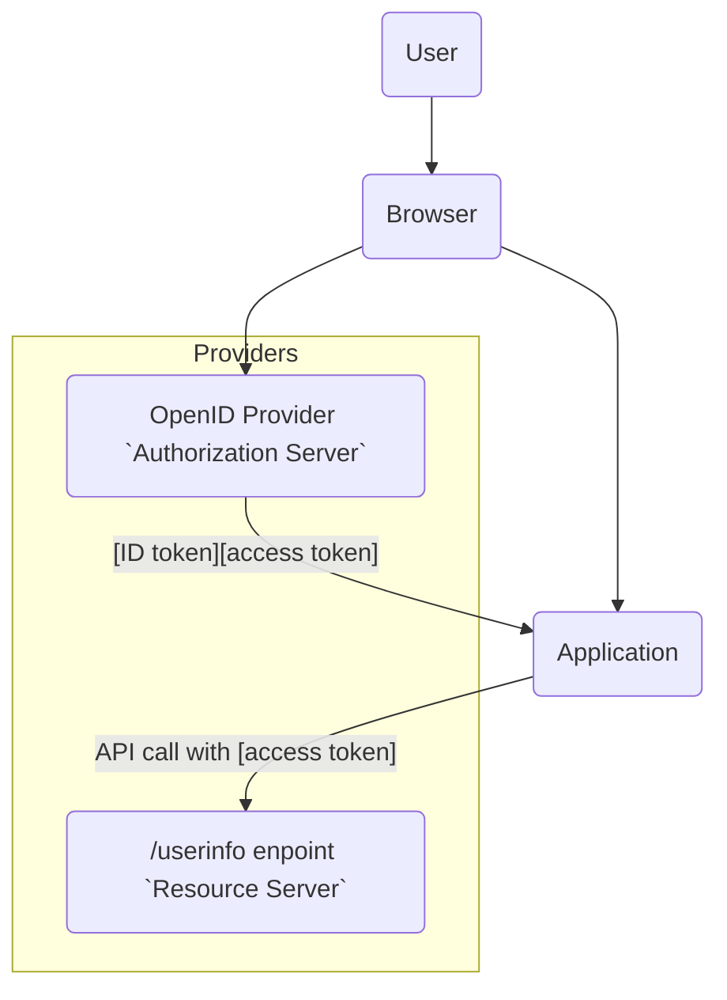

# Chapter 6: OpenId Connect

> In the social jungle of human existence, there is no feeling of being alive
> without a sense of identity.
>
> —Erik Erikson, German-American developmental psychologist and psychoanalyst
> who coined the phrase “Identity crisis,” from Identities: Youth and Crisis
> (1968)

- [Chapter 6: OpenId Connect](#chapter-6-openid-connect)
  - [Problem to Solve](#problem-to-solve)
  - [Terminology](#terminology)
    - [Roles](#roles)
    - [Client Types](#client-types)
    - [Tokens and Authorization Code](#tokens-and-authorization-code)
    - [Endpoints](#endpoints)
    - [ID Token](#id-token)
  - [How It Works](#how-it-works)
    - [OIDC Flows](#oidc-flows)
  - [Notes](#notes)

OAuth 2 provides a framework for authorizing applications to call APIs, but
isn’t designed for authenticating users to applications. [The
`OpenID Connect (OIDC)` protocol](https://openid.net/connect/) provides an `identity service` layer on top of
OAuth 2, designed to allow `authorization servers` to authenticate users for
applications and return the results in a standard way. Some implementations of
OAuth 2 added proprietary additions to do this, but a standard solution was
needed.

## Problem to Solve

The scenario `OIDC` is designed to solve involves a user who needs to be
authenticated in order to access an `application`. OIDC enables an `application`
to delegate user authentication to an OAuth 2 `authorization server` and have
it return to the `application` a set of claims about the authenticated user and
authentication event in a **standard format**.



When a user accesses an application, it redirects the user’s browser (or
similar user agent for native/mobile apps) to an `authorization server` that
implements OIDC. OIDC calls such an `authorization server` an `OpenID Provider`.

The `OpenID Provider` interacts with the `user` to authenticate them. After
authentication, the user’s browser is redirected back to the `application`.

The `application` can request that claims about the authenticated user be
returned in a security token called an `ID Token`. Alternatively, it can
request an OAuth 2 `access token` and use it to call the `OpenID Provider`’s
UserInfo endpoint to obtain the claims.

Because `OIDC` is a layer on top of OAuth 2, an `application` can use an
`OpenID Provider` for both user authentication and authorization to call the
`OpenID Provider`’s API.

## Terminology

### Roles

There are three different roles involved in the OIDC solution:

- `End User`: The `end user` is a subject to be authenticated.
- `OpenID Provider (OP)`:  The `OpenID Provider` is an OAuth 2
  `authorization server` that implements OIDC and can authenticate a user and
  return claims about the authenticated user and the authentication event to a
  `relying party` (application).
- `Relying Party (RP)`: An OAuth 2 client which delegates user authentication
  to an `OpenID Provider` and requests claims about the user from the
  `OpenID Provider`. A `relying party` could be another `identity provider`.

### Client Types

The OIDC specification references the `public application` and
`confidential application` types as well as `native applications`, defined in
the [“OAuth 2.0 for Native Apps”](https://tools.ietf.org/html/rfc8252) best current practice document as applications
installed on, and run natively on, a user’s device.

### Tokens and Authorization Code

OIDC uses the `authorization code`, `access token`, and `refresh token` for
OAuth 2 and defines a new token called an `ID Token`.

- `ID Token`: A token used to convey claims about an authentication event and
  an authenticated user to a `relying party` (application).

### Endpoints

OIDC utilizes the authorization and token endpoints for OAuth 2 and adds the
UserInfo endpoint.

- `UserInfo Endpoint`: Returns claims about an authenticated user. Calling the
  endpoint requires an `access` token, and the claims returned are governed by
  the `access token`.

### ID Token

An `ID Token` is a security token used by an `OpenID Provider` to convey claims
to an `application` about an authentication event and authenticated user.
`ID Tokens` are encoded in [JSON Web Token (JWT)](https://tools.ietf.org/html/rfc7519) format.

- JWT Header (algorithm and type of token)
  
  ```json
  {
    "alg": "RS256",
    "typ": "JWT"
  }
  ```

- Payload (claims)

  ```json
  {
    "iss": "http://openidprovider.com",
    "sub": "234567890",
    "aud": "2fb3JsPMrDnQkwLEVNMDzUF",
    "nonce": "47jglwOhmxoZhgOewhg9582lf",
    "exp": 1516239322,
    "iat": 1516239022,
    "name": "Fred Doe",
    "admin": true,
    "auth_time": 516239021,
    "arc": "I",
    "amr": "pwd"
  }
  ```

- Signature

The JWT format is designed to convey claims between two parties. As a JWT, an
`ID Token` consists of a header, a payload, and a signature.

- The header section of the `ID Token` contains information on
  - the type of object (JWT)
  - the specific signature algorithm used to protect the integrity of the
    claims in the payload. Common signature algorithms are
    - HS256 (HMAC with SHA256)
    - RS256 (RSA Signature with SHA256)
- The payload section contains the claims about a user and the authentication
  event.
- The signature section contains a digital signature based on the payload
  section of the `ID Token` and a `secret key` known to the `OpenID Provider`.
  - The `OpenID Provider` signs the JWT in accordance with the [JSON Web
    Signature (JWS) specification](https://tools.ietf.org/html/rfc7515).
  - A `relying party application` can validate the signature on the `ID Token`
    to check the integrity of the claims in it.
  - For confidentiality, the `OpenID Provider` can optionally encrypt the JWT
    using [JSON Web Encryption (JWE)](https://tools.ietf.org/html/rfc7516) after it is signed. If this is done, it
    produces a nested JWT.

The `name:value` pairs in the payload section of the `ID Token` JWT are the
claims about an authenticated user and authentication event. The OIDC
specification (Section 2) defines a set of claims for `ID Tokens` applicable to
[all types of OIDC authentication requests](https://openid.net/specs/openid-connect-core-1_0.html#IDToken):

OIDC Claims in ID Tokens for All OIDC Flows:

- `iss`: Issuer of the `ID Token`, identified in URL format. The issuer is
  typically the `OpenID Provider`. The `“iss”` claim should not include URL
  query or fragment components.
- `sub`: Unique (within the `OpenID Provider`), case-sensitive string
  identifier for the authenticated user or subject entity, no more than 255
  ASCII characters long. The identifier in the `subclaim` should never be
  reassigned to a new user or entity.
- `aud`: `Client ID` of the `relying party (application)` for which the
  `ID Token` is intended. May be a single, case-sensitive string or an array of
  the same if there are multiple `audiences`.
- `exp`: Expiration time for the `ID Token`, timestamp in second.
- `iat`: Time at which the `ID Token` was issued, timestamp in second.
- `auth_time`: Time at which the user was authenticated, timestamp in second.
- `nonce`: Unguessable, case-sensitive string value passed in authentication
  request from the `relying party` and added by an `OpenID Provider` to an
  `ID Token` to link the `ID Token` to a `relying party` application session
  and to facilitate detection of replayed `ID Tokens`.
- `amr`: String containing an `authentication method reference` – used to
  indicate the method(s) of authentication used to authenticate the subject of
  the `ID Token`. The [Authentication Method Reference Values](https://datatracker.ietf.org/doc/html/rfc8176) specification
  defines a set of initial standard values for this claim.
- `acr`: String containing an `authentication context class` reference – used
  to indicate authentication context class for the authentication mechanism
  used to authenticate the subject of the `ID Token`. Values may be decided by
  `OpenID Provider` or agreed upon between `relying party` and `OpenID Provider`
  and might use standards such as the draft [OpenID Connect Extended
  Authentication Profile ACR values](https://openid.net/specs/openid-connect-eap-acr-values-1_0.html).
- `azp`: `Client ID` of the `authorized party` to which the `ID Token` is
  issued. Typically not used unless the `ID Token` only has a single audience
  in the `“aud”` claim and that audience is different from the
  `authorized party`, though it can be used even if the `audience` and
  `authorized party` are the same.

An ID Token can contain additional claims beyond those listed above.
[Examples of additional standard claims](https://openid.net/specs/openid-connect-core-1_0.html#StandardClaims) which may be added are the user’s name,
given_name, family_name, email, email_verified, locale, and picture. A list of
additional standard claims can be found in [Section 5.1 of the OIDC core
specification](https://openid.net/specs/openid-connect-core-1_0.html#StandardClaims). Specific types of OIDC requests (flows) may involve additional
claims. Custom claims can also be defined and added by an `OpenID Provider`.

## How It Works

OIDC defines three different flows by which an application can interact with an
`OpenID Provider` to make an authentication request.

### OIDC Flows

>>>>> progress

## Notes

- <https://tools.ietf.org/html/rfc7636>
- <https://openid.net/specs/oauth-v2-multiple-response-types-1_0.html>
- <https://openid.net/specs/openid-connect-core-1_0.html#ScopeClaims>
- <https://openid.net/specs/openid-connect-core-1_0.html#AuthRequest>
- <https://openid.net/specs/openid-connect-core-1_0.html#ClientAuthentication>
- <https://tools.ietf.org/html/rfc7636>
- <https://tools.ietf.org/html/rfc7519#section-7.2>
- <https://datatracker.ietf.org/doc/html/draft-ietf-oauth-security-topics-21#section-2.1.2>
- <https://openid.net/specs/oauth-v2-form-post-response-mode-1_0.html>
- <https://datatracker.ietf.org/doc/html/draft-ietf-oauth-security-topics-21#section-2.1.2>
- <https://openid.net/specs/openid-client-initiated-backchannel-authentication-core-1_0-final.html>
