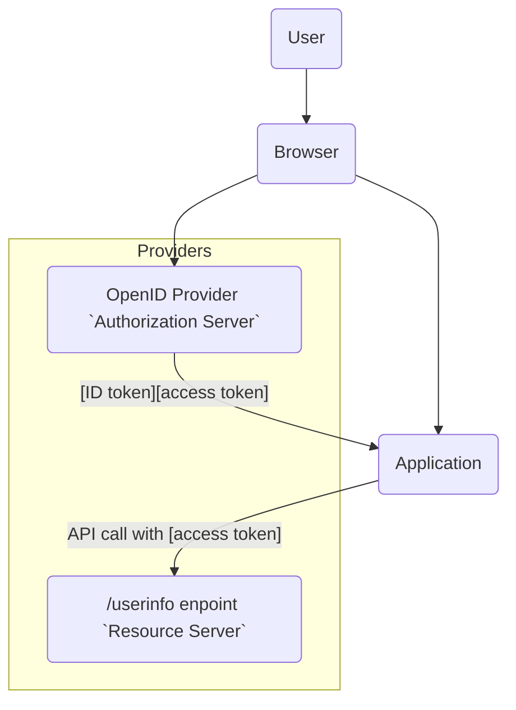
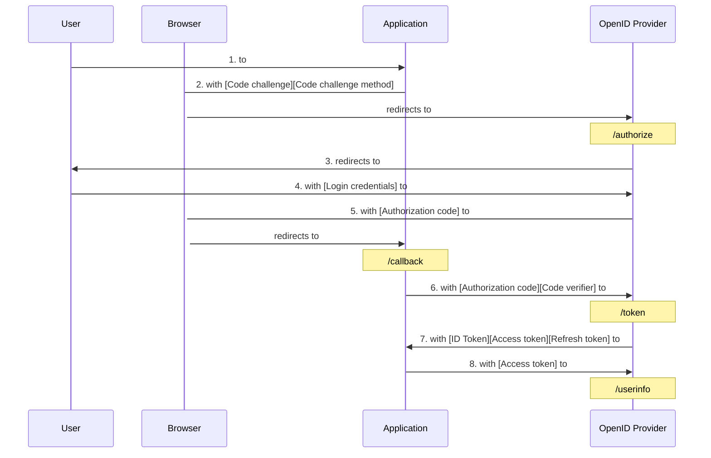
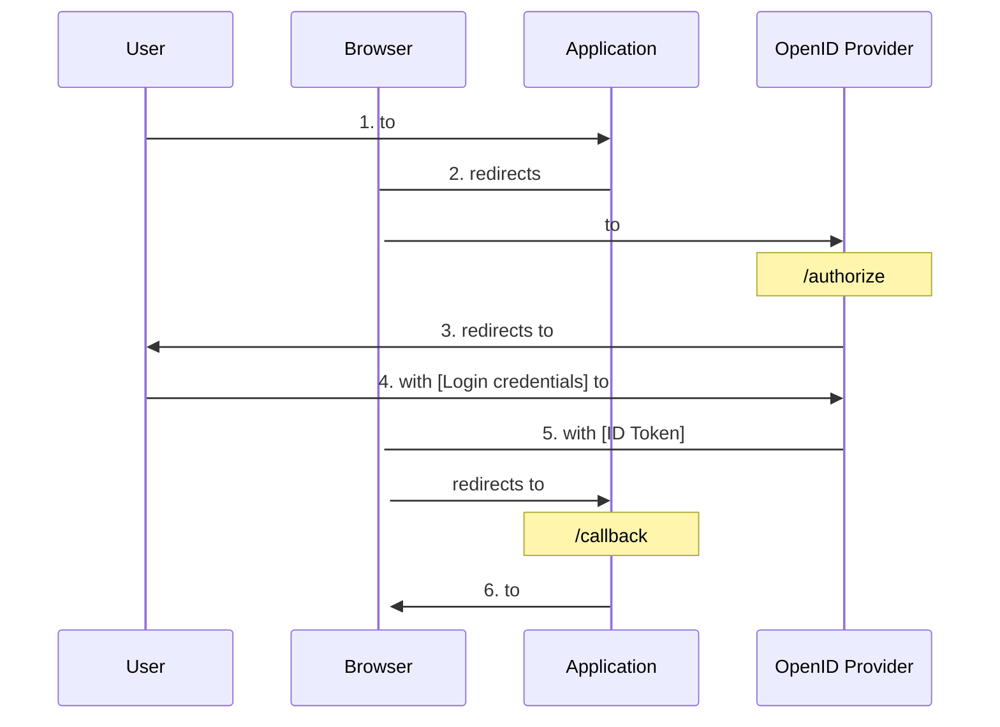
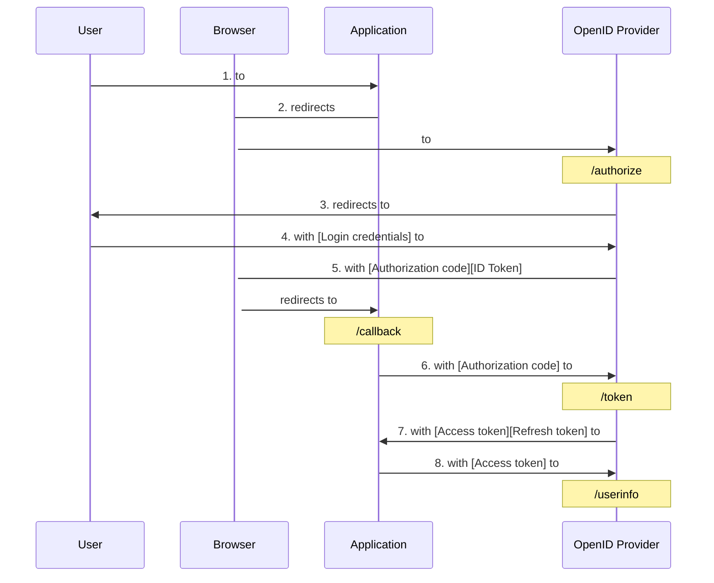

# Chapter 6: OpenId Connect

> In the social jungle of human existence, there is no feeling of being alive
> without a sense of identity.
>
> —Erik Erikson, German-American developmental psychologist and psychoanalyst
> who coined the phrase “Identity crisis,” from Identities: Youth and Crisis
> (1968)

- [Chapter 6: OpenId Connect](#chapter-6-openid-connect)
  - [Problem to Solve](#problem-to-solve)
  - [Terminology](#terminology)
    - [Roles](#roles)
    - [Client Types](#client-types)
    - [Tokens and Authorization Code](#tokens-and-authorization-code)
    - [Endpoints](#endpoints)
    - [ID Token](#id-token)
  - [How It Works](#how-it-works)
    - [OIDC Flows](#oidc-flows)
    - [OIDC Authorization Code Flow](#oidc-authorization-code-flow)
      - [Authentication Request](#authentication-request)
      - [Authentication Response](#authentication-response)
      - [Token Request](#token-request)
    - [OIDC Implicit Flow](#oidc-implicit-flow)
      - [OIDC Implicit Flow: Authentication Request](#oidc-implicit-flow-authentication-request)
      - [OIDC Implicit Flow: Authentication Response](#oidc-implicit-flow-authentication-response)
    - [OIDC Hybrid Flow](#oidc-hybrid-flow)
      - [OIDC Hybrid Flow: Authentication Request](#oidc-hybrid-flow-authentication-request)
      - [OIDC Hybrid Flow: Authentication Response](#oidc-hybrid-flow-authentication-response)
  - [UserInfo Endpoint](#userinfo-endpoint)
  - [Further Learning](#further-learning)
  - [Summary](#summary)
    - [Key Points](#key-points)

OAuth 2 provides a framework for authorizing applications to call APIs, but
isn’t designed for authenticating users to applications. [The
`OpenID Connect (OIDC)` protocol](https://openid.net/connect/) provides an `identity service` layer on top of
OAuth 2, designed to allow `authorization servers` to authenticate users for
applications and return the results in a standard way. Some implementations of
OAuth 2 added proprietary additions to do this, but a standard solution was
needed.

## Problem to Solve

The scenario `OIDC` is designed to solve involves a user who needs to be
authenticated in order to access an `application`. OIDC enables an `application`
to delegate user authentication to an OAuth 2 `authorization server` and have
it return to the `application` a set of claims about the authenticated user and
authentication event in a **standard format**.



When a user accesses an application, it redirects the user’s browser (or
similar user agent for native/mobile apps) to an `authorization server` that
implements OIDC. OIDC calls such an `authorization server` an `OpenID Provider`.

The `OpenID Provider` interacts with the `user` to authenticate them. After
authentication, the user’s browser is redirected back to the `application`.

The `application` can request that claims about the authenticated user be
returned in a security token called an `ID Token`. Alternatively, it can
request an OAuth 2 `access token` and use it to call the `OpenID Provider`’s
UserInfo endpoint to obtain the claims.

Because `OIDC` is a layer on top of OAuth 2, an `application` can use an
`OpenID Provider` for both user authentication and authorization to call the
`OpenID Provider`’s API.

## Terminology

### Roles

There are three different roles involved in the OIDC solution:

- `End User`: The `end user` is a subject to be authenticated.
- `OpenID Provider (OP)`:  The `OpenID Provider` is an OAuth 2
  `authorization server` that implements OIDC and can authenticate a user and
  return claims about the authenticated user and the authentication event to a
  `relying party` (application).
- `Relying Party (RP)`: An OAuth 2 client which delegates user authentication
  to an `OpenID Provider` and requests claims about the user from the
  `OpenID Provider`. A `relying party` could be another `identity provider`.

### Client Types

The OIDC specification references the `public application` and
`confidential application` types as well as `native applications`, defined in
the [“OAuth 2.0 for Native Apps”](https://tools.ietf.org/html/rfc8252) best current practice document as applications
installed on, and run natively on, a user’s device.

### Tokens and Authorization Code

OIDC uses the `authorization code`, `access token`, and `refresh token` for
OAuth 2 and defines a new token called an `ID Token`.

- `ID Token`: A token used to convey claims about an authentication event and
  an authenticated user to a `relying party` (application).

### Endpoints

OIDC utilizes the authorization and token endpoints for OAuth 2 and adds the
UserInfo endpoint.

- `UserInfo Endpoint`: Returns claims about an authenticated user. Calling the
  endpoint requires an `access` token, and the claims returned are governed by
  the `access token`.

### ID Token

An `ID Token` is a security token used by an `OpenID Provider` to convey claims
to an `application` about an authentication event and authenticated user.
`ID Tokens` are encoded in [JSON Web Token (JWT)](https://tools.ietf.org/html/rfc7519) format.

- JWT Header (algorithm and type of token)
  
  ```json
  {
    "alg": "RS256",
    "typ": "JWT"
  }
  ```

- Payload (claims)

  ```json
  {
    "iss": "http://openidprovider.com",
    "sub": "234567890",
    "aud": "2fb3JsPMrDnQkwLEVNMDzUF",
    "nonce": "47jglwOhmxoZhgOewhg9582lf",
    "exp": 1516239322,
    "iat": 1516239022,
    "name": "Fred Doe",
    "admin": true,
    "auth_time": 516239021,
    "arc": "I",
    "amr": "pwd"
  }
  ```

- Signature

The JWT format is designed to convey claims between two parties. As a JWT, an
`ID Token` consists of a header, a payload, and a signature.

- The header section of the `ID Token` contains information on
  - the type of object (JWT)
  - the specific signature algorithm used to protect the integrity of the
    claims in the payload. Common signature algorithms are
    - HS256 (HMAC with SHA256)
    - RS256 (RSA Signature with SHA256)
- The payload section contains the claims about a user and the authentication
  event.
- The signature section contains a digital signature based on the payload
  section of the `ID Token` and a `secret key` known to the `OpenID Provider`.
  - The `OpenID Provider` signs the JWT in accordance with the [JSON Web
    Signature (JWS) specification](https://tools.ietf.org/html/rfc7515).
  - A `relying party application` can validate the signature on the `ID Token`
    to check the integrity of the claims in it.
  - For confidentiality, the `OpenID Provider` can optionally encrypt the JWT
    using [JSON Web Encryption (JWE)](https://tools.ietf.org/html/rfc7516) after it is signed. If this is done, it
    produces a nested JWT.

The `name:value` pairs in the payload section of the `ID Token` JWT are the
claims about an authenticated user and authentication event. The OIDC
specification (Section 2) defines a set of claims for `ID Tokens` applicable to
[all types of OIDC authentication requests](https://openid.net/specs/openid-connect-core-1_0.html#IDToken):

OIDC Claims in ID Tokens for All OIDC Flows:

- `iss`: Issuer of the `ID Token`, identified in URL format. The issuer is
  typically the `OpenID Provider`. The `“iss”` claim should not include URL
  query or fragment components.
- `sub`: Unique (within the `OpenID Provider`), case-sensitive string
  identifier for the authenticated user or subject entity, no more than 255
  ASCII characters long. The identifier in the `subclaim` should never be
  reassigned to a new user or entity.
- `aud`: `Client ID` of the `relying party (application)` for which the
  `ID Token` is intended. May be a single, case-sensitive string or an array of
  the same if there are multiple `audiences`.
- `exp`: Expiration time for the `ID Token`, timestamp in second.
- `iat`: Time at which the `ID Token` was issued, timestamp in second.
- `auth_time`: Time at which the user was authenticated, timestamp in second.
- `nonce`: Unguessable, case-sensitive string value passed in authentication
  request from the `relying party` and added by an `OpenID Provider` to an
  `ID Token` to link the `ID Token` to a `relying party` application session
  and to facilitate detection of replayed `ID Tokens`.
- `amr`: String containing an `authentication method reference` – used to
  indicate the method(s) of authentication used to authenticate the subject of
  the `ID Token`. The [Authentication Method Reference Values](https://datatracker.ietf.org/doc/html/rfc8176) specification
  defines a set of initial standard values for this claim.
- `acr`: String containing an `authentication context class` reference – used
  to indicate authentication context class for the authentication mechanism
  used to authenticate the subject of the `ID Token`. Values may be decided by
  `OpenID Provider` or agreed upon between `relying party` and `OpenID Provider`
  and might use standards such as the draft [OpenID Connect Extended
  Authentication Profile ACR values](https://openid.net/specs/openid-connect-eap-acr-values-1_0.html).
- `azp`: `Client ID` of the `authorized party` to which the `ID Token` is
  issued. Typically not used unless the `ID Token` only has a single audience
  in the `“aud”` claim and that audience is different from the
  `authorized party`, though it can be used even if the `audience` and
  `authorized party` are the same.

An ID Token can contain additional claims beyond those listed above.
[Examples of additional standard claims](https://openid.net/specs/openid-connect-core-1_0.html#StandardClaims) which may be added are the user’s name,
given_name, family_name, email, email_verified, locale, and picture. A list of
additional standard claims can be found in [Section 5.1 of the OIDC core
specification](https://openid.net/specs/openid-connect-core-1_0.html#StandardClaims). Specific types of OIDC requests (flows) may involve additional
claims. Custom claims can also be defined and added by an `OpenID Provider`.

## How It Works

OIDC defines three different flows by which an application can interact with an
`OpenID Provider` to make an authentication request.

### OIDC Flows

The OIDC flows are designed around the constraints of different types of
applications and bear some similarity to the grant types defined in OAuth 2.
The original OIDC core specification defines the following flows:

- `Authorization Code Flow`
- `Implicit Flow`
- `Hybrid Flow`

### OIDC Authorization Code Flow

The OIDC Authorization Code Flow is similar to the OAuth 2
`authorization code grant` in relying upon two requests and an intermediary
`authorization code`. To authenticate a user, an application redirects the
user’s browser to an `OpenID Provider`. The `OpenID Provider` authenticates the
user and redirects the user’s browser back to the `application` with an
`authorization code`. The application uses the `authorization code` to obtain
an `ID Token`, `access token`, and optionally a `refresh token`, from the
`OpenID Provider`’s token endpoint.



1. The `user` accesses the `application (relying party)`.
2. The user’s browser redirected to the `OpenID Provider` with an
   `authentication request`.
3. The `OpenID Provider` interacts with the user for authentication and to
   obtain consent for the scope of user info request.
4. The user authenticates and gives consent, and the `OpenID Provider` creates
   or updates an authentication session for the user.
5. The user’s browser redirected back to the `application` with
   `authorization code`.
6. The `application` sends a token request to the `OpenID Provider`, with the
   `authorization code`.
7. The `OpenID Provider` responds with an `ID Token`, `access token`, and
   optionally a `refresh token`.
8. The `application` can use the `access token` at the `OpenID Provider`’s
   UserInfo endpoint.

The second call to the token endpoint to obtain the security tokens assumes the
application has the ability to authenticate itself to the `OpenID Provider`.
`Public client` applications that cannot securely maintain a `secret` for such
authentication can use `Proof Key for Code Exchange (PKCE)`. The use of PKCE is
designed to mitigate the risk of an `authorization code` being intercepted by
an unauthorized party. The following sample requests assume the use of PKCE.

#### Authentication Request

An application redirects the user’s browser with an authentication request to
the `OpenID Provider`’s authorization endpoint such as

```http
GET /authorize?
response_type=code
& client_id=<client_id>
& state=<state_value>
& nonce=<nonce_value>
& scope=<scope>
& redirect_uri=<callback_url>
& code_challenge=<code_challenge>
& code_challenge_method=<code_challenge_method> HTTP/1.1 Host: authorizationserver.com
```

The parameters may vary by individual OpenID Provider.

- `response_type`: The response type indicates which OIDC flow to use. `“code”`
  indicates that the `Authorization Code Flow` should be used.
- `response_mode`: An optional parameter used to request a nondefault mechanism
  to be used by the `authorization server` to deliver response parameters to
  the client application.
- `client_id`: The `client ID` for the `relying party application`, obtained
  when it registered with the `OpenID Provider (authorization server)`.
- `state`: An unguessable value passed to the `OpenID Provider` in the request.
  The `OpenID Provider` is supposed to return the exact same state parameter
  and value in a success response. Used by the `relying party application` to
  validate the response corresponds to a request it sent previously. This helps
  protect against token injection and CSRF (Cross-Site Request Forgery).
- `nonce`: An unguessable value passed to the `OpenID Provider` in the request
  and returned unmodified as a claim in the `ID Token` if an `ID Token` is
  requested. Used to protect against token replay.
- `scope`: A string specifying the claims requested about the authenticated
  user. Example scope: “openid:profile:email”.
- `redirect_uri`: URI where the `OpenID Provider` directs the response upon
  completion of the authentication request.
- `code_challenge`: PKCE `code challenge` derived from the PKCE `code verifier`
  using the `code challenge method` specified in the `code_challenge_method`
  parameter, as described in [Section 4.2 of the PKCE specification](https://tools.ietf.org/html/rfc7636).
- `code_challenge_method`: `“S256”` or `“plain”`. Applications capable of using
  S256 (SHA256 hash) must use it.

The `response_type` parameter in the authentication request is used to indicate
the desired OIDC flow. For the `Authorization Code Flow`, the `response_type`
should be `“code”`, appropriately named as it returns an `authorization code`
to the `application`. This OIDC flow is similar to the
`authorization code grant`.

The optional `response_mode` parameter governs the method by which the response
parameters are returned to the application. With the `“query”` response mode,
the response from the `OpenID Provider` is returned in a query string appended
to the redirect URI specified in the request. This mode is the default when the
`“code”` response type is used. With the `“fragment”` response mode, the
response from the `OpenID Provider` is included in a fragment appended to the
redirect URI. This is the default response mode for the `“token”` response
type. These two response modes are defined in the
[“OAuth 2.0 Multiple Response Type Encoding Practices” specification](https://openid.net/specs/oauth-v2-multiple-response-types-1_0.html).

The `scope` parameter in OAuth 2 is used to request API privileges to be
represented via an `access token`. With OIDC authentication requests, the
`scope` is used to indicate the use of OIDC and request particular claims about
the authenticated user. OIDC authentication requests must include the `“openid”`
scope value. The string “openid profile email” is a sample scope value. Adding
`“profile”` to the scope value requests a set of default user profile claims
such as name. Adding `“email”` requests the user’s email address and whether
that address has been validated. When the `response_type` results in the
issuance of an `access token`, the scope applies to the claims returned by the
`OpenID Provider`’s UserInfo endpoint. If an `access token` is not issued, the
requested claims will be included in the `ID Token`. Additional details on
requesting claims can be found in [Sections 5.4 and 5.5 of the OpenID Connect Core specification](https://openid.net/specs/openid-connect-core-1_0.html#ScopeClaims).

The `nonce` value should be included if an `ID Token` is requested. When an
application makes an authentication request to an `OpenID Provider`, it should
specify a unique, nonguessable `nonce` value that is tied to the session an
application has started for the user. One option is to generate a random value,
store it securely in the user session, and use its hash as the `nonce`. When
the application receives an `ID Token`, it must check that the token contains
the exact `nonce` value specified in the authentication request and that the
nonce matches the hash of the value previously stored in the session. This
links an `ID Token` with a user’s application session and mitigates the risk of
`ID Tokens` being replayed.

There are several additional, optional parameters which may be passed in an
authentication request to govern how and whether an `OpenID Provider` prompts a
user to authenticate and provide consent, to specify preferred language(s), to
pass hints about a user’s session or identifier, or to request specific user
claims. See [Section 3.1.2.1 of the OpenID Core specification](https://openid.net/specs/openid-connect-core-1_0.html#AuthRequest) for further information.

#### Authentication Response

The `OpenID Provider` returns a response to the redirect URI specified in the
authentication request and which must be registered with the `OpenID Provider`.
For the `Authorization Code Flow`, the default `response_mode` returns the
`authorization code` using a query parameter to the redirect URI (callback)
specified in the authentication request. It also returns the exact `state` value
that was passed in the authentication request.

```http
HTTP/1.1 302 Found
Location: https://clientapplication.com/callback?
code=<authorization_code>
& state=<state_value>
```

The application should check to see if the response contains any error codes
and if the `state` value returned with a response matches the `state` value it
sent in its authentication request. It can then use the `authorization code` to
make a token request. An application should take care to only use each
`authorization code` once as the server is obligated to respond with an error
if an `authorization code` has already been used.

#### Token Request

The `authorization code` returned by an `OpenID Provider` is used by an
`application` in a token request to the `OpenID Provider`’s token endpoint. The
following sample request assumes a `confidential client` application that was
registered at the `OpenID Provider` to authenticate with a `client secret` and
HTTP Basic authentication.

```http
POST /token HTTP/1.1
Host: authorizationserver.com
Content-Type: application/x-www-form-urlencoded
Authorization: Basic <encoded client credentials>
grant_type=authorization_code
& code=<authorization_code>
& redirect_uri=<redirect_uri>
& code_verifier=<code_verifier>
```

The registration for an application at an `OpenID Provider` may specify one of
several authentication methods to be used with token requests. Further
information on the defined authentication methods can be found in
[Section 9 of the OIDC Core specification](https://openid.net/specs/openid-connect-core-1_0.html#ClientAuthentication).

- `grant_type`: `“authorization_code”` is used when exchanging an
  `authorization code` for tokens.
- `code`: The `authorization code` received in response to the authentication
  request.
- `redirect_uri`: Callback location at the application for the OpenID Provider’s response from this call.
- `code_verifier`: The `PKCE code verifier` value from which the
  `code challenge` in the authentication request was derived. It should be an
  unguessable, cryptographically random string between 43 and 128 characters in length, inclusive, using the characters A–Z, a–z, 0–9, “-”, “.”, “_”, and “~”
  and formed as described in [Section 4.1 of the PKCE specification](https://tools.ietf.org/html/rfc7636).

The `OpenID Provider` will respond with the requested tokens in JSON format.
The following shows a sample response:

```http
HTTP/ 1.1 200 OK
Content-Type: application/json;charset=UTF-8
Cache-Control: no-store
Pragma: no-cache
{
  "id_token" : <id_token>,
  "access_token" : <access_token value>,
  "refresh_token" : <refresh_token value>,
  "token_type" : "Bearer",
  "expires_in" : <token lifetime>
}
```

- `id_token`: The `ID Token` with user claims.
- `access_token`: The `access token` for the `OpenID Provider`’s UserInfo
  endpoint.
- `refresh_token`: A `refresh token`, if a `refresh token` was requested or is
  returned by default.
- `token_type`: `Bearer` is typically used unless an `OpenID Provider` has
  documented another type.
- `expires_in`: The lifetime of the `access token`, in seconds.

Before relying on claims in an `ID Token`, an `application` should validate the
`ID Token` following guidance provided by the issuing `OpenID Provider` and
[the validation steps in the JWT specification](https://tools.ietf.org/html/rfc7519#section-7.2).
The application can obtain claims about the authenticated user from the
`ID Token` or by using the `access token` to call the `OpenID Provider`’s
UserInfo endpoint.

### OIDC Implicit Flow

The `Implicit Flow` in OIDC is similar to the OAuth 2 grant type of the same
name. The use of the OAuth 2 `implicit grant` to obtain an `access token`, at
least with default response mode, is no longer recommended and has been removed
from the OAuth 2.1 version of the specification. However, that guidance is
based on the risk of exposing an `access token` in a URL fragment which can be
leaked via the browser history or referer header. An application that only
needs to authenticate users and can obtain user information via an `ID Token`
does not need an `access token`. In this case, the `OIDC Implicit Flow` may be
acceptable. The figure below shows this flow with the application receiving
only an `ID Token`.



1. The user accesses the application (relying party).
2. The user’s browser redirected to the `OpenID Provider` with an
   authentication request.
3. The `OpenID Provider` interacts with the user for authentication and to
   obtain consent for the scope of user info request.
4. The user provides login credentials and consent, and the `OpenID Provider`
   creates or updates an authentication session for the user.
5. The user’s browser redirected back to the `application` with an `ID Token`.
6. The `application` obtains user claims from the `ID Token` and displays
   suitable application content to the user.

#### OIDC Implicit Flow: Authentication Request

An authentication request to authenticate a user with the `OIDC Implicit Flow`,
and request only an `ID Token`, will look similar to the following:

```http
GET /authorize?
response_type=id_token
& client_id=<client_id>
& state=<state_value>
& nonce=<nonce_value>
& scope=<scope_value>
& redirect_uri=<callback_url> HTTP/1.1 Host: authorizationserver.com
```

For the `Implicit Flow`, the allowed `response_type` values are

- `id_token`: Response contains only an `ID Token`.
- `id_token token`: Response contains an `ID Token` and `access token`.

By default, the `OIDC Implicit Flow` returns all tokens via front-channel
browser interaction to the redirect URI, using a `URL fragment`. The use of
`“id_token token”` `response_type` is not recommended with the default response
mode as it would expose an `access token` to [potential compromise through a
referer header or the browser’s history](https://datatracker.ietf.org/doc/html/draft-ietf-oauth-security-topics-21#section-2.1.2).
Using the `OIDC Implicit Flow` with the default response mode and `“id_token”`
`response_type` to return only an `ID Token` avoids this risk, assuming the
`ID Token` does not contain sensitive data.

Another option is to use a nondefault response mode.
[The OAuth 2.0 Form Post Response Mode specification](https://openid.net/specs/oauth-v2-form-post-response-mode-1_0.html)
defines a response mode, `“form_post”`, which results in the response from the
`authorization server` being encoded in an HTML form sent via HTTP-POST to the
application. This response mode could be considered for applications needing
only an `ID Token`. This avoids exposing the `ID Token` and data in it via a
URL fragment, but this response mode may not be feasible for some `application`
types. `Public clients` needing an `access token` and/or `ID Token` with
sensitive elements should use the `Authorization Code Flow` with PKCE instead.

It is unclear if `authorization servers` and `OpenID Providers` will terminate
support for the `Implicit Flow`. New applications should use the
`Authorization Code Flow` with PKCE instead of `Implicit Flow`. Existing
applications that use the `Implicit Flow` should consider replacing it to
reduce the risk of `access token` exposure as well as a potential end-of-life
announcement from their `OpenID Provider`.

#### OIDC Implicit Flow: Authentication Response

The following shows a sample response to an `Implicit Flow` authentication
request that used an `id_token` response type to request only an `ID Token`.
This approach can be used if the claims in the `ID Token` do not contain
sensitive data.

```http
HTTP/1.1 302 Found
Location: https://clientapplication.com/callback#
id_token=<id_token>
& state=<state>
```

### OIDC Hybrid Flow

The `OIDC Hybrid Flow` includes elements of both the
`OIDC Authorization Code Flow` and `OIDC Implicit Flow`. It is designed for
applications with both a secure back end and a front end with client-side
JavaScript executing in a browser. The `OIDC Hybrid Flow` enables models such
as returning an `ID Token` and `authorization code` in a front-channel response
to the `application` front end, leaving the `application` back end to obtain an
`access token` (and optional `refresh token`) from the token endpoint using the
`authorization code`.



1. The user accesses the `application (relying party)`.
2. The user’s browser redirected to the `OpenID Provider` with an
   authentication request.
3. The `OpenID Provider` interacts with the user for authentication and to
   obtain consent for the scope of user info request.
4. The user authenticates and provides consent, and the `OpenID Provider`
   creates or updates an authentication session for the user.
5. The user’s browser redirected back to the application front end with an
   `authorization code` and `ID Token`.
6. The client `application` validates the `ID Token`, and, if valid, the back
   end calls the token endpoint with `authorization code` to get additional
   tokens.
7. The `OpenID Provider` token endpoint returns requested tokens.
8. The client application can call the `OpenID Provider`’s UserInfo endpoint
   with an `access token`.

#### OIDC Hybrid Flow: Authentication Request

The `response_type` for the `OIDC Hybrid Flow` uses three different values to
govern which tokens are returned in the response from the `OpenID Provider`’s
authorization endpoint. Additional tokens can be requested via the subsequent
token request to the token endpoint. The possible values for `response_type`:

- `“code id_token”`: `Authorization code`, `id_token`
- `“code token”`: `Authorization code`, `access token` – NOT recommended with
  default `response_mode`
- `“code id_token token”`: `Authorization code`, `id_token`, `access token` –
  NOT recommended with default `response_mode`

The `response_types` which return an `access token` via front-channel response
from the authorization endpoint, namely, `“code token”` and
`“code id_token token”` are not recommended for use with the default response
mode as the `access token` would be exposed as a URL fragment in the browser
and [possibly leaked via referer headers or browser history](https://datatracker.ietf.org/doc/html/draft-ietf-oauth-security-topics-21#section-2.1.2).
If the default response mode is used, the `“code id_token”` `response_type`
should be used to return only the `ID Token` and `authorization code` using a
front-channel response to the browser. An `access token`, and optional
`refresh token`, can then be obtained from the `OpenID Provider`’s token
endpoint via secure back-channel interaction from the application’s back end.

In practice, the `Hybrid Flow` is not widely used. Using this flow requires an
`application` implementation that will provide both the front-end and back-end
with information, such as `nonce` and `state`, with which to validate any
responses and security tokens they receive as well as prevent attacks such as
CSRF or token injection. Applications should consider using the
`Authorization Code Flow` with PKCE unless they have a specific use case that
requires the `OIDC Hybrid Flow`.

A sample authentication request using the `OIDC Hybrid Flow` and
`“code id_token”` response type and default response mode is shown in the
following example:

```http
GET /authorize?
response_type=code id_token
&client_id=<client_identifier>
&redirect_uri=<callback_url>
&scope=<scope_value>
&state=<state_value>
&nonce=<nonce_value> HTTP/1.1 Host: authorizationserver.com
```

#### OIDC Hybrid Flow: Authentication Response

When the application receives the response, the application back end can use
the `authorization code` at the `OpenID Provider`’s token endpoint for
`OIDC Authorization Code Flow`.

## UserInfo Endpoint

An `application` can retrieve claims about a user from the `OpenID Provider`’s
UserInfo endpoint. The UserInfo endpoint is an OAuth 2 API endpoint, and to
call it requires an `access token` issued by the `OpenID Provider`.

When requesting the `access token`, an `application` uses the `scope` parameter
to indicate the desired claims about the user. The `OpenID Provider`
authenticates the user and obtains their consent for the requested claims and
then issues the `access token` with the authorized `scope` for the claims to
the `application`. The `application` then uses the `access token` to request
the claims from the UserInfo endpoint.

A sample application request to the UserInfo endpoint looks like the following:

```http
GET /userinfo HTTP/1.1
Host: authorizationserver.com
Authorization: Bearer <access_token>
```

The `OpenID Provider`’s UserInfo endpoint response returns claims with a JSON
object (unless signed or encrypted responses are used). The following sample
response assumes the requested scope was `“openid profile email”`:

```http
HTTP/1.1 200 OK
Content-Type: application/json
{
  "sub": "1234567",
  "name": "Fred Smith",
  "given_name": "Fred",
  "family_name": "Smith",
  "preferred_username": "fred.smith",
  "email": "fred.smith@example.com",
  "email_verified": true,
  "picture":"https://example.com/fred.smith/fred.smith.jpg",
}
```

An application should perform any validation on responses recommended by its
specific `OpenID Provider`.

The UserInfo endpoint is primarily useful if the desired user profile claims
are too large for an `ID Token` returned via a URL fragment or if the claims
contain sensitive information.

## Further Learning

There are some common scenarios where a different flow is needed.
The OIDC Client-Initiated Backchannel Authentication Flow (CIBA) defines a flow
where an `application` used by a third party, such as a bank teller, a support
agent, or even a self-service point-of-sale terminal, can initiate an
authentication request to an `OpenID Provider` to have it authenticate and
provide claims about a particular user. The `OpenID Provider` then initiates an
interaction with the user on a device, such as a cellphone, to authenticate
them. The key difference with this flow is that the `application` that needs to
authenticate the user is not running on the user’s device.

A more detailed description can be found in the
[OpenID Connect Client-Initiated Backchannel Authentication Flow specification](https://openid.net/specs/openid-client-initiated-backchannel-authentication-core-1_0-final.html).

## Summary

The OpenID Connect protocol provides an identity layer on top of OAuth 2 that
supports authenticating users to applications and enables single sign-on.

Adding to OAuth 2, OIDC adds an ID Token and a UserInfo endpoint, which return
claims about an authentication event and the authenticated user to the
application.

Using OIDC allows applications to delegate user authentication to an
OpenID Provider, and using OIDC and OAuth 2 together solves both authentication
and API authorization.

### Key Points

- OIDC provides an identity layer on top of OAuth 2 to authenticate users.
- OIDC enables single sign-on.
- OIDC provides an ID Token and UserInfo endpoint to obtain user profile info.
- OIDC defines a set of standard claims that can be obtained about a user.
- OIDC allows for the use of additional, custom claims.
- OIDC defines three grant flows for different client profiles.
- OIDC provides several options for returning an authorization code and/or
  security tokens via front-channel or back-channel response.
- Returning access tokens or refresh tokens via front-channel responses should
  be avoided by using a back-channel response or alternate response mode.
- Returning sensitive information in ID Tokens via front-channel responses
  should be avoided by using a back-channel response or the UserInfo endpoint
  or encrypting the ID Token if encryption is supported.
