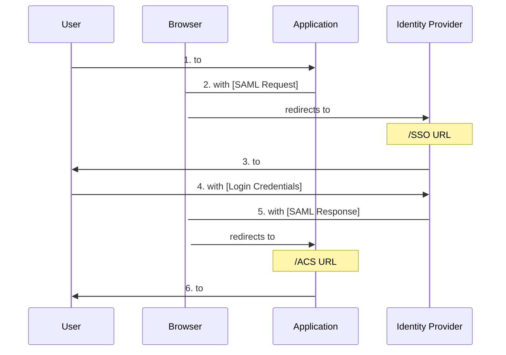
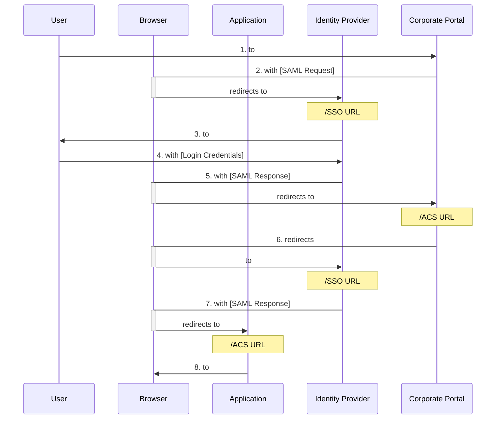
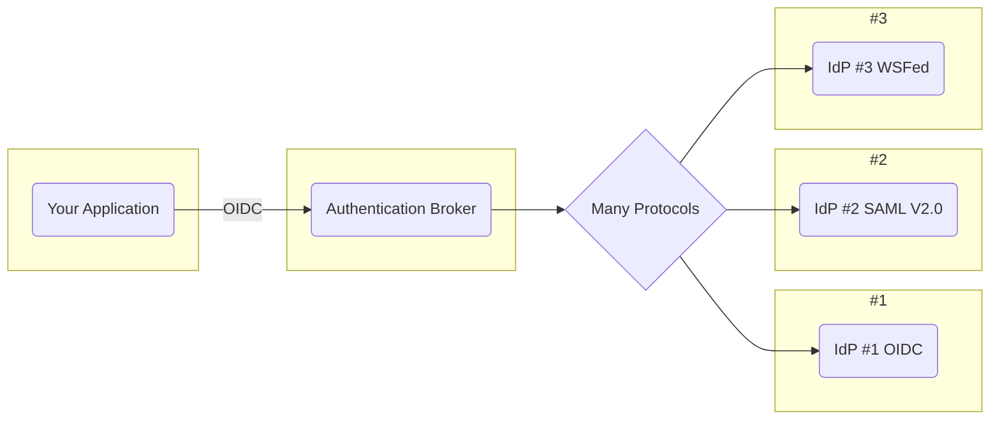

# Chapter 7: SAML 2

> To be trusted is a greater compliment than to be loved.
>
> —George MacDonald, from The Marquis of Lossie (1877)

- [Chapter 7: SAML 2](#chapter-7-saml-2)
  - [Problem to Solve](#problem-to-solve)
  - [Terminology](#terminology)
  - [How It Works](#how-it-works)
    - [SP-Initiated SSO](#sp-initiated-sso)
    - [Single Sign-On](#single-sign-on)
    - [IdP-Initiated Flow](#idp-initiated-flow)
  - [Identity Federation](#identity-federation)
  - [Authentication Brokers](#authentication-brokers)
  - [Configuration](#configuration)
  - [Summary](#summary)
    - [Key Points](#key-points)

The [Security Assertion Markup Language (SAML) 2](https://wiki.oasis-open.org/security/FrontPage)
is known for providing two important features, cross-domain single sign-on
(SSO) and identity federation. SAML 2 has been adopted in many enterprise
environments because it enabled the enterprise to have applications used by
employees, customers, and partners delegate user authentication to a
centralized enterprise identity provider. This gave the enterprise a central
place to manage and control identities.

## Problem to Solve

The most common use case for which SAML is used in our experience is
cross-domain single sign-on. In this scenario, a user needs to access multiple
applications which reside in different domains. If the user is a corporate
employee and the applications are SaaS applications, it would be difficult for
the enterprise to manage all the SaaS application accounts their employees
create.

SAML was designed as an
[“eXtensible Markup Language (XML)–based framework for
describing and exchanging security information between online business
partners”](www.oasis-open.org/committees/download.php/27819/sstc-saml-tech-overview-2.0-cd-02.pdf).
SAML enables applications to delegate user authentication to a remote entity
known as an `identity provider`. The `identity provider` authenticates the user
and returns to the application an assertion with information about the
authenticated user and authentication event. If the user accesses a second
application shortly afterward, which delegates authentication to the same
`identity provider`, the user will be able to access the second application
without being prompted again to log in. This capability is single sign-on.

SAML also provides a mechanism for an `application` and `identity provider` to
use a common shared identifier for a user in order to exchange information
about the user. This is known as `federated identity`. The `federated identity`
can use the same identifier across systems, or it can use an opaque, internal
identifier which is mapped to the identifier for the user in each system.

## Terminology

The SAML specifications define the following terms:

- `Subject`: An entity about which security information will be exchanged. A
  subject usually refers to a person, but can be any entity capable of
  authentication, including a software program.
- `SAML Assertion`: An XML-based message that contains security information
  about a subject.
- `SAML Profile`: A specification that defines how to use SAML messages for a
  business use case such as cross-domain single sign-on.
- `Identity Provider`: A role defined for the SAML cross-domain single sign-on
  profile. An `identity provider` is a server which issues `SAML assertions`
  about an authenticated subject, in the context of cross-domain single sign-on.
- `Service Provider`: Another role defined for the SAML cross-domain single
  sign-on profile. A `service provider` delegates authentication to an
  `identity provider` and relies on information about an authenticated subject
  in a `SAML assertion` issued by an `identity provider` in the context of
  cross-domain single sign-on.
- `Trust Relationship`: An agreement between a SAML `service provider` and a
  SAML `identity provider` whereby the `service provider` trusts `assertions`
  issued by the `identity provider`.
- `SAML Protocol Binding`: A description of how SAML message elements are
  mapped onto standard communication protocols, such as HTTP, for transmission
  between `service providers` and `identity providers`. In practice, SAML
  request and response messages are typically sent over HTTPS using either
  HTTP-Redirect or HTTP-POST, using the HTTP-Redirect and HTTP-POST bindings,
  respectively.

## How It Works

The most common SAML scenario is cross-domain web single sign-on. In this
scenario, the `subject` is a user that wishes to use an `application`. The
application acts as a SAML `service provider`. The application delegates user
authentication to a SAML `identity provider`. The `identity provider`
authenticates a user and returns a `security token`, known as a
`SAML assertion`, to the application. A `SAML assertion` provides information
about the authentication event and the authenticated user, known as the
`subject`.

An entity acting as an `identity provider` can also act as a `service provider`
by further delegating authentication to another `identity provider`. To
establish the ability to do cross-domain web single sign-on, the organizations
owning the `service provider` (application) and `identity provider` exchange
information, known as metadata. The metadata contains information such as URL
endpoints and digital certificates. This data enables the two parties to
exchange messages that are digitally signed and optionally encrypted. The
metadata is used to configure and set up a trust relationship between the
`service provider` and the `identity provider` and must be done before the
`identity provider` can authenticate users for the `service provider`
(application).

Once mutual configuration of providers is in place, when a user accesses the
`service provider` (application), it redirects the user’s browser over to the
`identity provider` with a SAML authentication request message. The
`identity provider` authenticates the user and issues a redirect back to the
application with a SAML authentication response message. The response contains
a `SAML assertion` with information about the user and authentication event, or
an error, if an error condition occurred. The `identity provider` can tailor
the identity claims in the assertion as needed for each `service provider`.

### SP-Initiated SSO

In the example below, the user starts at the `service provider (SP)`
(application) so it is known as the `SP-initiated flow`. This is called
“SP-initiated” because the user initiates the interaction at the
`service provider (SP)`. It is the simplest form of cross-domain single
sign-on:



1. The user visits a `service provider` (application).
2. The `service provider` redirects the user’s browser to the
   `identity provider` with a SAML authentication request.
3. The `identity provider` interacts with the user for authentication.
4. The user authenticates. The `identity provider` validates credentials.
5. The `identity provider` redirects the user’s browser back to the
   `service provider` with a SAML response containing a SAML authentication
   assertion. The response is sent to the `service provider`’s Assertion
   Consumer Service (ACS) URL.
6. The `service provider` consumes and validates the SAML response and
   responds to the user’s original request (assuming the user was successfully
   authenticated and has sufficient privileges for the request).

### Single Sign-On

When the user is redirected by the second application to the
`identity provider`, the `identity provider` will recognize the user already
has a session and won’t ask them to authenticate again. The `identity provider`
will simply redirect the user’s browser back to the second application with a
successful `SAML authentication response`. This is called single sign-on
(SSO).

### IdP-Initiated Flow

SAML also defined another flow, known as `IdP-initiated`, where the user
starts at the `identity provider (IdP)`. In this case, the `identity provider`
redirects the user’s browser to the `service provider` with a SAML response
message without the `service provider` having sent any authentication request.
This flow is found in some enterprise environments where a user accesses
applications via a corporate portal.

When the user initially accesses the corporate portal, they are redirected to
the corporate `identity provider` to log in. After logging in, the user is
returned to the portal and sees a menu of application links on the portal.
Clicking one of these links redirects the user to the `identity provider`,
with the application URL as a parameter. The `identity provider` detects the
user already has an authenticated session and redirects the user’s browser to
the application, with a SAML response message. The `IdP-initiated flow` does
not require a portal, but we’ve chosen to show it as it is a common way this
flow is used.

The `IdP-initiated flow` with a portal has been used in enterprises because it
provides single sign-on and ensures users go to the correct URL for each
application which reduces the risk of users being phished.



1. The user visits a corporate portal.
2. The portal redirects the user’s browser to the `identity provider` with a
   SAML authentication request.
3. The `identity provider` interacts with the user for authentication.
4. The user authenticates. The `identity provider` validates credentials.
5. The `identity provider` redirects the user’s browser back to the portal
   with a SAML response for the portal (response #1) containing an
   authentication assertion. The user is logged in to the portal which
   displays content to the user, including a list of applications.
6. The user clicks a link in the portal for an application. The link directs
   the user’s browser to the `identity provider` with a parameter indicating
   the desired service provider application. The `IdP` checks the user’s
   session. This diagram assumes the user’s session is still valid.
7. The `identity provider` redirects the user’s browser to the
   `service provider`’s Assertion Consumer Service (ACS) URL, with a new SAML
   response (response #2) for that `service provider` (the application).
8. The `service provider` (application) consumes the SAML response and
   authentication assertion and renders an appropriate page for the user, assuming their identity and privileges are sufficient for their request.

In general, with `IdP-initiated flows`, there are fewer checkpoints with which
to validate incoming SAML responses, which may make applications more
vulnerable to certain types of replay or injection attacks, especially if
`IdP-initiated flows` can initiate actions within an application. We recommend
using a flow that initiates from a `Service Provider` rather than one that
initiates from an `Identity Provider`.

## Identity Federation

With SAML, `identity federation` establishes an agreed-upon identifier that is
used between a `service provider` (application) and an `identity provider` to
refer to a `subject` (user). This enables a `service provider` to delegate
authentication of the user to an `identity provider` and receive back an
authentication assertion with identity claims that include an identifier for
the authenticated subject that will be recognizable by the `service provider`.

The figure below illustrates an example. A user named Ann Smith has an account
in two applications, application1 hosted at `app1.com` and application2 hosted
at `app2.com`. In application1, her account identifier is `ann@corp.com`, and
in application2, her account identifier is `ann`. Ann also has an account at a
corporate `identity provider` where her account identifier is `ann@corp.com`.

The administrators for application1 and the `identity provider` exchange
metadata about their environments and use it to set up federation information
between application1 and the `identity provider`. The same is done by the
administrators of application2 and the `identity provider`. In practice, the
administrators of an `identity provider` configure it to send assertions to
each `service provider` that contain appropriate identifiers and attributes
for the `service provider` (application).

```mermaid
flowchart TD

subgraph "Identity Provider: corp.com"
  ann(ann@corp.com
  app1: ann@corp.com
  app2: ann)
end

subgraph "app1.com"
  id1(ID: ann@corp.com)
end

subgraph "app2.com"
  id2(ID: ann)
end

ann --ann@corp.com--> id1
ann --ann--> id2
```

When Ann accesses `application1`, it redirects her browser to her employer’s
`identity provider` at `corp.com`. The `identity provider` authenticates Ann
and redirects her browser back to `application1` with an authentication
assertion containing a naming attribute identifying her as `ann@corp.com`.
`Application1` uses the same identifier for Ann, so it recognizes her based on
that identity.

When Ann accesses `application2`, it redirects her browser to the
`identity provider` which recognizes that she already has a session. If the
`identity provider` returns an authentication assertion identifying her as
`ann@corp.com`, however, `application2` will not recognize her as a valid user
by that name. The `identity provider` needs to return an appropriate
identifier for each `service provider`. In this case, when the
`identity provider` delivers the authentication assertion to `application2`,
it needs to identify the subject of the assertion with a naming attribute
using `ann`.

The logical link between the identity for a person at a `service provider` and
at an `identity provider` can be set up in different ways.

- In practice, a user’s email address is often used as the identifier for a
  user at both the `service provider` and `identity provider`.
  - This can be problematic, however, as a user may need to change their email
    address, and it can conflict with privacy requirements.
- The use of a specific identifier attribute can be requested dynamically in a
  request, or an `identity provider` can be configured to send a particular
  identifier to a `service provider`.
- It is also possible for an `identity provider` and `service provider` to
  exchange information using an opaque, internal identifier for a user that is
  mapped on each entity’s side to the user’s profile within that entity.

The use of a unique identifier for each federation is privacy-friendly and
prevents correlation of user activity across providers, but this has not been
widely done in practice. The approach to use is set up when the owners of the
`service provider` and `identity provider` exchange metadata and configure
their servers to establish the trust relationship (often called a federation)
between the `service provider` and `identity provider`.

## Authentication Brokers

`Authentication brokers` can be used by applications to easily enable support
for multiple authentication protocols and mechanisms. SAML is a complex
protocol, which would require significant work to implement and support across
many customers because each customer’s SAML `Identity Provider` may be
configured differently, resulting in minor differences in the assertions.

Rather than implement SAML directly in your application yourself, you can use
an `authentication broker` to simplify the task of supporting SAML. An
`authentication broker` allows your application to use a newer identity
protocol like OIDC and rely on the `authentication broker` to communicate via
different protocols to a variety of identity providers.

The following figure depicts an application implemented to use OIDC and
OAuth 2 with an `authentication broker` which communicates in turn with
several `identity providers`, each of which uses a different protocol. The use
of an `authentication broker` allows an application team to implement newer
identity protocols in their application and focus on the core features of
their application instead of spending time to directly implement and support
older identity protocols requested by customers.



If you elect not to use an authentication broker, it is recommendded at least
using a SAML library rather than attempting to implement SAML yourself. SAML
assertions are lengthy, with many XML elements to parse and validate, making
it a complex protocol to implement.

## Configuration

The elements that typically need to be configured at the `service provider`
(application) and `identity provider` and their meaning are listed below. The
owners of the `service provider` and `identity provider` need to exchange the
information in these elements to enable the configuration of the federation.

In practice, the information is often available via a discovery URL. The owner
of the `service provider` can consult the discovery URL at the
`identity provider` to obtain the information to enter into the
`service provider`’s configuration for the federation, and vice versa for the
owner of the `identity provider`. The `identity provider` must furthermore be
configured to send an assertion that contains an identifier for the user that
will be recognized by the `service provider` application. The assertion must
also contain any additional attributes needed by the application. These
attributes might include user profile attributes used to customize the user
experience or information about roles or groups that are needed for the
application’s access control enforcement.

Common `Service Provider` Configuration:

- `SSO URL`: Single sign-on URL of the `identity provider`. This is where the
  `service provider` will send its authentication requests.
- `Certificate`: Certificate(s) from the `identity provider`. Used to validate
  signatures on SAML responses/assertions from the `identity provider`. Also
  used if a `service provider` sends encrypted requests. Some providers allow
  different certificates for the two uses.
- `Protocol binding`: Protocol binding to use when sending requests.
  HTTP-Redirect for simple requests or HTTP-POST if requests are signed, which
  is recommended.
- `Request signing`: Whether to digitally sign SAML authentication requests
  and, if so, via which signature algorithm. Signing is recommended. It can
  protect request elements from modification and make DOS attacks more costly
  to perform.
- `Request encryption`: Whether to digitally encrypt a SAML authentication
  request.

Common `Identity Provider` Configuration:

- `ACS URL`: AssertionConsumerService URL of the `service provider`. This is
  where it will receive SAML authentication responses from the
  `identity provider`.
- `Certificate`: Certificate(s) from the `service provider`. Used to validate
  signatures on SAML requests. Also needed if responses are to be encrypted.
  Some providers allow different certificates for the two uses.
- `Protocol binding`: Protocol binding to use when sending a response.
  HTTP-POST is typically required to accommodate signed messages.
- `Response signing`: Whether to digitally sign the SAML authentication
  response, the assertion, or both and, if so, via which signature algorithm.
  Signing is mandatory.
- `Response encryption`: Whether to digitally encrypt a SAML response.

The `Service Provider` Configuration are set up at the `Service Provider` for
each `Identity Provider` it will rely upon. Similarly, the `Identity Provider` Configuration are configured at the `Identity Provider` for each
`Service Provider` that will rely upon the `Identity Provider`.

As time passes, the information used to establish the federation may change.
The most common change is for the digital certificates or cryptographic keys
to expire. These are exchanged during the setup of a federation relationship
between providers and used to validate digital signatures on SAML messages and
optionally to decrypt encrypted SAML messages. If a certificate or key expires,
the `identity provider` may not be able to consume a SAML request from the
`service provider`, or the `service provider` will not be able to consume and
validate the `SAML assertion` from the `identity provider`.

The owners of `service providers` and `identity providers` need to notify the
other party for each federation when a change is coming and work out an
appropriate procedure to make updates without disrupting service. Some
providers may facilitate such changes by

- dynamically checking for updates at a provider’s discovery URL
- allowing the configuration of two values
  - This option requires the provider to try one value, and if it fails, try
    the second value.

Another operational requirement is to ensure providers have accurate time.
`SAML assertions` have an expiration, which is often just long enough for the
assertion to be transmitted to the recipient and consumed. If the servers for
the `service provider` or `identity provider` are not synchronized with an
accurate time source, their internal clock may slowly drift. This can cause a
`service provider` to receive an assertion that is already expired. Therefore,
it is imperative for the `service provider` and `identity provider` to
synchronize their time with an accurate time service such as the Network Time
Protocol (NTP).

## Summary

SAML is an older protocol compared to OIDC. Now that OIDC and OAuth 2 exist,
modern applications designed around APIs will benefit from implementing these
newer protocols, as they provide support for both authentication and API
authorization, respectively, and identity providers that support them exist
for both consumer- and corporate-facing scenarios.

### Key Points

- SAML provided two features which became widely used: cross-domain single
  sign-on and identity federation.
- A SAML service provider delegates user authentication to an
  `identity provider`.
- A SAML `identity provider` authenticates a user and returns the results of a
  user authentication event in an XML message called an
  `authentication response`.
- An `authentication response` contains an `authentication assertion` with
  claims about the authentication event and authenticated user.
- `Identity federation` establishes a common identifier for a user between an
  `identity provider` and a `service provider`.
- New applications should consider using an authentication broker service to
  simplify the task of supporting SAML and WS-Fed.
- Owners of SAML `service providers` and `identity providers` need to
  coordinate when making configuration changes that will impact the other.
- SAML `service providers` and `identity providers` need to be synchronized
  with an accurate time source.
