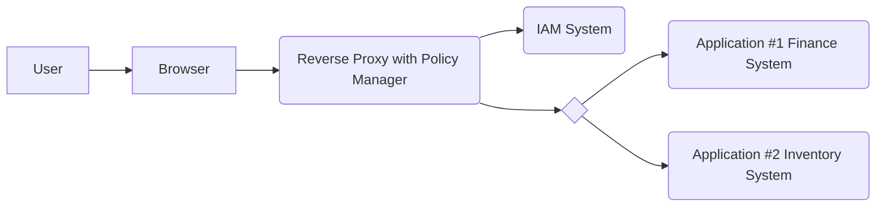
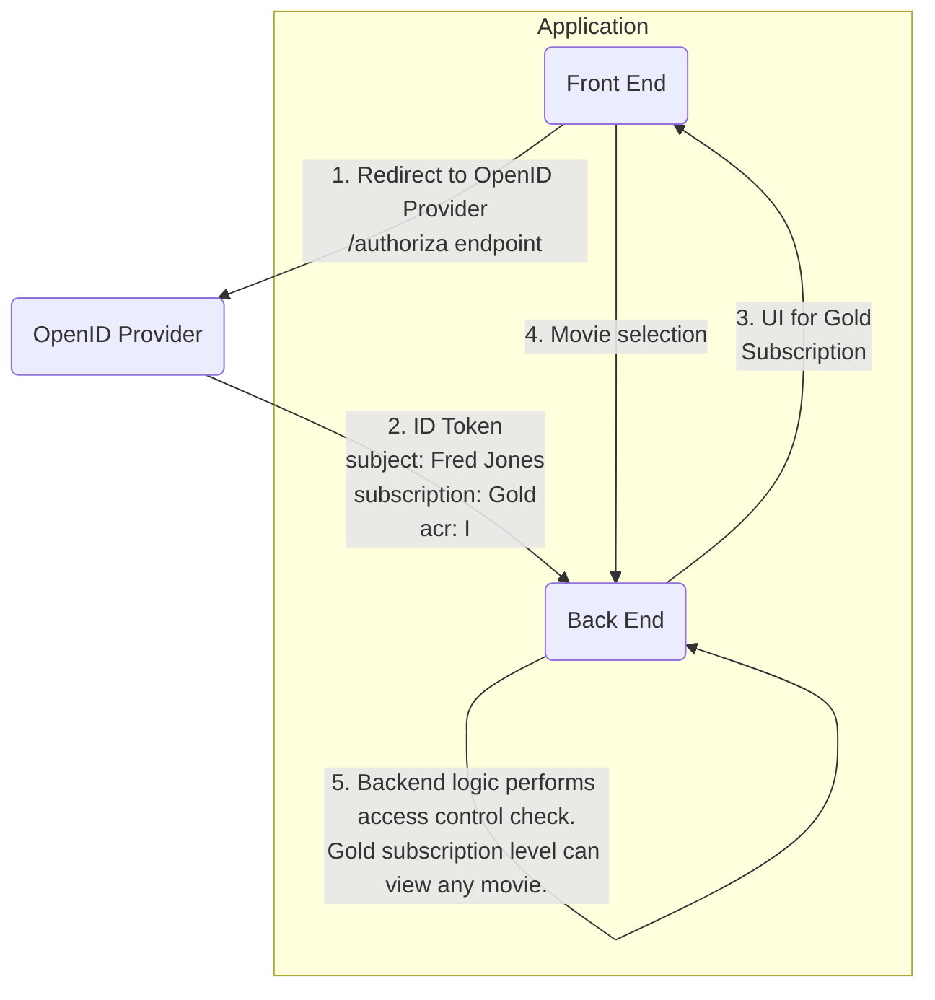

# Chapter 8: Authorization and Policy Enforcement

> A people that values its privileges above its principles soon loses both.
>
> —Dwight D. Eisenhower, 34th president of the United States, from first
> inaugural address

- [Chapter 8: Authorization and Policy Enforcement](#chapter-8-authorization-and-policy-enforcement)
  - [Authorization vs. Policy Enforcement](#authorization-vs-policy-enforcement)
  - [Levels of Authorization and Access Policy Enforcement](#levels-of-authorization-and-access-policy-enforcement)
    - [Level 1 - Application or API Access](#level-1---application-or-api-access)
    - [Level 2 - Functional Access](#level-2---functional-access)
    - [Level 3 - Data Access](#level-3---data-access)
  - [User vs. Application Authorization](#user-vs-application-authorization)
    - [User Authorization](#user-authorization)
      - [User Profile Attributes](#user-profile-attributes)
      - [Transactional User Attributes](#transactional-user-attributes)
    - [Delivery](#delivery)
    - [Enforcement](#enforcement)
  - [Application Authorization](#application-authorization)
    - [Application Authorization: Application Attributes](#application-authorization-application-attributes)
    - [Application Authorization: Authorization](#application-authorization-authorization)
    - [Application Authorization: Delivery](#application-authorization-delivery)
    - [Application Authorization: Enforcement](#application-authorization-enforcement)
  - [Authorization and Enforcement Extensions](#authorization-and-enforcement-extensions)
  - [Summary](#summary)
    - [Key Points](#key-points)

## Authorization vs. Policy Enforcement

In governing what a user or application can do, there are two distinct
functions:

- `authorization`: for the granting of privileges
- `access policy enforcement`: the act of checking that a person or application
  has been granted the necessary privilege before responding to a request for a
  protected resource
  
For example, if you buy a theater ticket, the ticket constitutes your
authorization to attend the performance. On the night of the performance, the
ticket taker at the door enforces policy by checking to ensure that only
authorized patrons (with tickets) enter the theater.

Authorization may be granted well in advance of a resource being requested or
at the time of requesting access. It may be done using an interface provided by
the entity containing the requested resource or by a trusted third party with
the authorization information conveyed securely to the policy enforcement point.

`Access policy enforcement` is done at the time a resource request is made and
ideally at an enforcement point within or close to the protected resource to
reduce the possibility of the enforcement being bypassed. If a policy
enforcement point is separate from the resources it protects, the environment
must be designed to ensure the only route to the protected resource involves
going through the policy enforcement point, to prevent bypass.

## Levels of Authorization and Access Policy Enforcement

There are different levels at which `authorization` and
`access policy enforcement` may be specified and applied, respectively:

- `Level 1`: Whether an entity can access an `application` or `API` at all
- `Level 2`: What `functions` an entity can use in an application or API
- `Level 3`: What `data` an entity can access or operate on

### Level 1 - Application or API Access

At the highest level, `authorization` and `access policy enforcement` can
control whether an entity has permission to access an application or API at
all. This use case is often found in corporate settings. For example, an
employee in a marketing team probably has no business accessing the corporate
accounting system. This level of policy enforcement may be handled within an
application or by an entity in front of the application. The enforcement can be
done external to an application by components such as an `authentication broker`
or a reverse proxy that works with an identity and access management (IAM)
system. Such systems can act as a high-level enforcement point to deflect users
who are not authorized to access an application at all. A similar approach can
be used with API Gateways protecting APIs and in both cases is useful to reduce
policy enforcement workload on target systems.

### Level 2 - Functional Access

Functional-level `authorization` and `access policy enforcement` govern the
functions or tasks an entity can do within an application or API. For example,
a junior accounting clerk in the finance department might be able to access the
corporate accounting system and enter individual journal entries but not
perform a month-end close, which would typically be done by a more senior,
experienced employee. A mobile app for library patrons might be able to call a
“place hold” API endpoint, but not an endpoint to modify the description of a
library book. This level of `authorization` and `access policy enforcement` is
sometimes called `coarse-grained` and tends to be application specific. It may
leverage information about a user stored in the application or elsewhere, such
as roles or groups in a directory service, but is often enforced within an
application or API in order to enforce application-specific policy logic.

### Level 3 - Data Access

A third level of `authorization` and `access policy enforcement` governs access
to particular subsets of data or resources. This is sometimes called the
`fine-grained` or `granular level of access control`. If `functional-level`
`access policy enforcement` defines the functions or tasks an entity can do,
`data-level` or `fine-grained` access policy further restricts access to
specific data or resources. For example, in a sales order entry application, a
user with the role `regional sales manager` may be authorized at a functional
level to view sales orders, but `data-level` access policy restricts them to
only view sales orders for their specific region. The user’s region would be
specified as an attribute in their user profile. `Data-level access` is often
enforced within an application or API, but may leverage capabilities within an
underlying storage layer, such as the ability to restrict access to tablespaces
or views in an Oracle Database.

## User vs. Application Authorization

There are two situations that require `authorization` and
`access policy enforcement`:

1. The first governs what a user (or entity) can do in an application,
2. The second controls what an application can request from an API.

A `user` needs `authorization` to perform various functions within an
application.

An `application` requires `authorization` to call a protected API. If the
content at a third-party API is owned by the user of the application, the
application’s access is on the user’s behalf and requires the user’s
`authorization`. This scenario is often found in consumer-facing applications.

If, on the other hand, the content at the API is owned by the `application` or
accessed by the `application` on its own behalf, an `authorization server` can
authorize the `application` based on permissions previously configured by the
administrator of the `authorization server`. There is no need for the user to
authorize the request because the application owns the requested resource.

In addition to any `authorization` by a user or `authorization server`, an API
may still need to enforce additional access policy. In other words, an
`access token` issued by an `authorization server` is not necessarily the final
word on whether an access request should be granted. Some access policy
decisions, especially for granular, `data-level` access, may be most
efficiently handled by the API designed to manage the data as opposed to a
generic `authorization server`. For example, a bank application may be
authorized to call an API to transfer money to pay a bill, and the user may
authorize a particular payment, but if the user’s account has insufficient
funds, the API will probably reject the payment request, per bank policy.

Regardless of the entity being authorized, there are three steps commonly
involved in controlling access:

- Authorization and the specification of access policy
- Delivery of authorization information to the enforcement point (if needed)
- Enforcement of the access policy by the enforcement point

### User Authorization

A relatively simple model is an [access control list (ACL)](https://csrc.nist.gov/glossary/term/access_control_list).
In this scheme, authorization policy is often specified as a list of entities
granted access for a specific protected resource. Each individual file has a
list of the users or groups of users which have been granted access to the
file. When someone requests access to a file, the policy enforcement point
needs to check if the authenticated identity of the requestor is in the list of
users in the file’s ACL. For the sample program, the `resource server` API is
the policy enforcement point, so it needs a claim from the `identity provider`
(an OIDC Provider in the sample) about the identity of the user as well as any
groups to which they belong.

In a [role-based access control (RBAC)](https://csrc.nist.gov/Projects/Role-Based-Access-Control) model,
protected resources have various functions which can be performed on them. For
example, an order management system may allow users to create, read, update,
and delete sales orders. These actions represent privileges which can be
granted to users who need to perform such functions. For administrative
convenience, it is common to define roles, which are collections of privileges
that would typically be assigned together to a user, to facilitate the role
they serve in an organization. For example, a small company may need its sales
staff to be able to create, read, update, and delete (CRUD) sales orders,
quotes, and invoices in a sales management system. Rather than assigning each
of these privileges individually to each sales person, a role can be created
that lumps them together. Such a role might be called `salesexecution`. The
role can then be assigned to a salesperson user, giving them all the privileges
they need with one administrative action. Another role could be defined that
only had read access to those objects, perhaps called `salesanalysis`, and that
role could be used for analysts who only need to retrieve sales order data for
analytical purposes but not update it.

As a further administrative convenience, collections of users, often called
`groups`, can be defined. This would enable the assignment of a role to sets of
users at once, rather than individually. For example, a group called
`salespeople` could be defined, with all sales people being members of the
group. The `salesexecution` role and other roles needed by sales teams could be
assigned to the `salespeople` group. Similarly, sales analysts could be members
of a group called `salesanalysts` which would be granted the `salesanalysis`
role along with any other roles needed by analysts. With an `RBAC` model, an
`application` or `resource server` API serving as a `policy enforcement point`
needs claims about the identity of the authenticated user as well as roles
they've been assigned and/or groups to which they belong.

In an [attribute-based access control (ABAC)](https://csrc.nist.gov/Projects/Attribute-Based-Access-Control) model,
authorization is specified via rules that utilize attributes in a user's
profile. For example, access to a finance system might be allowed for all users
that satisfy the rule `user_profile:team = finance`. In other words, a user
will get access if their user profile has a value of “finance” in the “team”
attribute. In this case, an `application` or `resource server` API acting as a
policy enforcement point needs claims about the identity of the user and the
relevant user profile attributes needed for evaluation of access control rules.

For access enforcement with these models, the component implementing policy
enforcement typically requires trusted claims for the authenticated user’s
identity and any user profile attributes relevant for access control decisions
and enforcement. These claims must originate from an authoritative source and
be transmitted to the policy enforcement point in a way that precludes
tampering.

#### User Profile Attributes

The attributes used to convey authorization for users can vary, but fall into
two main categories. A user’s identity may be granted authorization based on
roles which they’ve been assigned in a [role-based access control (RBAC)](https://csrc.nist.gov/Projects/Role-Based-Access-Control) model,
membership in a group or `access control list (ACL)`, or individual user
profile attributes evaluated by rules as part of an
[attribute-based access control (ABAC)](https://csrc.nist.gov/Projects/Attribute-Based-Access-Control) model.
These attributes are relatively static factors that remain the same, regardless
of where the user is or what device they are using at the time of accessing a
protected resource.

If such authorization information is specified outside an application, such as
in a corporate directory service or policy service, but accessible by the
`identity provider` authenticating a user, these attributes can be delivered to
the application by the `identity provider`. If authorization is specified in
the application, the `identity provider` can deliver an identifier for the
authenticated user to the application so it can retrieve the necessary
authorization information from its own data store.

The authorization step to grant a user privileges is typically done in advance
of the user making a request in an application. For example, if a new employee
joins a company’s finance team, the business may authorize the employee to
access its accounting application by assigning the user roles in a corporate
identity system on the new hire’s first day. For a consumer-facing application,
a user may be assigned access-related user profile attributes when they
purchase a particular subscription level for the application.

#### Transactional User Attributes

Authorization may also be based upon factors that are part of the user’s
physical environment at the time of authentication or accessing a protected
resource. Such factors can include the user’s geographic location, whether the
user is inside or outside a corporate firewall, or whether the user’s device is
certified as adhering to certain security configuration standards. The day of
the week or time of day may be factors as well as the strength of the
authentication mechanism used. These factors are captured at the time of
authentication rather than being part of the user’s profile. Such factors, if
captured by an `identity provider`, can also be provided to applications in the
form of claims in a security token.

### Delivery

For applications using OIDC, user profile attributes and authorization
information can be delivered to applications as claims in an `ID Token` or in
the response from the OIDC Provider’s `UserInfo` endpoint. Applications using
SAML 2 can receive the information via attribute statements in a
`SAML assertion`. For `resource servers` (APIs) using OAuth 2, such information
can be delivered via standard and custom claims, such as described for
[JWT-format access tokens](https://datatracker.ietf.org/doc/html/rfc9068),
provided the issuing authorization server supports such a feature. User profile
information such as a user’s roles, groups, or a purchased subscription level,
and factors such as a user’s IP address or strength of authentication method,
can be delivered to an application or API in this way. An application can use
the information to tailor the application user interface for the user’s allowed
capabilities, and an application back end or API can use it to perform access
policy enforcement.

An example showing the delivery of user profile information via an `ID Token`
to support access enforcement is shown in the figure below. In this example,
the application is a movie rental application where users can purchase
different subscription levels to get access to different selections of movies.
The `ID Token` delivers to the application the user’s purchased subscription
level.

1. The user redirected to login at the OIDC OpenID Provider.
2. The `ID Token` includes the user’s purchased subscription.
3. Subscription data in the `ID Token` is used to determine the list of movies
   displayed.
4. The user selects a movie to view.
5. The application back end checks the user has the required subscription level
   for their selected movie.

Applications using SAML 2 can follow a similar model, obtaining authorization
data from the SAML 2 assertion. This example assumes that the user profile
attributes, such as the user’s subscription level, are stored in a centralized
repository available to the `OIDC Provider`. Centralizing such information is
useful if there are several applications relying on the same user profile
attributes.

Alternatively, a stand-alone application may implement features in the
application user interface for the administration of authorization and store
all authorization information within the application’s data store. In this
case, the application may only need from the OIDC Provider a claim for the
identity of the authenticated user. The application would then use that
identity to look up authorization information for the user in its own data
store and perform the necessary policy enforcement.

Another possible model involves an API Gateway deployed in front of an
application’s back-end API or set of APIs. API Gateways can inspect incoming
API requests, route them to an appropriate API, and perform load balancing and
failover. They can also handle `authentication` and `authorization` of requests
coming to APIs. Application APIs can make use of claims in an `access token` to
perform access enforcement, and API Gateways that support OAuth 2 can be used
to perform a similar function.

### Enforcement

Before relying on any information in a security token, an application must
validate the token. In the case of an `ID Token`, validation steps include

- Validate the `ID Token` is a correctly formatted JWT (JSON Web Token)
- Validate the signature on the `ID Token`
- Check that the token has not expired
- Check the issuer is the correct OpenID Provider
- Check the intended audience for the token is the application

Be sure to check the latest protocol specifications for further guidance, in
case of updates, as well as the documentation for your OpenID Provider for the
exact validation steps required by their implementation.

Similarly, an application receiving a SAML 2 assertion must validate the
assertion. This will include steps such as checking that the assertion is
signed, validating the signature on the assertion, validating the issuer is a
trusted provider, and checking the assertion is within its validity period.
Again, check with your SAML provider for the complete list of validation
requirements. Once a security token has been validated, the application or API
can use relevant claims within the token for access policy enforcement.

## Application Authorization

### Application Authorization: Application Attributes

With OAuth 2, application requests to call APIs on a user’s behalf are
authorized by the user, but requests to call APIs on the application’s own
behalf are authorized by an `authorization server` based on configured policy.
This policy is typically configured in advance of an application calling an
API.

If the number of applications or API endpoints is small, the policy
specification may be expressed by indicating the specific applications
authorized to call specific API endpoints.

In scenarios with large numbers of client applications or API endpoints, with
widely varying authorization requirements for each, policy specification can
become complex. There is no widely adopted standard for such policy
administration and specification, so the options available from authorization
servers, especially to support complex cases, vary.

### Application Authorization: Authorization

An application that makes an OAuth 2 request for authorization to call an API
can specify its requested scope of access using the `scopes` parameter to the
authorization request. For example, an application requesting an `access token`
for an `OpenID Provider`’s `UserInfo` endpoint to retrieve user attributes
might use `scope = openid profile email`. An application calling a third-party
API to retrieve a user’s documents might request a `scope` of `get:documents`.
In these examples, the requested API resources are owned by the user, so the
OAuth 2 authorization server will prompt the user, displaying the scopes
requested by the application, and ask for the user’s consent for the access
request before issuing an `access token`.

There aren’t any official rules about how to make use of OAuth 2 scopes, but as
a simple string, constrained by URL length limits, scopes may be best suited
for simple scenarios like these, where an `authorization server` requests
easily described authorization from a user to allow an application to act on
their behalf. For other, more complex access policy scenarios, a richer request
mechanism is often needed.

Several newer specifications provide additional capabilities for authorization
requests. While still in draft form, the
[Rich Authorization Request (RAR)](https://datatracker.ietf.org/doc/html/draft-ietf-oauth-rar)
specification defines the ability to submit complex authorization requests to
`authorization servers` in the form of a JSON object. A request can specify
information using a set of standardized fields as well as custom-defined
fields. Standard fields are defined for request attributes such as the location
of resources, the privileges requested, and actions to be performed. A RAR is
submitted to an `authorization server` using the `authorization_details`
parameter, which can be used with requests where the `scope` parameter can be
used. For resources owned by a user, an `authorization server` can prompt the
user to authorize access using information in the RAR. For resources owned by
an application, the `authorization server` can compare the request parameters
in the RAR to policy configured in the `authorization server` to decide whether
to issue an `access token`.

Applications can also encapsulate an authorization request and its parameters in
a [JWT-secured Authorization Request (JAR)](https://datatracker.ietf.org/doc/html/rfc9101)
which enables the application to digitally sign and optionally encrypt the
request object. This provides for better authenticity and confidentiality for
request parameters.

An authorization request can also be pushed by the application directly to an
`authorization server` using a
[Pushed Authorization Request (PAR)](https://datatracker.ietf.org/doc/html/rfc9126).
After pushing an authorization request, the application receives a request URI,
which it can reference when it makes the authorization call to the
`authorization server` via the browser (or other user agent), further reducing
the exposure of authorization request information via browser interaction.

With the client credentials grant, the requested API resources are owned by the
application, and no user interaction is required. The privileges granted to
each application are specified in the `authorization server` (or a policy
server accessed from it). An `authorization server` can compare the information
in an authorization request with policy configured in the `authorization server`
to decide whether to issue an `access token`. For scenarios with complex
policy, a RAR may be useful to express relevant details of the authorization
request.

A few points are worth considering in designing the authorization requests for
scenarios with complex access control policy for an API:

- When access requests are displayed for a user’s authorization, it must be
  easy for a user to understand the access they are granting.
- Users may be unwilling to authorize requests with confusing or overly broad
  scopes.
- If an application requests many scopes in one authorization request, the
  request may hit URL length limits.
- If an application has to make many authorization requests, such as when very
  granular scopes are used, it can generate a lot of traffic to the
  `authorization server`.
- Frequently prompting users for authorization may cause users to click “ok”
  without paying much attention to the request.
- Information needed for access policy decisions can be conveyed in
  authorization requests by other means than scopes, such as via
  `Rich Authorization Requests (RARs)`.
- Where supported, custom claims in `access tokens` can convey additional
  information useful to APIs for policy enforcement.
- The use of `JWT-secured Authorization Requests (JARs)` and
  `Pushed Authorization Requests (PARs)` enables increased integrity protection
  and confidentiality for authorization requests and their parameters.
- Access policy decisions and enforcement may be handled by a combination of
  `authorization servers`, API Gateways, and APIs.

### Application Authorization: Delivery

Regardless of whether the protected resource is owned by the user or the
application, if the request is authorized, the `authorization server` will
issue an `access token` to the application for the requested API. An
`authorization server` may allow adding additional custom claims to an
`access token`, such as claims about the user, including user profile
attributes and roles they’ve been assigned. These additional claims may be
useful to an API in enforcing access. Support for extensibility via custom
claims and attributes about users may vary by individual `authorization server`
implementations.

### Application Authorization: Enforcement

An API must validate an `access token` and perform access policy enforcement to
make sure the application’s request is permitted before responding. The steps
to validate and obtain information about an `access token` will vary depending
on the `authorization server`’s implementation for `access tokens`.

Once the `access token` has been validated, the API can use the information in
the token, including any custom claims if allowed, to perform its own access
policy enforcement before responding to the request.

For example, an application may call an API with a valid `access token` that
contains the scope `get:documents` which allows it to retrieve documents. The
API still needs to perform more granular checks, such as whether the specific
user, on whose behalf the request is made, is allowed to access the specific
documents requested, and whether the authentication mechanism used to
authenticate the user met or exceeded the access requirements for the requested
documents. An API may be in a better position than an `authorization server` to
enforce that type of detailed, application-specific enforcement check.

## Authorization and Enforcement Extensions

Some identity providers have implemented proprietary mechanisms on top of SAML,
OIDC, and OAuth in order to provide access enforcement capabilities for
applications and resource servers. This enables application administrators to
define access policy in the administrative interface for the `identity provider`
using a combination of privileges, roles, groups and rules. When an application
makes an authorization request, the `identity provider` can check the access
policies it contains and return an unauthorized status if the requesting user
doesn’t satisfy the access policies for the request. This relieves the
application or `resource server` from having to implement some policy
enforcement logic. There is no standard governing such authorization and
enforcement extensions, so check your `identity provider`’s documentation for
information regarding any such capabilities.

Leveraging an `identity provider` for access enforcement may be feasible for
applications with simple access control policies. However, applications and APIs
often have to take on a significant portion of authorization and access
enforcement responsibility for more complex scenarios, as when there is a large
number of resources with specific access requirements or when applications must
check user profile attributes like `region` that govern tasks such as running a
regional month-end close in a financial system. If nothing else, it is
challenging to make the administrative interface of access policy
understandable when application-specific actions and policies need to be mapped
onto a generic `identity provider`’s administrative user interface. It is
critical that administrators understand what they have done when they use an
interface to specify access policy.

To understand the access requirements for your application, you can inventory
the data objects involved in your application. For each item in the inventory,
identify the functions that can be performed on it. Be sure to include
functions beyond the basic create, read, update, and delete tasks, such as
triggering a month-end financial close or certifying a set of audit records.
Then consider the policy for who can do each task or operate on each data
object and under what conditions. Having a good understanding of your required
access policy can help you evaluate if an `identity provider`’s authorization
capabilities will be sufficient for your application.

You should also consider how access policy will be administered. Some providers
may have an administrative user interface for specifying policy. If the
provider only has an API, you may have to develop a custom interface to enable
the specification of policy at the `identity provider`. Creating a custom
administrative interface based on a provider’s administrative API or using
their administrative interface may lock you into using that provider more
strongly than simply using a provider’s authentication and authorization
capabilities. Decisions about where and how to administer policy should be made
consciously and strategically rather than solely by convenience.

The specification of access policy can quickly become even more complex if there
is a need for delegated administration, where different people administer
different portions of the policy. For example, in a large enterprise, managers
(rather than centralized administrators) may assign their team members to
access control roles or groups because the managers know what each person’s job
requires. In this case, an interface is needed to specify policy for who can
administer each part of the access policy as well as provide a delegated
administration interface for managers to assign roles or groups to people.

## Summary

Authorization involves the granting of privileges, whereas access policy
enforcement is a check done at the time a resource is requested, to validate
the requestor has been granted the requisite privileges for the request.
Authorization and access policy enforcement may be used to govern what a user
can do in an application as well as whether an application can make a request
to an API.

User authorization may be based on static factors in a user’s profile and/or
dynamic factors evaluated at the time of authentication, both of which can be
delivered to an application in a security token. Application authorization may
be based on scopes or more complex parameters and approved by a user or based
on configuration in an authorization server and represented by an `access token`
delivered to an application to call an API.

Identity providers may provide custom features that aid access policy
enforcement, but applications and APIs often need to implement at least some
access policy enforcement themselves.

### Key Points

- `Authorization` is the granting of privileges to access protected resources.
- `Access policy enforcement` is done when a request is made and checks if a
  requestor has been granted sufficient authorization for the request.
- `Authorization` and `access policy enforcement` apply to users accessing
  applications as well as applications calling APIs.
- There are many models for specifying access policy, including
  `access control lists`, `role-based access control`, and
  `attribute-based access control`.
- `Roles` and `groups` are used to facilitate the administration of
  `authorization` and `access policy`.
- Authorization policy for users may be based upon user profile attributes or
  dynamic factors evaluated at the time a user authenticates or makes a request.
- Authorization for applications to call APIs is granted by users or
  authorization servers depending on the OAuth 2 grant type used.
- `Authorization` and `access policy enforcement` can be specified on multiple
  levels.
- OAuth 2 scopes are likely best suited for simple authorization scenarios
  where users authorize easily expressed requests to access APIs on their
  behalf.
- `Applications` with complex `access policy and enforcement` needs should
  consider the use of `JWT-secured Authorization Requests (JARs)`,
  `Rich Authorization Requests (RARs)`, and
  `Pushed Authorization Requests (PARs)`.
- Claims in security tokens can be used as a basis for
  `access policy enforcement` decisions in applications and APIs.
- Security tokens must be validated before their claims are used for security
  decisions.
- Some identity providers have proprietary features that provide simple
  `access policy enforcement`.
- Access policy decisions and enforcement may be handled by a combination of
  `authorization servers`, `API Gateways`, and APIs.
- Remember to consider requirements for `access policy`,
  `policy administration`, `delegated policy administration`, and
  `policy enforcement` when designing access control for your application.
