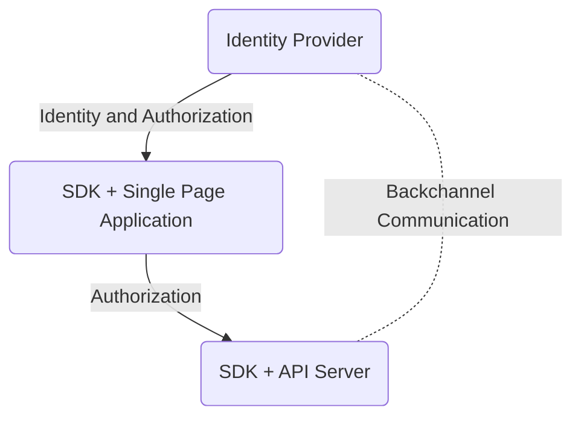

# Chapter 10: Using Modern Identity to Build Applications

> It’s not just what it looks like and feels like. Design is how it works.
>
> —Steve Jobs, founder of Apple Computers, as quoted in “The Guts of a New
> Machine,” New York Times Magazine

- [Chapter 10: Using Modern Identity to Build Applications](#chapter-10-using-modern-identity-to-build-applications)
  - [Sample Application: Collaborative Text Editor](#sample-application-collaborative-text-editor)
    - [Discovery](#discovery)
      - [Who Are Your Users: Employees or Consumers?](#who-are-your-users-employees-or-consumers)
      - [How Will Users Authenticate?](#how-will-users-authenticate)
      - [Can Your App Be Used Anonymously?](#can-your-app-be-used-anonymously)
      - [Web-Based or Native App Format or Both?](#web-based-or-native-app-format-or-both)
      - [Does Your Application Call APIs?](#does-your-application-call-apis)
      - [Does Your Application Store Sensitive Data?](#does-your-application-store-sensitive-data)
      - [What Access Control Requirements Exist?](#what-access-control-requirements-exist)
      - [How Long Should a User Session Last?](#how-long-should-a-user-session-last)
      - [Will Users Need Single Sign-On (If More Than One Application)?](#will-users-need-single-sign-on-if-more-than-one-application)
      - [What Should Happen When a User Logs Out?](#what-should-happen-when-a-user-logs-out)
      - [Are There Any Compliance Requirements?](#are-there-any-compliance-requirements)
      - [Platform, Framework, and Identity Provider](#platform-framework-and-identity-provider)
  - [Design](#design)
    - [Buy vs. Build](#buy-vs-build)
    - [Industry Standard Protocols](#industry-standard-protocols)
    - [Architecture](#architecture)
  - [Implementation: Front End](#implementation-front-end)
    - [login() and handleCallback()](#login-and-handlecallback)
    - [getToken() and getProfile()](#gettoken-and-getprofile)
      - [A Detailed Note on Token Management in SPAs](#a-detailed-note-on-token-management-in-spas)
    - [.logout()](#logout)
    - [Closing Note](#closing-note)
  - [Implementation: Back-End API](#implementation-back-end-api)
    - [.getUserId()](#getuserid)
  - [Notes](#notes)

## Sample Application: Collaborative Text Editor

The application involves a stateless back-end API serving a single-page
application (SPA). Learnings from this architecture can be carried over to
mobile applications, which require a similar separation of concerns between the
client and API Server.

The application offers the following features and services:

- Allows the user to create an article, using rich text – via Markdown.
- Articles belong to the author (user).
- Authors can share an article with others.
- Authors can invite others to collaboratively edit an article.
- Authors can invite others to view the contents of an article in read-only
  mode.

The demo doesn’t support multiple users editing the same article at the same
time. Furthermore, a new version is created every time a document is saved.
Thus, if Jon created an article, and Jessie were to edit it, Jessie would get
their own copy of the version, which is a full copy of the document, and any
subsequent edits by either will be in their own history and branch.

### Discovery

#### Who Are Your Users: Employees or Consumers?

#### How Will Users Authenticate?

#### Can Your App Be Used Anonymously?

#### Web-Based or Native App Format or Both?

#### Does Your Application Call APIs?

#### Does Your Application Store Sensitive Data?

#### What Access Control Requirements Exist?

#### How Long Should a User Session Last?

#### Will Users Need Single Sign-On (If More Than One Application)?

#### What Should Happen When a User Logs Out?

#### Are There Any Compliance Requirements?

#### Platform, Framework, and Identity Provider

## Design

- Identity-Related
  - Authenticating users
  - Issuing tokens
  - Revoking sessions/tokens
  - Logout
- Application-Related
  - Reading/writing documents
  - Performing checks on documents
  - Access to documents

### Buy vs. Build

### Industry Standard Protocols

### Architecture



With an `identity provider` in the picture, we can reshape our original problem
space into the following questions from an identity perspective:

- How is my application going to trigger a login and logout?
- How is my application going to establish who the logged-in user is?
- How is my application going to call the API?
- How can the API ensure the request it received is valid/authorized?
- How can my API ensure the requested user has sufficient authorization to
  perform this task?

With an identity layer, our solution can be divided into three components:

- Identity Provider
  - Authenticating users
  - Managing service-wide session
  - Providing logout
  - Providing identity federation
- Application and API
  - Performing application-related tasks
- Application-specific identity layer (convenience functions)
  - Acting as a glue between the identity provider and the API/application

## Implementation: Front End

The problems on the front end are:

- How is my application going to trigger a login and logout?
- How is my application going to establish who the logged-in user is?
- How is my application going to call the API?

It's going to be using OpenID Connect (OIDC) to communicate between the
`application` and the `identity provider`.

The registration with the `identity provider` process assigns a `client ID` to
an application and allows the application to specify a `callback URL`, among
other things.

- `login`: To authenticate the user using the identity provider.
- `getToken`: To get a token to call an API with specific scopes.
- `logout`: To end the current authentication session via the identity provider.
- `getProfile`: To get information about the current user.
- `handleCallback`: To handle redirection back from the identity provider,
  mostly needed for redirect-based flows on browsers.

Some applications store the user profile data fetched from identity providers
on client storage (e.g., `LocalStorage`). However, any sensitive data, such as
`access tokens`, must only be placed in adequately secure storage.

The storage options available vary based on the type of application and
platform used. In your identity abstraction layer, you should try to reuse as
much functionality from the identity SDK as possible. If your identity SDK
offers some type of storage, you should prefer using it. However, if your
identity SDK provides only the bare-bones methods for abstracting OIDC, your
methods would need to the storing themselves.

### login() and handleCallback()

Login in OIDC usually involves implementing the redirection flow using the
`authorization code` flow. Implementing this two-step process as one “logical”
unit has advantages. For instance, consider a scenario where a user who has
never logged in navigates to a document at `/articles/foo/1` via a hyperlink
shared to them. At this point, we’d like to redirect the user to the
`identity provider` and then redirect them to `/articles/foo/1` after they have
logged in successfully.

To solve this, we can include state data such as the user’s desired document
URL and any additional metadata on client-side storage and then “refer” to it
via a string key, which we pass to the `identity provider` as a state
parameter. Upon successful authentication of the user, our application will
receive the state parameter back and would be able to use this data to redirect
the user to the desired document URL.

To send such a key of state data, we usually use the `state` parameter in OIDC.
When using `state` it must be an opaque string. One simple storage solution
could be to use `localStorage` and JSON in the browser as shown in the
following code snippet:

```js
// encoding
function encodeState(data) {
  const state = randomBytes(32);
  const serializedData = JSON.stringify(data);
  localStorage.setItem("state_"+ state, serializedData);
  return state;
}
// decoding
function decodeState(state) {
  const stateKey = "state_" + state;
  if (!localStorage.hasItem(stateKey)) {
    throw new Error("State not found");
  }
  const storedState = JSON.parse(localStorage.getItem(stateKey));
  localStorage.clearItem(stateKey);
  return storedState;
}

// Then use it when redirecting
.authorize({ state: encodeState({ returnTo: "/articles/foo/1" }) });
// On callback
// Assume parsedResponseUrl is URL Object
const state = parsedResponseUrl.search.state;
const storedState = decodeState(state);
window.history.push(storedState.returnTo); // replace with your library /router
```

The key things to look for in an identity SDK for `login()` and
`handleCallback()` are

- How does the identity SDK create the authorization URL? This may be exposed
  as a method named `login`, `authorize`, or something similar.
- How does the identity SDK receive the data that is returned by the
  `identity provider`?
- Does the SDK handle the implementation details of redirecting the user and
  handling the response?
- What information are you responsible for storing and providing to the SDK?
- Does the SDK implement verification of the `ID Token` or not?

The flow to implement `login` can be:

- Serialize your application `state` and generate any parameters needed to call
  the SDK.
- Call the method to generate the `/authorize` URL and redirect to the
  `OpenID Provider` in the SDK.
- Resume flow when redirect occurs using `.handleCallback`.
- Perform necessary validation steps, such as checking the `ID Token` is valid.
- Perform any additional required steps, such as redirecting to the original
  page, prefilling a form, etc.

Invoking `.handleCallback` should occur on a dedicated route in your web
application such as `/user/auth/callback`, which is registered on the
`identity provider`’s configuration as the callback URL for the application.
The callback handler should be written to process both successful and
unsuccessful authentication cases to avoid unexpected behavior when an
`identity provider` doesn’t return with a successful status.

- On the Web, it is natural for a web-based application to redirect the user’s
  browser to the `identity provider` in order for the user to authenticate
  there.
- For native apps, both iOS, MacOS and Android offer system browser
  integrations for doing this securely, and such redirection has become a
  widely accepted user experience on such platforms.

### getToken() and getProfile()

As a part of the login method using OIDC, the application will receive an
`ID Token` and an `access token`. These should ideally be stored in a
javascript variable (in memory) effectively acting as if they are cached until
they expire. The `getToken` and `getProfile` convenience functions would
primarily work on top of this cache, fetching the user profile and
`access token` from it as needed.

There are two strategies available for getting a new token after the original
token has expired.

- If your application is using `refresh tokens`, it would be able to get a new
  `access token` using the `refresh token` and the `refresh token` grant.
- If your application is not using `refresh tokens`, it would need to redirect
  to the `identity provider` to get a new `access token`.
  - This can be done in a hidden iframe to improve user experience. OIDC SDKs
    and identity providers may implement this using `response_mode`
    `web_message`.

Things to look for in an identity SDK for `getToken()` and `getProfile()`:

- Does the SDK support the `web_message` response type?
- Does the SDK support `refresh tokens` and `refresh token rotation`?

Long-lived, nonrotating refresh tokens are effectively sensitive credentials
and should not be used on public, web-based clients due to the higher risk of
exposure and compromise. If `refresh token rotation` is not available in an
SDK, you’ll need to implement the logic to receive a new `refresh token` each
time a `refresh token` is used and store this new `refresh token` for the next
request. This logic can be added on top of your token management logic, which
would be responsible for checking when you need new `access tokens` or
`ID Tokens`.

The implementation for both `getToken` and `getProfile` includes the following:

- Check if cached content is available.
- If not, use the `refresh token`, or do a hidden redirect flow to get a new
  `access token` and any other necessary information from the
  `identity provider`.
- If an error is raised, handle it. For example, if the error requires user
  interaction, handle it by redirecting the user to the identity provider.
- Once all data is obtained, for `getToken` return the `access token`, and for
  `getProfile` return the contents of the `ID Token`.

#### A Detailed Note on Token Management in SPAs

We abstract token management in the `getToken` method for the front end. When
the token is acquired, the application uses the `expires_in` element of the
response to compute an expected timeout for the token. All this information,
along with the `audience`, `scope`, and other metadata associated with the
`token`, is stored in memory. Later, when the application needs an
`access token` with specific scopes, the `getToken` method simply returns an
`access token` from the in-memory cache, until the token expires, at which
point the application needs to request a new `access token`.

When using `refresh token rotation`, there are three possible flows to request
a new `access token` (with our identity provider’s feature set).

- A `refresh token` is in memory: Request a new `access token` using
  `refresh token rotation`.
- A `refresh token` is not available (no longer in memory): Try to retrieve a
  new `access token` from the `identity provider` using a hidden iframe. This
  may fail with browsers implementing tracking protections.
- A `refresh token` is not available, and a redirect via hidden iframe fails:
  Fully redirect the user’s browser to the `identity provider` with
  `prompt=none`. If a session exists, the browser will be redirected back to
  the application with new tokens.

Implementing this can be challenging, especially since doing so in a browser
where the user has never authenticated or is not authenticated will create
unnecessary overhead for your `identity provider`. To simplify that, we
recommend using some kind of a `localStorage` flag or variable, such as
`_lastSessionValidated_`, which would represent the likelihood of a session
being available on your `identity provider`. Based on this variable, you could
execute the logic for the second and third flows, as appropriate.

In our case, we abstract `getToken` using the `getToken` method in our identity
provider’s SDK, [auth0-spa-js](https://auth0.com/docs/libraries/auth0-single-page-app-sdk).

### .logout()

Logout is implemented by clearing any tokens available to the application from
memory. This includes tokens received during the user’s session as well as any
cookies and session state set by the application. In addition, when logging
out, we redirect to the `OpenID Provider`’s logout endpoint. This terminates
the `identity provider` session as the provider will log the user out when the
logout endpoint is invoked. The implementation for `logout` and session
termination is vendor specific.

Things to look for in an identity SDK for `.logout()`:

- How to invoke the [OIDC (Relying Party) RP-Initiated Logout](https://openid.net/specs/openid-connect-rpinitiated-1_0.html)
- Methods to clear any meta state the SDK might have stored for the user session

Implementing `logout` is pretty straightforward in our case and includes

- Clear all tokens in memory
- Remove all other locally stored information about the user
- Redirect the user to the `identity provider`’s OIDC Logout endpoint via the
  SDK

An additional consideration is how to handle `access tokens` at logout.
`Identity providers` that issue opaque `access tokens` may provide a mechanism
to revoke `access tokens`. If provided, this can be used within a `logout`
function. With a JWT `access token`, however, it is not possible to revoke the
`access token` unless the issuing `identity provider` supports a blocklist
feature or provides an introspection endpoint to check the status of the
current token. It is possible to maintain a blocklist at your `resource server`,
but synchronizing these blocklists can be challenging. If not revoked or
blocklisted, the `access tokens` will stay valid until they expire. In
practice, it’s often more convenient to use a short token expiration than to
call the provider for each token to check for blocklisting.

### Closing Note

Even if an `identity provider` offers a higher-level SDK, we still recommend
writing an identity layer as a simple wrapper on top of the SDK. This makes it
easier to update your code if the SDK’s API changes in the future. It can also
facilitate testing, debugging, and Continuous Integration/Continuous Deployment
(CI/CD) workflows without having to call the `identity provider` during your
tests because you can stub out the convenience functions with a dummy
implementation.

For additional learning, we have included a sample using `OAuth4WebAPI` which
is a pure OpenID Connect Client to implement capabilities mentioned earlier.

## Implementation: Back-End API

Just like the front end, there are the two major problems to solve:

- How can the API ensure the request it received is valid/authorized?
- How can my API ensure the requested user has sufficient authorization to
  perform this task?

The first task is primarily dependent on the client (the application) via the
`identity provider`. The `access token` issued by the `identity provider` must
be included in all requests from the client application to the back-end server,
as a bearer token. Identity Providers have different ways of representing an
API, but, in general, you’ll register a back-end server/API with an
`identity provider`, which will issue it a unique identifier. A client
application can then request an `access token` for a specific API using that
identifier. In our case, the identifier for our registered API is used with the
`audience` parameter in the client’s authorization request to the
`identity provider`. (This parameter may be called the `resource` parameter in
some implementations.)

Depending on the `identity provider`, you may receive an opaque `access token`
that is validated by checking with the `identity provider` via an API call.
Alternatively, you may receive a JWT-format `access token`, which is a
self-contained token that includes the proof of its legitimacy
cryptographically attached to it. JWT-format tokens are common, and there is
now a defined [“JSON Web Token (JWT) Profile for OAuth 2.0 Access Tokens”](https://datatracker.ietf.org/doc/html/rfc9068).
We use JWT `access tokens` that use the RS256 signature algorithm. Doing so
allows us to validate the JWT using the public key hosted by the
`identity provider` on a well-known URL. This avoids the requirement to store a
secret symmetric key on our API servers to validate the signature of
`JWT access tokens` as would be required with HS256. This reduces risk, because
if the secret key were compromised, it could be used by a rogue element to
issue unauthorized tokens.

Once a JWT is received by an API and extracted from the request header, the API
server should decode it and perform a quick assessment on whether the JWT uses
one of the approved algorithms and is issued by an approved `identity provider`
for the API. The API back end should then fetch and cache the `public key` from
the `identity provider` and validate the signature on the JWT `access token`
before trusting the contents of the token.

Most languages and development frameworks provide a library for
`JWT access token` validation. The website <https://jwt.io> lists a large
number of these libraries. Your `identity provider` or SDK vendor might provide
a more specialized library for this task.

You will need to ensure the `audience`, issuer, and algorithms are valid, by
having an approved list on your API Server. You should not trust the incoming
information in the `access token` without validating it. For example, if the
issuer ID on your `identity provider` is `https://foo.bar`, then any requests
to your API using `access tokens` from another issuer must receive an
`HTTP 401` response (unauthorized). Another example is that tokens with
`none` as the algorithm must be rejected.

The second problem to solve in the back end can be divided into two major
tasks, namely, identifying who the user is and what they are allowed to do. We
can convert these into methods:

- `function getUserId(token) {}`: Takes a token and extracts the `user_id`
- `function canPerform(token, resource, action) {}`: Given a token check a
  specific action can be performed using the token

### .getUserId()

>>>>> progress

## Notes

xi. https://openid.net/specs/openid-connect-session-1_0.html
xii. https://openid.net/specs/openid-connect-session-1_0.html
