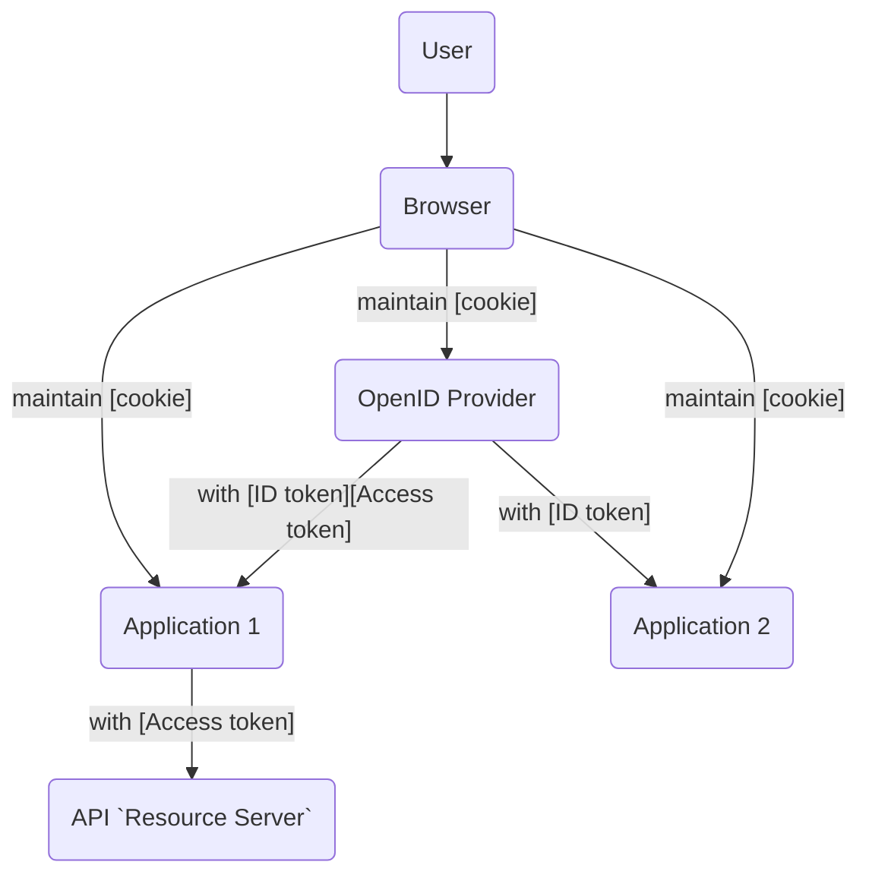
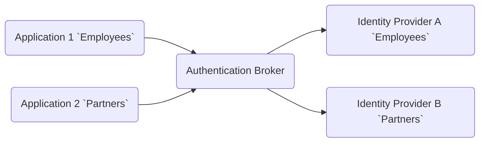

# Chapter 11: Single Sign-On

> A ripple widening from a single stone Winding around the waters of the world.
>
> —Theodore Roethke, American poet, from The Far Field (1964)

- [Chapter 11: Single Sign-On](#chapter-11-single-sign-on)
  - [What Is SSO?](#what-is-sso)
  - [How SSO Works](#how-sso-works)
  - [SSO Configuration](#sso-configuration)
    - [SSO Session Duration](#sso-session-duration)
    - [Authentication Mechanisms](#authentication-mechanisms)
    - [Login Page Branding](#login-page-branding)
    - [Multiple Identity Providers](#multiple-identity-providers)

## What Is SSO?

Single sign-on is the ability for a user to authenticate once and access
multiple applications without having to log in again. It is usually enabled by
using an `identity provider`. Once authenticated, a user enjoys single sign-on
access to applications as long as their identity provider session (SSO session)
has not expired or been terminated.

- [Google Sign-In](https://developers.google.com/identity/).

There are a few trade-offs with single sign-on. Implementing single sign-on
creates a gateway to your application with the potential to be a single point
of failure. A centralized service also provides a single point of attack. To
mitigate these risks, it’s essential to select an `identity provider` that is
designed to be highly available and implements security best practices.

An `identity provider` also has greater visibility of user activity and the
ability to track users across sites, which can be a privacy concern. When
selecting an `identity provider`, you should perform due diligence evaluation
of the privacy features and security certifications of a provider before
entrusting your application’s authentication to it.

## How SSO Works

A user visits `application 1` which redirects their browser to an
`identity provider` with an authentication request. The `identity provider`
authenticates the user, establishes a session for the user, and creates a
cookie in the user’s browser with information about the session. Then it
redirects the user’s browser back to the application with security token(s)
which contain data about the authentication event and authenticated user. The
application can then create or update its own local session (and possibly a
cookie) for the user as appropriate for the type of application.

If the user then visits application 2 with the same browser, the second
application detects that the user has not yet logged in to it and redirects the
user to the `identity provider`. The user’s browser includes the
`identity provider` cookie with the request, so the `identity provider` uses
the cookie to detect the user already has an authenticated session at the
`identity provider`. It checks if the user’s session is still valid and, if so,
redirects the user’s browser back to the second application with the requested
security token(s) without prompting the user for credentials. The second
application then creates or updates a local session for the user (and possibly
a cookie) as appropriate for the type of application it is.

There are various reasons that the user’s session might become invalid. It
might have timed out. Alternatively, the session might have been terminated at
the `identity provider` by an administrator or if the user logged out of the
`identity provider`. The user might have even logged out of another application
that triggered a logout request to end the `identity provider` session.

Even with a valid SSO session, there are situations where the user still has to
interact with the `identity provider`. If the user visits an application that
requests API authorization to call an API on the user’s behalf, and the
`identity provider` is also the `authorization server` for the API, the
`identity provider` will prompt the user for consent for the API access. If the
user visits an application that requires a stronger or different form of
authentication than that used to establish their existing session, the user
will be prompted to meet the new application’s authentication requirements. If
an application includes in its authentication request a parameter to force
authentication, the user will need to reauthenticate. Similarly, a parameter
can be used to specify a maximum length of time that can elapse between active
authentications, and this may trigger a need for a user to reauthenticate as
well.

## SSO Configuration

### SSO Session Duration

The length of the SSO session, often specified in terms of `maximum` and `idle`
timeouts, should be configured, keeping in mind the sensitivity of the
applications relying on the SSO session. If an application using OIDC requires
a user to actively authenticate more frequently than an `identity provider`
session would require, the `max_age` parameter in the authentication request
can be used to specify the `maximum` allowed time, in seconds, that can elapse
since the user was last actively authenticated. The use of this parameter
requires the `identity provider` to actively authenticate the user again if the
value of `max_age` in an authentication request is less than the elapsed time
since the user last authenticated. Applications should still check the
`auth_time` claim in the `ID Token` to ensure the requested `max_age` was
followed.

### Authentication Mechanisms

### Login Page Branding

In terms of user experience, the login page for an SSO session should make it
clear what the user is logging in to. For example, if an employee is redirected
to a corporate `identity provider`, it is helpful for the login page to be
branded to identify it as the corporate login page.

If the user’s login creates an SSO session, but the application only performs a
local application logout, users may not realize another step is needed to
terminate the SSO session. In designing or configuring login pages, it should
be clear through branding and other means what the user is logging in to and
how to terminate any sessions when done.

### Multiple Identity Providers

If SSO is implemented using an authentication broker that allows for the
configuration of multiple identity providers, the broker should be configured
to ensure that users from each identity provider can only log in to the
applications appropriate for them. This is sometimes called the
`Circle of Trust (CoT)` for an `identity provider`. For example, if a company
has an authentication broker with one `identity provider` configured for
employees and another configured for partners, the configuration should ensure
that partners cannot get access to applications intended only for employees.

This scenario is illustrated in the figure below. In this example,
`Application 1` should only be accessed by users authenticated by
`Identity Provider A`. `Application 2` should only be accessed by users
authenticated by `Identity Provider B`. An SSO session established by a user
logging in to `Identity Provider B` should not enable access to `Application 1`.

