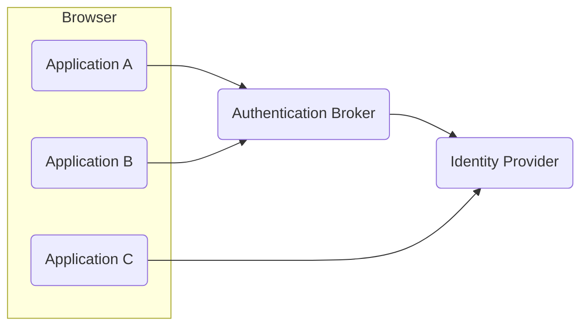
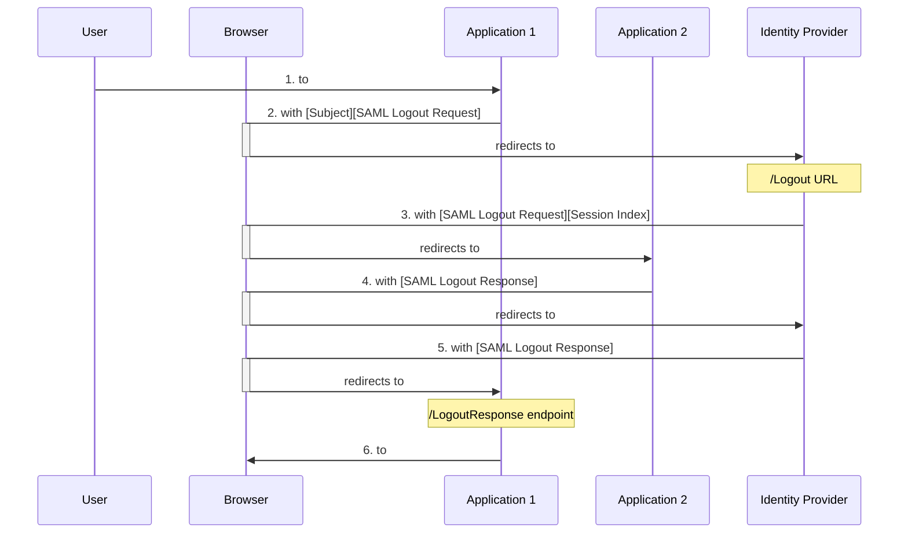

# Chapter 13: Logout

> Great is the art of beginning, but greater is the art of ending.
>
> —Henry Wadsworth Longfellow, American poet and educator, from “Elegiac Verse”
> (1881)

- [Chapter 13: Logout](#chapter-13-logout)
  - [Multiple Sessions](#multiple-sessions)
  - [Logout Triggers](#logout-triggers)
  - [Logout Options](#logout-options)
  - [Application Logout](#application-logout)
  - [OAuth 2](#oauth-2)
  - [OIDC](#oidc)
  - [SAML 2](#saml-2)
  - [Session Termination](#session-termination)
  - [Logout and Multilevel Authentication](#logout-and-multilevel-authentication)
  - [Redirect After Logout](#redirect-after-logout)
  - [Summary](#summary)
    - [Key Points](#key-points)

Implementing logout can be more complex to design and test in some cases than
login.

Terminating a session if it is no longer needed eliminates the chance that the
session can be hijacked by others. This complements other measures in a
comprehensive security strategy and is beneficial for situations where devices
might be stolen or confiscated.

## Multiple Sessions

Logout can be complex to implement in environments with single sign-on, because
there may be multiple sessions to worry about.

At a minimum, a user has an application session (Model 1). If an application
delegates authentication to an `identity provider` (`IdP`), the
`identity provider` may have an active session for the user (Model 2). If an
application uses an `authentication broker`, to facilitate handling many
different `identity providers` and protocols, the `authentication broker` may
also have an active session for the user (Model 3). This means that a user
could have sessions in up to three different tiers of a solution architecture
like Model 3 after logging in. It is possible for an `identity provider` to
delegate authentication to another `identity provider`, so there could be even
more tiers involved, but that is not common.

```diagram
Model 1: Application

Model 2: Application --> Identity Provider

Model 3: Application --> Authentication Broker --> Identity Provider
```

Logout is further complicated because with single sign-on (SSO), there might be
even more sessions to consider. If a user can access multiple applications via
SSO, there could be an additional session in each of those applications.
Applications A and B delegate authentication to an authentication broker, which
in turn delegates user authentication to an identity provider. Application C
delegates authentication directly to the identity provider. If a user accesses
applications A, B, and C in short order, the user would have five active
sessions.

Figure 2:



## Logout Triggers

The termination of any of a user’s sessions can be triggered by several
different events.

- The most obvious is when a user clicks a logout button in an `application`.
- A user may also be able to trigger a logout of their session directly at an
  `identity provider` if it provides such a feature.
- In addition to user-initiated logout, an administrator might terminate a
  user’s session in either an `application` or `identity provider`.
- Another possibility is that a user’s session times out if the user has been
  idle or logged in for too long.
- Then again, an `application` or `identity provider` may receive a logout
  request from another component in the environment.
  
When any of these events occur, one or more of the user’s sessions will be
terminated. The question is: Which ones should be terminated and under which
circumstances?

## Logout Options

When there are multiple sessions for a user, it is necessary to decide what
should happen when any of the user’s sessions are terminated. If a user’s
session in an application is terminated, it may be appropriate to terminate one
or more of the following, depending on where sessions exist:

- `Application` session
- Authentication broker session (if a broker is used)
- `Identity provider` session

In addition, if a user’s SSO session is terminated at an `identity provider` or
`authentication broker`, it may be appropriate to terminate one or more of the

- User sessions for the user at any “upstream” relying parties (`applications`
  or other providers)
- User sessions for the user at any “downstream” `identity providers`

For example, in Figure 2, when the user logs out of `application A`, the
application could send a logout request to the `authentication broker`. The
`authentication broker` may have other applications (relying parties) relying
on its session for the user, such as `application B` in the diagram. When it
receives the logout request, the `authentication broker` could send a logout
request to `application B` to terminate the user’s session there. In addition,
the `authentication broker` could send a logout request to the
`identity provider`. The `identity provider` would see that `application C`
relied on its session for the user and could send a logout request to
`application C`.

The same possibilities should be evaluated if a user’s session is terminated at
an `identity provider` or `authentication broker` for any reason. In Figure 2,
if the user’s session is terminated at the `identity provider`, it could send a
logout request to `application C` and the `authentication broker` because they
are both relying parties to the `identity provider`. Similarly, if the user’s
session is terminated at the `authentication broker`, it could send a logout
request to the `identity provider` and/or to one or both of the relying party
`applications A` and `B`.

In designing logout, it is necessary to consider where sessions exist and which
should be terminated when a user initiates a logout or if their session is
terminated for other reasons. One factor in the decision is the entity owning
the sessions.

- In enterprise environments, corporate security policy may dictate that a
  logout in an `application` must trigger the termination of an
  `identity provider` session and possibly all the user’s open sessions in
  other applications.
- In a consumer-facing environment where a user logs in with a
  `social provider`, however, it may be less justified or impossible for an
  `application` logout to terminate the user’s session at the
  `social identity provider`.
  
Obviously, an `identity provider` or `authentication broker`’s supported
features for logout are another factor that will influence logout design.

User experience is an important factor as well. Care should be taken to avoid
surprises for users. Terminating all application and SSO sessions for a user
with one logout provides a convenient way to terminate all access at once.

This may be desirable in an enterprise environment because if users have to log
out of each application individually, they may forget one. If the impact of
such a logout is not clear to a user, this may “pull the rug out” from under
the user’s other application sessions that rely on the same SSO session.

An example will help illustrate this. Using the scenario in Figure 2, if a user
is working simultaneously in the three applications, A, B, and C, and a logout
from `application A` triggers the termination of their sessions everywhere,
that may prevent the user from completing in-flight transactions in
`application B` or `C`, depending on how those applications handle session
termination. The abrupt termination of sessions in other applications may cause
a user to lose their work there. Whether the user can continue working in the
other applications depends on how logout and session termination is implemented.

One possibility is to have the logout in `application A` trigger an immediate
logout of the user in `applications B` and `C`. This would require that the
termination of the user’s session at `application A` triggers a logout request
to the `authentication broker`, which is configured to send, upon its session
termination, a logout request to `application B`. The `authentication broker`
could also send a logout request to the `identity provider`, which in turn
could send a logout request to `application C`. These logout messages would
effectively terminate all the user’s sessions across the three applications,
the `authentication broker`, and the `identity provider`.

Alternatively, when `application A` sends a logout request to the
`authentication broker`, the broker could simply terminate its own session for
the user. In this case, the user can continue working in `application B` until
the user’s session in `application B` times out. Upon such timeout,
`application B` would check if the user’s session is valid at the
`authentication broker`. If the user’s session in the `authentication broker`
had been terminated, the user would need to log in again to continue to access
`application B`.

The decision regarding which sessions to terminate is specific to each
environment and should take into account

- the entity that owns a session
- the user experience
- the sensitivity of the application
- security benefits of not leaving sessions open when not needed

The design of logout will also need to consider the capabilities of individual
applications, brokers, and identity providers as their support for logout
features may vary.

## Application Logout

For application logout, when any of the logout triggers, the application needs
to delete any application session information, tokens, and browser cookies set
by the application. If using OAuth 2 `access tokens` from an
`authorization server` that supports `access token` revocation, they should be
revoked via the `authorization server`’s revocation endpoint. `Refresh tokens`,
if used, should be revoked as well.

Local application logout by itself does not impact any other authenticated
sessions the user might have established at an `identity provider` or
`authentication broker`, but an application can choose to send logout request
messages to such other components when local application logout is triggered.

## OAuth 2

OAuth 2 does not contain a logout endpoint because it is designed for
authorizing an API call, not authenticating users. Nevertheless, upon the
termination of a user’s session, an application should clean up security tokens
related to the user if possible. An `application` may have obtained
`access tokens` for APIs and possibly `refresh tokens` as well. The OAuth 2
specification indicates that `authorization servers` ***SHOULD*** provide a
mechanism to revoke `access tokens`, and the [OAuth 2.0 Token Revocation](https://tools.ietf.org/html/rfc7009)
specification defines a standard for this. Providing an `access token`
revocation mechanism is not mandatory, however, so some `authorization server`
implementations may not support it.

If an `authorization server` supports `access token` revocation, an application
should use its revocation endpoint to revoke `access tokens` authorized by a
user for that application when the user logs out or their session is terminated
for other reasons. If an `access token` cannot be revoked, an application that
has `refresh token(s)` for renewing expired `access tokens` should revoke the
`refresh tokens`. (Authorization servers must support `refresh token`
revocation.) Without a `refresh token`, when a previously issued `access token`
expires, the application will not be able to obtain a new `access token`.

Applications that cannot revoke `access tokens` must rely on the `access token`
expiration to terminate the application’s ability to call an API. This
underscores a benefit of `access tokens` with short expirations.

## OIDC

The original OIDC specification does not define an explicit logout mechanism
for an `application` to request termination of a user’s session at an
`OpenID Provider` or a way for an `OpenID Provider` to notify a relying party
when the `OpenID Provider`’s session has terminated. There are several recently
finalized specifications related to OIDC logout which bear consideration. You
should keep in mind that it may take time for providers to implement support
for newly approved specifications.

The [OpenID Connect RP-Initiated Logout](https://openid.net/specs/openid-connect-rpinitiated-1_0.html)
specification describes a logout flow whereby a relying party can request an
`OIDC Provider` to log a user out. The relying party does this by redirecting
the user’s browser to a logout endpoint at the `OIDC Provider`. The
`OIDC Provider` then asks the user to confirm they wish to log out and, if so,
terminates its session for the user. The relying party can optionally specify a
URL to which the user is redirected after logout at the `OIDC Provider`.

The [OpenID Connect Session Management](https://openid.net/specs/openid-connect-session-1_0.html)
specification offers a solution for a relying party application to detect when
an `OpenID Provider` session has terminated. It is designed to use a hidden
`iframe` loaded from an `OpenID Provider` and which has access to browser state
from the `OpenID Provider`. This `iframe` is polled from another hidden `iframe`
loaded from the relying party application and will receive back a status of
`changed` if the user’s session at the `OpenID Provider` has changed. If this
occurs, the relying party application can redirect the user to the
`OpenID Provider` with a new authentication request using `prompt=none`, and if
this request receives an error response, it indicates the user session at the
`OpenID Provider` is no longer valid. The application can terminate its session
for the user, if appropriate, or perhaps ask the user if they’d like to renew
their session. If so, the `application` can redirect them back to the
`OpenID Provider` to authenticate and renew the session. However, recent
browser features for tracking prevention may prevent this scheme from reliably
working as designed. It is not yet clear if a fix or workaround will be
developed.

The [OpenID Connect Front-Channel Logout facility](https://openid.net/specs/openid-connect-frontchannel-1_0.html)
provides a solution for an `OpenID Provider` to send logout requests to
`relying party applications` when the `OpenID Provider` session for a user has
been terminated. Front-Channel Logout relies on an `OpenID Provider` rendering
an `iframe` that contains the `relying party`’s logout URL. The logout URL must
have been previously registered with the `OpenID Provider`. This mechanism can
enable a global logout capability but suffers from some disadvantages. This
specification is also impacted by recent browser features for tracking
prevention. This can prevent a `relying party application` from being able to
process the logout. In addition, if a user has navigated away from an
`application` in their browser, a Front-Channel Logout request to the
`application` may fail, with the user’s session in the application only logged
out if the user returns to it using the browser’s back button.

The [OpenID Connect Back-Channel Logout](https://openid.net/specs/openid-connect-backchannel-1_0.html)
specification provides a solution for an `OpenID Provider` to send logout
requests to a `relying party` via back-channel communication directly between
servers rather than via front-channel browser actions. This may provide a more
reliable logout option than Front-Channel Logout when there are many
`relying parties`. For this solution, `relying parties` register a back-channel
logout URI with an `OpenID Provider`. The `OpenID Provider` remembers all
`relying parties` to which a user has logged in via their `OpenID Provider`
session. When the `OpenID Provider` session for the user is terminated, the
`OpenID Provider` sends a logout request, formatted as a `JWT` and called a
`Logout Token`, to each of the `relying parties` the user visited during the
session.

The `Logout Token` is sent via back-channel communication (server to server)
using an `HTTP-POST` to the `relying party`’s back-channel logout URI
previously registered with the `OpenID Provider`. Upon receiving and validating
a `Logout Token`, a `relying party` removes its session for the user and
returns a status response to the `OpenID Provider`. This solution requires
direct connectivity between the `OpenID Provider` and a `relying party`’s
back-channel logout URI. This may be problematic for applications residing in
on-premise enterprise environments behind firewalls unless the `OpenID Provider`
is also in the same internal environment behind the firewalls.

It is also possible for a `relying party` application to detect the termination
of a user’s session at an `OpenID Provider` by periodically polling the
`OpenID Provider` by redirecting a user’s browser to the `OpenID Provider` with
the `prompt` parameter in the authentication request set to `none`. If the user
does not have a valid session at the `OpenID Provider`, an error status
response will be returned, and the application can terminate the user’s session
in the `application` or redirect the user again to reauthenticate and renew
their session. This approach results in network traffic from the polling and
has the drawback that the redirect may interrupt the user experience. Doing the
redirect in a hidden `iframe` to mitigate user experience issues has been
negatively impacted by recent browser features for tracking prevention and may
not be a viable solution for some scenarios. Repeatedly polling an
`OpenID Provider` may also run the risk of hitting rate limits.

A common concern is the ability to quickly terminate a user’s access to an
`application`. This may be needed in corporate situations if an employee has
been terminated against their will. If the `OpenID Provider` for an environment
supports a capability to notify `relying parties` when a user’s
`OpenID Provider` session has terminated, this can be used. If the user’s
account in the `OpenID Provider` has been disabled, the `application` will not
receive the successful response needed to renew the session. This should
effectively terminate the user’s ability to use the application, at least with
a tolerance period equal to the application’s polling frequency.

## SAML 2

With SAML 2, a `service provider` application can terminate a user’s session at
an `identity provider` by issuing a logout request message to the
`identity provider`. Upon receipt of the logout request message, the
`identity provider` terminates the session it holds for the user, identified by
a subject identifier in the request and possibly a session identifier for the
session. The `identity provider` may also update or remove its session cookie
in the user’s browser. The `identity provider` then responds to the
`application` with a logout response message.

SAML 2 also provides a way for the `identity provider` to notify other
`relying parties` if a user’s session is terminated at the `identity provider`.
Upon termination of the `identity provider` session or receipt of a logout
request message from a `service provider`, the `identity provider` can send a
logout request message to each of the other `relying parties` with an active
session for the user. The `relying parties` are supposed to terminate their
session and respond with a logout response message to the `identity provider`.
If the global logout was initiated by one `service provider`, the
`identity provider` returns a logout response message to the `relying party`
that initiated the logout.



1. The user initiates the logout at `Application 1` (a relying party).
2. `Application 1` redirects the user’s browser to the `Identity Provider` with
   a SAML Logout Request message.
3. The `Identity Provider` sends a SAML Logout Request message to other
   `relying parties`, such as `Application 2`.
4. `Application 2` sends a SAML Logout Response message after processing the
   logout.
5. The `Identity Provider` sends a SAML Logout Response message back to the
   `relying party` that sent the original Logout Request.
6. `Application 1` acknowledges the logout.

Steps `3` and `4` in the preceding sequence are commonly sent via the user’s
browser, using front-channel interaction. Many SAML 2 `identity providers`
reside behind corporate firewalls, and using a front-channel implementation
avoids issues with firewalls. In a complicated logout scenario, however, with
several `relying parties`, the sequence may fail before it completes, leaving
some sessions intact. The SAML 2 specification includes a back-channel logout
mechanism which may be more reliable if logout messages need to be sent to
multiple parties. However, back-channel logout may not be implemented in all
SAML 2 implementations, and back-channel logout messages require direct
connectivity between the `identity provider` and the `relying parties`, which
may be challenging for components behind corporate firewalls.

## Session Termination

There may be a need at times to quickly terminate a user’s SSO session as well
as `application` sessions. In corporate settings, this is often a requirement
for situations where an employee is terminated against their will. In the
absence of single logout, a user’s account can be disabled at an
`identity provider`, but they may be able to remain active in `applications`
with open sessions until the applications next communicate with the
`identity provider`. In the case of OIDC or OAuth 2, this may be when the
`application` session and/or `access token` expires. In the case of SAML 2, it
will be when the `application` session expires. When this occurs, the
`application` sends a new authentication request to the `identity provider`,
which will fail if the user’s account is disabled. If user termination risk is
a concern, `application` session duration and `access token` expiration should
be set considering the sensitivity of `applications` involved and the
availability of means to quickly terminate a user’s sessions.

## Logout and Multilevel Authentication

If step-up or multi-factor authentication is implemented such that it is
possible for a user’s session to be at different authentication assurance
levels, based on the strength of authentication mechanisms used, it should be
clear what happens when a user logs out.

A common solution is for logout to completely terminate the user’s session,
regardless of the authentication level it was at. Whatever logout behavior is
chosen, it is important that its behavior and effect be clear to users.

## Redirect After Logout

A final aspect of designing logout is deciding where to send the user after
logout. If you send the user to an `application` home page which redirects the
user to an `identity provider` where the user still has a valid session, the
user will be returned right back into the `application` with a new session
created for them. This effectively breaks the logout process and can waste your
helpdesk’s time with complaints that logout doesn’t work. For a better user
experience, you can redirect to a logout confirmation page or a home page that
doesn’t automatically redirect a user to an `identity provider`. In addition to
carefully selecting where to send a user after logout, you should ensure that
redirection is only done to a list of allow-listed URLs to avoid
[vulnerabilities stemming from open redirects](https://cwe.mitre.org/data/definitions/601.html).
Planning appropriate redirect URLs for logout and including them in an
allow-list will provide a good user experience and avoid open redirect
vulnerabilities.

## Summary

Implementing logout can be more complex to design and test than login. There
may be multiple authentication sessions for a user, and you need to decide
which to terminate when any user session is terminated or times out. In
addition to the logout behavior, designs should specify where to send a user
after logout has occurred.

### Key Points

- Solution designs should specify which authentication sessions should be
  terminated when a user logs out.
- The effect of a logout action should be made clear to users so they know
  which sessions have been terminated and which have not.
- Designs should specify where to redirect the user after logout.
- Single logout can be used to send a logout message to `relying party` sessions
  associated with a user’s `identity provider` session.
- There are several recently finalized specifications related to logout with
  OIDC.
- SAML 2 `relying parties` can send a logout request to terminate a user’s
  session at an `identity provider`.
- SAML 2 supports single logout.
- The effect and scope of any logout should be clear to users.
