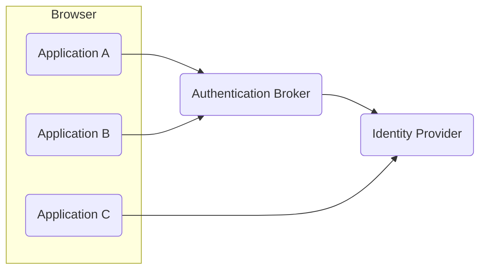

# Chapter 13: Logout

> Great is the art of beginning, but greater is the art of ending.
>
> —Henry Wadsworth Longfellow, American poet and educator, from “Elegiac Verse”
> (1881)

- [Chapter 13: Logout](#chapter-13-logout)
  - [Multiple Sessions](#multiple-sessions)
  - [Logout Triggers](#logout-triggers)
  - [Logout Options](#logout-options)
  - [Application Logout](#application-logout)
  - [OAuth 2](#oauth-2)
  - [Notes](#notes)

Implementing logout can be more complex to design and test in some cases than
login.

Terminating a session if it is no longer needed eliminates the chance that the
session can be hijacked by others. This complements other measures in a
comprehensive security strategy and is beneficial for situations where devices
might be stolen or confiscated.

## Multiple Sessions

Logout can be complex to implement in environments with single sign-on, because
there may be multiple sessions to worry about.

At a minimum, a user has an application session (Model 1). If an application
delegates authentication to an `identity provider` (`IdP`), the
`identity provider` may have an active session for the user (Model 2). If an
application uses an `authentication broker`, to facilitate handling many
different `identity providers` and protocols, the `authentication broker` may
also have an active session for the user (Model 3). This means that a user
could have sessions in up to three different tiers of a solution architecture
like Model 3 after logging in. It is possible for an `identity provider` to
delegate authentication to another `identity provider`, so there could be even
more tiers involved, but that is not common.

```diagram
Model 1: Application

Model 2: Application --> Identity Provider

Model 3: Application --> Authentication Broker --> Identity Provider
```

Logout is further complicated because with single sign-on (SSO), there might be
even more sessions to consider. If a user can access multiple applications via
SSO, there could be an additional session in each of those applications.
Applications A and B delegate authentication to an authentication broker, which
in turn delegates user authentication to an identity provider. Application C
delegates authentication directly to the identity provider. If a user accesses
applications A, B, and C in short order, the user would have five active
sessions.

Figure 2:



## Logout Triggers

The termination of any of a user’s sessions can be triggered by several
different events.

- The most obvious is when a user clicks a logout button in an `application`.
- A user may also be able to trigger a logout of their session directly at an
  `identity provider` if it provides such a feature.
- In addition to user-initiated logout, an administrator might terminate a
  user’s session in either an `application` or `identity provider`.
- Another possibility is that a user’s session times out if the user has been
  idle or logged in for too long.
- Then again, an `application` or `identity provider` may receive a logout
  request from another component in the environment.
  
When any of these events occur, one or more of the user’s sessions will be
terminated. The question is: Which ones should be terminated and under which
circumstances?

## Logout Options

When there are multiple sessions for a user, it is necessary to decide what
should happen when any of the user’s sessions are terminated. If a user’s
session in an application is terminated, it may be appropriate to terminate one
or more of the following, depending on where sessions exist:

- `Application` session
- Authentication broker session (if a broker is used)
- `Identity provider` session

In addition, if a user’s SSO session is terminated at an `identity provider` or
`authentication broker`, it may be appropriate to terminate one or more of the

- User sessions for the user at any “upstream” relying parties (`applications`
  or other providers)
- User sessions for the user at any “downstream” `identity providers`

For example, in Figure 2, when the user logs out of `application A`, the
application could send a logout request to the `authentication broker`. The
`authentication broker` may have other applications (relying parties) relying
on its session for the user, such as `application B` in the diagram. When it
receives the logout request, the `authentication broker` could send a logout
request to `application B` to terminate the user’s session there. In addition,
the `authentication broker` could send a logout request to the
`identity provider`. The `identity provider` would see that `application C`
relied on its session for the user and could send a logout request to
`application C`.

The same possibilities should be evaluated if a user’s session is terminated at
an `identity provider` or `authentication broker` for any reason. In Figure 2,
if the user’s session is terminated at the `identity provider`, it could send a
logout request to `application C` and the `authentication broker` because they
are both relying parties to the `identity provider`. Similarly, if the user’s
session is terminated at the `authentication broker`, it could send a logout
request to the `identity provider` and/or to one or both of the relying party
`applications A` and `B`.

In designing logout, it is necessary to consider where sessions exist and which
should be terminated when a user initiates a logout or if their session is
terminated for other reasons. One factor in the decision is the entity owning
the sessions.

- In enterprise environments, corporate security policy may dictate that a
  logout in an `application` must trigger the termination of an
  `identity provider` session and possibly all the user’s open sessions in
  other applications.
- In a consumer-facing environment where a user logs in with a
  `social provider`, however, it may be less justified or impossible for an
  `application` logout to terminate the user’s session at the
  `social identity provider`.
  
Obviously, an `identity provider` or `authentication broker`’s supported
features for logout are another factor that will influence logout design.

User experience is an important factor as well. Care should be taken to avoid
surprises for users. Terminating all application and SSO sessions for a user
with one logout provides a convenient way to terminate all access at once.

This may be desirable in an enterprise environment because if users have to log
out of each application individually, they may forget one. If the impact of
such a logout is not clear to a user, this may “pull the rug out” from under
the user’s other application sessions that rely on the same SSO session.

An example will help illustrate this. Using the scenario in Figure 2, if a user
is working simultaneously in the three applications, A, B, and C, and a logout
from `application A` triggers the termination of their sessions everywhere,
that may prevent the user from completing in-flight transactions in
`application B` or `C`, depending on how those applications handle session
termination. The abrupt termination of sessions in other applications may cause
a user to lose their work there. Whether the user can continue working in the
other applications depends on how logout and session termination is implemented.

One possibility is to have the logout in `application A` trigger an immediate
logout of the user in `applications B` and `C`. This would require that the
termination of the user’s session at `application A` triggers a logout request
to the `authentication broker`, which is configured to send, upon its session
termination, a logout request to `application B`. The `authentication broker`
could also send a logout request to the `identity provider`, which in turn
could send a logout request to `application C`. These logout messages would
effectively terminate all the user’s sessions across the three applications,
the `authentication broker`, and the `identity provider`.

Alternatively, when `application A` sends a logout request to the
`authentication broker`, the broker could simply terminate its own session for
the user. In this case, the user can continue working in `application B` until
the user’s session in `application B` times out. Upon such timeout,
`application B` would check if the user’s session is valid at the
`authentication broker`. If the user’s session in the `authentication broker`
had been terminated, the user would need to log in again to continue to access
`application B`.

The decision regarding which sessions to terminate is specific to each
environment and should take into account

- the entity that owns a session
- the user experience
- the sensitivity of the application
- security benefits of not leaving sessions open when not needed

The design of logout will also need to consider the capabilities of individual
applications, brokers, and identity providers as their support for logout
features may vary.

## Application Logout

For application logout, when any of the logout triggers, the application needs
to delete any application session information, tokens, and browser cookies set
by the application. If using OAuth 2 `access tokens` from an
`authorization server` that supports `access token` revocation, they should be
revoked via the `authorization server`’s revocation endpoint. `Refresh tokens`,
if used, should be revoked as well.

Local application logout by itself does not impact any other authenticated
sessions the user might have established at an `identity provider` or
`authentication broker`, but an application can choose to send logout request
messages to such other components when local application logout is triggered.

## OAuth 2

>>>>> progress

## Notes

i. https://tools.ietf.org/html/rfc7009
ii. https://openid.net/specs/openid-connect-
         rpinitiated-1_0.html
iii. https://openid.net/specs/openid-connect-session-1_0.html
iv. https://openid.net/specs/openid-connect- frontchannel-1_0.html
v. https://openid.net/specs/openid-connect- backchannel-1_0.html
vi. https://cwe.mitre.org/data/definitions/601.html
