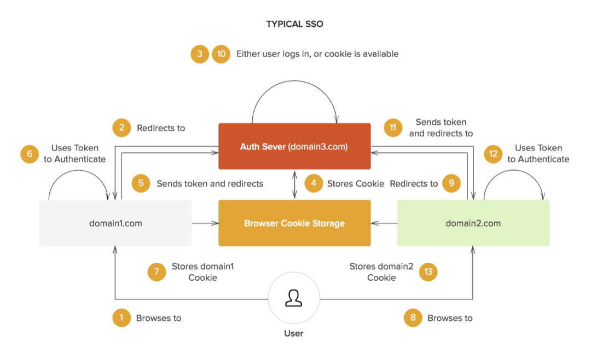

# Chapter 1: Introduction to Single Sign On (SSO)

- [Chapter 1: Introduction to Single Sign On (SSO)](#chapter-1-introduction-to-single-sign-on-sso)
  - [A Brief History of Authentication and Identity](#a-brief-history-of-authentication-and-identity)
    - [Username and Password](#username-and-password)
    - [Social](#social)
    - [Passwordless](#passwordless)
    - [Multifactor Authentication](#multifactor-authentication)
  - [Single Sign On and Identity Federation](#single-sign-on-and-identity-federation)
  - [Glossary of SSO and Authentication Terms](#glossary-of-sso-and-authentication-terms)
  - [Road to Single Sign On](#road-to-single-sign-on)

SSO is a type of authentication in which a user logs in to one system and is
automatically granted access to other services.

## A Brief History of Authentication and Identity

- In the past, most applications were developed in-house and deployed locally.
  It was fairly easy to manage.
- Software as a Service has become the standard by which modern applications and
  services are accessed.
  - SaaS vendors had the responsibility of securing and protecting the data they
    were entrusted with.

### Username and Password

- passwords must be hashed and salted

### Social

- Social authentication has the benefit of allowing an app to offload many of
  the authentication, user data storage, and security duties to the social
  authentication provider.
- The biggest drawback is the ability for the social authentication provider to
  stop providing access which would break the systems authentication system.

### Passwordless

With the username provided, the system generates a one time passcode or a
"magic" link, and delivers it to the user via

- email
- SMS
- a dedicated app

Benefits:

- the owner of the system does not have to take the burden of storing and
  protecting user passwords
- users are not required to remember the password

### Multifactor Authentication

Multifactor authentication is not a type of authentication in the traditional
sense. It makes existing authentication methods more secure.

The most common type of it is two-factor authentication (2FA).

## Single Sign On and Identity Federation

Identity federation deals with managing user identities and granting them the
rights and priviledges to log into disparate apps and services.

In the SSO use case, the user credentials are sent to a centralized
authentication server. The need for a centralized authentication server stems
from the *same-origin policy* that forbids browsers from sharing cookies between
domains.

Having a centralized authentication system allows many apps to talk directly to
the server if a user is authenticated and if so grant them access.

A typical SSO scenario between two apps:

## Glossary of SSO and Authentication Terms

- Access Management
- Authentication
- Authorization
- Back-end Server
- Claim
- Client
- Credentials
- Delegation
- Domain
- Factor
  - knowledge factors
    - password
    - PIN
    - security answer
  - ownership factors
    - security token
    - ID card
  - inherence factors
    - fingerprint
    - DNA
    - retinal scan
- Federated Identity Management
- Federation Provider
- Forest
- Identification
- Identity Provider (IdP)
- Kerberos
- Multifactor Authentication
- Multitenancy
- OAuth (Open Authorization)
- OpenID
- Passwordless
- Role
- Role-Based Access Control (RBAC)
- Security Assertion Markup Language (SAML)
- Single Sign On
- Social Identity Provider (SOcial IdP)
- Software as a Service (SaaS)
- Web Identity
- Windows Identity
- WS-Federation

## Road to Single Sign On
