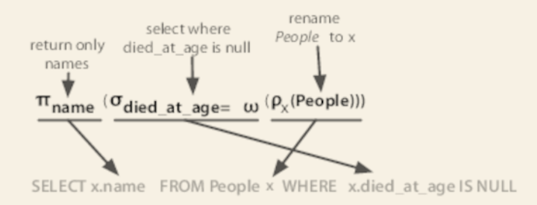
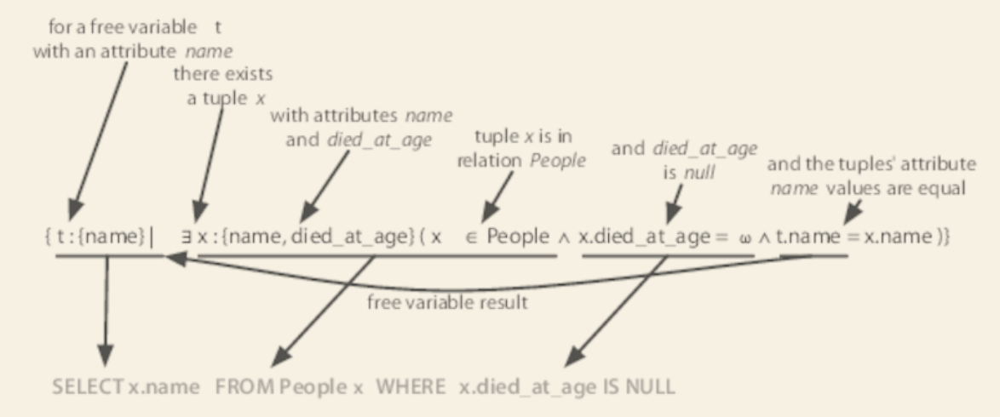

# 2. PostgreSQL

- [2. PostgreSQL](#2-postgresql)
  - [That's Post-greS-Q-L](#thats-post-gres-q-l)
  - [Day 1: Relations, CRUD, and Joins](#day-1-relations-crud-and-joins)
    - [Starting with SQL](#starting-with-sql)
      - [Mathematical Relations](#mathematical-relations)
    - [Working with Tables](#working-with-tables)

## That's Post-greS-Q-L

- Domain-specific plugins
  - Natural language parsing
  - Multidimensional indexing
  - Geographic queries
  - Custom datatypes
- Builtins
  - Unicode
  - Sequences
  - Table inheritance
  - Subselects
- Fast and reliable

```sh
sudo -u postgres createuser 7dbs
sudo -u postgres createdb -O 7dbs 7dbs
```

## Day 1: Relations, CRUD, and Joins

- `psql 7dbs`
  - `\h`: commands
    - e.g.: `\h CREATE INDEX`
  - `\?`: helps

### Starting with SQL

Mathematical terms to SQL convention:

- relations: TABLEs
- attributes: COLUMNs
- tuples: ROWs

#### Mathematical Relations

Relational databases are *relational* based on mathematics. They aren't
relational because tables "relate" to each other via foreign keys.

RDBMSs are built atop a set theory branch called *relational algebra* - a
combination of selections (`WHERE ...`), projections (`SELECT ...`), Cartesian
products (`JOIN ...`).



Relational queries are derived from a branch of mathematics known as
*tuple relational calculus*, which can be converted to *relational algebra*.



### Working with Tables

>>>>> progress
