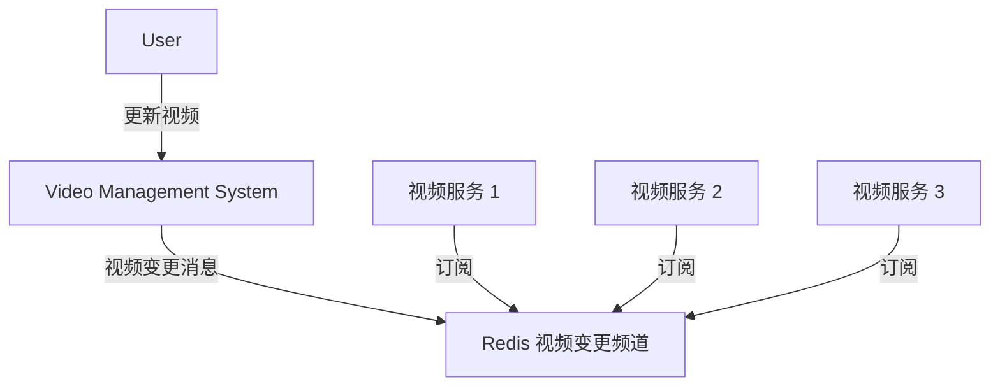

# 第3章 小功能大用处

- [第3章 小功能大用处](#第3章-小功能大用处)
  - [3.1 慢查询分析](#31-慢查询分析)
    - [3.1.1 慢查询的两个配置参数](#311-慢查询的两个配置参数)
      - [1. 获取慢查询日志](#1-获取慢查询日志)
      - [2. 获取慢查询日志列表长度](#2-获取慢查询日志列表长度)
      - [3. 慢查询日志重置](#3-慢查询日志重置)
    - [3.1.2 最佳实践](#312-最佳实践)
  - [3.2 Redis Shell](#32-redis-shell)
    - [3.2.1 redis-cli 详解](#321-redis-cli-详解)
      - [1. -r: repeat](#1--r-repeat)
      - [2. -i: interval](#2--i-interval)
      - [3. -x: 读取 stdin](#3--x-读取-stdin)
      - [4. -c: cluster](#4--c-cluster)
      - [5. -a: auth](#5--a-auth)
      - [6. --scan 和 --pattern](#6---scan-和---pattern)
      - [7. --slave](#7---slave)
      - [8. --rdb](#8---rdb)
      - [9. --pipe](#9---pipe)
      - [10. --bigkeys](#10---bigkeys)
      - [11. --eval](#11---eval)
      - [12. --latency](#12---latency)
      - [13. --stat](#13---stat)
      - [14. --raw 和 --no-raw](#14---raw-和---no-raw)
    - [3.2.2 redis-server 详解](#322-redis-server-详解)
    - [3.2.3 redis-benchmark 详解](#323-redis-benchmark-详解)
      - [1. -c: clients](#1--c-clients)
      - [2. -n \[requests\]](#2--n-requests)
      - [3. -q: requests per second](#3--q-requests-per-second)
      - [4. -r: random](#4--r-random)
      - [5. -P: 每个请求 pipeline 的命令数量](#5--p-每个请求-pipeline-的命令数量)
      - [6. -k: keepalive \[boolean\]](#6--k-keepalive-boolean)
      - [7. -t: test](#7--t-test)
      - [8. --csv](#8---csv)
  - [3.3 Pipeline](#33-pipeline)
    - [3.3.1 Pipeline 概念](#331-pipeline-概念)
    - [3.3.2 性能测试](#332-性能测试)
    - [3.3.3 原生批量命令与 Pipeline 对比](#333-原生批量命令与-pipeline-对比)
    - [3.3.4 最佳实践](#334-最佳实践)
  - [3.4 事务与 Lua](#34-事务与-lua)
    - [3.4.1 事务](#341-事务)
      - [1.命令错误](#1命令错误)
      - [2.运行时错误](#2运行时错误)
    - [3.4.2 Lua用法简述](#342-lua用法简述)
      - [1.数据类型及其逻辑处理](#1数据类型及其逻辑处理)
        - [1.1 字符串](#11-字符串)
        - [1.2 数组](#12-数组)
        - [1.3 for](#13-for)
        - [1.4 while](#14-while)
        - [1.5 if else](#15-if-else)
        - [1.6 哈希](#16-哈希)
      - [2.函数定义](#2函数定义)
    - [3.4.3 Redis 与 Lua](#343-redis-与-lua)
      - [1.在 Redis 中使用 Lua](#1在-redis-中使用-lua)
        - [1.1 eval](#11-eval)
        - [1.2 evalsha](#12-evalsha)
      - [2.Lua 的 Redis API](#2lua-的-redis-api)
    - [3.4.4 案例](#344-案例)
    - [3.4.5 Redis 如何管理 Lua 脚本](#345-redis-如何管理-lua-脚本)
  - [3.5 Bitmaps](#35-bitmaps)
    - [3.5.1 数据结构模型](#351-数据结构模型)
    - [3.5.2 命令](#352-命令)
      - [1.设置值](#1设置值)
      - [2.获取值](#2获取值)
      - [3.获取 Bitmaps 指定范围值为 1 的个数](#3获取-bitmaps-指定范围值为-1-的个数)
      - [4.Bitmaps 间的运算](#4bitmaps-间的运算)
      - [5.计算 Bitmaps 中第一个值为 targetBit 的偏移量](#5计算-bitmaps-中第一个值为-targetbit-的偏移量)
    - [3.5.3 Bitmaps 分析](#353-bitmaps-分析)
  - [3.6 HyperLogLog](#36-hyperloglog)
    - [1.添加](#1添加)
    - [2.计算独立用户数](#2计算独立用户数)
    - [3.合并](#3合并)
  - [3.7 发布订阅](#37-发布订阅)
    - [3.7.1 命令](#371-命令)
      - [1.发布消息](#1发布消息)
      - [2.订阅消息](#2订阅消息)
      - [3.取消订阅](#3取消订阅)
      - [4.按照模式订阅和取消订阅](#4按照模式订阅和取消订阅)
      - [5.查询订阅](#5查询订阅)
        - [5.1 查看活跃的频道](#51-查看活跃的频道)
        - [5.2 查看频道订阅数](#52-查看频道订阅数)
        - [5.3 查看模式订阅数](#53-查看模式订阅数)
    - [3.7.2 使用场景](#372-使用场景)
  - [3.8 GEO](#38-geo)
    - [1.增加地理位置信息](#1增加地理位置信息)
    - [2.获取地理位置信息](#2获取地理位置信息)
    - [3.获取两个地理位置的距离](#3获取两个地理位置的距离)
    - [4.获取指定位置范围内的地理信息位置集合](#4获取指定位置范围内的地理信息位置集合)
    - [5.获取 geohash](#5获取-geohash)
    - [6.删除地理位置信息](#6删除地理位置信息)
  - [3.9 本章重点回顾](#39-本章重点回顾)

除了 Redis 提供的 5 种数据结构之外，Redis 还提供了诸如

- 慢查询分析：通过慢查询分析，找到有问题的命令进行优化。
- Redis Shell：功能强大的 Redis Shell 会有意想不到的实用功能。
- Pipeline：通过 Pipeline 机制有效提高客户端性能。
- 事务与 Lua 脚本：制作自己的专属原子命令。
- Bitmaps：通过在字符串数据结构上使用位操作，有效节省内存，为开发提供新的思路。
- HyperLogLog：一种基于概率的新算法，节省内存空间。
- 发布订阅：基于发布订阅模式的消息通信机制。
- GEO：提供了基于地理位置信息的功能。

等附加功能。

## 3.1 慢查询分析

Redis 执行客户端命令的生命周期：

1. 发送命令
2. 命令排队
3. 命令执行（慢查询只统计这一步）
4. 返回结果

### 3.1.1 慢查询的两个配置参数

两个问题需要明确：

1. 预设阈值怎么设置？
    - `slowlog-log-slower-than`: us, 默认值 10000 (10ms)
    - `= 0` 时会记录所有命令
    - `< 0` 时不会记录任何命令
2. 慢查询记录存放在什么地方？
    - `slowlog-max-len`: 存储慢查询日志的列表最大长度

如何修改？

```redis
config set slowlog-log-slower-than 20000
config set slowlog-max-len 1000

# 持久化到本地配置文件
config rewrite
```

#### 1. 获取慢查询日志

```redis
slowlog get [n]
```

每一条慢查询日志有 4 个属性：

- id
- time: 时间戳
- duration: 耗时
- command + args: 具体命令和参数

#### 2. 获取慢查询日志列表长度

```redis
slowlog len
```

#### 3. 慢查询日志重置

```redis
slowlog reset
```

### 3.1.2 最佳实践

- `slowlog-max-len`: 生产环境建议设置 1000 以上
  - 记录慢查询时 Redis 会对长命令做截断操作，因此不会占用大量内存
  - 增大列表上限可以减缓慢查询被剔除的可能
- `slowlog-log-slower-than`: 默认值为 10ms，需要根据实际并发量调整
  - 对于高流量场景，建议设置为 1ms (OPS 1000)
- 慢查询记录的时间不包括命令排队和网络传输时间，因此客户端实际执行时间会大于命令执行时间。
  - 如果客户端出现请求超时，需要检查该时间点是否有对应的慢查询
- 定期执行 `slowlog get` 将慢查询导出持久化到其他存储中
  - Redis 私有云 CacheCloud 提供了这样的功能

## 3.2 Redis Shell

### 3.2.1 redis-cli 详解

重要参数及其使用场景：

#### 1. -r: repeat

```sh
redis-cli -r 3 ping
```

#### 2. -i: interval

```sh
# 每隔 1s 执行一次 ping，共 5 次
redis-cli -r 5 -i 1 ping

# 支持小数
redis-cli -r 5 -i 0.01 ping
```

#### 3. -x: 读取 stdin

作为 redis-cli 最后一个参数

```sh
echo "world" | redis-cli -x set hello
```

#### 4. -c: cluster

连接 Redis Cluster 节点时使用，防止 moved 和 ask 异常

#### 5. -a: auth

用于输入密码

#### 6. --scan 和 --pattern

用于扫描指定模式的键，相当于使用 scan 命令

#### 7. --slave

把当前客户端模拟成当前 Redis 节点的从节点，用来获取当前节点的更新操作。这些操作可能时实际开发业务时需要的数据。

```sh
redis-cli --slave
# SYNC with master, discarding 72 bytes of bulk transfer...
# SYNC done. Logging commands from master.
# "PING"
# "PING"
# "PING"
# "PING"
# "PING"
# "SELECT","0"
# "set","hello","world"
# "set","a","b"
# "PING"
# "incr","count"
```

#### 8. --rdb

使 Redis 生成 RDB 持久化文件，保存在本地。

#### 9. --pipe

用于将命令封装成 Redis 通信协议定义的数据格式，批量发送给 Redis 执行。

```sh
echo -en '*3\r\n$3\r\n....' | redis-cli --pipe
```

#### 10. --bigkeys

这个选项使用 scan 命令对 Redis 进行键采样，找出内存占比较大的键值，这些键可能是系统瓶颈。

#### 11. --eval

执行指定 Lua 脚本

#### 12. --latency

有三个选项：

1. --latency: 测试客户端到 Redis 的网络延迟，只有聚合结果
2. --latency-history: 分时段统计结果
3. --latency-dist: 输出统计图表

#### 13. --stat

实时获取 Redis 重要统计信息，info 的信息更全，但它不实时。

#### 14. --raw 和 --no-raw

```sh
redis-cli --raw get hello
# 你好

redis-cli --no-raw get hello 
# "\xe4\xbd\xa0\xe5\xa5\xbd"
```

### 3.2.2 redis-server 详解

`--test-memory`: 用来检测当前操作系统能否稳定分配 Redis 指定容量的内存，避免因为内存问题造成崩溃。

```sh
# 单位为 1MB
redis-server --test-memory 1024
```

通常无需每次都测试，一般用于特定场景调试和测试。

### 3.2.3 redis-benchmark 详解

#### 1. -c: clients

客户端并发量，默认 50

#### 2. -n [requests]

总请求量，默认 100,000。Redis 会使用各类数据结果进行测试

```sh
# 100 客户端同时请求 Redis, 一共 20000 次
redis-benchmark -c 100 -n 20000
```

#### 3. -q: requests per second

仅仅显示 requests per second 信息

#### 4. -r: random

测试时插入随机的键，它会在 `key`, `counter` 键加上 12 位的后缀，`-r 10000` 代表只对后4位做随机处理（而不是随机的个数）。

```sh
redis-benchmark -c 100 -n 20000 -r 10000
```

#### 5. -P: 每个请求 pipeline 的命令数量

默认为 1

#### 6. -k: keepalive [boolean]

- `0`: 不使用
- `1`: 使用，默认值

#### 7. -t: test

对指定命令进行基准测试

```sh
redis-benchmark -t get, set -q
```

#### 8. --csv

结果按照 csv 格式输出。

## 3.3 Pipeline

### 3.3.1 Pipeline 概念

Redis 客户端执行一条命令有 4 个步骤：

1. 发送命令
2. 命令排队
3. 命令执行
4. 返回结果

`1.` + `4.` 的耗时称为 RTT: Round Trip Time。

批量操作命令如 `mget`、`mset` 可以有效地节约 RTT，但是还有很多其他命令不支持批量操作。对于地理距离遥远的客户端与节点，RTT 会浪费大量时间。

Pipeline 机制能改善上面这类问题，它能将一组命令组装后通过一次 RTT 传输给 Redis，再将结果按顺序返回。

Pipeline N 条命令可以节约 N - 1 次 RTT。

`--pipe` 实际上也是利用了 pipeline 机制。不过大部分时候是在应用代码中使用这个选项。

```sh
echo -en '*3...SET\r\n...INCR\r\n....' | redis-cli --pipe
```

### 3.3.2 性能测试

- Pipeline 执行速度一般比逐条执行快
- RTT 越大，Pipeline 效果越明显

### 3.3.3 原生批量命令与 Pipeline 对比

- 原生批量命令是原子的，Pipeline 是非原子的
- 原生批量命令是一个命令对应多个 key，Pipeline 支持多个命令
- 原生批量命令是服务端支持实现的，而 Pipeline 需要服务端和客户端共同支持

### 3.3.4 最佳实践

- 过大的 Pipeline 命令数量会增加客户端的等待时间以及网络拥堵
- Pipeline 只能操作一个 Redis 实例；不过在分布式场景中仍然是重要的优化手段

## 3.4 事务与 Lua

为了保证多条命令组合的原子性，Redis 提供了：

- 简单的事务
- 集成 Lua 脚本定制原子命令

### 3.4.1 事务

将一组需要一起执行的命令放到 `multi` 和 `exec` 两个命令之间，`multi` 代表事务开始，`exec`
代表事务结束，它们之间的命令是原子顺序执行的。

```redis
multi
# OK
sadd user:a:follow user:b
# QUEUED
sadd user:b:fans user:a
# QUEUED
exec
```

QUEUED 表明命令没有真正执行，如果此时另一个客户端执行 `sismember user:a:follow user:b`
会返回 0。执行 `exec` 后事务才完成。

`discard` 可以中止事务。

#### 1.命令错误

如果事务中某个命令拼写错误，会导致整个事务撤销。

#### 2.运行时错误

例如，用错命令，赋了非法值等。但这类错误不能回滚整个事务，而是一部分执行成功。因此开发者需要自行处理这类问题。之所以说 Redis 的事务是简单的事务，就在于它不支持回滚。

有些应用场景需要在事务之前确保事务中的 key 没有被其他客户端修改过才执行事务。这是可以用 watch
命令。

1. T1:Client1: `set key "java"`
2. T2:Client1: `watch key`
3. T3:Client1: `multi`
4. T4:**Client2**: `append key python`
5. T5:Client1: `append key jedis`
6. T6:Client1: `exec`
7. T7:Client1: `get key`

这会导致事务不被执行，最后的 `get key` 结果为 `"javapython"`

### 3.4.2 Lua用法简述

Lua 在 Redis 中可以定制命令。

#### 1.数据类型及其逻辑处理

- boolean
- number
- string
- table (标哥)

##### 1.1 字符串

```lua
-- local 表示局部变量，没有的话就是全局变量
local strings hello = "world"
print(hello)
```

##### 1.2 数组

```lua
-- index 从 1 开始，而不是 0
local tables myArray = {"redis", "jedis", true, 88.0}
print(myArray[3])
-- true
```

##### 1.3 for

```lua
local int sum = 0
for i = 1, 100
do
    sum = sum + i
end
print(sum)
```

```lua
-- # 取长度
for i = 1, #myArray
do
    print(myArray[i])
end
```

```lua
for index, value in ipairs(myArray)
do
    print(index)
    print(value)
end
```

##### 1.4 while

```lua
local int sum = 0
local int i = 0
while i <= 100
do
    sum = sum + i
    i = i + 1
end
print(sum)
```

##### 1.5 if else

```lua
local tables myArray = {"redis", "jedis", true, 88.0}
for i = 1, #myArray
do
    if myArray[i] == "jedis"
    then
        print("true")
        break
    else
        -- do nothing
    end
end
```

##### 1.6 哈希

```lua
local tables user_1 = {age = 28, name = "tome"}
-- .. 连接字符串
print("user_1 age is " .. user_1["age"])
```

遍历

```lua
for key, value in pairs(user_1)
do print(key .. value)
end
```

#### 2.函数定义

```lua
function funcName()
    -- ...
end

function concat(str1, str2)
    return str1 .. str2
end

print(concat("hello ", "world"))
```

### 3.4.3 Redis 与 Lua

#### 1.在 Redis 中使用 Lua

有两种方法：

- `eval`
- `evalsha`

##### 1.1 eval

```redis
# eval 脚本 KEY个数 KEY列表 参数列表
eval 'return "hello " .. KEYS[1] .. ARGV[1]' 1 redis world
# "hello redisworld"
```

`redis-cli --eval` 可以直接执行 Lua 脚本文件。

##### 1.2 evalsha

1. 加载 Lua 脚本到 Redis
    - `redis-cli script load "$(cat script.lua)"`
2. Redis 计算脚本 SHA1 值，并使脚本常驻
3. 返回 SHA1 值
4. `evalsha SHA1 KEY个数 KEY列表 参数列表`

#### 2.Lua 的 Redis API

Lua 可以使用 `redis.call` 实现对 Redis 的访问

```lua
redis.call("set", "hello", "world")
redis.call("get", "hello")
```

相当于在客户端执行

```redis
eval 'return redis.call("get", KEYS[1])' 1 hello
```

Lua 还可以使用 `redis.pcall` 实现对 Redis 的调用，区别在于如果 `redis.call`
失败，脚本会直接结束返回错误，而 `redis.pcall` 会忽略错误继续执行。

💡 Lua 还可以使用 `redis.log` 将 Lua 脚本日志输出到 Redis 的日志文件中，但一定要控制日志级别。Redis 还提供了 Lua Script Debugger 功能来调试复杂的 Lua 脚本

### 3.4.4 案例

Lua 脚本的三个主要好处：

1. 在 Redis 中是原子执行的，中间不会插入其他命令
2. 可以定制化命令，并常驻内存实现复用
3. 可以打包多条 Redis 命令，减少网络开销

例子：当前列表记录着热门用户的 id，现要对列表内所有的键对应热度做 +1 操作，并且保证是原子执行。

```redis
lrange hot:user:list 0 -1
# "user:1:ratio"
# "user:8:ratio"
# "user:3:ratio"
# "user:99:ratio"
# "user:72:ratio"

mset user:1:ratio 968 user:8:ratio 762 user:3:ratio 556 user:99:ratio 400 user:72:ratio 101
mget user:1:ratio user:8:ratio user:3:ratio user:99:ratio user:72:ratio
# 968
# 762
# 556
# 400
# 101
```

```lua
-- lrange_and_mincr.lua
local mylist = redis.call("lrange", KEYS[1], 0, -1)
local count = 0

for index,key in ipairs(mylist)
do
    redis.call("incr", key)
    count = count + 1
end
return count
```

```sh
redis-cli --eval lrange_and_mincr.lua hot:user:list
```

### 3.4.5 Redis 如何管理 Lua 脚本

- `script load script.lua`
- `script exists sha1 [sha1 ...]`: 返回的数字 sha1 有效脚本数量
- `script flush`: 清除已加载的脚本
- `script kill`: 杀掉正在执行的脚本

Redis 提供了一个 `lua-time-limit` 参数，默认 5s，它是 Lua 脚本的超时时间。但这个超时时间仅仅是在超时后，向其他命令调用发送 `BUSY` 信号，而不会停掉正在执行的脚本。

这时可以等待或者使用 `script kill`。⚠️ 如果脚本正在执行写操作，则 `script kill` 不会生效。

## 3.5 Bitmaps

### 3.5.1 数据结构模型

- Bitmaps 本身不是一种数据结构，实际上它就是字符串，但是它可以对字符串的位进行操作
- Bitmaps 单独提供了一套命令，所以使用 Bitmaps 和使用字符串的方法不同。
  - 可以把 Bitmaps 想象成一个以位为单位的数组，数组每个元素只能是 0 或 1，数组的下标在
    Bitmaps 中叫偏移量。

### 3.5.2 命令

例子：将每个独立用户是否访问过网站存放在 Bitmaps 中，访问的记为 1，没访问的记为 0，偏移量为用户的 id。

#### 1.设置值

```redis
setbit key offset value

setbit unique:users:date 0 1
setbit unique:users:date 5 1
setbit unique:users:date 11 1
setbit unique:users:date 15 1
setbit unique:users:date 19 1
```

⚠️ 在第一次初始化 Bitmaps 时，如果偏移量巨大，这个初始化过程会比较慢而造成阻塞。

#### 2.获取值

```redis
getbit key offset

getbit unique:users:date 0
```

#### 3.获取 Bitmaps 指定范围值为 1 的个数

```redis
bitcount [start][end] # 字节数

bitcount unique:users:date
bitcount unique:users:date 2 2
```

#### 4.Bitmaps 间的运算

bitop 是一个复合操作，可以做多个 Bitmaps 的 and, or, not, xor 等操作并保存在 `destkey`
中。

```redis
bitop op destkey key [key...]

# 获取 2016-04-04 和 2016-04-03 这两天中访问过网站的用户数
bitop or unique:users:or:2016-04-04_03 unique:users:2016-04-03 unique:users:2016-04-04
```

#### 5.计算 Bitmaps 中第一个值为 targetBit 的偏移量

```redis
bitpos key targetBit [start][end]

# 查询访问网站的最小用户 id
bitpos unique:users:date 1
bitpos unique:users:date 1 1
```

### 3.5.3 Bitmaps 分析

假设网站有 1 亿用户，每天独立访问用户有 5 千万，如果每天用集合类型和 Bitmaps 分别存储活跃用户：

集合类型:

- 用户 id 占用空间：64 bits (8 bytes)
- 需要存储的用户量：50,000,000
- 内存量：`64bits * 50,000,000 = 400MB`

Bitmaps:

- 用户 id 占用空间：1 bit
- 需要存储的用户量：100,000,000
- 内存量：`1bit * 100,000,000 = 12.5MB`

但如果这个网站每天的独立访问用户很少，只有 10 万，这时候用 Bitmaps 就不太适合了：

集合类型:

- 需要存储的用户量：100,000
- 内存量：`64bits * 100,000 = 800KB`

Bitmaps:

- 需要存储的用户量：100,000,000
- 内存量：`1bit * 100,000,000 = 12.5MB`

## 3.6 HyperLogLog

HyperLogLog 也不是一种新的数据结构（实际类型为字符串类型），而是一种基数算法，利用极小的内存空间完成独立总数的统计，数据集可以是 IP, Email, ID 等。HyperLogLog 提供了 3 个命令：

- `pfadd`
- `pfcount`
- `pfmerge`

举例：

- 2016-03-06 的访问用户有
  - uuid-1
  - uuid-2
  - uuid-3
  - uuid-4
- 2016-03-05
  - uuid-4
  - uuid-5
  - uuid-6
  - uuid-7

### 1.添加

```redis
pfadd key element [element ...]

pfadd 2016_03_06:unique:ids "uuid-1" "uuid-2" "uuid-3" "uuid-4"
pfadd 2016_03_05:unique:ids "uuid-4" "uuid-5" "uuid-6" "uuid-7"
```

### 2.计算独立用户数

```redis
pfcount key [key ...]

pfcount 2016_03_06:unique:ids
pfcount 2016_03_05:unique:ids
```

使用脚本向 HyperLogLog 插入 100 万个 id

```redis
info memory
# used_memory:861696
# used_memory_human:841.50K
```

```sh
elements=""
key="2016_05_01:unique:ids"
for i in `seq 1 1000000`
do
    elements="${elements} uuid-"${i}
    if [[ $((i%1000)) == 0 ]];
    then
        redis-cli pfadd ${key} ${elements}
        elements=""
    fi
done
```

执行后，内存只增加了 15KB 左右。不过，用 `pfcount` 的统计结果并不是精确的 100万

```redis
pfcount 2016_05_01:unique:ids
# 1009838
```

如果是用集合类型存储 100 万个 uuid

```sh
elements=""
key="2016_05_01:unique:ids:set"
for i in `seq 1 1000000`
do
    elements="${elements} "${i}
    if [[ $((i%1000)) == 0 ]];
    then
        redis-cli sadd ${key} ${elements}
        elements=""
    fi
done
```

使用集合占用的内存达到 84MB，但是统计数量是精确的

```redis
scard 2016_05_01:unique:ids:set
# 1000000
```

### 3.合并

```redis
pfmerge destkey sourcekey [sourcekey ...]
```

`pfmerge` 可以求出多个 HyperLogLog 的并集并赋值给 `destkey`

例如要求出 2016-03-06 和 2016-03-05 的访问独立用户数；

```redis
pfmerge 2016_03_05_06:unique:ids 2016_03_05:unique:ids 2016_03_06:unique:ids
pfcount 2016_03_05_06:unique:ids
# 7
```

使用 HyperLogLog 的原则：

- 只为了计算独立总数，不需要获取单条数据
- 可以容忍一定的误差率，Redis 官方给出的失误率为 0.81%

## 3.7 发布订阅

### 3.7.1 命令

#### 1.发布消息

```redis
publish channel message

publish channel:sports "Tim won the championship"
```

#### 2.订阅消息

```redis
subscribe channel [channel ...]

subscribe channel:sports
```

订阅命令有两点需要注意：

- 客户端在执行订阅命令之后进入了订阅状态，只能接收 subscribe, psubscribe, unsubscribe,
  punsubscribe 的四个命令。
- 新开启的订阅客户端无法收到此前的消息，因为 Redis 没有对发布的消息做持久化

🔔 和很多专业的消息队列系统（Kafka, RocketMQ）相比，Redis 的发布订阅相对粗糙，
无法实现消息堆积和回溯。不过如果场景相对简单，还是一个不错的选择。

#### 3.取消订阅

```redis
unsubscribe [channel [channel ...]]
unsubscribe channel:sports
```

#### 4.按照模式订阅和取消订阅

这里的 pattern 是 glob 风格。

```redis
psubscribe pattern [pattern ...]
punsubscribe [pattern [pattern ...]]

psubscribe it*
```

#### 5.查询订阅

##### 5.1 查看活跃的频道

```redis
pubsub channels [pattern]
```

活跃频道是指至少有一个订阅者的频道。

##### 5.2 查看频道订阅数

```redis
pubsub numsub [channel ...]

pubsub numsub channel:sports
```

##### 5.3 查看模式订阅数

```redis
pubsub numpat
```

### 3.7.2 使用场景

聊天室、公告牌、服务之间利用消息解耦都可以使用发布订阅模式。



视频服务订阅 `video:changes` 频道：

```redis
subscribe video:changes
```

视频管理系统发布消息到 `video:changes` 频道：

```redis
publish video:changes "video1, video3, video5"
```

当视频服务收到消息，就可以对视频信息进行更新：

```sh
for video in video1, video3, video5
    update {video}
```

## 3.8 GEO

GEO (geospatial) 地理信息定位功能，支持存储地理位置信息，用于实现诸如附近位置、摇一摇这类依赖地理位置信息的功能。Redis 的 GEO 借鉴 NoSQL 数据库 Ardb 实现的。

### 1.增加地理位置信息

```redis
geoadd key longitude latitude member [longitude latitude member ...]

# 更新也是用 geoadd, 以 member 为依据，如果不存在就增加，并返回 1，否则更新，返回 0
geoadd cities:locations 116.28 39.55 beijing
geoadd cities:locations 117.12 39.08 tianjin
```

### 2.获取地理位置信息

```redis
geopos key member [member ...]

geopos cities:locations beijing
```

### 3.获取两个地理位置的距离

```redis
geodist key member1 member2 [unit]

geodist cities:locations tianjin beijing km
```

单位有

- m
- km
- mi (miles)
- ft (feet)

### 4.获取指定位置范围内的地理信息位置集合

```redis
georadius key longitude latitude radius m|km|ft|mi [withcoord] [withdist]
    [withhash] [COUNT count] [asc|desc] [store key] [storedist key]
georadiusbymember key member     radius m|km|ft|mi [withcoord] [withdist]
    [withhash] [COUNT count] [asc|desc] [store key] [storedist key]
```

这两个命令都是以一个地理位置为中心算出指定半径内的其他地理位置信息

- georadius 给出具体经纬度
- georadiusbymember 给出成员

可选参数：

- withcoord: 返回结果中包含经纬度
- withdist: 返回结果中包含离中心节点位置的距离
- withhash: 返回结果中包含 geohash
- COUNT count: 指定返回结果的数量
- asc|desc: 按距离中心节点的距离做升序或者降序
- store key: 将返回结果的地理位置信息保存到指定键
- storedist key: 将返回结果离中心节点的距离保存到指定键

```redis
georadiusbymember cities:locations bejing 150 km
# 1) "beijing"
# 2) "tianjin"
# 3) "tangshan"
# 4) "baoding"
```

### 5.获取 geohash

Redis 使用 geohash 将二维经纬度转换为一维的字符串：

```redis
geohash key member [member ...]

geohash cities:locations beijing
```

geohash 的特点：

- GEO 数据类型为 zset，Redis 将所有地理位置信息的 geohash 存放在 zset 中
  - `type cities:locations`
- 字符串越长，表示的位置更精确。如下为 geohash 长度和精确度 (km) 的关系
  - 1: 2500
  - 2: 630
  - 3: 78
  - 4: 20
  - 5: 2.4
  - 6: 0.61
  - 7: 0.076
  - 8: 0.019
  - 9: 0.002
- 两个字符串越相似，它们之间的距离越近，Redis 利用字符串前缀匹配算法实现相关的命令
- geohash 编码和经纬度可以互相转换

Redis 使用有序集合结合 geohash 特性实现了 GEO 的若干命令

### 6.删除地理位置信息

GEO 没有提供删除成员的命令，但因为它底层实现是 zset，所以可以借助 zrem 命令删除。

```redis
zrem key member
```

## 3.9 本章重点回顾

1. 慢查询中的两个重要参数 `slowlog-log-slower-than` 和 `slowlog-max-len`。
2. 慢查询不包含命令网络传输和排队时间。
3. 有必要将慢查询定期存放。
4. `redis-cli` 一些重要的选项，例如 `--latency`、`–-bigkeys`、`-i` 和 `-r` 组合。
5. `redis-benchmark` 的使用方法和重要参数。
6. Pipeline 可以有效减少 RTT 次数，但每次 Pipeline 的命令数量不能无节制。
7. Redis 可以使用 Lua 脚本创造出原子、高效、自定义命令组合。
8. Redis 执行 Lua 脚本有两种方法: `eval` 和 `evalsha`。
9. Bitmaps 可以用来做独立用户统计，有效节省内存。
10. Bitmaps 中 setbit 一个大的偏移量，由于申请大量内存会导致阻塞。
11. HyperLogLog 虽然在统计独立总量时存在一定的误差，但是节省的内存量十分惊人。
12. Redis 的发布订阅机制相比许多专业的消息队列系统功能较弱，不具备堆积和回溯消息的能力，但胜在足够简单。
13. Redis3.2 提供了 GEO 功能，用来实现基于地理位置信息的应用，底层实现是 zset。
