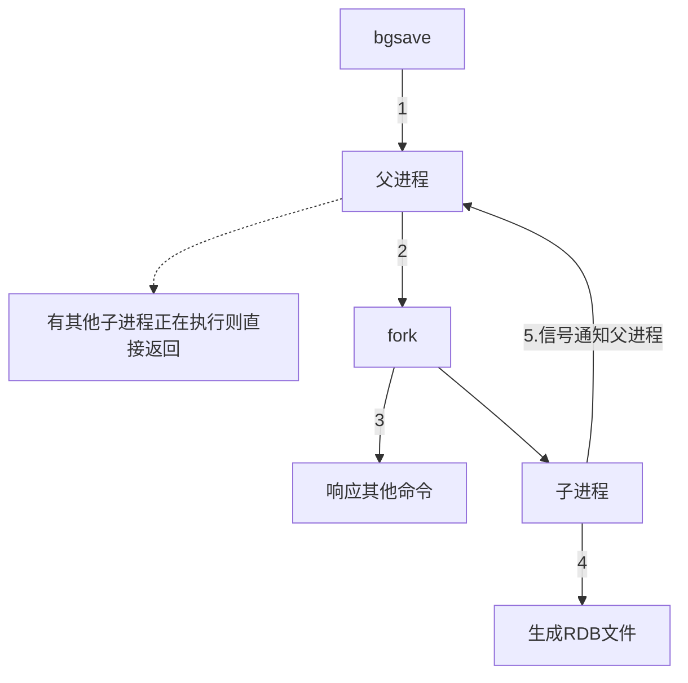
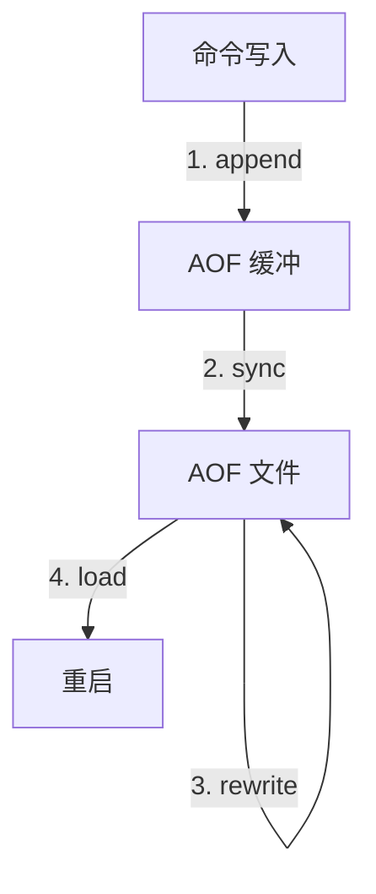
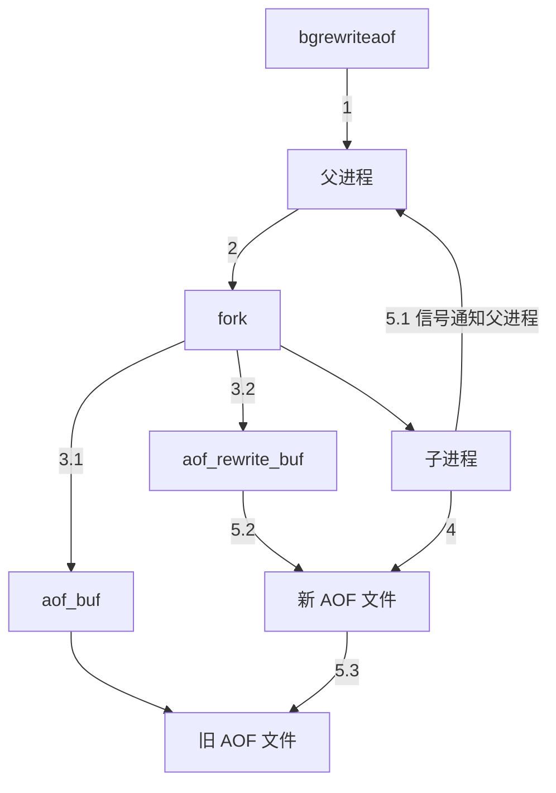
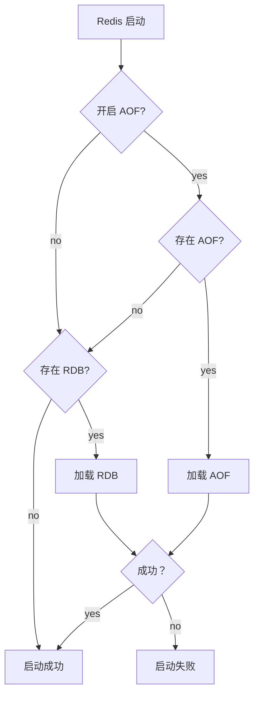
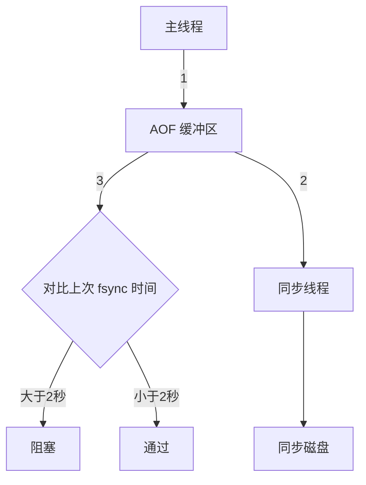

# 第5章 持久化

- [第5章 持久化](#第5章-持久化)
  - [5.1 RDB](#51-rdb)
    - [5.1.1 触发机制](#511-触发机制)
    - [5.1.2 流程说明](#512-流程说明)
    - [5.1.3 RDB 文件的处理](#513-rdb-文件的处理)
    - [5.1.4 RDB 的优缺点](#514-rdb-的优缺点)
  - [5.2 AOF](#52-aof)
    - [5.2.1 使用 AOF](#521-使用-aof)
    - [5.2.2 命令写入](#522-命令写入)
    - [5.2.3 文件同步](#523-文件同步)
    - [5.2.4 重写机制](#524-重写机制)
    - [5.2.5 重启加载](#525-重启加载)
    - [5.2.6 文件校验](#526-文件校验)
  - [5.3 问题定位与优化](#53-问题定位与优化)
    - [5.3.1 fork 操作](#531-fork-操作)
    - [5.3.2 子进程开销监控和优化](#532-子进程开销监控和优化)
      - [1. CPU](#1-cpu)
      - [2. 内存](#2-内存)
      - [3. 硬盘](#3-硬盘)
    - [5.3.3 AOF 追加阻塞](#533-aof-追加阻塞)
  - [5.4 多实例部署](#54-多实例部署)
  - [补充：混合持久化](#补充混合持久化)
  - [5.5 本章重点回顾](#55-本章重点回顾)

Redis 支持 RDB 和 AOF 两种持久化机制。

## 5.1 RDB

RDB 持久化是把当前进程数据生成***快照***保存到硬盘，触发持久化分为

- 手动触发
- 自动触发

### 5.1.1 触发机制

- `save`: 阻塞当前 Redis，直到 RDB 过程完成为止
  - 对于内存比较大的实例会造成长时间阻塞，线上环境不建议使用。
- `bgsave`: Redis 进程执行 fork 操作创建子进程，RDB 持久化由子进程负责，完成后自动结束。
  - 阻塞只发生在 fork 阶段，一般时间很短。

`bgsave` 命令是针对 `save` 阻塞问题做的优化。Redis 内部所有涉及 RDB 的操作都采用 `bgsave`，而 `save` 命令已经废弃。

除了执行命令手动触发之外，还可以自动触发 RDB 持久化:

1. `save m n` 表示 `m` 秒内数据集存在 `n` 次修改时，自动触发 `bgsave`。
2. 如果从节点执行全量复制操作，主节点自动执行 `bgsave` 生成 RDB 文件并发送给从节点。
3. 执行 `debug reload` 命令重新加载 Redis 时，也会自动触发 `save` 操作。
4. 默认情况下执行 `shutdown` 命令时，如果没有开启 AOF 持久化则自动执行 `bgsave`。

### 5.1.2 流程说明

`bgsave` 是主流的触发 RDB 持久化方式。



1. 执行 `bgsave` 命令，Redis 父进程判断当前是否存在正在执行的子进程，如 RDB/AOF 子进程，如果存在则直接返回。
2. 父进程执行 `fork` 操作创建子进程，`fork` 过程中父进程会阻塞，通过 `info stats` 命令查看 `latest_fork_usec` 选项，可以获取最近一个 `fork` 操作的耗时，单位为微秒。
3. 父进程 `fork` 完成后，`bgsave` 命令返回 `Background saving started` 信息并不再阻塞父进程，可以继续响应其他命令。
4. 子进程创建 RDB 文件，根据父进程内存生成临时快照文件，完成后对原有文件进行原子替换。执行
   `lastsave` 命令可以获取最后一次生成 RDB 的时间，对应 info 统计的
   `rdb_last_save_time` 选项。
5. 进程发送信号给父进程表示完成，父进程更新统计信息，具体见 `info Persistence` 下的
   `rdb_*` 相关选项。

### 5.1.3 RDB 文件的处理

- **保存**: RDB 文件保存在 `dir` 配置指定的目录下，文件名通过 `dbfilename` 配置指定。
  可以通过执行 `config set dir {newDir}` 和 `config set dbfilename {newFileName}`
  运行期动态执行，当下次运行时 RDB 文件会保存到新目录。
  - 当遇到坏盘或磁盘写满等情况时，可以通过 `config set dir {newDir}` 在线修改文件路径到可用的磁盘路径，之后执行 `bgsave` 进行磁盘切换，同样适用于 AOF 持久化文件。
- **压缩**: Redis 默认采用 LZF 算法对生成的 RDB 文件做压缩处理，压缩后的文件远远小于内存大小，默认开启，可以通过 `config set rdbcompression {yes|no}` 动态修改。
  - 虽然压缩 RDB 会消耗 CPU，但可大幅降低文件的体积，方便保存到硬盘或通过网络发送给从节点，因此线上建议开启。
- **校验**: 如果 Redis 加载损坏的 RDB 文件时拒绝启动，并打印如下日志
  - `# Short read or OOM loading DB. Unrecoverable error, aborting now.`
  - 这时可以使用 Redis 的 `redis-check-dump` 工具检测 RDB 文件并获取对应的错误报告。

### 5.1.4 RDB 的优缺点

- **优点**
  - RDB 是一个紧凑压缩的二进制文件，代表在某个时间点上的数据快照，非常适用于备份，全量复制等场景。比如每 6 小时执行 `bgsave` 备份，并把 RDB 文件拷贝到远程机器或者文件系统中，用于灾难恢复。
  - Redis 加载 RDB 恢复数据远远快于 AOF 的方式。
- **缺点**
  - RDB 方式数据没办法做到实时持久化/秒级持久化。因为 `bgsave` 每次运行都要执行 `fork`
    操作创建子进程，频繁执行成本过高。
  - RDB 文件使用特定二进制格式保存，Redis 版本演进过程中有多个格式的 RDB 版本，存在老版本无法兼容新版 RDB 格式的问题。

针对 RDB 不适合实时持久化的问题，Redis 提供了 AOF 持久化方式。

## 5.2 AOF

***AOF (append only file)*** 持久化: 以独立日志的方式记录每次写命令，重启时再重新执行
AOF 文件中的命令达到恢复数据的目的。AOF 的主要作用是解决了数据持久化的实时性，目前已经是
Redis 持久化的主流方式。

### 5.2.1 使用 AOF

- 开启 AOF 功能需要设置配置: `appendonly yes`，默认不开启。
- AOF 文件名通过 `appendfilename` 配置设置，默认文件名是 `appendonly.aof`。
- 保存路径同 RDB 持久化方式一致，通过 `dir` 配置指定。

AOF的工作流程操作:



1. 命令写入 (`append`): 所有的写入命令会追加到 `aof_buf` 缓冲区中。
2. 文件同步 (sync): 缓冲区根据对应的策略向硬盘做同步操作。
3. 文件重写 (rewrite): 随着 AOF 文件越来越大，需要定期对 AOF 文件进行重写，达到压缩的目的。
4. 重启加载 (load): 当 Redis 重启时，可以加载 AOF 文件进行数据恢复。

### 5.2.2 命令写入

AOF 命令写入的内容直接是文本协议格式。例如 `set hello world` 这条命令，在 AOF 缓冲区会追加如下文本:

```redis
*3\r\n$3\r\nset\r\n$5\r\nhello\r\n$5\r\nworld\r\n
```

关于 AOF 的两个疑惑:

1. AOF 为什么直接采用文本协议格式？
    - 文本协议具有很好的兼容性。
    - 开启 AOF 后，所有写入命令都包含追加操作，直接采用协议格式，避免二次处理开销。
    - 文本协议具有可读性，方便直接修改和处理。
2. AOF 为什么把命令追加到 `aof_buf` 中？
    - Redis 使用单线程响应命令，如果每次写 AOF 文件命令都直接追加到硬盘，那么性能完全取决于当前硬盘负载。
    - 先写入缓冲区 `aof_buf` 中还有另一个好处，Redis 可以提供多种缓冲区同步硬盘的策略，在性能和安全性方面做出平衡。

### 5.2.3 文件同步

Redis 有多种 AOF 缓冲区同步文件策略，由参数 `appendfsync` 控制。

- `always`: 命令写入 `aof_buf` 后调用系统 `fsync` 操作同步到 AOF 文件，`fsync` 完成后线程返回；
  - 在一般的 SATA 硬盘上，Redis 只能支持大约几百 TPS 写入，显然跟 Redis 高性能特性背道而驰，不建议配置。
- `everysec`: 命令写入 `aof_buf` 后调用系统 `write` 操作，`write` 完成后线程返回。
  `fsync` 同步文件操作由专门线程每秒调用一次。
  - 是建议的同步策略，也是默认配置，做到兼顾性能和数据安全性。理论上只有在系统突然宕机的情况下丢失 1 秒的数据。(严格来说最多丢失 1 秒数据是不准确的)
- `no`: 命令写入 `aof_buf` 后调用系统 `write` 操作。不对 AOF 文件做 `fsync` 同步，由操作系统负责，通常同步周期最长 30 秒。
  - 由于操作系统每次同步 AOF 文件的周期不可控，而且会加大每次同步硬盘的数据量，虽然提升了性能，但数据安全性无法保证。

系统调用 `write` 和 `fsync` 说明:

- `write` 操作会触发延迟写 (delayed write) 机制。Linux 在内核的页缓冲区用来提高硬盘 IO
  性能。
  - `write` 操作在写入系统缓冲区后直接返回。
  - 同步硬盘操作依赖于系统调度机制，例如: 缓冲区页空间写满或达到特定时间周期。
  - 同步文件之前，如果此时系统故障宕机，缓冲区内数据将丢失。
- `fsync` 针对单个文件操作 (比如 AOF 文件)，做强制硬盘同步，`fsync` 将阻塞直到写入硬盘完成后返回，保证了数据持久化。

除了 `write`、`fsync`，Linux 还有 `sync`、`fdatasync` 操作，具体 API 说明参见:

- <http://linux.die.net/man/2/write>
- <http://linux.die.net/man/2/fsync>
- <http://linux.die.net/>

### 5.2.4 重写机制

随着命令不断写入 AOF，文件会越来越大，Redis 引入 AOF 重写机制压缩文件体积。AOF 文件重写是把
Redis 进程内的数据转化为写命令同步到新 AOF 文件的过程。

重写后的 AOF 文件为什么可以变小？有如下原因:

1. 进程内已经超时的数据不再写入文件。
2. 旧的 AOF 文件含有无效命令，如 `del key1`、`hdel key2`、`srem keys`、`set a 111`、
   `set a 222` 等。重写使用进程内数据直接生成，这样新的 AOF 文件只保留最终数据的写入命令。
3. 多条写命令可以合并为一个，如: `lpush list a`、`lpush list b`、`lpush list c`
   可以转化为: `lpush list a b c`。
   - 为了防止单条命令过大造成客户端缓冲区溢出，对于 `list`、`set`、`hash`、`zset`
     等类型操作，以 64 个元素为界拆分为多条。

AOF 重写降低了文件占用空间，除此之外，另一个目的是: 更小的 AOF 文件可以更快地被 Redis 加载。

AOF 重写过程可以手动触发和自动触发:

- **手动触发**: 直接调用 `bgrewriteaof` 命令。
- **自动触发**: 根据 `auto-aof-rewrite-min-size` 和 `auto-aof-rewrite-percentage`
  参数确定自动触发时机。
  - `auto-aof-rewrite-min-size`: 表示运行 AOF 重写时文件最小体积，默认为 64MB。
  - `auto-aof-rewrite-percentage`: 代表当前 AOF 文件空间 (`aof_current_size`)
    和上一次重写后 AOF 文件空间 (`aof_base_size`) 的比值。

- 自动触发时机 = `aof_current_size` > `auto-aof-rewrite-min-size`
  && (`aof_current_size` - `aof_base_size`) / `aof_base_size` >=
  `auto-aof-rewrite-percentage`

其中 `aof_current_size` 和 `aof_base_size` 可以在 `info Persistence`
统计信息中查看。



1. 执行 AOF 重写请求。如果当前进程正在执行 AOF 重写，请求不执行并返回如下响应:

    ```txt
    ERR Background append only file rewriting already in progress
    ```

    如果当前进程正在执行 `bgsave` 操作，重写命令延迟到 `bgsave` 完成之后再执行，返回如下响应:

    ```txt
    Background append only file rewriting scheduled
    ```

2. 父进程执行 `fork` 创建子进程，开销等同于 `bgsave` 过程。
3. 命令继续写入 aof 缓冲区
    - 3.1. 主进程 `fork` 操作完成后，继续响应其他命令。所有修改命令依然写入 AOF 缓冲区并根据 `appendfsync` 策略同步到硬盘，保证原有 AOF 机制正确性。
    - 3.2. 由于 `fork` 操作运用**写时复制**技术，子进程只能共享 `fork` 操作时的内存数据。
        由于父进程依然响应命令，Redis 使用“AOF 重写缓冲区”保存这部分新数据，防止新 AOF
        文件生成期间丢失这部分数据。
4. 子进程根据内存快照，按照命令合并规则写入到新的 AOF 文件。每次批量写入硬盘数据量由配置
   `aof-rewrite-incremental-fsync` 控制，默认为 32MB，防止单次刷盘数据过多造成硬盘阻塞。
5. 生成新 AOF
    - 5.1. 新 AOF 文件写入完成后，子进程发送信号给父进程，父进程更新统计信息，具体见
        `info persistence` 下的 `aof_*` 相关统计。
    - 5.2. 父进程把 AOF 重写缓冲区的数据写入到新的 AOF 文件。
    - 5.3. 使用新 AOF 文件替换老文件，完成 AOF 重写。

### 5.2.5 重启加载

AOF 和 RDB 文件都可以用于服务器重启时的数据恢复。



1. AOF 持久化开启且存在 AOF 文件时，优先加载 AOF 文件，打印如下日志:

    ```txt
    * DB loaded from append only file: 5.841 seconds
    ```

2. AOF 关闭或者 AOF 文件不存在时，加载 RDB 文件，打印如下日志:

    ```txt
    * DB loaded from disk: 5.586 seconds
    ```

3. 加载 AOF/RDB 文件成功后，Redis 启动成功。
4. AOF/RDB 文件存在错误时，Redis 启动失败并打印错误信息。

### 5.2.6 文件校验

加载损坏的AOF文件时会拒绝启动，并打印如下日志:

```txt
# Bad file format reading the append only file: make a backup of your AOF file,
    then use ./redis-check-aof --fix <filename>
```

对于错误格式的 AOF 文件，先进行备份，然后采用 `redis-check-aof --fix` 命令进行修复。
修复后使用 `diff-u` 对比数据的差异，找出丢失的数据，有些可以人工修改补全。

AOF 文件可能存在结尾不完整的情况，比如机器突然掉电导致 AOF 尾部文件命令写入不全。Redis
提供了 `aof-load-truncated` 配置来兼容这种情况，默认开启。
加载 AOF 时，当遇到此问题时会忽略并继续启动，同时打印如下警告日志:

```txt
# !!! Warning: short read while loading the AOF file !!!
# !!! Truncating the AOF at offset 397856725 !!!
# AOF loaded anyway because aof-load-truncated is enabled
```

## 5.3 问题定位与优化

Redis 持久化功能一直是影响 Redis 性能的高发地。

### 5.3.1 fork 操作

当 Redis 做 RDB 或 AOF 重写时，一个必不可少的操作是执行 `fork` 操作创建子进程，对于大多数操作系统来说 `fork` 是个重量级操作。
虽然 `fork` 创建的子进程不需要拷贝父进程的物理内存空间，但是会复制父进程的空间内存页表。
例如对于 10GB 的 Redis 进程，需要复制大约 20MB 的内存页表，因此 `fork`
操作耗时跟进程总内存量息息相关，如果使用虚拟化技术，特别是 Xen 虚拟机，`fork` 操作会更耗时。

- `fork` 耗时问题定位: 对于高流量的 Redis 实例 OPS 可达 5 万以上，如果 `fork`
  操作耗时在秒级别将拖慢 Redis 几万条命令执行，对线上应用延迟影响非常明显。
  - 正常情况下 `fork` 耗时应该是每 GB 消耗 20 毫秒左右。
  - 可以在 `info stats` 统计中查 `latest_fork_usec` 指标获取最近一次 `fork` 操作耗时，单位微秒。

如何改善 `fork` 操作的耗时:

1. 优先使用物理机或者高效支持 `fork` 操作的虚拟化技术，避免使用 Xen。
2. 控制 Redis 实例最大可用内存，`fork` 耗时跟内存量成正比，线上建议每个 Redis 实例内存控制在 10GB 以内。
3. 合理配置 Linux 内存分配策略，避免物理内存不足导致 `fork` 失败。
4. 降低 `fork` 操作的频率，如适度放宽 AOF 自动触发时机，避免不必要的全量复制等。

### 5.3.2 子进程开销监控和优化

子进程负责 AOF 或者 RDB 文件的重写，它的运行过程主要涉及 CPU、内存、硬盘三部分的消耗。

#### 1. CPU

- **CPU 开销分析**: 子进程负责把进程内的数据分批写入文件，这个过程属于 CPU
  密集操作，通常子进程对单核 CPU 利用率接近 90%.
- **CPU 消耗优化**: Redis 是 CPU 密集型服务，不要做绑定单核 CPU 操作。
  - 由于子进程非常消耗 CPU，会和父进程产生单核资源竞争。
  - 不要和其他 CPU 密集型服务部署在一起，造成 CPU 过度竞争。

如果部署多个 Redis 实例，尽量保证同一时刻只有一个子进程执行重写工作。

#### 2. 内存

- **内存消耗分析**: 子进程通过 `fork` 操作产生，占用内存大小等同于父进程，理论上需要两倍的内存来完成持久化操作，但 Linux 有写时复制机制 (copy-on-write)。
  - 父子进程会共享相同的物理内存页，当父进程处理写请求时会把要修改的页创建副本，而子进程在
    `fork` 操作过程中共享整个父进程内存快照。
- **内存消耗监控**: RDB 重写时，Redis 日志输出容如下:

    ```txt
    * Background saving started by pid 7692
    * DB saved on disk
    * RDB: 5 MB of memory used by copy-on-write
    * Background saving terminated with success
    ```

  - 如果重写过程中存在内存修改操作，父进程负责创建所修改内存页的副本。
    - 从日志中可以看出这部分内存消耗了 5MB，可以等价认为 RDB 重写消耗了 5MB 的内存。

AOF 重写时，Redis 日志输出容如下:

```txt
* Background append only file rewriting started by pid 8937
* AOF rewrite child asks to stop sending diffs.
* Parent agreed to stop sending diffs. Finalizing AOF...
* Concatenating 0.00 MB of AOF diff received from parent.
* SYNC append only file rewrite performed
* AOF rewrite: 53 MB of memory used by copy-on-write
* Background AOF rewrite terminated with success
* Residual parent diff successfully flushed to the rewritten AOF (1.49 MB) 
* Background AOF rewrite finished successfully
```

父进程维护页副本消耗同 RDB 重写过程类似，不同之处在于 AOF 重写需要 AOF 重写缓冲区，因此根据以上日志可以预估内存消耗为: `53MB + 1.49MB`，也就是 AOF 重写时子进程消耗的内存量。

💡 运维提示：编写 shell 脚本根据 Redis 日志可快速定位子进程重写期间内存过度消耗情况。

内存消耗优化:

1. 同 CPU 优化一样，如果部署多个 Redis 实例，尽量保证同一时刻只有一个子进程在工作。
2. 避免在大量写入时做子进程重写操作，这样将导致父进程维护大量页副本，造成内存消耗。
    - Linux kernel 在 2.6.38 内核增加了 Transparent Huge Pages (THP)，支持 huge
      page (2MB) 的页分配，默认开启。
    - 当开启时可以降低 `fork` 创建子进程的速度，但执行 `fork` 之后，复制页单位从原来 4KB
      变为 2MB，会大幅增加重写期间父进程内存消耗。
    - 建议设置 `sudo echo never > /sys/kernel/mm/transparent_hugepage/enabled`
      关闭THP。

#### 3. 硬盘

- **硬盘开销分析**: 子进程主要职责是把 AOF 或者 RDB 文件写入硬盘持久化。
  - 根据 Redis 重写 AOF/RDB 的数据量，结合系统工具如 `sar`、`iostat`、`iotop`
    等，可分析出重写期间硬盘负载情况。
- **硬盘开销优化**
  - 不要和其他高硬盘负载的服务部署在一起。如: 存储服务、消息队列服务等。
  - AOF 重写时会消耗大量硬盘 IO，可以开启配置 `no-appendfsync-on-rewrite`，默认关闭。表示在 AOF 重写期间不做 `fsync` 操作。
  - 当开启 AOF 功能的 Redis 用于高流量写入场景时，如果使用普通机械磁盘，写入吞吐一般在
    100MB/s 左右，这时 Redis 实例的瓶颈主要在 AOF 同步硬盘上。
  - 对于单机配置多个 Redis 实例的情况，可以配置不同实例分盘存储 AOF 文件，分摊硬盘写入压力。

💡 配置 `no-appendfsync-on-rewrite=yes` 时，在极端情况下可能丢失整个 AOF
重写期间的数据，需要根据数据安全性决定是否配置。

### 5.3.3 AOF 追加阻塞

当开启 AOF 持久化时，常用的同步硬盘的策略是 `everysec`，用于平衡性能和数据安全性。
对于这种方式，Redis 使用另一条线程每秒执行 `fsync` 同步硬盘。
当系统硬盘资源繁忙时，会造成 Redis 主线程阻塞。



1. 主线程负责写入 AOF 缓冲区。
2. AOF 线程负责每秒执行一次同步磁盘操作，并记录最近一次同步时间。
3. 主线程负责对比上次 AOF 同步时间:
    - 如果距上次同步成功时间在 2 秒内，主线程直接返回。
    - 如果距上次同步成功时间超过 2 秒，主线程将会阻塞，直到同步操作完成。

AOF 阻塞流程有两个问题:

1. `everysec` 配置最多可能丢失 2 秒数据，不是 1 秒。
2. 如果系统 `fsync` 缓慢，将会导致 Redis 主线程阻塞影响效率。

AOF 阻塞问题定位:

1. 发生 AOF 阻塞时，Redis 输出如下日志，用于记录 AOF `fsync` 阻塞导致拖慢 Redis 服务的行为:

    ```txt
    Asynchronous AOF fsync is taking too long (disk is busy). Writing the AOF
    buffer without waiting for fsync to complete, this may slow down Redis
    ```

2. 每当发生 AOF 追加阻塞事件发生时，在 `info Persistence` 统计中，`aof_delayed_fsync`
   指标会累加，查看这个指标方便定位 AOF 阻塞问题。
3. AOF 同步最多允许 2 秒的延迟，当延迟发生时说明硬盘存在高负载问题，可以通过监控工具如
   `iotop` 定位消耗硬盘 IO 资源的进程。

## 5.4 多实例部署

Redis 单线程架构导致无法充分利用 CPU 多核特性，通常的做法是在一台机器上部署多个 Redis 实例。
当多个实例开启 AOF 重写后，彼此之间会产生对 CPU 和 IO 的竞争。

对于单机多 Redis 部署，如果同一时刻运行多个子进程，对当前系统影响将非常明显，因此需要采用措施，隔离子进程工作。
Redis 在 `info Persistence` 中提供了监控子进程运行状况的度量指标:

| 属性                         | 含义                                   |
| ---------------------------- | -------------------------------------- |
| rdb_bgsave_in_progress       | bgsave 子进程是否正在运行              |
| rdb_current_bgsave_time_sec  | 当前运行 bgsave 的时间，-1 表示未运行  |
| aof_enabled                  | 是否开启 AOF                           |
| aof_rewrite_in_progress      | AOF 重写子进程是否正在运行             |
| aof_rewrite_scheduled        | 在 bgsave 结束后是否运行 AOF 重写      |
| aof_current_rewrite_time_sec | 当前运行 AOF 重写的时间，-1 表示未运行 |
| aof_current_rewrite_size     | AOF 文件当前字节数                     |
| aof_base_size                | AOF 上次重写 rewrite 的字节数          |

基于以上指标，可以通过外部程序轮询控制 AOF 重写操作的执行:

1. 外部程序定时轮询监控机器上所有 Redis 实例。
2. 对于开启 AOF 的实例，查看 `(aof_current_size - aof_base_size) / aof_base_size`
   确认增长率。
3. 当增长率超过特定阈值 (如 100%)，执行 `bgrewriteaof` 命令触发当前实例的 AOF 重写。
4. 运行期间循环检查 `aof_rewrite_in_progress` 和 `aof_current_rewrite_time_sec`
   指标，直到 AOF 重写结束。
5. 确认实例 AOF 重写完成后，再检查其他实例并重复 2.~4. 步。从而保证机器内每个 Redis 实例
   AOF 重写串行化执行。

## 补充：混合持久化

RDB + AOF: `config set aof-use-rdb-preamble yes`

## 5.5 本章重点回顾

1. 两种持久化方式: RDB 和 AOF。
2. RDB 使用一次性生成内存快照的方式，产生的文件紧凑压缩比更高，因此读取 RDB 恢复速度更快。
   由于每次生成 RDB 开销较大，无法做到实时持久化，一般用于数据冷备和复制传输。
3. `save` 命令会阻塞主线程不建议使用，`bgsave` 命令通过 `fork` 操作创建子进程生成 RDB
   避免阻塞。
4. AOF 通过追加写命令到文件实现持久化，通过 `appendfsync` 参数可以控制实时/秒级持久化。
   因为需要不断追加写命令，所以 AOF 文件体积逐渐变大，需要定期执行重写操作来降低文件体积。
5. AOF 重写可以通过 `auto-aof-rewrite-min-size` 和 `auto-aof-rewrite-percentage`
   参数控制自动触发，也可以使用 `bgrewriteaof` 命令手动触发。
6. 子进程执行期间使用 `copy-on-write` 机制与父进程共享内存，避免内存消耗翻倍。AOF
   重写期间还需要维护重写缓冲区，保存新的写入命令避免数据丢失。
7. 持久化阻塞主线程场景有: `fork` 阻塞和 AOF 追加阻塞。`fork`
   阻塞时间跟内存量和系统有关，AOF 追加阻塞说明硬盘资源紧张。
8. 单机下部署多个实例时，为了防止出现多个子进程执行重写操作，建议做隔离控制，避免 CPU 和 IO
   资源竞争。
