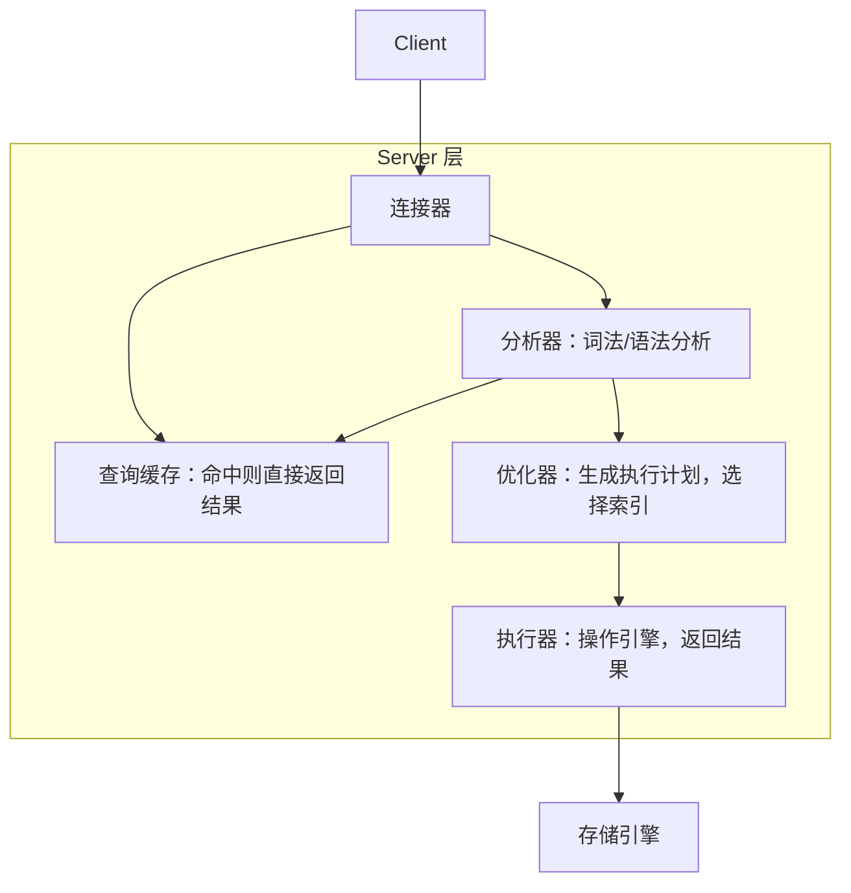
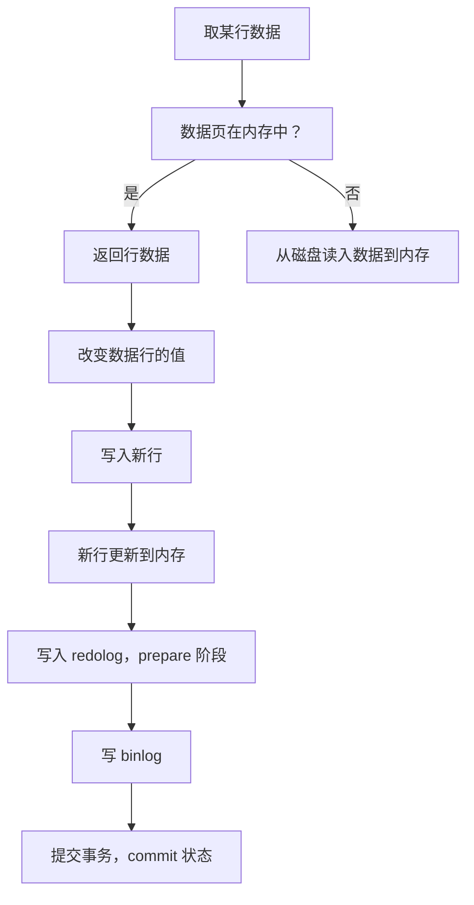

# 02 | 日志系统：一条SQL更新语句是如何执行的？

- [02 | 日志系统：一条SQL更新语句是如何执行的？](#02--日志系统一条sql更新语句是如何执行的)
  - [WAL (Write Ahead Logging)](#wal-write-ahead-logging)
  - [Redo log](#redo-log)
  - [Binlog](#binlog)
  - [InnoDB 执行过程](#innodb-执行过程)
  - [两阶段提交 Two-Phase Commit](#两阶段提交-two-phase-commit)
    - [为什么日志需要“两阶段提交”](#为什么日志需要两阶段提交)
  - [小结](#小结)



⚠️ 不建议使用查询缓存。每当相关数据有更新时，缓存都会失效。

## WAL (Write Ahead Logging)

先写日志，再写存储页（在磁盘中）。这里的日志就是指 redo log，而 InnoDB 会适时再将更新记录写到磁盘中。

## Redo log

- 当 redo log 写满时，InnoDB 也会将内容写到磁盘中。
- Redo log 确保当进程异常退出时，已经提交的数据不丢失。
- redo log 是 InnoDB 特有的日志。
- redo log 是物理日志，记录具体在某个数据页上做了什么修改
- redo log 是循环写的，空间固定，会用完。

redo log 包括两部分

- 内存中的日志缓冲 (redo log buffer)
- 磁盘上的日志文件 (redo log file)

mysql每执行一条 DML 语句，先将记录写入 redo log buffer，后续某个时间点再一次性将多个操作记录写到 redo log file 持久化。

## Binlog

- Binlog 是 Server 层的归档日志
- Binlog 是逻辑日志，记录 sql 语句原始逻辑
- Binlog 是追加写入，文件到达一定大小后会切换新的文件
- Binlog 不支持崩溃恢复

## InnoDB 执行过程

```sql
update T set c=c+1 where ID=2;
```

1. 执行器先找引擎取 ID=2 这一行。ID 是主键，引擎直接用树搜索找到这一行。如果 ID=2 这一行所在的数据页本来就在内存中，就直接返回给执行器；否则，需要先从磁盘读入内存，然后再返回。
2. 执行器拿到引擎给的行数据，把这个值加上 1，比如原来是 N，现在就是 N+1，得到新的一行数据，再调用引擎接口写入这行新数据。
3. 引擎将这行新数据更新到内存中，同时将这个更新操作记录到 redo log 里面，此时 redo log 处于 `prepare` 状态。然后告知执行器执行完成了，随时可以提交事务。
4. 执行器生成这个操作的 binlog，并把 binlog 写入磁盘。执行器调用引擎的提交事务接口，引擎把刚刚写入的 redo log 改成 `commit` 状态，更新完成。

这里 redo log 的 `prepare` 和 `commit` 的两个阶段，就是“两阶段提交”。



## 两阶段提交 Two-Phase Commit

两阶段提交是为了让两份日志之间的逻辑一致。问题：怎样让数据库恢复到半个月内任意一秒的状态？

binlog 会记录所有的逻辑操作，并且是采用“追加写”的形式。想要恢复半个月内的任意状态，那么备份系统中一定会保存最近半个月的所有 binlog，同时系统定期做整库备份。

- 这里的“定期”取决于系统的重要性，可以是一天一备，也可以是一周一备。

当需要恢复到指定的某一秒时，可以这么做：

- 首先，找到最近的一次全量备份，从这个备份恢复到临时库；
- 然后，从备份的时间点开始，将备份的 binlog 依次取出来，重放到指定时刻。
- 这样临时库就跟误删之前的线上库一样了。

### 为什么日志需要“两阶段提交”

redo log 和 binlog 是两个独立的逻辑，如果不用两阶段提交，要么就是先写完 redo log 再写
binlog，或者反过来。

假设语句执行后，写第一个日志成功，写第二个日志时 crash 了：

1. **先写 redo log 后写 binlog**：redo log 写完之后，系统即使崩溃，仍然能够把数据恢复回来。但是由于 binlog 没写完就 crash 了，这时候 binlog 里面就没有记录这个语句。
    - 因此，之后备份日志的时候，存起来的 binlog 里面就没有这条语句。
    - 如果需要用这个 binlog 来恢复临时库的话，由于这个语句的 binlog 丢失，这个临时库就会少了这一次更新。
2. **先写 binlog 后写 redo log**：如果在 binlog 写完之后 crash，由于 redo log 还没写，崩溃恢复以后这个事务无效。但是 binlog 里面已经记录了这个日志。
    - 所以，用 binlog 来恢复的时候就多了一个事务，与原库的值不同。

如果不使用“两阶段提交”，那么数据库的状态就有可能和用它的日志恢复出来的库的状态不一致。

在使用备库增加系统读能力的时候，常见的做法也是用全量备份加上应用 binlog 来实现的。

简单说，redo log 和 binlog 都可以用于表示事务的提交状态，而两阶段提交就是让这两个状态保持逻辑上的一致。

对于 binlog 已经写入，而 redo log 还没 commit 的事务，崩溃恢复过程会认为这个事务已经成功提交。

## 小结

- redo log 用于保证 crash-safe 能力。
- `innodb_flush_log_at_trx_commit` 这个参数设置成 1 的时候，表示每次事务的 redo log 都直接持久化到磁盘。
  - 这个参数建议设置成 1，这样可以保证 MySQL 异常重启之后数据不丢失。
- `sync_binlog` 这个参数设置成 1 的时候，表示每次事务的 binlog 都持久化到磁盘。
  - 这个参数也建议设置成 1，这样可以保证 MySQL 异常重启之后 binlog 不丢失。
- 两阶段提交是跨系统维持数据逻辑一致性时常用的一个方案，即使不做数据库内核开发，日常开发中也有可能会用到。
