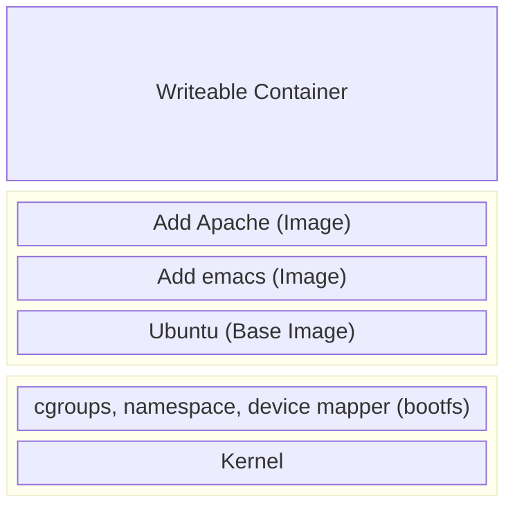

# Chapter 4 Working with Docker images and repositories

- [Chapter 4 Working with Docker images and repositories](#chapter-4-working-with-docker-images-and-repositories)
  - [What is a Docker image?](#what-is-a-docker-image)
  - [Listing Docker images](#listing-docker-images)
  - [Pulling images](#pulling-images)
  - [Searching for images](#searching-for-images)
  - [Building our own images](#building-our-own-images)
    - [Creating a Docker Hub acount](#creating-a-docker-hub-acount)
    - [Using Docker commit to create images](#using-docker-commit-to-create-images)
    - [Building images with a Dockerfile](#building-images-with-a-dockerfile)
      - [Our first Dockerfile](#our-first-dockerfile)
    - [Building the image from our Dockerfile](#building-the-image-from-our-dockerfile)
    - [What happens if an instruction fails?](#what-happens-if-an-instruction-fails)
    - [Dockerfiles and the build cache](#dockerfiles-and-the-build-cache)
    - [Using the build cache for templating](#using-the-build-cache-for-templating)
    - [Viewing our new image](#viewing-our-new-image)
    - [Launching a container from our new image](#launching-a-container-from-our-new-image)
    - [Dockerfile instructions](#dockerfile-instructions)
      - [CMD](#cmd)
      - [ENTRYPOINT](#entrypoint)
      - [WORKDIR](#workdir)
      - [ENV](#env)
      - [USER](#user)
      - [VOLUME](#volume)
      - [ADD](#add)
      - [COPY](#copy)
      - [LABEL](#label)
      - [STOPSIGNAL](#stopsignal)
      - [ARG](#arg)
      - [SHELL](#shell)
      - [HEALTHCHECK](#healthcheck)
      - [ONBUILD](#onbuild)
  - [Pushing images to the Docker Hub](#pushing-images-to-the-docker-hub)
    - [Automated Builds](#automated-builds)
  - [Deleting an image](#deleting-an-image)
  - [Running your own Docker registry](#running-your-own-docker-registry)
    - [Running a registry from a container](#running-a-registry-from-a-container)
    - [Testing the new registry](#testing-the-new-registry)
  - [Alternative Indexes](#alternative-indexes)
    - [Quay](#quay)
  - [Summary](#summary)

## What is a Docker image?

A Docker image is made up of **filesystems** layered over each other. At the
base is a **boot filesystems**, `bootfs`, which resembles the typical Linux/Unix
boot filesystem. When a container has booted, it is moved into memory, and the
boot filesystem is unmounted to free up the RAM used by the `initrd` disk image.

Docker next layers a root filesystem, `rootfs`, on top of the boot filesystem.

In a traditional Linux boot, the root filesystem is mounted read-only and then
switched to read-write after boot. In the Docker world, the root filesystem
stays in read-only mode, and Docker takes advantage of a `union mount` to add
more read-only filesystems onto the root filesystme.

- A union mount is a mount that allows several filesystems to be mounted at one
  time but appear to be one filesystem.
- The union mount overlays the filesystems on top of one another so that the
  resulting filesystem may contain files and subdirectories from any or all of
  the underlying filesystems.

Docker calls each of these filesystems images. Images can be layered on top of
one another.

- The image below is called the **parent image**
- The final image is called the **base image**

When a container is launched from an image, Docker mounts a read-write
filesystem on top of any layers below. This is where processes we want the
container to run will execute.



When Docker first starts a container, the initial read-write layer is empty.
Changes are applied to this layer. If you change a file, that file will be
copied from the read-only layer below into the read-write layer. The original
file will still exist but is hidden underneath the copy.

This pattern is called ***copy on write***.

## Listing Docker images

📝 Local images are in the `/var/lib/docker` diretory. Each image will be inside
a directory named for your storage driver; e.g. `aufs` or `devicemapper`. All
containers are in `/var/lib/docker/containers` directory.

The default registry is the public registry [Docker Hub](https://hub.docker.com/).

Inside a Docker registry, images are stored in repositories. A repository
contains images, layers, and metadata about those images.

📝 A `ubuntu` image is a cut-down version with the bare runtime required to run
the distribution.

```sh
docker pull ubuntu:16.04
docker run -it --name new_container ubuntu:16.04 /bin/bash
```

`16.04` is a Docker tag. Each tag marks together a series of image layers that
represent a specific image.

It's always a good idea to build a container from specific tags.

There are two types of repositories:

- user repositories: contain images contributed by Docker users
- top-level repositories: are controlled by the Docker company and selected
  vendors.

## Pulling images

By default, Docker will download the `latest` tag.

```sh
# pull images preemptively
docker pull fedora:21

# view a docker image
docker images fedora
```

## Searching for images

```sh
docker search puppet
```

## Building our own images

Two ways to create a Docker image:

- `docker commit`
- `docker build` with a Dockerfile (recommended)

📝 Normally, users build new images from existing base images.

- [Create a base image](https://docs.docker.com/build/building/base-images/)

### Creating a Docker Hub acount

```sh
docker login
docker logout
```

📝 The credentials are stored in the `$HOME/.docker/config.json` file.

### Using Docker commit to create images

```sh
docker run -it ubuntu /bin/bash
```

Inside the container:

```sh
apt-get -y update
apt-get -y install apache2

exit
```

```sh
docker ps -l -q
docker commit 9deb60f84b56 octobug/apache2
docker commit -m "A new custom image" -a "James Turnbull" \
  9deb60f84b56 octobug/apache2:webserver

docker inspect octobug/apache2:webserver

docker run -it octobug/apache2:webserver /bin/bash
```

### Building images with a Dockerfile

The Dockerfile uses a basic DSL (Domain Specific Language) with instructions for
building Docker images.

#### Our first Dockerfile

```sh
mkdir static_web
cd static_web
touch Dockerfile
```

The `static_web` directory holding is called a **build context**.

```dockerfile
# Version: 0.0.1
FROM ubuntu:18.04
LABEL maintainer="octobug"
RUN apt-get update; apt-get install -y nginx
RUN echo 'Hi, I am in your container' \
    > /var/www/html/index.html
EXPOSE 80
```

- The first instruction must be `FROM`, it specifies an existing image that the
  following instructions will operate on. This image is called the
  **base image**.
- The `RUN` instruction executes commands on the current image. Each `RUN` will
  create a new layer and, if successful, will commit that layer and then execute
  the next instruction.
  - By default, it executes inside a shell using the command wrapper
    `/bin/sh -c`
  - If you are running the instruction without a shell, you can specify the
    instruction in `exec` format: `RUN [ "apt-get", "install", "-y", "nginx" ]`
- The `EXPOSE` tells Docker that the application will use this port on the
  container.
  - That doesn't mean you can automatically access whatever service is running
    on that port. Docker doesn't open the port automatically, but waits for you
    to do it when you run the container using the `docker run --expose`.
  - You can specify multiple `EXPOSE` instructions to mark multiple ports.
  - Docker also uses `EXPOSE` to help link together containers.

Instructions in the `Dockerfile` are processed from the top down. ***Each
instruction adds a new layer to the image and then commits the image***. Docker
executing instructions roughly follow a workflow:

- Docker runs a container from the image.
- An instruction executes and makes a change to the container.
- Docker runs the equivalent of `docker commit` to commit a new layer.
- Docker then runs a new container from this new image.
- The next instruction in the file is executed, and the process repeats until
  all instructions have been executed.

### Building the image from our Dockerfile

```sh
cd static_web
docker build -t="octobug/static_web:v1" .
```

- `-t`: mark the resulting image with a repository and a name and a tag
  (if ignored will it will be tagged as `latest`).
- You can also specify a Git repo as a source for the `Dockerfile` rather
  than a `.`.
- `-f`: specify a build source with a file path, so that the file doesn't need
  to be called `Dockerfile`.

📝 `.dockerignore`. Globbing can be done using Go's filepath.

### What happens if an instruction fails?

Debug:

- Find the last succeeded image ID.
- `docker run -it 6b288d964152 /bin/bash`.
- Try the failed instruction in the container.

### Dockerfiles and the build cache

Docker will treat each previous layer as a cache.

To skip the cache: `docker build --no-cache -t="..." .`

### Using the build cache for templating

With this template, when the `REFRESHED_AT` is changed, Docker resets the cache
when it hits that `ENV` instruction and runs every subsequent instruction anew
without relying on the cache.

```Dockerfile
FROM ubuntu:18.04
LABEL maintainer="whalevocal@gmail.com"
ENV REFRESHED_AT 2016-07-01
RUN apt-get -qq update
```

A fedora version:

```Dockerfile
FROM fedora:21
LABEL maintainer="whalevocal@gmail.com"
ENV REFRESHED_AT 2016-07-01
RUN yum -q makecache
```

### Viewing our new image

To see how a image was created:

```sh
docker history 1105669f17ab
```

### Launching a container from our new image

```sh
docker run -d -p 80 --name static_web octobug/static_web nginx -g "daemon off;"
```

- `-p 80`: which port to publish at runtime. Docker has two methods of assigning
  ports on the Docker host:
  - Docker can randomly assign a high port from the range `32768~61000` on the
    Docker host that maps to port 80 on the container.
  - You can specify a specific port on the Docker host that maps to port 80 on
    the container.
- `nginx -g "daemon off;"` will launch Nginx in the foreground.

```sh
docker ps -l
docker port static_web
docker port static_web 80
docker inspect
```

```sh
docker run -d -p 81:80 --name static_web_80 octobug/static_web nginx -g "daemon off;"
```

- `host_port:container_port`

```sh
# bind on the 127.0.0.1 interface
docker run -d -p 127.0.0.1:80:80 --name static_web_lb octobug/static_web nginx -g "daemon off;"

# bind to a random port on the host
docker run -d -p 127.0.0.1::80 --name static_web_random octobug/static_web nginx -g "daemon off;"
```

💡 You can bind UDP ports by adding the suffix `/udp` to the port binding.

Docker also has a `-P` to publish all ports exposed via `EXPOSE` instructions in
the Dockerfile.

```sh
docker run -d -P --name static_web_all octobug/static_web nginx -g "daemon off;"
```

### Dockerfile instructions

- `ADD`
- `ARG`
- `CMD`
- `COPY`
- `ENTRYPOINT`
- `ENV`
- `HEALTHCHECK`
- `LABEL`
- `ONBUILD`
- `SHELL`
- `STOPSIGNAL`
- `USER`
- `VOLUME`
- `WORKDIR`
- ...

#### CMD

It specifies the command to run when a container is launched. It is similar to
the `RUN` instruction, but rather than running the command when the container is
being built. It is much like specifying a command to run when launching a
container with the `docker run` command.

```sh
docker run -it octobug/static_web /bin/true
```

This would be articulated in the `Dockerfile` as:

```dockerfile
CMD ["/bin/true"]
```

```dockerfile
CMD ["/bin/bash", "-l", ...]
```

⚠️ The command is contained in an array. This tells Docker to run the command
as-is. You can also specify the `CMD` instruction without an array, in which
case Docker will prepend `/bin/sh -c` to the command. This may result in
unexpected behavior when the command is executed. It is recommended that you
always use the array syntax.

If we specify a `CMD` in the `Dockerfile` and one on the `docker run` command
line, then the command line will override the `Dockerfile`'s `CMD` instruction.

```dockerfile
# Version: 0.0.1
FROM ubuntu:18.04
LABEL maintainer="octobug"
RUN apt-get update; apt-get install -y nginx
RUN echo 'Hi, I am in your container' \
    > /var/www/html/index.html
EXPOSE 80
CMD ["/bin/bash"]
```

```sh
docker build -t="octobug/test" .
docker run -it octobug/test
```

If we specify a command at the end of the `docker run`, docker will override
the `CMD` in the Dockerfile.

```sh
docker run -it octobug/test /bin/ps
```

💡 If you specify more than one `CMD` in a Dockerfile, only the last one will be
used.

- If you need to run multiple processes or commands as part of starting a
  container you should use a service management tool like `Supervisor`.

#### ENTRYPOINT

The `ENTRYPOINT` instruction provides a command that isn't as easily overridden.
Any arguments we specify on the `docker run` command line will be passed as
arguments to the command specified in the `ENTRYPOINT`.

```dockerfile
ENTRYPOINT ["/usr/sbin/nginx"]
ENTRYPOINT ["/usr/sbin/nginx", "-g", "daemon off;"]
```

```sh
docker build -t="octobug/static_web" .
docker run -it octobug/static_web -g "daemon off;"
```

This `-g "daemon off;"` argument will be passed to the command specified in the
`ENTRYPOINT` instruction, which will become `/usr/sbin/nginx -g "daemon off;"`.

We can combine `ENTRYPOINT` and `CMD` to do some neat things:

```dockerfile
ENTRYPOINT ["/usr/sbin/nginx"]
CMD ["-h"]
```

In this case, if we don't specify anything to pass to the container, then the
`-h` is passed by the `CMD`, it becomes `/usr/sbin/nginx -h`. This allows us to
build in a default command to execute when the container is run combined with
overridable options and flags on the `docker run` command line.

💡 The `ENTRYPOINT` could be overridden with `--entrypoint` flag when using
`docker run`.

#### WORKDIR

It provides a way to set the working directory for the container and the
`ENTRYPOINT` and `CMD` to be executed when a container is launched from the
image.

We can use it to set the working directory for a series of instructions or for
the final container.

```dockerfile
WORKDIR /opt/webapp/db
RUN bundle install
WORKDIR /opt/webapp
ENTRYPOINT [ "rackup" ]
```

You can override the working directory at runtime with the `-w` flag.

```sh
docker run -it -w /var/log ubuntu pwd
```

#### ENV

```sh
ENV RVM_PATH /home/rvm/
```

The new environment variable will be used for any subsequent `RUN` instructions,
as if we had specified an environment variable prefix to a command:

```dockerfile
RUN gem install unicorn
```

would be executed as

```sh
RVM_PATH=/home/rvm/ gem install unicorn
```

Multiple variables are also supported:

```dockerfile
ENV RVM_PATH=/home/rvm RVM_ARCHFLAGS="-arch i386"
```

They can be used in other instructions:

```dockerfile
ENV TARGET_DIR /opt/app
WORKDIR $TARGET_DIR
```

📝 You can also escape environment variables by prefixing them with a backslash.

These environment variables will also be persisted into any containers created
from the image.

```sh
# inside a container
env
...
RVM_PATH=/home/rvm/
...
```

You can also pass them on the `docker run` using `-e` flag. These variables will
only apply at runtime.

```sh
docker run -it -e "WEB_PORT=8080" ubuntu env
```

#### USER

```dockerfile
USER nginx
```

It can specify a username or a UID and group or GID or even a combination
thereof:

```dockerfile
USER user
USER user:group
USER uid
USER uid:gid
USER user:gid
USER uid:group
```

It can be overriden at runtime by `-u` flag with `docker run`.

💡 The default user is `root`.

#### VOLUME

A volume is a specially designated directory within one or more containers that
bypasses the Union File System to provide several useful features for persistent
or shared data:

- Volumes can be shared and reused between containers.
- A container doesn't have to be running to share its volumes.
- Changes to a volume are made directly.
- Changes to a volume will not be included when you update an image.
- Volumes persist even if no containers use them.

This allows us to add data, a database, or other content into an image without
committing it to the image and allows us to share that data between containers.
This can be used to do testing with containers and an application's code,
manage logs, or handle databases inside a container.

```dockerfile
VOLUME ["/opt/project", "/data"]
```

This would attempt to create a mount point `/opt/project` to any container
created from the image.

💡 The `docker cp` command allows you to copy files to and from your containers.

#### ADD

It can add files and directories from the build environment into the image.

```dockerfile
ADD software.lic /opt/application/software.lic
```

The source of the file can be a URL, filename, or directory as long as it is
inside the build context or environment. You ***cannot*** `ADD` files from
outside the build directory or context.

If the **destination** ends in a `/`, then it considers the source a directory.
If it doesn't, it considers the source a file.

```dockerfile
ADD http://wordpress.org/latest.zip /root/wordpress.zip
```

The `ADD` instruction has some special magic for taking care of local `tar`
archives (`gzip`, `bzip2`, `xz`). If a source file is a `tar`, Docker will
automatically unpack it.

```dockerfile
ADD latest.tar.gz /var/www/wordpress/
```

The archive is unpacked with the same behavior as running `tar` with the `-x`
option: the ouput is the union of whatever exists in the destination plus the
contents of the archive.

If the destination doesn't exist, Docker will create the full path. New files
and directories will be created with a mode of 0755 and a UID and GID of 0.

📝 If the file or directories added by an `ADD` change then this will invalidate
the cache for all follwing instructions in the `Dockerfile`.

#### COPY

The key difference between `ADD` and `COPY` is that the `COPY` is purely focused
on copying local files from the build context and does not have any extraction
or decompression capabilities.

```dockerfile
COPY conf.d/ /etc/apache2/
```

This will copy files from `conf.d` directory to the `/etc/apache2/` directory.

The source of the files must be the path to a file or directory relative to the
build context. You **cannot** copy anthing that is outside of the build context
directory. Because the build context is uploaded to the Docker daemon, and the
copy takes place there. The destination should be an absolute path inside the
container.

Any files and directories created by the copy will have a UID and GID of 0.

If the source is a directory, the entire directory is copied. Everything is
copied including their filesystem metadata.

#### LABEL

It adds metadata to a Docker image. It is in the form of key/value pairs.

```dockerfile
LABEL version="1.0"
LABEL location="New York" type="Data Center" role="Web Server"
```

It is recommended combining all the metadata in a single `LABEL` instruction to
save creating multiple layers with each piece of metadata.

#### STOPSIGNAL

It sets the system call signal that will be sent to the container when you tell
it to stop. This signal can be a valid number or a signal name.

#### ARG

It defines variables that can be passed at build-time via the `docker build`
command. This is done using the `--build-arg` flag. You can only specify
build-time arguments that have been defined in the `Dockerfile`.

```dockerfile
ARG build
ARG webapp_user=user
```

If no value is specified for the argument at build-time using `--build-arg`,
then the default is used.

```sh
docker build --build-arg build=1234 -t octobug/webapp .
```

⚠️ This isn't safe for passing credentials. They will be exposed during the
build process and in the build history of the image.

Docker has a set of predefined `ARG` variables that you can use:

- `HTTP_PROXY`
- `http_proxy`
- `HTTPS_PROXY`
- `https_proxy`
- `FTP_PROXY`
- `ftp_proxy`
- `NO_PROXY`
- `no_proxy`

#### SHELL

It overrides the default shell. The defailt shells are

- Linux: `["/bin/sh", "-c"]`
- Windows: `["cmd", "/S", "/C"]`

The `SHELL` instruction can be used multiple times. Each new `SHELL` instruction
overrides all previous `SHELL` instructions.

#### HEALTHCHECK

It tells Docker how to test a container to check that it is still working
correctly. This allows you to check things like a web site being served or an
API endpoint responding with the correct data.

When a container has a health check specified, it has a health status in
addition to its normal status.

```Dockerfile
HEALTHCHECK --interval=10s --timeout=1m --retries=5 CMD curl http://localhost || exit 1
```

The command after the `"CMD"` keyword can be either a shell command or an exec
array. The command should exit with `0` to indicate health or `1` an unhealthy
state.

We can see the state of the health check using the `docker inspect` command.

```sh
docker inspect --format '{{.State.Health.Status}}' static_web
docker inspect --format '{{range .State.Health.Log}} {{.ExitCode}} {{.Output}} {{end}}' static_web
```

You can also disable any health checks specified in any base images:

```dockerfile
HEALTHCHECK NONE
```

#### ONBUILD

It adds triggers to images. A trigger is executed when the image is used as the
basis of another image. e.g.

- if you have an image that needs source code added from a specific location
  that might not yet be available.
- if you need to execute a build script that is specific to some environments
- ...

The trigger inserts a new instruction in the build process, as if it were
specified right after the `FROM` instruction. It can be any build instruction.

```dockerfile
ONBUILD ADD . /app/src
ONBUILD RUN cd /app/src; make
```

This would add an `ONBUILD` trigger to the image being created. With it, we can
always add the local source and specify some configuration or build information
for **each application**.

The `ONBUILD` triggers are executed in the order specified in the parent image
and are only inherited once, it cannot be inherited by grandchildren.

📝 There are several instructions which can't be used on `ONBUILD`:

- `FROM`
- `MAINTAINER`
- `ONBUILD`

## Pushing images to the Docker Hub

```sh
docker push octobug/static_web
```

Images without a user prefix are pushed to the root repository. Root
repositories are managed only by the Docker.

### Automated Builds

We can realize Automated Builds by connecting a GitHub or BitBucket repository
containing a `Dockerfile` to the Docker Hub. When we push to the repository,
an image build will be triggered.

📝 You can't push to an Automated Build using `docker push`.

## Deleting an image

```sh
docker rmi octobug/static_web
```

## Running your own Docker registry

> <https://docs.docker.com/registry/>

### Running a registry from a container

```sh
docker run -d -p 5000:5000 --name registry registry:2
```

### Testing the new registry

```sh
docker tag 1105669f17ab localhost:5001/octobug/static_web
docker push localhost:5001/octobug/static_web

docker run -it localhost:5001/octobug/static_web /bin/bash
```

## Alternative Indexes

### Quay

> <https://quay.io/>

## Summary
