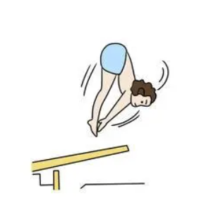

# 7. 英文时态 (一): 一般时态

- [7. 英文时态 (一): 一般时态](#7-英文时态-一-一般时态)
  - [7.1 英文时态体系概述](#71-英文时态体系概述)
    - [7.1.1 英语时态的构成: 四时四态](#711-英语时态的构成-四时四态)
      - [一、tense (时)](#一tense-时)
      - [二、aspect (态)](#二aspect-态)
      - [三、英语谓语的“万能公式”](#三英语谓语的万能公式)
      - [四、一般时态的构成](#四一般时态的构成)
      - [五、进行时态的构成](#五进行时态的构成)
      - [六、完成时态的构成](#六完成时态的构成)
      - [七、完成进行时态的构成](#七完成进行时态的构成)
    - [7.1.2 时态学习技巧](#712-时态学习技巧)
      - [一、时态的形式、意义和用法](#一时态的形式意义和用法)
      - [二、深入理解每一种体态动作的核心意义](#二深入理解每一种体态动作的核心意义)
      - [三、以“体态 (aspect)”为学习时态的基础](#三以体态-aspect为学习时态的基础)
      - [四、动词与时态表达有关](#四动词与时态表达有关)
    - [7.1 英文时态体系概述 - 思维总结](#71-英文时态体系概述---思维总结)
  - [7.2 一般现在时态——并非表示现在](#72-一般现在时态并非表示现在)
    - [7.2.1 用法一: 表示普遍的事实或真理 (expressing a general truth)](#721-用法一-表示普遍的事实或真理-expressing-a-general-truth)
    - [7.2.2 用法二: 表示重复活动 (expressing a regularly occurring event)](#722-用法二-表示重复活动-expressing-a-regularly-occurring-event)
      - [一、表示习惯的动作](#一表示习惯的动作)
      - [二、表示习惯的状态](#二表示习惯的状态)
    - [7.2.3 用法比较: 表示重复活动的一般现在时态和现在完成进行时态](#723-用法比较-表示重复活动的一般现在时态和现在完成进行时态)
    - [7.2.4 用法三: 一般现在时表示正在发生的动作](#724-用法三-一般现在时表示正在发生的动作)
      - [一、一般现在时态用在以 there 或 here 开头的句子中，表示目前的短暂动作](#一一般现在时态用在以-there-或-here-开头的句子中表示目前的短暂动作)
      - [二、表示现在瞬间的动作 (instant actions)](#二表示现在瞬间的动作-instant-actions)
    - [7.2.5 用法四: 一般现在时表示将来发生的动作](#725-用法四-一般现在时表示将来发生的动作)
      - [一、用在条件状语从句和时间状语从句中](#一用在条件状语从句和时间状语从句中)
      - [二、在谈到未来的计划和时间安排表的时候，表示将来的动作](#二在谈到未来的计划和时间安排表的时候表示将来的动作)
      - [三、在从句中表示将来的动作，此时主句往往用了一个将来时](#三在从句中表示将来的动作此时主句往往用了一个将来时)
    - [7.2.6 用法五: 一般现在时表示过去发生的动作](#726-用法五-一般现在时表示过去发生的动作)
      - [一、表示死者的理论、著作等](#一表示死者的理论著作等)
      - [二、引用书刊、报纸、通知或新近收到的信件内容时](#二引用书刊报纸通知或新近收到的信件内容时)
    - [7.2.7 用法六: 一般现在时代指现在完成时](#727-用法六-一般现在时代指现在完成时)
    - [思维训练 7.2](#思维训练-72)
  - [7.3 被遗忘了的一般过去时态](#73-被遗忘了的一般过去时态)
    - [7.3.1 引言](#731-引言)
    - [7.3.2 基本用法一: 过去发生的短暂动作或状态](#732-基本用法一-过去发生的短暂动作或状态)
    - [7.3.3 基本用法二: 过去发生的重复或延续动作](#733-基本用法二-过去发生的重复或延续动作)
    - [7.3.4 用法比较: 一般过去时和现在完成时用于“for + 时间段”的区别](#734-用法比较-一般过去时和现在完成时用于for--时间段的区别)
    - [7.3.5 口语用法一: “我不知道”——“I don't know” or “I didn't know”?](#735-口语用法一-我不知道i-dont-know-or-i-didnt-know)
    - [7.3.6 口语用法二: “我忘记了”——“I forget” or “I forgot”?](#736-口语用法二-我忘记了i-forget-or-i-forgot)
    - [7.3.7 口语用法三: “我以为”——“I think” or “I thought”?](#737-口语用法三-我以为i-think-or-i-thought)
    - [7.3.8 口语用法四: 根据上下文的语境灵活地使用一般过去时](#738-口语用法四-根据上下文的语境灵活地使用一般过去时)
    - [7.3.9 口语用法五: 礼貌表达](#739-口语用法五-礼貌表达)
    - [思维训练 7.3](#思维训练-73)
  - [7.4 一般将来时态——预测、计划和意愿](#74-一般将来时态预测计划和意愿)
    - [7.4.1 引言](#741-引言)
      - [一、从时态形态 (tense form) 的构成来看](#一从时态形态-tense-form-的构成来看)
      - [二、从表达“将来时态”的各种手段来看](#二从表达将来时态的各种手段来看)
      - [三、从是否成为事实的角度 (factual or on-factual) 来看](#三从是否成为事实的角度-factual-or-on-factual-来看)
    - [7.4.2 will 表示将来——预测](#742-will-表示将来预测)
    - [7.4.3 be going to 表示将来——预测](#743-be-going-to-表示将来预测)
      - [一、表示“预测”，be going to 比 will 有更多的证据支持，而且事件发生的时间更近](#一表示预测be-going-to-比-will-有更多的证据支持而且事件发生的时间更近)
      - [二、表示“预测”时，will 的语气比 be going to 显得正式](#二表示预测时will-的语气比-be-going-to-显得正式)
    - [7.4.4 be going to 表示“计划”与 will 表示“意愿”](#744-be-going-to-表示计划与-will-表示意愿)

英语谓语的核心是**助动词**和**实义动词**。

## 7.1 英文时态体系概述

- 他昨天走路。
  - He left yesterday.
- 他今天走。
  - He leaves today.
- 他明天走。
  - He will leave tomorrow.

### 7.1.1 英语时态的构成: 四时四态

时态 (tense and aspect) 在英语中反映的是两个不同的概念，即 **tense** (时) 和 **aspect**
(态或体)。与时间相联系的"时"，以及与工作的内在结构相关的"态"或"体"，
这两方面组合在一起构成"时态"。

#### 一、tense (时)

用来规定事物发生的时间。主要有四种不同的时间标识:

1. 现在时 (present)
2. 过去时 (past)
3. 将来时 (future)
4. 过去将来时 (past future)

#### 二、aspect (态)

用来规定动作完成的程度，反映说话者对事物的态度。这种动作方面的规定有四种：

1. 简单体 (simple, 或者称为"零"体态)
2. 进行体 (continuous)
3. 完成体 (perfect)
4. 完成进行体 (perfect continuous)

英语的"态 (aspect)" 是有关动作内在结构特点方面的属性。

- 当我们谈到"时 (tense)"的时候，我们关心的是这个动作发生的时间，
  即是在现在、过去还是将来发生的。
- 当我们谈到"态 (aspect)"的时候，我们关心的则是这个动作是固定不变的还是动态变化的
  (fixed or changing)，这个动作是完成了的还是在延续的 (complete or ongoing)，
  这个动作持续的时间是很短还是很长 (lasting for only a moment or for a long time) 等。

实际造句中所使用的时态正是有上述四种时间规定和四种动作规定组合在一起而构成。

**一般 (Simple)** 体

| 时间标示\动作标示      | 一般 (Simple)                       |
| ---------------------- | ----------------------------------- |
| 现在 (Present)         | 现在一般时 (Present simple)         |
| 过去 (Past)            | 过去一般时 (Past simple)            |
| 将来 (Future)          | 将来一般时 (Future simple)          |
| 过去将来 (Past future) | 过去将来一般时 (Past future simple) |

**进行 (Continuous)** 体

| 时间标示\动作标示      | 进行 (Continuous)                      |
| ---------------------- | -------------------------------------- |
| 现在 (Present)         | 现在进行时 (Present continuous)        |
| 过去 (Past)            | 过去进行时 (Past continuous)           |
| 将来 (Future)          | 将来进行时 (Future continuous)         |
| 过去将来 (Past future) | 过去将来进行时 (Past future coninuous) |

**完成 (Perfect)** 体

| 时间标示\动作标示      | 完成 (Perfect)                       |
| ---------------------- | ------------------------------------ |
| 现在 (Present)         | 现在完成时 (Present perfect)         |
| 过去 (Past)            | 过去完成时 (Past perfect)            |
| 将来 (Future)          | 将来完成时 (Future perfect)          |
| 过去将来 (Past future) | 过去将来完成时 (Past future perfect) |

**完成进行 (Perfect continuous)** 体

| 时间标示\动作标示      | 完成进行 (Perfect continuous)                       |
| ---------------------- | --------------------------------------------------- |
| 现在 (Present)         | 现在完成进行时 (Present perfect continuous)         |
| 过去 (Past)            | 过去完成进行时 (Past perfect continuous)            |
| 将来 (Future)          | 将来完成进行时 (Future perfect continuous)          |
| 过去将来 (Past future) | 过去将来完成进行时 (Past future perfect continuous) |

以 work 为例，这些时态的构成形式如下：

**一般 (Simple)** 体

| 时间标示\动作标示      | 一般 (Simple) |
| ---------------------- | ------------- |
| 现在 (Present)         | work/works    |
| 过去 (Past)            | worked        |
| 将来 (Future)          | will work     |
| 过去将来 (Past future) | would work    |

**进行 (Continuous)** 体

| 时间标示\动作标示      | 进行 (Continuous) |
| ---------------------- | ----------------- |
| 现在 (Present)         | am/is/are working |
| 过去 (Past)            | was/were working  |
| 将来 (Future)          | will be working   |
| 过去将来 (Past future) | would be working  |

**完成 (Perfect)** 体

| 时间标示\动作标示      | 完成 (Perfect)    |
| ---------------------- | ----------------- |
| 现在 (Present)         | has/have workded  |
| 过去 (Past)            | had worked        |
| 将来 (Future)          | will have worked  |
| 过去将来 (Past future) | would have worked |

**完成进行 (Perfect continuous)** 体

| 时间标示\动作标示      | 完成进行 (Perfect continuous) |
| ---------------------- | ----------------------------- |
| 现在 (Present)         | has/have been working         |
| 过去 (Past)            | had been working              |
| 将来 (Future)          | will have been working        |
| 过去将来 (Past future) | would have been working       |

#### 三、英语谓语的“万能公式”

| Tense           | (Modal) | (Perfect)  | (Continuous) | Verb |
| --------------- | ------- | ---------- | ------------ | ---- |
| PAST or PRESENT | (WILL)  | (HAVE+-ED) | (BE+-ING)    | VERB |

英语中所有的谓语形式都可以从上面这个谓语公式推导出来。

1. tense 表示"时"，主要有两种最基本的"时"：现在 (present) 和过去 (past)。
2. modal 表示英语谓语中的"情态"，以 "will" 作为代表。括号表示它不是必须项。
3. perfect 表示"完成体"，以 "have+-ed" 表示。括号表示它不是必须项。
4. continuous 表示"进行体"，以 "be+-ing" 表示。括号表示它不是必须项。
5. verb 表示英语的谓语动词。

#### 四、一般时态的构成

"一般时态"只有"时"的变化，而没有"态"的变化。因此把"一般时态"称为"零"体动作。

| Tense           | (Modal) | Verb |
| --------------- | ------- | ---- |
| PAST or PRESENT | (WILL)  | VERB |

#### 五、进行时态的构成

进行时态有"进行体"：

| Tense           | (Modal) | Continuous | Verb |
| --------------- | ------- | ---------- | ---- |
| PAST or PRESENT | (WILL)  | BE+-ING    | VERB |

#### 六、完成时态的构成

完成时态有"完成体"：

| Tense           | (Modal) | Perfect  | Verb |
| --------------- | ------- | -------- | ---- |
| PAST or PRESENT | (WILL)  | HAVE+-ED | VERB |

#### 七、完成进行时态的构成

完成进行时态同时包含"完成体"和"进行体"：

| Tense           | (Modal) | Perfect  | Continuous | Verb |
| --------------- | ------- | -------- | ---------- | ---- |
| PAST or PRESENT | (WILL)  | HAVE+-ED | BE+-ING    | VERB |

### 7.1.2 时态学习技巧

#### 一、时态的形式、意义和用法

*I have been coming to Beijing for 14 years.*

这里的 "have been coming" 不难看出是"现在完成进行时"的构成形态，
但它表达什么意义则比较难把握，需要结合语境等信息才能准确理解其意义。

译文: 14 年来我多次来北京。

#### 二、深入理解每一种体态动作的核心意义

每一种时态的核心意义，就是它最基本、最稳定的中心意义。比如简单体的核心意义是，
被概念化的整体事件，这些事件是无法继续发展的。简言之，
**一般时态**具有**完整**和**不变**的核心意义。这种体态与进行体相对，
**进行体**表示**不完整**的或**未完成**的，其相关的事件或状态被看做是一个整体的某个部分，
往往还有继续发展或变化的余地。

一般时态就像是一幅静态的画，而进行时态像一幅"沙画"，处于动态变化中。

1. John lives in Beijing.
   - 使用一般现在时，把"约翰住在北京"作为一个整体事件来描述，没有任何发展和变化的可能。
2. John is living in Beijing.
   - 用现在进行时表示"约翰住在北京"可能是暂时的，存在发生变化的可能。

#### 三、以“体态 (aspect)”为学习时态的基础

1. 学习时态重在深刻理解"体 (aspect)"的内涵。同一"体"的动作有着本质上相通的特点，
   区别只是说话人的"时间视角"不同。
2. 在以表示动作规定方面的"体"为逻辑主线的前提下，
   分析比较不同时间规定下的同一"体"的动作以及其他各种时态之间的区别。

#### 四、动词与时态表达有关

对于上述"体 (aspect)" (广义的"体") 方面的属性，英语通过两方面来表达，也就是英语中的两类体:

1. 语法体 (gramamtical aspect)，如进行体、完成体等；(狭义的"体")
2. 动词体 (lexical aspect)，用来标示动词词义本身所固有的特点。
   1. 状态 (state)
   2. 动作 (action)
      1. 短暂动作 (punctual)
      2. 延续动作 (durative)

### 7.1 英文时态体系概述 - 思维总结

1. 英语的"时态"是由"时"和"态"两个不同的概念组成的。共有四个时间的和四个体态，因此英语共有 16
   种时态。
2. 复杂的英文时态来自如下谓语公式:

    | Tense           | (Modal) | (Perfect)  | (Continuous) | Verb |
    | --------------- | ------- | ---------- | ------------ | ---- |
    | PAST or PRESENT | (WILL)  | (HAVE+-ED) | (BE+-ING)    | VERB |

3. 除了要正确地掌握时态的构成外，重点是理解每一种时态的核心含义。
4. 学习时态，必须与谓语动词的特点结合起来，比如动作与状态的区分、延续动作与短暂动作的区分，
   这些就是所谓的"动词体 (lexical aspect)"。

## 7.2 一般现在时态——并非表示现在

一般现在时态并非只是表示"现在"。确切地说，**一般现在时**本质的思维特征是:
表示从过去到现在直至将来的一段时间内发生的**动作** (action) 或存在的**状态** (state)。
也就是说，这些动作或状态的发生不限于某个特定的时间，它们可发生于任何时间，包括现在、过去和将来。
这一段时间可以近乎无限长 (如表示客观真理)，也可以是人们生活的一段时间 (如人们的习惯活动)。
因此，一般现在时态通常被描述为有两种基本用法:

1. 表示客观真理: The sun *rises* in the east and *sets* in the west.
2. 表示习惯活动: I often *spend* two hours reading English in the morning.

具体来说，我们可用已办现在时来表示:

1. 不受时间限制的科学事实、客观真理、谚语格言，以及用于概括、结论、观点等；
2. 表示人们日常生活习惯及重复活动。

### 7.2.1 用法一: 表示普遍的事实或真理 (expressing a general truth)

表示不受时间限制的**科学事实**、**客观真理**、**言语格言**，以及用于**概括**、**结论**、
**观点**等。此时，这些动作或状态的发生不限于某个特定的时间，即它们可发生于任何时间，
包括**现在**、**过去**和**将来**。

```diagram
 <----------------|---------------->
------------------|--------------------
                                时间坐标
```

- Water freezes at 32 Fahrenheit and boils at 212 Fahrenheit.
- The world is round.
- The earth moves around the sun.
- Opportunities always favor the prepared minds.

### 7.2.2 用法二: 表示重复活动 (expressing a regularly occurring event)

表示经常发生的、习惯性的动作 (action) 或者是存在的状态 (state)。

```diagram
        · · · · · | · · · · ·
------------------|--------------------
                                时间坐标
```

#### 一、表示习惯的动作

- He often goes to the gym.
- I go to the gym twice a week.
- He walks to school every day.

#### 二、表示习惯的状态

*I like rice for dinner.*

这一用法常和一些表示动作频率的时间副词连用。

1. 表示肯定的频度副词
   - always
   - frequently
   - generally
   - occasionally
   - often
   - sometimes
   - usually
2. 表示否定的频度副词
   - never
   - rarely
   - seldom
3. 表示频度的副词短语
   - once a week
   - twice a year
   - once in every 6 months
   - on alternatr days

应用上述这些副词的注意点:

1. 它在句子中的位置通常是: 在 be 动词后、实义动词前
   - He is **always** late.
   - He **always** goes to schools by bike.
2. 上述否定副词不能再与否定助动词 (如 don't) 连用
   - ❌ He doesn't seldom come late.
   - ✅ He **seldom** comes late.
3. 这些副词一般放在否定助动词前，**always** 除外
   - The history lectures **sometimes** aren't interesting.
   - His wife complains that he **sometimes** doesn't listen to her.
   - He doesn't **always** leave before 6 o'clock. **Sometimes** he works until
     7 o'clock.

### 7.2.3 用法比较: 表示重复活动的一般现在时态和现在完成进行时态

1. I swim 1,000 meters every afternoon.
   - 我每天下午游 1,000 米。
   - 表示过去、现在、将来都是 swim 1,000 meters。但无法表达何时开始、何时结束。
2. I have been swimming 1,000 meters every afternoon.
   - 到目前为止，我每天下午游 1,000 米。
   - 表示从过去到目前为止

加上具体的时间状语可以用来表示一项活动在具体多长时间段内重复，这种用法可以用于现在完成进行时，
因为**完成进行时**可以表达明确的时间段概念，这个概念表示"从过去一直到目前为止"。

但这种用法不能用于一般现在时，因为**一般现在时无法表达一个明确的时间段**。

- 现在完成进行时
  - ✅ I have been swimming 1,000 meters every afternoon, but I think I'll make
    it a little longer later.
  - ✅ I have been winter swimming since 1984.
- 一般现在时 (没有这个用法)
  - ❌ I swim 1,000 meters every afternoon, but I think I'll make it a little
    longer later.
  - ❌ I winter swim since 1984.

综上，**一般现在时**是在泛泛地谈时间，并没有时间段的概念；
而**完成进行时**表示说话人的脑子里有一个"到目前为止"的时间段的概念。

### 7.2.4 用法三: 一般现在时表示正在发生的动作

#### 一、一般现在时态用在以 there 或 here 开头的句子中，表示目前的短暂动作

- Here comes your wife.
  - 你妻子来了。
  - 说话人看到 your wife 正在走来，这句话表示正在发生的动作。
  - ❌ Here is coming your wife.
  - ✅ Your wife is coming.
    - 你妻子很快就要过来了。
- There goes our bus; we'll have to wait for the next one.
  - 我们的车开走了，我们只好等下一辆了。

#### 二、表示现在瞬间的动作 (instant actions)

这个瞬间动作是说话人在说话的同时即刻发生的。这只适用于表达动作的动词，表示对一些动作的解说，
比如: 球赛解说、剧情介绍、解释自己正在做的事情、给别人一边说一边做的示范动作等。

- Michael passess to Clint. Clint to Jack, Jack back to Clint -- and Clint
  shoots -- and it's a goal!
  - 球赛解说，表示在说话时刻正在发生的动作。
- The woman is a spy, now she enters the room, opens the drawer, takes out a
  pistol and slips it into her pocket.
  - 剧情说明。
- I select an anlbum, remove the record from its cover and put it on the turn
  table.
  - 解释自己正在做的动作。

### 7.2.5 用法四: 一般现在时表示将来发生的动作

在某些特定的场合，一般现在时态有时可表示将来发生的动作。

#### 一、用在条件状语从句和时间状语从句中

主要用在**条件状语**从句 (if 和 unless) 和**时间状语**从句 (when, as soon as, before
和 after 等) 中，表示将来的动作。

- Please let me know when he comes back.
- What are you going to do when you leave school?
- I'll be glad if shee comes over to visit me.
- I'll give the book to him as soon as I see him.
- I will get everything ready before you come back.

上述从句中的动作 come 和 see 均是将在未来发生的，但要用一般现在时态表示将来。
若从句中的动作含有"意愿"的意思，则从句中可用 will。

- If you will give me a hand with these books, I'll appreciate it.
- If they will not accept a check, we shall have to pay in cash, though it
  would be much trouble for both sides.

#### 二、在谈到未来的计划和时间安排表的时候，表示将来的动作

此时句中的动词往往是表示短暂动作的动词，如 go, come, leave, start 和 move 等。

- The train starts at 2 o'clock.
- We move next week.
- They leave for Shanghai by train tomorrow evening.

#### 三、在从句中表示将来的动作，此时主句往往用了一个将来时

- I will reward the person who finds my lost kitten.
- I will give the booklet to whoever asks for it.

### 7.2.6 用法五: 一般现在时表示过去发生的动作

在某些特定的场合，一般现在时还可表示过去发生的动作。

#### 一、表示死者的理论、著作等

因为这些理论、著作到现在仍然有效；或表示一些名人名言。

- In The Sociology of Science, now considered a classic, Robert Merton
  **discusses** cultural, economic, and social forces that contributed to the
  development of modern science.
- R.Descartes **says** that the reading of all good books is like a conversation
  with the finest men of past centuries.

#### 二、引用书刊、报纸、通知或新近收到的信件内容时

- The newspaper **reads**, "The criminal who killed eight women has been
  executed."
  - 这里 reads 其实是表示过去，因为显然是说话人看过 newspaper 之后才说了这句话。
- The sign on the washing machines says, "Out of Order."

### 7.2.7 用法六: 一般现在时代指现在完成时

在**口语**中，可以用一般现在时代指现在完成时。能这样使用的动词主要有:

- find
- hear
  - I hear (=have heard) that he has left Beijing.
- inform
  - I am (=have been) informed that you have been there.
- learn
- read
  - I read (=have read) in the newspaper that the criminal who killed eight
    women has been executed.
- see
  - I see (=have seen) that you have your hair cut.
- tell

### 思维训练 7.2

**用动词的适当形式填空。**

*7. Okay, so you ____ (stick) to your New Year's resolution and ____ (go) to the
gym on a regular basis. But wait! Are you eating and drinking the right things
at the right in order to maximize your efforts?*

答案: have been sticked, going

## 7.3 被遗忘了的一般过去时态

### 7.3.1 引言

**San Francisco Was.**

上面这句导语是 1906 年旧金山大地震时的新闻导语。这里通过关键词 **was**
表明这次地震对旧金山的破坏程度——该城市已不复存在。

其他例子: `Was $57, Now $38` (打折标语)。

以上例子可看出，英语通过动词的变形来潜含各种言外之意。这种特色称为**话语标记**
(language mark)。

### 7.3.2 基本用法一: 过去发生的短暂动作或状态

**一般过去时**常表示在过去某一个特定的时间所发生的**动作**或存在的**状态**，
此时常和表示过去的特定**时间状语**连用。这些时间状语有:

- last night
- last spring
- last year
- the night before last
- three days ago
- yesterday

⚠️ 注意，以上这类时间状语之前不需要加介词，比如 at last night, in last year 等都是错的。

- I saw him in the library yesterday morning.
- I began to learn English ten years ago.
- He was late for school this morning.
- I was tired last night, so I went to bed early.

以上例句均表示在过去某一特定的时间点 (a specific point of time in the past)
发生的动作或状态:

```diagram
          A     |
----------------|-------------->
```

有时句子里没有明确的过去时间，这时需要根据上下文语境推断出某个动作是过去发生的，
这时也要用一般过去时。

I didn't choose this life; it chose me.

### 7.3.3 基本用法二: 过去发生的重复或延续动作

除了表示短暂动作之外，一般过去时还可以表示过去的一段时间 (a specific period of time in
the past) 内延续或重复的动作:

```diagram
  ------------  |
----------------|--------------->
```

- I slept for eight hours last night.
- She lived in our town for three years, but now she is living in Beijing.
- I wrote a letter once a week to my family when I was in my first college year.
- He took a walk after supper when he was alive.

总结:

1. 形式: did
2. 意义: 一般过去时态表示在过去的某一特定时间发生和结束的活动或情况。(The Past Simple
   Tense is used to express a completed action which took place at a specified
   time in the past. The specified time is either stated or implied.)

**过去发生的短暂动作或状态** vs. **过去发生的重复或延续动作**:

- **过去发生的短暂动作或状态**: 一般表示在过去的某一特定时间 (如 last night, a year ago,
  in 1980 等) 发生和结束的活动
  - 例句
    - I *saw* him in the library yesterday morning.
    - I *began* to learn English ten years ago.
  - 解释说明: 均有特定的过去时间状语
    - yesterday morning
    - ten years ago
- **过去发生的重复或延续动作**: 也可表示过去某一段时间内重复发生并结束的动作
  - 例句
    - I *slept* for eight hours last night.
    - She *lived* in our town for three years, but now she is living in Beijing.
  - 解释说明: 表示在过去的某一段时间内持续发生的动作，但这一动作现在已结束。

### 7.3.4 用法比较: 一般过去时和现在完成时用于“for + 时间段”的区别

常见误解: **一般过去时态**不能与"for + 时间段"连用，
认为"for + 时间段"只能与现在完成时态连用。

实际上一般过去时态是可以和"for + 时间段"连用的，如上个小节的例句:

I slept *for eight hours* last night.

一般过去时表示的延续动作或状态:

```diagram
  ------------  |
----------------|--------------->
```

现在完成时表示的延续动作:

```diagram
    ------------|
----------------|--------------->
```

从以上图示可以看出两种时态的区别:

- 一般过去时与"for + 时间段"连用，表示动作**在过去已经结束**，并没有延续到现在；
  - She lived in our town for three years.
  - 她在我们小镇生活过三年 (现在不在这里)。
  - 这里的 lived 表示在过去的某一段时间内持续的动作，但这一动作现在已经结束。
- 现在完成时与"for + 时间段"连用，表示动作延续到现在，并且还有可能延续下去。
  - She has lived in our town for three years.
  - 她在我们小镇已经生活了三年 (现在还在这里)。
  - 由于这个句子表示事件延续到了现在，因此可以在时间状语 for three years 后加上一个 now:
  - She has lived in our town for three years now.

💡 **一般过去时的这种用法常用来表述自己过去某段时间内的经历**。

I was born and raised in New York for 10 years...

泰坦尼克号的残骸在 1985 年被发现:

- 被发现之前: Its final resting place has remained a mystery for 70 years now.
- 被发现之后: Its final resting place remained a mystery for more than 70 years.

### 7.3.5 口语用法一: “我不知道”——“I don't know” or “I didn't know”?

对话一:

- A: Do you see the person with loose pants and long hair? Is it a boy or girl?
- B: A girl. She is my daughter.
- A: Oh, please forgive me. **I didn't know you were her mother.**
  - 这里说"我不知道"的时候其实已经知道了，因为 B 已经跟 A 说了，所以 A
    的意思其实是"我刚才不知道"，所以用一般过去时。
- B: No, I'm her father.

对话二:

- Your roommate: Do you have to play that music so loud? I've got a test
  tomorrow!
- You: Sorry, I didn't realize you coud hear it.

### 7.3.6 口语用法二: “我忘记了”——“I forget” or “I forgot”?

- I forget the meaning of the word.
  - 说话的时刻依然是忘记的。
- I forgot to bring your earphone back.
  - 说话的时刻已经想起来，"忘记"已成为过去。

"我忘记做某事"，由于说这句话的时候已经想起来某事，"忘记"是过去的事情，所以在英语中一般说成
"I forgot to do..."，而非 "I forget to do..."。

忘记也可以说成 "It slipped my mind..."。

### 7.3.7 口语用法三: “我以为”——“I think” or “I thought”?

"我以为..."本质上是"我还以为..."或"我本来以为..."，
表示"过去是这样认为，但现在不这么认为了"，具有过去时间的意味。
所以，"我以为..."用英文要说成 "I thought..."。

- A: I really thought that I'd win the match.
- B: Oh, well, better luck next time.

如果是: I really think that I will win the match.
则这句话一定是比赛前这么说，表明自己很有信心。

总之: 当我们要说"我本来还以为..."时，在英文中就要说成 "I thought..."。

### 7.3.8 口语用法四: 根据上下文的语境灵活地使用一般过去时

有时候是否使用一般过去时完全取决于上下文语境的含义，
这时需要说话者对某个特定语境中暗含的过去时间特别敏感。

- It is nice to meet you.
  - 刚认识说的
- It was nice meeting you
  - 经过聊天后，meet 已成为刚刚的过去，所以要用 was。
  - 可简化成: Nice meeting you.

对话 `5`:

- Mr. Dean: What do you think?
- Mrs. Dean: Well, it has just as many bedrooms as the last apartment. And the
  living room is huge.
- Jenny (the daughter): But the bedrooms are too small. And there isn't enough
  closet space for my clothes.
- Mr. Dean: And it's not as cheap as the last apartments we **saw**.
- Mrs. Dean: But that apartment **was** dark and dingy. And it **was** in a
  dangerous neighborhood.
- Mr. Dean: Let's see if the real estate agent has something else to show us.

这里 saw 使用过去时比较好理解，是表示在过去的某个时间 saw 房子。对于
"But that apartment **was** dark and dingy. And it **was** in a dangerous
neighborhood."，这句话使用了过去状态表达，显然对于上一次看的房子，它的状态现在并没有改变，
是一个一直延续到现在说话时刻的不变的状态，按理应该使用一般现在时。

这里使用过去时的两个 was 是与上一句的 saw 密切相关的，类似"时态呼应"的道理。
因为上一个公寓是在过去 saw 的，关于上一个公寓的一切在说话者看来都"停留"在过去了。所以，
说话者这里用过去时 was 来描述一切与之相关的情况。

换句话说，这里的过去时态并不是表示今昔对比，并不表示上一个公寓过去是那样而现在不是。

对话 `6`:

- A: Excuse me. I believe I **was** here first. Do you mind waiting your turn?
- B: Oh, sure. Sorry.
- A: That's OK.

### 7.3.9 口语用法五: 礼貌表达

在口语中，一般过去时 (也可用过去进行时) 可以表示语气委婉，此时的过去时丝毫没有过去的意味，
而谈的是现在的情况。

- I wondered if you could help me.
- Could you give me a hand?
- I was wondering if you could possibly lend me your car for this evening.

### 思维训练 7.3

**一、用括号中动词的适当形式填空。**

*1. Mozart ____ (write) more than 600 pieces of music.*

答案: wrote

不同于[7.2.6 用法五: 一般现在时表示过去发生的动作](#726-用法五-一般现在时表示过去发生的动作)
这里并没有表达"著作现在仍然有效"这个意思。

*9.*

- *A: Do you have to play that music so loud? I've got a test tomorrow!*
- *B: Sorry, I ____ (not, realize) you ____ (be) studying.*

答案: didn't realize, were

*11.*

- *A: Sally says we should meet her in the park at noon.*
- *B: I ____ (think) we ____ (be) meeting at the library.*

答案: thought, were

*14.*

- *A: This is the most fascinating article that I've ever read.*
- *B: Oh, really? I ____ (think) that anything about eletronics ____ (be)
  tedious.*

答案: thought, would be

**二、翻译句子。**

*16.*

- *A: 我还以为你说你不能来参加这个会议呢。*
- *B: 哦，不，我能来。*

答案:

- A: I thought you said you couldn't come to the meeting.
- B: Oh, no, I can.

*17.*

- *A: 我还以为你说上周要给我打电话说工作的问题呢。*
- *B: 哦，对不起，我全忘光了！*

答案:

- A: I thought you said were going to call me last week about the job.
- B: Oh, I'm sorry. It completely slipped my mind.

*18. 你理了短发之后，我差一点把你当成别人了呢。*

答案: I almost thought you were someone else with that short haircut.

*19. 哦，我差点忘了，还有件事，我忘了问你明天是否能开车送我去上学。*

答案: Oh, I almost forgot. Just one more thing. I forgot to ask you if you could
give me a ride to school tomorrow.

*20.*

- *A: Excuse me. 我想我比你先来这里。Do you mind waiting your turn?*
- *B: Oh, sure. Sorry.*
- *A: That's OK.*

答案: I thought I was here first.

## 7.4 一般将来时态——预测、计划和意愿

### 7.4.1 引言

从严格意义上来说，英文里是没有"将来时态"的，而只有现在时态和过去时态这两种时态 (Technically,
English has no "future tense", but only two distinct tense forms -- present and
past tenses.)。

#### 一、从时态形态 (tense form) 的构成来看

1. 现在时态 (present tense) 的构成使用动词原形 (basic verb form)，
   或遇到单数第三人称主语，谓语动词加 `-s`。
2. 过去时态 (past tense) 的构成则是动词变为过去式。
3. 因此，对于现在时态和过去时态，都是在谓语动词的词尾上进行变形。但对于将来时态，
   动词的词尾却没有任何变形。
4. 正是因为在表示将来时间内发生的事情时，英语谓语动词的词干 (stem word)
   不会发生任何形式的变化，因此"将来时"的说法被看作是不贴切的。
5. 所以，从这个结构意义上来说，英语中是没有将来时态的。

#### 二、从表达“将来时态”的各种手段来看

表达将来时态是采取动词形式变化以外的其他方式来达到这一目的。具体的方式有:

1. 使用情态动词 will 和 be going to
2. 使用现在进行时 (be doing) 表示将来的动作
3. 采用其他的句型结构，如 be to do 或 be about to do

#### 三、从是否成为事实的角度 (factual or on-factual) 来看

1. 发生在过去或现在的事情都已是确定无疑的，是一个事实。但谈论将来要发生的事情，
   就不可能成为一个确定无疑的事实，而只能表示一种可能性。
2. 从核心意义的角度来说，发生在"将来"的事件与发生在"过去"或"现在"的事件不可能有相同的确信度
   (certainty)。
3. 因此，严格地讲，will 用来表示对未来的预测，但不是对事实的叙述或报告。will do
   本质上只是情态动词 will 的一种用法而已。

    It will rain later.

    传统上把这里的 will rain 看作一般将来时，但实际上这里只是情态动词 will 表示"推测"，
    或确切地说是"预测 (prediction)"的一种用法。另外还可以用其他情态动词来表示预测:

    - It may rain later.
    - It might rain later.
  
    但我们一般不会认为 may do 或 might do 是一般将来时态。

4. 从情态意义上来看:
   1. 预测 (prediction): 表示说话人认为将来会发生某件事；
   2. 事先计划 (future plan): 表示说话人在头脑里已经做出决定将来要做某件事；
   3. 意愿 (willingness): 表示说话人在说话的时刻立即做出决断表明他将去做某事。

### 7.4.2 will 表示将来——预测

will 最典型的用法就是对未来进行"预测" (prediction about the future -- something we
expect to happen)。

- `例句 1`: Will we travel to the stars?
- `例句 6`: Will we travel back or forward in time?
- `例句 13`: How will the universe end?
- `例句 14`: Will there be anything left to discover?
- `例句 16`: What will we wear?
- `例句 25`: How much will the Internet rule our lives?
- `例句 26`: How hot will it get?
- `例句 29`: Will we live to be 125?

### 7.4.3 be going to 表示将来——预测

- `例句 1`: Look at those black clouds! It's going to rain.
- `例句 2`: It's not going to snow again tomorrow, is it? It was supposed to be
  warm all week.

#### 一、表示“预测”，be going to 比 will 有更多的证据支持，而且事件发生的时间更近

be going to 是一个现在时态的形式，它所表示的对将来行为的预测往往暗示与"现在"有联系，
而且是在说话后不久就将发生的。所以当有**现在的证据**可以支持预测时，
或者说根据目前**明显的迹象**来推断某件事将要发生时，我们就要用 be going to，而不宜用 will。

- `例句 3`: With all of these typos in this resume, you are not going to make a
  very good impression.
- `例句 4`
  - A: Look at the time. I'm going to miss my bus.
  - B: Don't worry. I'll drive you to the stop. And if the bus has already
    left, I can get you to your apartment.
- `例句 5`: The traffic is terrible. We **are going to** be late.

`例句 9`:



- ✅ She is going to dive into the water.
- ❌ She will dive into the water.
  - 因为这个女子的动作已经可以明显表明"她要跳水了"这样的推断。

另外，be going to 还往往表示当前已有迹象表明说话者无力控制的 (uncontrollable)
即将发生的行为。

`例句 10`:

- ✅ Help! I'm going to fall!
- ❌ Help! I'll fall.

相比较而言，will 则只是表明说话人(主观地)认为或相信某件事将要发生。

- `例句 15`:
  - A: I hear Mary isn't getting much support in her running against Steve in
    the election.
  - B: It is not over yet. I think she will make a come back.
- `例句 16`: There will be a lot of rainfall next spring.

或者 will 用于"在某种条件下某事才会发生"的情况。所以，在带有**条件或时间状语从句**的主句中，
我们通常用 will 表示预测，而不用 be going to。

- `例句 17`: If the crop fails, there will be a famine.
  - 条件状语
- `例句 18`: You'll feel better when you take this medicine.
  - 时间状语
- `例句 19`: You'll feel better if you take this medicine.
  - 条件状语

**will** 和 **be going to** 分别出现在同一个句子里的差别:

- `例句 23`:
  - I'm going to be sick.
    - 相当于说 "I'm going to be sick because I feel terrible now."，
      即目前有迹象表明要生病了。
    - 译: 我感觉要生病了。
  - I will be sick.
    - 相当于说 "I will be sick if I eat any more of this ice cream."，
      即这种预测是附带在另一个条件之上的。
    - 译: 我会生病的。
- `例句 24`:
  - The bridge is going to collapse.
    - 有坍塌的迹象才会这么说。
    - 译: 这座桥就要塌了。
  - The bridge will collapse.
    - 判断这座桥也许因为设计问题，也许是豆腐渣工程，做出了未来会坍塌的判断。
    - 译: 这座桥会塌的。

综上所述，在表示预测时，will 和 be going to 有以下两点区别:

1. 用 be going to 特别意指根据目前的明显迹象来推断某件事将要发生；而 will
   则只是表明说话人认为或相信某件事将要发生。
2. be going to 通常用来表示说话人预期所说的事件马上或在相当近的将来就要发生；而 will
   所表示的动作发生的时间可近可远。

此外，be going to 往往还表示当前已有迹象表明说话者无力控制的即将发生的行为。

#### 二、表示“预测”时，will 的语气比 be going to 显得正式

will 比较正式，而 be going to 更为不正式，常用于私人谈话中，所以在口语中很常用，而且
be going to 在口语交流中常被读成 be gonna。

`餐馆场景中`:

- 对朋友说: I'm gonna have the chicken.
- 对服务员说: I'll have the chicken.

### 7.4.4 be going to 表示“计划”与 will 表示“意愿”

>>>>> progress
