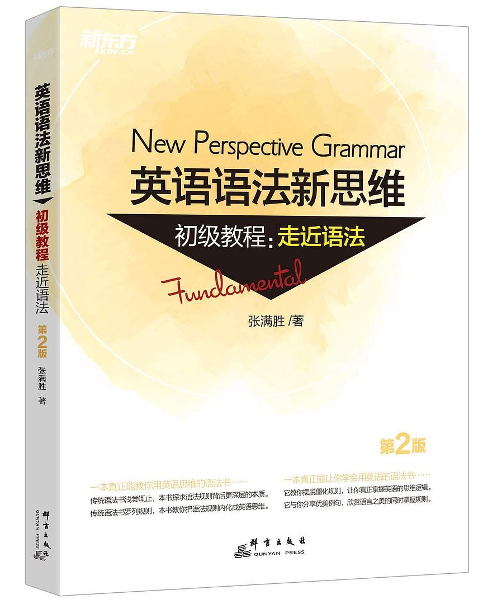
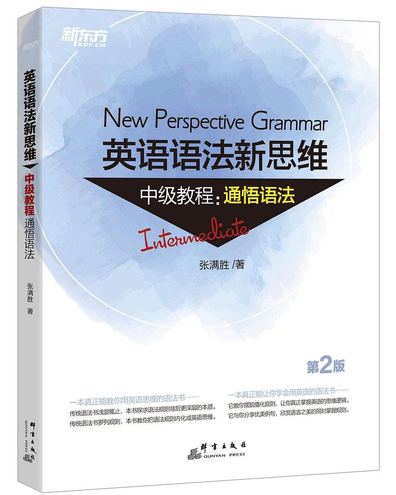
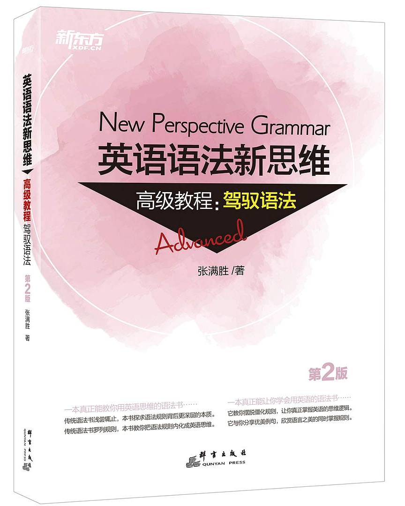

<!-- markdownlint-disable MD001 -->
<!-- markdownlint-disable MD013 -->
<!-- markdownlint-disable MD024 -->
<!-- class: lead invert -->

# 英语学习资料分享

`2022.07.13`

---

<!-- class: invert -->

## 为什么**现在**还要学英语？

- 计算机行业的新兴知识依然以英语为主；
- 机器翻译依然不完美；
- 机器翻译再完美也没有直接看懂来得快；
- 上学的时候没认真学。

[🔗外国人采访上海初中生](https://www.bilibili.com/video/BV1aP4y1g7mw)

---

<!-- class: invert -->

## 专题

### 1. 词汇 (Vocabulary)

### 2. 语法 (Grammar)

### ~~3. 写作 (Writing)~~

### ~~4. 听力 (Listening)~~

### ~~5. 口语 (Speaking)~~

---

<!-- class: lead invert -->

# 1. 词汇 (Vocabulary)

---

<!-- class: invert -->

# 目标

- 10,000+
- 20,000+
- ...

---

<!-- class: invert -->

# 单词书

- 路线 A: `初中` -> `高中` -> `四级` -> `六级` -> `考研` -> `雅思/托福` -> `GRE`
- 路线 B: `COCA 20000 常用词` -> `GRE` -> `积累自己的词库`

---

<!-- class: invert -->

# 词汇名称解释

- **雅思**: IELTS `/ˈaɪ.ɛlts/` International English Language Testing System，主要面向去英联邦国家留学的学生；
- **托福**: TOEFL `/ˈtoʊfəl/` Test of English as a Foreign Language，主要面向去北美国家留学的学生；
- **GRE**: Graduate Record Examinations，北美研究生入学考试；
- **COCA**: `/ˈkəʊkə/` Corpus of Contemporary American English，美国当代英语语料库。

---

<!-- class: invert -->

# 音标 & 拼写

依靠读音来记单词拼写会事半功倍。

## 常见音标 (Phonetic Symbol) 体系

- [DJ (Daniel Jones Phonetic Symbol)](https://zh.wikipedia.org/zh-cn/DJ%E9%9F%B3%E6%A8%99): 最初用于标注英式发音，但也可用于标注美式发音
- [KK (John Samuel Kenyon and Thomas Albert Knott)](https://zh.wikipedia.org/zh-cn/KK%E9%9F%B3%E6%A8%99): 美式发音音标
- [IPA (International Phonetic Alphabet)](https://zh.wikipedia.org/zh-cn/%E5%9C%8B%E9%9A%9B%E9%9F%B3%E6%A8%99): 国际音标

---

<!-- class: invert -->

# 例子: **DJ** vs. **KK**

- IELTS
  - DJ: `/ˈaɪ.elts/`
  - KK: `/ˈaɪ.ɛlts/`
- low
  - DJ: `/ləʊ/`(英音) `/loʊ/`(美音)
  - KK: `/lo/`

[🔗英语兔 - 音标系列](https://www.youtube.com/playlist?list=PLiRHe7F8P0-2wRRzK6nzriMTXyfRwKEG6)

---

<!-- class: invert -->

# 音标 & 拼写

## 拼写 (Spelling)

大部分常见词可以依靠读音来帮助记忆拼写:

- philanthropic: `/ˌfɪlən'θrɒpɪk/` adj. 慈善的, 慈善事业的, 博爱的
- superintendent: `/ˌsuːpərɪn'tendənt/` n. 负责人, 主管人, 监管人
- tuberculosis: `/tjuːˌbɜːkju'ləʊsɪs/` n. 结核病
- veterinarian: `/ˌvetərɪ'neəriən/` n. 兽医

---

<!-- class: invert -->

# 词汇含义

## 1. 词根词缀 (Roots and Affixes)

[🔗词根词缀表 (pdf)](../vocabulary/roots_and_affixes_s.md)

## 2. 重复、重复再重复

---

<!-- class: invert lead -->

## 遗忘率可能超过 50%

(扇贝单词 App)

---

<!-- class: invert -->

# 1. 词汇 (Vocabulary)

### 需要投入多少时间？

利用碎片时间即可。

### 工具

- 扇贝单词或同类手机App
- [🔗扇贝英语网页版](https://web.shanbay.com/)
- [🔗有道词典网页版](https://dict.youdao.com/)
- [🔗Test your English vocabulary](http://testyourvocab.com/)

---

<!-- class: invert lead -->

# 2. 语法 (Grammar)

---

<!-- class: invert -->

# 如何理解这几句话？

1. *I have been married.*
2. *I have been coming to Beijing for fourteen years.*
3. *Beauty means this to one and that to the other. And yet when anyone of us has seen that which to him is beautiful he has known an emotion which is in every case the same in kind.*

---

<!-- class: invert -->

# 目标

- **读**: 正确理解英文资料的字面意思；
- **写**: 正确、流畅地表达自己的想法。

---

<!-- class: invert -->

# 语法书

- [🔗《英语魔法师之语法俱乐部》](https://book.douban.com/subject/1014914/)(2001)，旋元佑
- [🔗《赖世雄经典英语语法》](https://book.douban.com/subject/34781531/)(2019)，赖世雄
- 《英语语法新思维 (第 2 版)》(2018)，张满胜
  - [🔗初级教程：走近语法](https://book.douban.com/subject/30701505/)
  - [🔗中级教程：通悟语法](https://book.douban.com/subject/30571037/)
  - [🔗高级教程：驾驭语法](https://book.douban.com/subject/30778541/)

---

<!-- class: invert -->

# 英语语法新思维

---

<!-- class: invert -->

# 包含哪些内容？

[🔗英语语法新思维语法提纲 (pdf)](grammar-outline.md)
