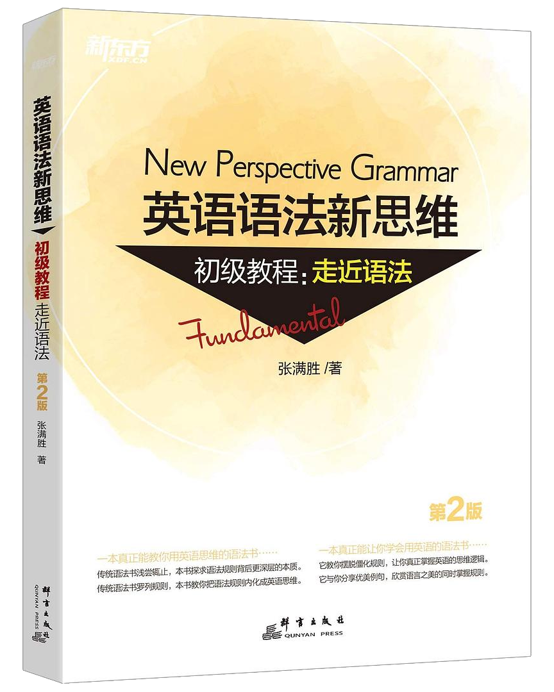
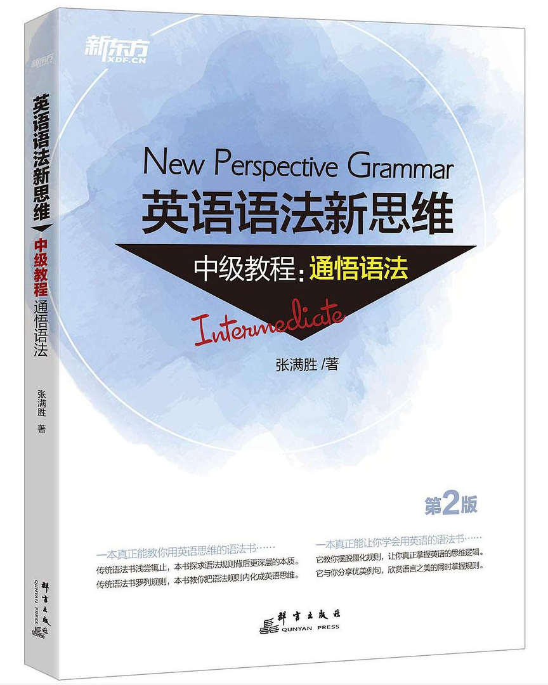
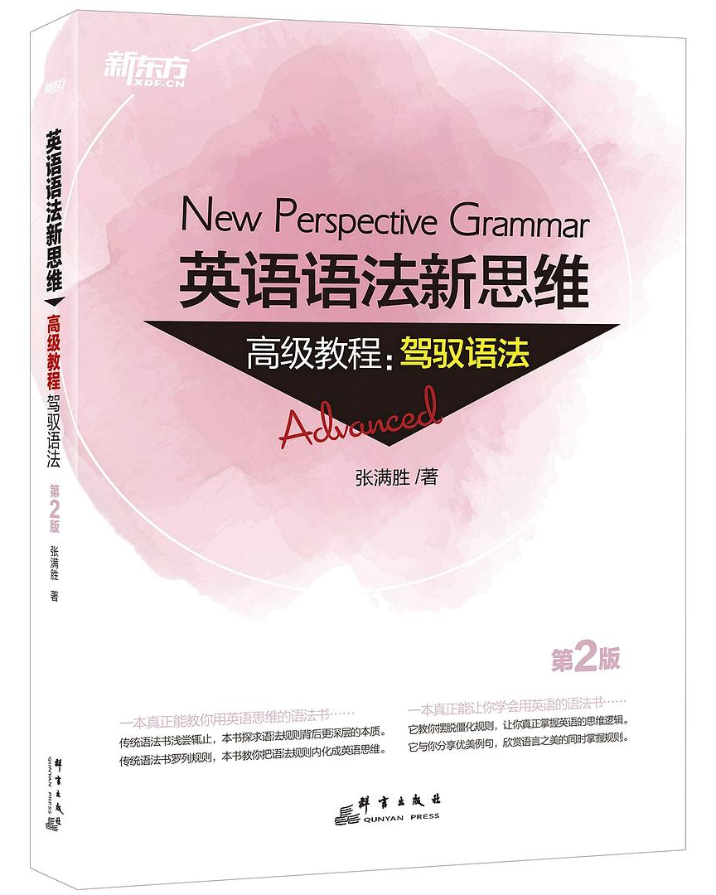

# 英语语法学习笔记

> 本 PDF 使用 Visual Studio Code 插件
> [yzane/vscode-markdown-pdf](https://github.com/yzane/vscode-markdown-pdf)
> 生成。

## 引言

*I have been coming to Beijing for fourteen years*.

过去这 14 年中，我常常来北京。

解析：用短暂动词 (come) 的完成进行时 (have been coming)
来表示到目前为止的一段时间内重复发生的动作。

❌ I have been coming to Beijing fourteen times.

解析：现在完成进行时态在表示重复活动时，不能说明具体的次数。

## 参考资料

- 英语语法新思维 (第 2 版)，张满胜
  - [初级教程：走近语法](https://book.douban.com/subject/30701505/)
  - [中级教程：通悟语法](https://book.douban.com/subject/30571037/)
  - [高级教程：驾驭语法](https://book.douban.com/subject/30778541/)

<!-- markdownlint-disable MD025 -->

# 目录

## [初级教程：走近语法](#英语语法新思维-初级教程走近语法)

- [0. 名词短语](#绪论-名词短语)
- [1. 名词](#1-名词)
- [2. 限定词 (一)：冠词](#2-限定词-一-冠词)
- [3. 限定词 (二)：数量限定词与个体限定词](#3-限定词-二-数量限定词与个体限定词)
- [4. 形容词](#4-形容词)
- [5. 动词分类 (一)：实义动词与 (情态) 助动词](#5-动词分类-一-实义动词与-情态-助动词)
- [6. 动词分类 (二)：英语的五种基本句型](#6-动词分类-二-英语的五种基本句型)
- [7. 英文时态 (一)：一般时态](#7-英文时态-一-一般时态)

## [中级教程：通悟语法](#英语语法新思维-中级教程通悟语法)

- [1. 简单句与复合句](#1-简单句与复合句)
- [2. 名词从句](#2-名词从句)
- [3. 定语从句](#3-定语从句)
- [5. 完成时态](#5-完成时态)

## [高级教程：驾驭语法](#英语语法新思维-高级教程驾驭语法)

# 英语语法新思维 初级教程：走近语法

:[0. 名词短语](noun_phrase.md)

:[1. 名词](noun.md)

:[2. 限定词 (一)：冠词](determiner_article.md)

:[3. 限定词 (二)：数量限定词与个体限定词](determiner_quantifying_and_individual.md)

:[4. 形容词](adjective.md)

:[5. 动词分类 (一)：实义动词与 (情态) 助动词](content_verbs_and_modal_auxiliary_verbs.md)

:[6. 动词分类 (二)：英语的五种基本句型](five_basic_sentence_patterns.md)

:[7. 英文时态 (一)：一般时态](1_7_simple_tense.md)

# 英语语法新思维 中级教程：通悟语法

:[1. 简单句与复合句](simple_and_complex_sentence.md)

:[2. 名词从句](nominal_clause.md)

:[3. 定语从句](attributive_clause.md)

:[5. 完成时态](2_5_perfect_tense.md)

# 英语语法新思维 高级教程：驾驭语法

