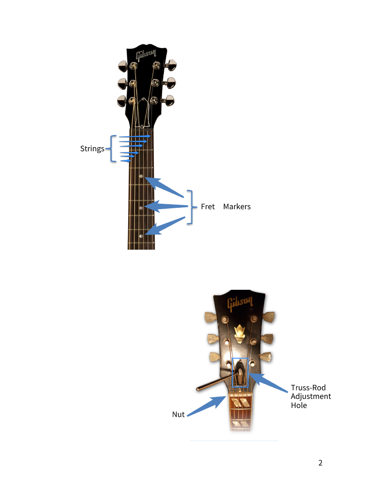

# Week 1

- [Week 1](#week-1)
  - [Parts of the Guitar (Acoustic)](#parts-of-the-guitar-acoustic)
  - [Chord Block Diagrams and Fretboard Maps](#chord-block-diagrams-and-fretboard-maps)
  - [A Minor and E Major Chords](#a-minor-and-e-major-chords)

## Parts of the Guitar (Acoustic)

## Chord Block Diagrams and Fretboard Maps

## A Minor and E Major Chords

