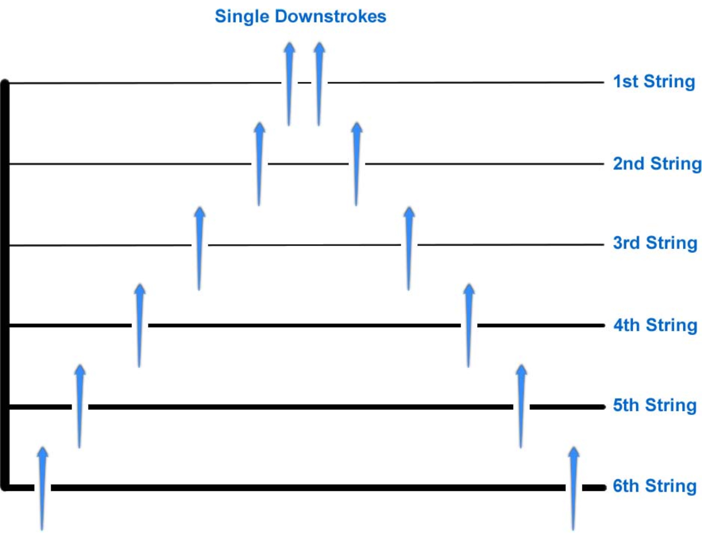
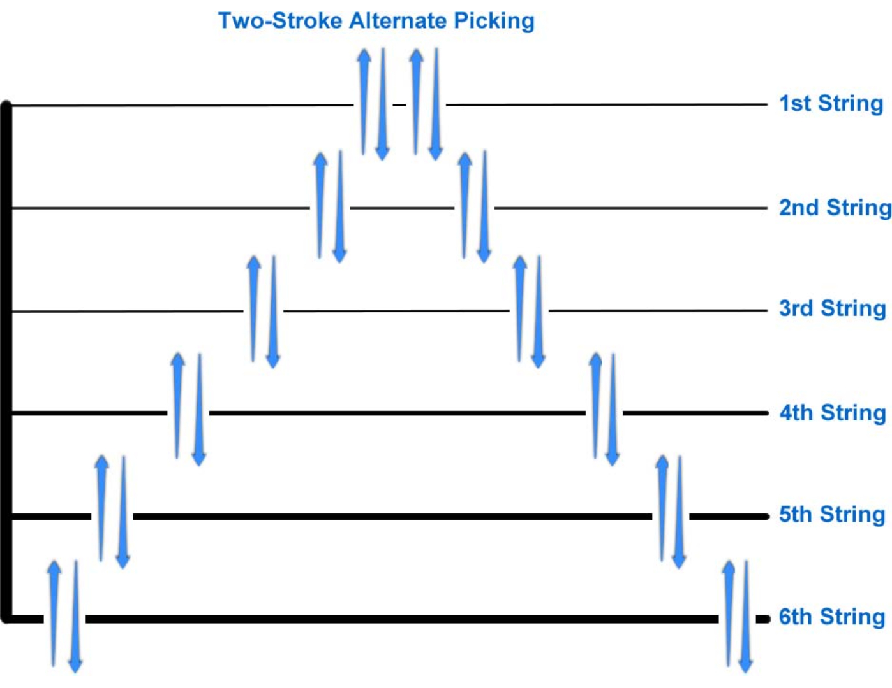
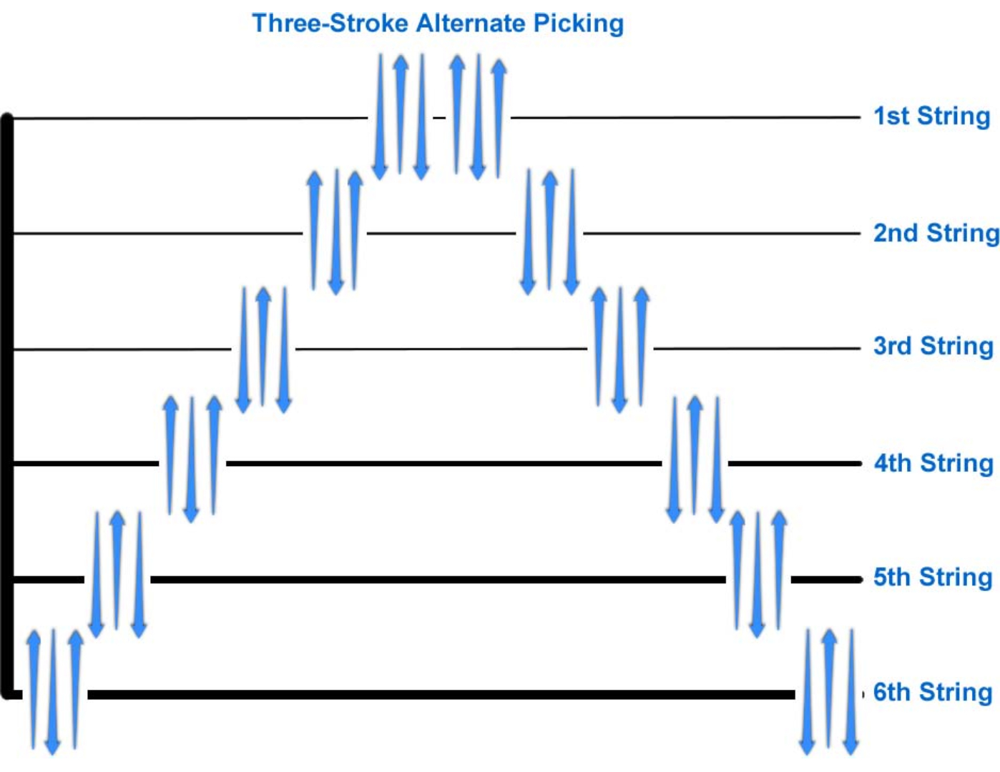
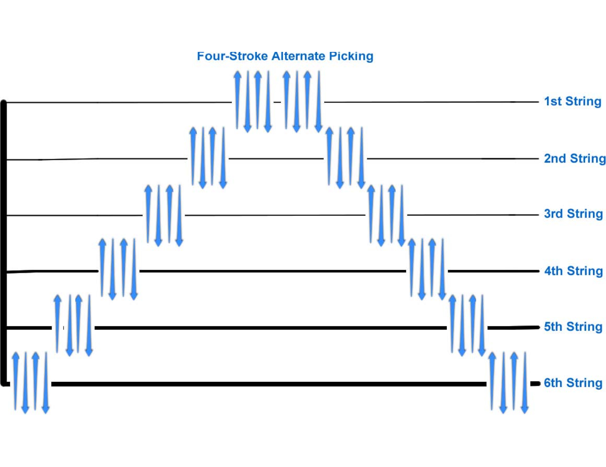
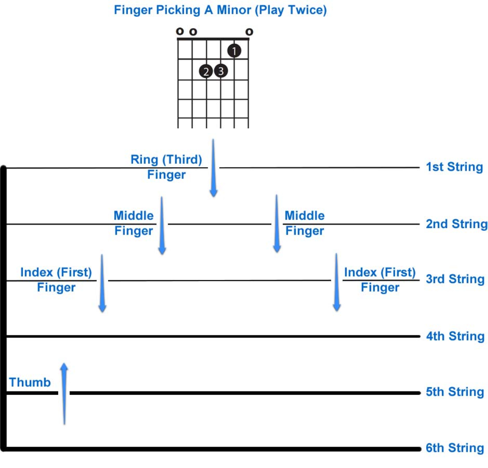
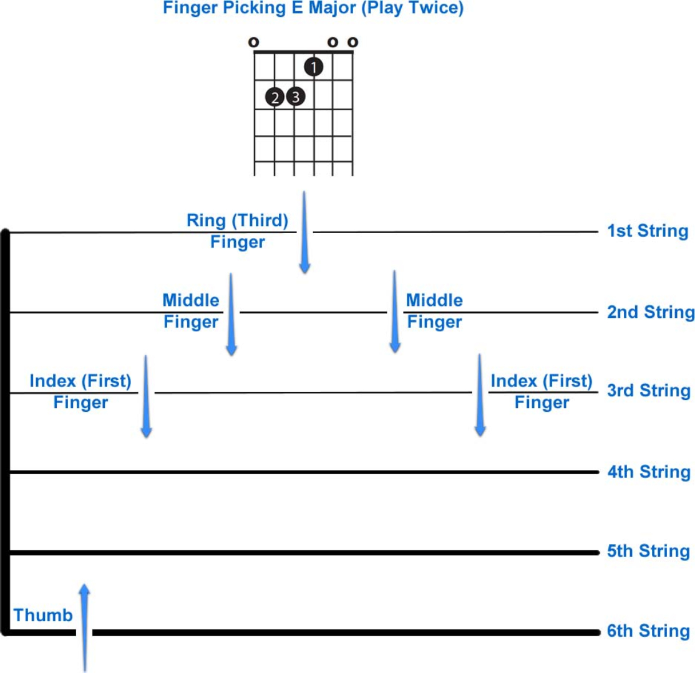
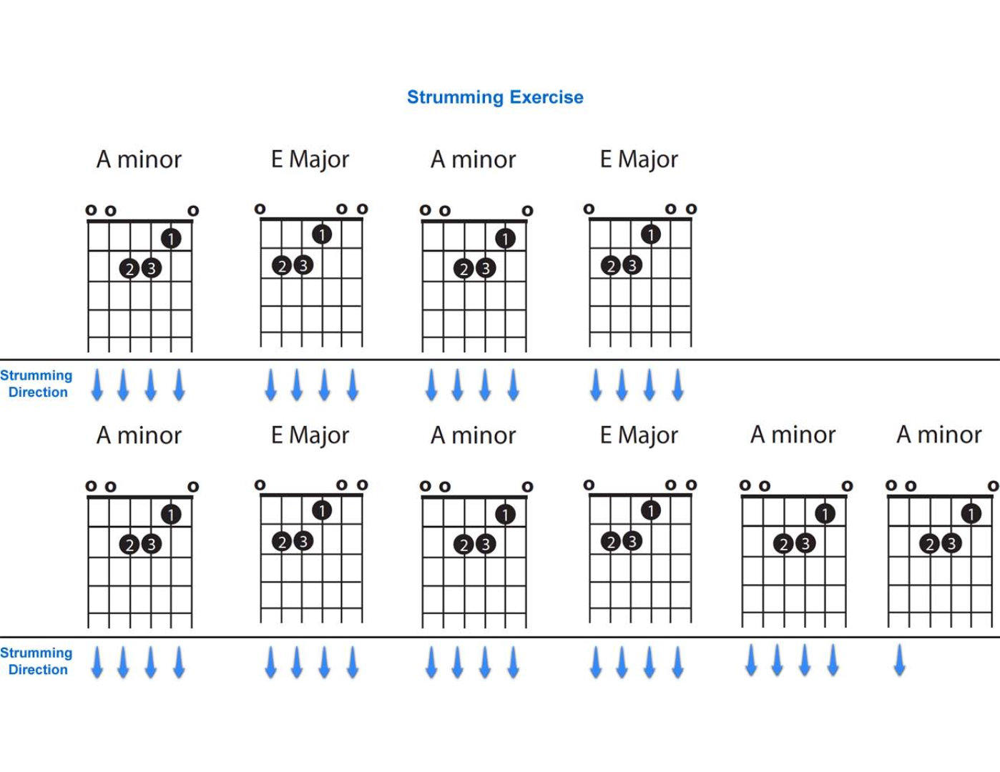
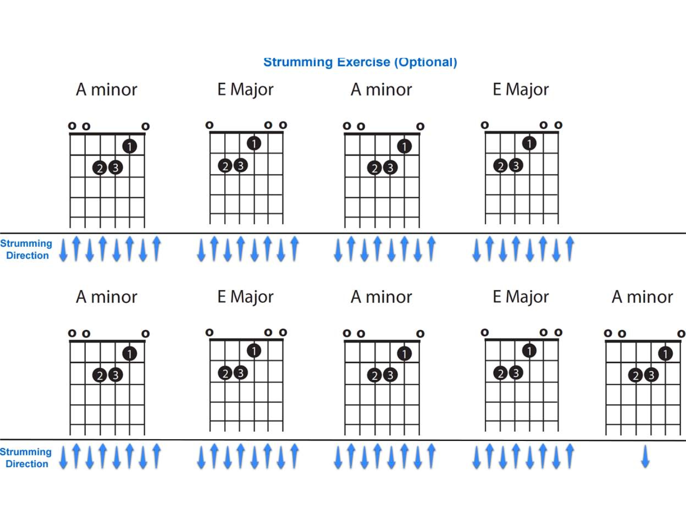

# Week 2

## String Names and Numbers

From thin (1) to thick (6):

1. E
2. B
3. G
4. D
5. A
6. E

## Tuning Your Guitar

### Tuning Your Guitar with a Tuner

So called **standard tuning**: depending on an extra device, such as a digital
tuner or a tuner App.

### Tuning Your Guitar by Matching

| SRC | DST |
| --- | --- |
| E.5 | A |
| A.5 | D |
| D.5 | G |
| G.4 | B |
| B.5 | E |

#### With a Tuning Fork

Make it vibrate then place its end on the bridge of the guitar. By doing so we
could get a starting pitch of an A.

### Tuning Your Guitar with Harmonics

| SRC | DST |
| --- | --- |
| E.5 | A.7 |
| A.5 | D.7 |
| A.12 | G.2 |
| A.7 | B.5 |
| A.7 | E |

## Picking

### Picking Technique

#### Single Downstrokes

#### Two-Stroke Alternate Picking

#### Three-Stroke Alternate Picking

#### Four-Stroke Alternate Picking

### Finger Picking

#### Finger Picking A Minor (Play Twice)

#### Finger Picking E Major (Play Twice)

## Strumming

### Strumming the Guitar

#### Strumming Exercise

#### Strumming Exercise (Optional)

