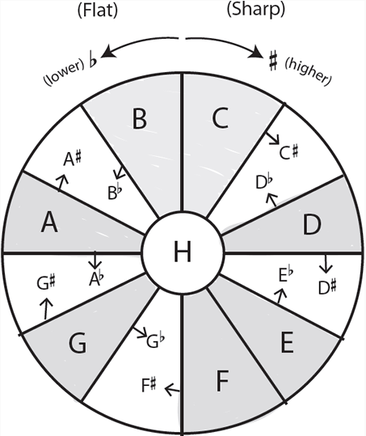

# Week 3

## Twelve Frets and Twelve Half Steps

### The Note Wheel

There are sharps and flats between every note except the B and the C and the E
and the F.

#### Clock Wise

There is a sharp above every note except B and E.

#### Counter Clock Wise

There is a flat below every note except F and C.

## Notes on the Fretboard

> <https://www.coursera.org/learn/guitar/lecture/04o7H/notes-on-the-fretboard>
