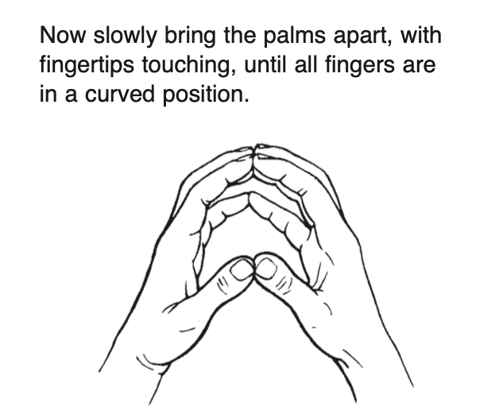

# Introduction to Playing

## Preliminary Exercises

- Be kind to your hands
- Use a little warm water: promoting circulation is important

## How to Sit at the Piano

- SIT TALL
- Lean slightly forward
- Let arms hang loosely from shoulders
- Elbows slightly higher than keys
- Bench must face the keyboard squarely
- Knees slightly under keyboard
- Feet flat on the floor
  - Right foot may be slightly forward

## Finger Numbers

1. Thumb
2. Index
3. Middle
4. Ring
5. Pinky / Little

## Piano Tones

> these are not musical terms, just descriptive words

- **SOFT** tone
- **LOUDER** tone

## The Keyboard

On the keyboard, **DOWN** is to the left, **UP** is to the right.

## Name That Key!

A B C D E F G

**A**'s are found between the **TOP TWO KEYS** of each **3-BLACK-KEY GROUP**.

- The lowest key of a 88-key piano is **A**
- The highest key of a 88-key piano is **C**

## Isometric Exercise

**EXERCISE**: Keep fingers in the curved position, relaxed.

Now press the 3rd fingers firmly together. Keep the other fingers relaxed.
Do this four times, counting “ONE–TWO–THREE–FOUR.”
Do the same with the 2nd fingers, then the 4th fingers, then the thumbs,
and finally with the 5th fingers.
Repeat several times, then shake out your hands vigorously.
Repeat again.

## A Beneficial Hand Massage

### Four Good Reasons for Playing with Curved Fingers

1. When the fingers are curved, each finger has, in effect, the same length.
2. Curved fingers bring the thumb into the correct playing position.
3. With curved fingers, keys respond instantly. You are IN CONTROL when you CURVE!
4. Moving over the keys will require turning the thumb ***under*** the fingers and crossing fingers ***over*** the thumb. Curved fingers provide an ARCH that makes this motion possible.
