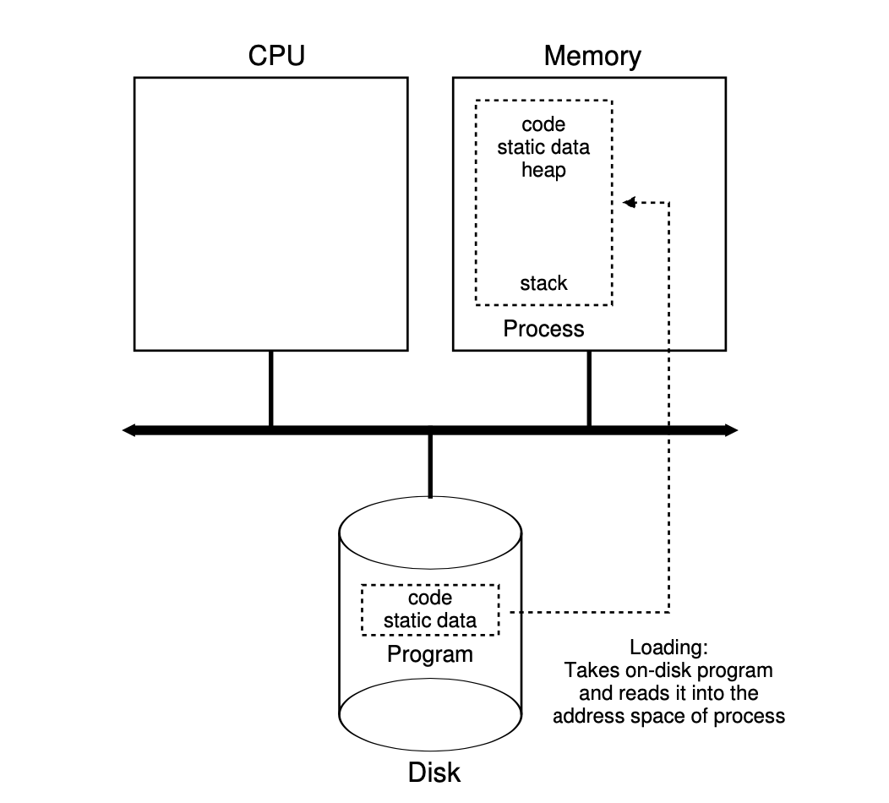
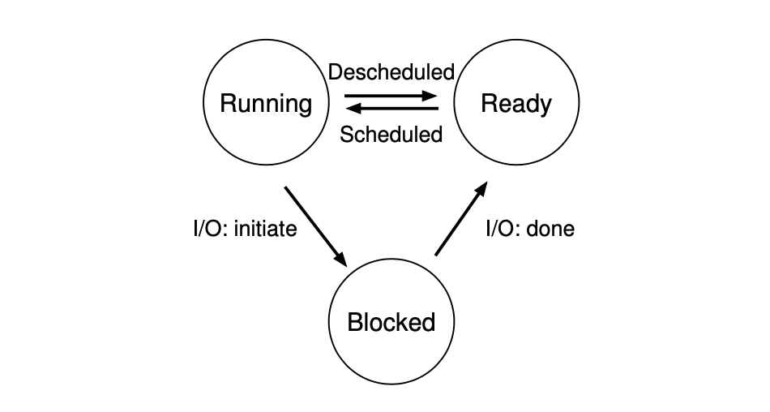
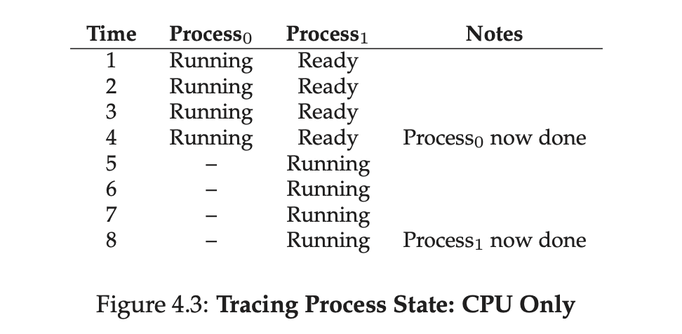
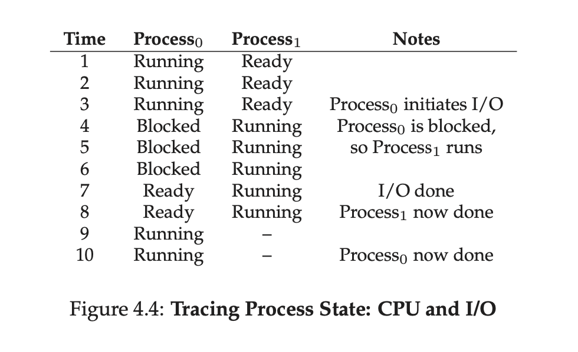

# 4. The Abstraction: The Process

The definition of a **process** is quite simple: it is a running program. The
program itself is a lifeless thing: it just sits there on the disk, a bunch of
instructions (and maybe some static data), waiting to spring into action. It is
the operating system that takes these bytes and gets them running, transforming
the program into something useful.

**THE CRUX OF THE PROBLEM**:

- HOW TO PROVIDE THE ILLUSION OF MANY CPUS?
- Although there are only a few physical CPUs available, how can the OS provide
  the illusion of a nearly-endless supply of said CPUs?

The OS creates this illusion by **virtualizing** the CPU. By running one
process, then stopping it and running another, and so forth, the OS can promote
the illusion that many virtual CPUs exist when in fact there is only one
physical CPU (or a few). This basic technique, known as **time sharing** of the
CPU, allows users to run as many concurrent processes as they would like; the
potential cost is performance, as each will run more slowly if the CPU(s) must
be shared.

To implement virtualization of the CPU, and to implement it well, the OS will
need both some low-level machinery and some high-level intelligence. We call
the low-level machinery **mechanisms**; mechanisms are low-level methods or
protocols that implement a needed piece of functionality. For example, we’ll
learn later how to implement a **context switch**, which gives the OS the
ability to stop running one program and start running another on a given CPU;
this **time-sharing mechanism** is employed by all modern OSes.

On top of these mechanisms resides some of the intelligence in the OS, in the
form of **policies**. Policies are algorithms for making some kind of decision
within the OS. For example, given a number of possible programs to run on a
CPU, which program should the OS run? A **scheduling policy** in the OS will
make this decision, likely using historical information, workload knowledge,
and performance metrics to make its decision.

**USE TIME SHARING** (AND **SPACE SHARING**)

**Time sharing** is a basic technique used by an OS to share a resource. By
allowing the resource to be used for a little while by one entity, and then a
little while by another, and so forth, the resource can be shared by many. The
counterpart of time sharing is **space sharing**, where a resource is divided
(in space) among those who wish to use it.

## 4.1 The Abstraction: A Process

A **process** is simply a running program; at any instant in time, we can
summarize a process by taking an inventory of the different pieces of the
system it accesses or affects during the course of its execution.

To understand what constitutes a process, we thus have to understand its
**machine state**: what a program can read or update when it is running.

One obvious component of machine state that comprises a process is its
**memory**. Instructions lie in memory; the data that the running program reads
and writes sits in memory as well. Thus the memory that the process can address
(called its **address space**) is part of the process.

Also part of the process’s machine state are **registers**; many instructions
explicitly read or update registers and thus clearly they are important to the
execution of the process.

Note that there are some particularly special registers that form part of this
machine state. For example, the **program counter (PC)** (sometimes called the
**instruction pointer** or **IP**) tells us which instruction of the program is
currently being executed; similarly a **stack pointer** and associated
**frame pointer** are used to manage the stack for function parameters, local
variables, and return addresses.

Finally, programs often access persistent storage devices too. Such
**I/O information** might include a list of the files the process currently has
open.

TIP: **SEPARATE POLICY AND MECHANISM**

In many operating systems, a common design paradigm is to separate high-level
policies from their low-level mechanisms. You can think of the mechanism as
providing the answer to a *how* question about a system; for example, how does
an operating system perform a context switch? The policy provides the answer to
a *which* question; for example, which process should the operating system run
right now? Separating the two allows one easily to change policies without
having to rethink the mechanism and is thus a form of **modularity**, a general
software design principle.

## 4.2 Process API

What must be included in any interface of an operating system? These APIs, in
some form, are available on any modern operating system.

- **Create**: An operating system must include some method to create new
  processes. When you type a command into the shell, or double-click on an
  application icon, the OS is invoked to create a new process to run the
  program you have indicated.
- **Destroy**: As there is an interface for process creation, systems also
  provide an interface to destroy processes forcefully. Of course, many
  processes will run and just exit by themselves when complete; when they
  don’t, however, the user may wish to kill them, and thus an interface to halt
  a runaway process is quite useful.
- **Wait**: Sometimes it is useful to wait for a process to stop running; thus
  some kind of waiting interface is often provided.
- **Miscellaneous Control**: Other than killing or waiting for a process, there
  are sometimes other controls that are possible. For example, most operating
  systems provide some kind of method to suspend a process (stop it from
  running for a while) and then resume it (continue it running).
- **Status**: There are usually interfaces to get some status information about
  a process as well, such as how long it has run for, or what state it is in.

## 4.3 Process Creation: A Little More Detail

How does the OS get a program up and running? How does process creation
actually work?

*Loading: From Program To Process*.



The first thing that the OS must do to run a program is to **load** its code and
any static data (e.g., initialized variables) into memory, into the address
space of the process. Programs initially reside on **disk** in some kind of
**executable format**; thus, the process of loading a program and static data
into memory requires the OS to read those bytes from disk and place them in
memory somewhere.

In early operating systems, the loading process is done **eagerly**, i.e., all
at once before running the program; modern OSes perform the process **lazily**,
i.e., by loading pieces of code or data only as they are needed during program
execution.

Once the code and static data are loaded into memory, there are a few other
things the OS needs to do before running the process. Some memory must be
allocated for the program’s **run-time stack**. C programs use the stack for
local variables, function parameters, and return addresses; the OS allocates
this memory and gives it to the process. The OS will also likely initialize the
stack with arguments; specifically, it will fill in the parameters to the
`main()` function, i.e., `argc` and the `argv` array.

The OS may also allocate some memory for the program’s **heap**. In C programs,
the heap is used for explicitly requested dynamically-allocated data; programs
request such space by calling `malloc()` and free it explicitly by calling
`free()`. The heap is needed for data structures such as linked lists, hash
tables, trees, and other interesting data structures. The heap will be small at
first; as the program runs, and requests more memory via the `malloc()` library
API, the OS may get involved and allocate more memory to the process to help
satisfy such calls.

The OS will also do some other initialization tasks, particularly as related to
input/output (I/O). For example, in UNIX systems, each process by default has
three open **file descriptors**, for standard input, output, and error; these
descriptors let programs easily read input from the terminal and print output
to the screen.

By loading the code and static data into memory, by creating and initializing a
stack, and by doing other work as related to I/O setup, the OS has now
(finally) set the stage for program execution. It thus has one last task: to
start the program running at the entry point, namely `main()`. By jumping to
the `main()` routine, the OS transfers control of the CPU to the newly-created
process, and thus the program begins its execution.

## 4.4 Process States

In a simplified view, a process can be in one of three states:

- **Running**: In the running state, a process is running on a processor. This
  means it is executing instructions.
- **Ready**: In the ready state, a process is ready to run but for some reason
  the OS has chosen not to run it at this given moment.
- **Blocked**: In the blocked state, a process has performed some kind of
  operation that makes it not ready to run until some other event takes place.
  A common example: when a process initiates an I/O request to a disk, it
  becomes blocked and thus some other process can use the processor.

*Process: State Transitions*.



As you can see in the diagram, a process can be moved between the `ready` and
`running` states at the discretion of the OS. Being moved from `ready` to
`running` means the process has been **scheduled**; being moved from `running`
to `ready` means the process has been **descheduled**. Once a process has
become `blocked`, the OS will keep it as such until some event occurs; at that
point, the process moves to the `ready` state again.

*Tracing Process State: CPU Only*.



Example of how two processes might transition through some of these states.

*Tracing Process State: CPU and I/O*.



Note that there are many decisions the OS must make, even in this simple
example. First, the system had to decide to run `Process1` while `Process0`
issued an I/O; doing so improves resource utilization by keeping the CPU busy.
Second, the system decided not to switch back to `Process0` when its I/O
completed; it is not clear if this is a good decision or not. These types of
decisions are made by the OS **scheduler**.

## 4.5 Data Structures

The OS is a program, and like any program, it has some key data structures that
track various relevant pieces of information. To track the state of each
process, for example, the OS likely will keep some kind of **process list** for
all processes that are `ready` and some additional information to track which
process is currently `running`. The OS must also track, in some way, `blocked`
processes; when an I/O event completes, the OS should make sure to wake the
correct process and `ready` it to run again.

*Figure 4.5: The xv6 Proc Structure*.

```c
// the registers xv6 will save and restore
// to stop and subsequently restart a process
struct context
{
    int eip;
    int esp;
    int ebx;
    int ecx;
    int edx;
    int esi;
    int edi;
    int ebp;
};

// the different states a process can be in
enum proc_state
{
    UNUSED,
    EMBRYO,
    SLEEPING,
    RUNNABLE,
    RUNNING,
    ZOMBIE
};

// the information xv6 tracks about each process
// including its register context and state
struct proc
{
    char *mem;                  // Start of process memory
    uint sz;                    // Size of process memory
    char *kstack;               // Bottom of kernel stack for this process
    enum proc_state state;      // Process state
    int pid;                    // Process ID
    struct proc *parent;        // Parent process
    void *chan;                 // If non-zero, sleeping on chan
    int killed;                 // If non-zero, have been killed
    struct file *ofile[NOFILE]; // Open files
    struct inode *cwd;          // Current directory
    struct context context;     // Switch here to run process
    struct trapframe *tf;       // Trap frame for the current interrupt
};
```

Figure 4.5 shows what type of information an OS needs to track about each
process in the xv6 kernel.

From the figure, you can see a couple of important pieces of information the OS
tracks about a process. The **register context** will hold, for a stopped
process, the contents of its registers. When a process is stopped, its
registers will be saved to this memory location; by restoring these registers,
the OS can resume running the process.

You can also see from the figure that there are some other states a process can
be in, beyond `running`, `ready`, and `blocked`. Sometimes a system will have
an `initial` state that the process is in when it is being created. Also, a
process could be placed in a `final` state where it has exited but has not yet
been cleaned up (in UNIX-based systems, this is called the `zombie` state).
This final state can be useful as it allows other processes (usually the
**parent** that created the process) to examine the return code of the process
and see if the just-finished process executed successfully (usually, programs
return zero in UNIX-based systems when they have accomplished a task
successfully, and non-zero otherwise). When finished, the parent will make one
final call (e.g., `wait()`) to wait for the completion of the child, and to
also indicate to the OS that it can clean up any relevant data structures that
referred to the now-extinct process.

ASIDE: **DATA STRUCTURE — THE PROCESS LIST**

Operating systems are replete with various important **data structures**. The
**process list** (also called the **task list**) is the first such structure.
It is one of the simpler ones, but certainly any OS that has the ability to run
multiple programs at once will have something akin to this structure in order
to keep track of all the running programs in the system. Sometimes people refer
to the individual structure that stores information about a process as a
**Process Control Block (PCB)**, a fancy way of talking about a C structure
that contains information about each process (also sometimes called a **process
descriptor**).

ASIDE: **KEY PROCESS TERMS**

- The **process** is the major OS abstraction of a running program. At any
  point in time, the process can be described by its state: the contents of
  memory in its **address space**, the contents of CPU registers (including the
  **program counter** and **stack pointer**, among others), and information
  about I/O (such as open files which can be read or written).
- The **process API** consists of calls programs can make related to processes.
  Typically, this includes creation, destruction, and other useful calls.
- Processes exist in one of many different **process states**, including
- running, ready to run, and blocked. Different events transition a process
  from one of these states to the other.
- A **process list** contains information about all processes in the system.
  Each entry is found in what is sometimes called a
  **process control block (PCB)**, which is really just a structure that
  contains information about a specific process.

## 4.6 Summary

**Process** is quite simply viewed as a running program. With this conceptual
view in mind, we will now move on to the nitty-gritty: the low-level mechanisms
needed to implement processes, and the higher-level policies required to
schedule them in an intelligent way. By combining mechanisms and policies, we
will build up our understanding of how an operating system virtualizes the CPU.

## Homework (Simulation)

`process-run.py`
