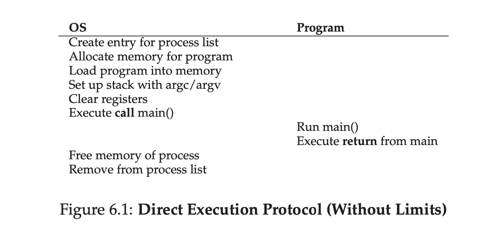
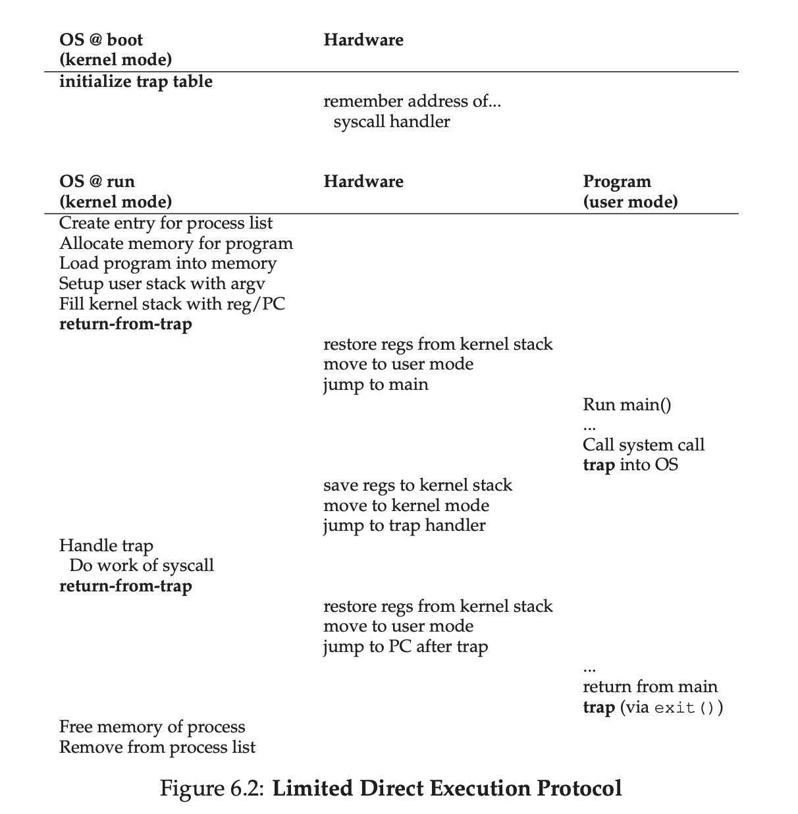
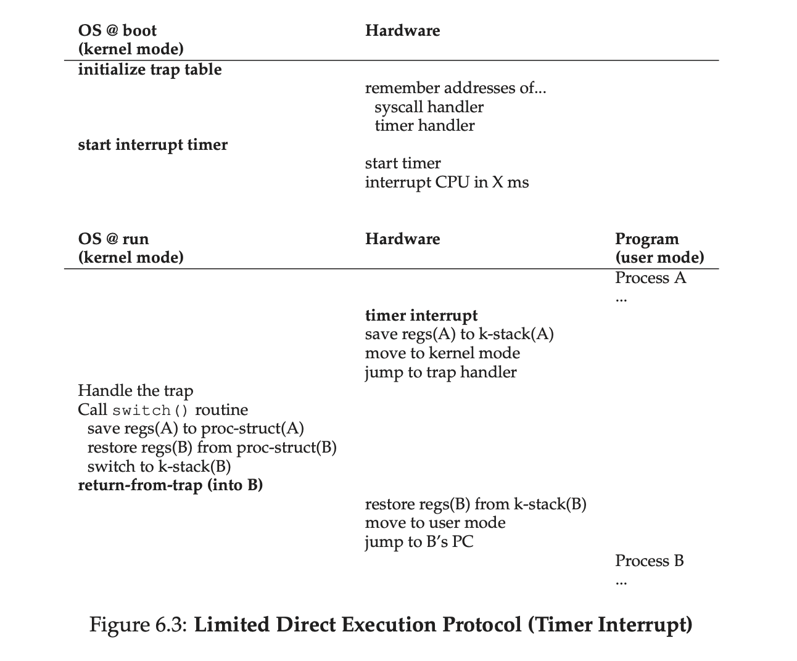

# 6. Mechanism: Limited Direct Execution

In order to virtualize the CPU, the operating system needs to somehow share the
physical CPU among many jobs running seemingly at the same time. The basic idea
is simple: run one process for a little while, then run another one, and so
forth. By **time sharing** the CPU in this manner, virtualization is achieved.

There are a few challenges, however, in building such virtualization machinery.

- The first is **performance**: how can we implement virtualization without
  adding excessive overhead to the system?
- The second is **control**: how can we run processes efficiently while
  retaining control over the CPU? Control is particularly important to the OS,
  as it is in charge of resources; without control, a process could simply run
  forever and take over the machine, or access information that it should not
  be allowed to access.
- Obtaining high performance while maintaining control is thus one of the
  central challenges in building an operating system.

THE CRUX: **HOW TO EFFICIENTLY VIRTUALIZE THE CPU WITH CONTROL**

The OS must virtualize the CPU in an efficient manner while retaining control
over the system. To do so, both hardware and operating-system support will be
required. The OS will often use a judicious bit of hardware support in order to
accomplish its work effectively.

## 6.1 Basic Technique: Limited Direct Execution

*Direct Execution Protocol (Without Limits)*.



To make a program run as fast as one might expect, not surprisingly OS
developers came up with a technique, which we call
**limited direct execution**. The “direct execution” part of the idea is
simple: just run the program directly on the CPU. Thus, when the OS wishes to
start a program running, it creates a process entry for it in a process list,
allocates some memory for it, loads the program code into memory (from disk),
locates its entry point (i.e., the `main()` routine or something similar),
jumps to it, and starts running the user’s code. Figure 6.1 shows this basic
direct execution protocol (without any limits, yet), using a normal call and
return to jump to the program’s `main()` and later to get back into the kernel.

But this approach gives rise to a few problems in our quest to virtualize the
CPU.

- The first is simple: if we just run a program, how can the OS make sure the
  program doesn’t do anything that we don’t want it to do, while still running
  it efficiently?
- The second: when we are running a process, how does the operating system stop
  it from running and switch to another process, thus implementing the
  **time sharing** we require to virtualize the CPU?

In answering these questions below, we’ll get a much better sense of what is
needed to virtualize the CPU. In developing these techniques, we’ll also see
where the “limited” part of the name arises from; without limits on running
programs, the OS wouldn’t be in control of anything and thus would be “just a
library” — a very sad state of affairs for an aspiring operating system!

## 6.2 Problem #1: Restricted Operations

THE CRUX: **HOW TO PERFORM RESTRICTED OPERATIONS**

A process must be able to perform I/O and some other restricted operations, but
without giving the process complete control over the system. How can the OS and
hardware work together to do so?

ASIDE: **WHY SYSTEM CALLS LOOK LIKE PROCEDURE CALLS**

You may wonder why a call to a system call, such as `open()` or `read()`, looks
exactly like a typical procedure call in C; that is, if it looks just like a
procedure call, how does the system know it’s a system call, and do all the
right stuff?

The simple reason: it *is* a procedure call, but hidden inside that procedure
call is the famous **trap** instruction. More specifically, when you call
`open()` (for example), you are executing a procedure call into the C library.
Therein, whether for `open()` or any of the other system calls provided, the
library uses an agreed-upon calling convention with the kernel to put the
arguments to open in well-known locations (e.g., on the stack, or in specific
registers), puts the system-call number into a well-known location as well
(again, onto the stack or a register), and then executes the aforementioned
trap instruction. The code in the library after the trap unpacks return values
and returns control to the program that issued the system call.

Thus, the parts of the C library that make system calls are hand-coded in
assembly, as they need to carefully follow convention in order to process
arguments and return values correctly, as well as execute the hardware-specific
trap instruction. And now you know why you personally don’t have to write
assembly code to trap into an OS; somebody has already written that assembly
for you.

Direct execution has the obvious advantage of being fast; the program runs
natively on the hardware CPU and thus executes as quickly as one would expect.
But running on the CPU introduces a problem: what if the process wishes to
perform some kind of restricted operation, such as issuing an I/O request to a
disk, or gaining access to more system resources such as CPU or memory?

One approach would simply be to let any process do whatever it wants in terms
of I/O and other related operations. However, doing so would prevent the
construction of many kinds of systems that are desirable. For example, if we
wish to build a file system that checks permissions before granting access to a
file, we can’t simply let any user process issue I/Os to the disk; if we did, a
process could simply read or write the entire disk and thus all protections
would be lost.

Thus, the approach we take is to introduce a new processor mode, known as
**user mode**; code that runs in user mode is restricted in what it can do. For
example, when running in user mode, a process can’t issue I/O requests; doing
so would result in the processor raising an exception; the OS would then likely
kill the process.

In contrast to user mode is **kernel mode**, which the operating system (or
kernel) runs in. In this mode, code that runs can do what it likes, including
privileged operations such as issuing I/O requests and executing all types of
restricted instructions.

We are still left with a challenge, however: what should a user process do when
it wishes to perform some kind of privileged operation, such as reading from
disk? To enable this, virtually all modern hardware provides the ability for
user programs to perform a **system call**. Pioneered on ancient machines such
as the Atlas, system calls allow the kernel to carefully expose certain key
pieces of functionality to user programs, such as accessing the file system,
creating and destroying processes, communicating with other processes, and
allocating more memory. Most operating systems provide a few hundred calls;
early Unix systems exposed a more concise subset of around twenty calls.

TIP: **USE PROTECTED CONTROL TRANSFER**

The hardware assists the OS by providing different modes of execution. In
**user mode**, applications do not have full access to hardware resources. In
**kernel mode**, the OS has access to the full resources of the machine.
Special instructions to **trap** into the kernel and **return-from-trap** back
to user-mode programs are also provided, as well as instructions that allow the
OS to tell the hardware where the **trap table** resides in memory.

To execute a system call, a program must execute a special **trap**
instruction. This instruction simultaneously jumps into the kernel and raises
the privilege level to kernel mode; once in the kernel, the system can now
perform whatever privileged operations are needed (if allowed), and thus do the
required work for the calling process. When finished, the OS calls a special
**return-from-trap** instruction, which, as you might expect, returns into the
calling user program while simultaneously reducing the privilege level back to
user mode.

The hardware needs to be a bit careful when executing a trap, in that it must
make sure to save enough of the caller’s registers in order to be able to
return correctly when the OS issues the return-from-trap instruction. On x86,
for example, the processor will push the program counter, flags, and a few
other registers onto a per-process **kernel stack**; the return-from-trap will
pop these values off the stack and resume execution of the user-mode program.
Other hardware systems use different conventions, but the basic concepts are
similar across platforms.

There is one important detail left out of this discussion: how does the trap
know which code to run inside the OS? Clearly, the calling process can’t
specify an address to jump to (as you would when making a procedure call);
doing so would allow programs to jump anywhere into the kernel which clearly is
a **Very Bad Idea**. Thus the kernel must carefully control what code executes
upon a trap.

The kernel does so by setting up a **trap table** at boot time. When the
machine boots up, it does so in privileged (kernel) mode, and thus is free to
configure machine hardware as need be. One of the first things the OS thus does
is to tell the hardware what code to run when certain exceptional events occur.
For example, what code should run when a harddisk interrupt takes place, when a
keyboard interrupt occurs, or when a program makes a system call? The OS
informs the hardware of the locations of these **trap handlers**, usually with
some kind of special instruction. Once the hardware is informed, it remembers
the location of these handlers until the machine is next rebooted, and thus the
hardware knows what to do (i.e., what code to jump to) when system calls and
other exceptional events take place.

To specify the exact system call, a **system-call number** is usually assigned
to each system call. The user code is thus responsible for placing the desired
system-call number in a register or at a specified location on the stack; the
OS, when handling the system call inside the trap handler, examines this
number, ensures it is valid, and, if it is, executes the corresponding code.
This level of indirection serves as a form of **protection**; user code cannot
specify an exact address to jump to, but rather must request a particular
service via number.

One last aside: being able to execute the instruction to tell the hardware
where the trap tables are is a very powerful capability. Thus, as you might
have guessed, it is also a **privileged** operation. If you try to execute this
instruction in user mode, the hardware won’t let you, and you can probably
guess what will happen (hint: adios, offending program). Point to ponder: what
horrible things could you do to a system if you could install your own trap
table? Could you take over the machine?

Figure 6.2: **Limited Direct Execution Protocol**



The timeline summarizes the protocol. We assume each process has a kernel stack
where registers are saved to and restored from (by the hardware) when
transitioning into and out of the kernel.

There are two phases in the **Limited Direct Execution (LDE)** protocol.

- In the first (at boot time), the kernel initializes the trap table, and the
  CPU remembers its location for subsequent use. The kernel does so via a
  privileged instruction (all privileged instructions are highlighted in bold).
- In the second (when running a process), the kernel sets up a few things
  before using a **return-from-trap** instruction to start the execution of the
  process; this switches the CPU to user mode and begins running the process.
  When the process wishes to issue a system call, it traps back into the OS,
  which handles it and once again returns control via a **return-from-trap** to
  the process. The process then completes its work, and returns from `main()`;
  this usually will return into some stub code which will properly exit the
  program (say, by calling the `exit()` system call, which traps into the OS).
  At this point, the OS cleans up and we are done.

TIP: **BE WARY OF USER INPUTS IN SECURE SYSTEMS**

Even though we have taken great pains to protect the OS during system calls (by
adding a hardware trapping mechanism, and ensuring all calls to the OS are
routed through it), there are still many other aspects to implementing a
**secure** operating system that we must consider. One of these is the handling
of arguments at the system call boundary; the OS must check what the user
passes in and ensure that arguments are properly specified, or otherwise reject
the call.

For example, with a `write()` system call, the user specifies an address of a
buffer as a source of the write call. If the user passes in a “bad” address
(e.g., one inside the kernel’s portion of the address space), the OS must
detect this and reject the call. Otherwise, it would be possible for a user to
read all of kernel memory; given that kernel (virtual) memory also usually
includes all of the physical memory of the system, this small slip would enable
a program to read the memory of any other process in the system.

In general, a secure system must treat user inputs with great suspicion. Not
doing so will undoubtedly lead to easily hacked software, a despairing sense
that the world is an unsafe and scary place, and the loss of job security for
the all-too-trusting OS developer.

## 6.3 Problem #2: Switching Between Processes

The next problem with direct execution is achieving a switch between processes.
The OS should just decide to stop one process and start another. But it
actually is a little bit tricky: specifically, if a process is running on the
CPU, this by definition means the OS is not running. If the OS is not running,
how can it do anything at all? (hint: it can’t) While this sounds almost
philosophical, it is a real problem: there is clearly no way for the OS to take
an action if it is not running on the CPU. Thus we arrive at the crux of the
problem.

THE CRUX: **HOW TO REGAIN CONTROL OF THE CPU**

How can the operating system regain control of the CPU so that it can switch
between processes?

### A Cooperative Approach: Wait For System Calls

One approach that some systems have taken in the past is known as the
**cooperative** approach. In this style, the OS *trusts* the processes of the
system to behave reasonably. Processes that run for too long are assumed to
periodically give up the CPU so that the OS can decide to run some other task.

Thus, you might ask, how does a friendly process give up the CPU in this
utopian world? Most processes, as it turns out, transfer control of the CPU to
the OS quite frequently by making **system calls**, for example, to open a file
and subsequently read it, or to send a message to another machine, or to create
a new process. Systems like this often include an explicit **yield** system
call, which does nothing except to transfer control to the OS so it can run
other processes.

Applications also transfer control to the OS when they do something illegal.
For example, if an application divides by zero, or tries to access memory that
it shouldn’t be able to access, it will generate a **trap** to the OS. The OS
will then have control of the CPU again (and likely terminate the offending
process).

Thus, in a cooperative scheduling system, the OS regains control of the CPU by
waiting for a system call or an illegal operation of some kind to take place.
You might also be thinking: isn’t this passive approach less than ideal? What
happens, for example, if a process ends up in an infinite loop, and never makes
a system call? What can the OS do then?

TIP: **DEALING WITH APPLICATION MISBEHAVIOR**

Operating systems often have to deal with misbehaving processes, those that
either through design (maliciousness) or accident (bugs) attempt to do
something that they shouldn’t. In modern systems, the way the OS tries to
handle such malfeasance is to simply terminate the offender. One strike and
you’re out! Perhaps brutal, but what else should the OS do when you try to
access memory illegally or execute an illegal instruction?

### A Non-Cooperative Approach: The OS Takes Control

Without some additional help from the hardware, it turns out the OS can’t do
much at all when a process refuses to make system calls (or mistakes) and thus
return control to the OS. In fact, in the cooperative approach, your only
recourse when a process gets stuck in an infinite loop is to resort to the
age-old solution to all problems in computer systems: **reboot** the machine.
Thus, we again arrive at a subproblem of our general quest to gain control of
the CPU.

THE CRUX: **HOW TO GAIN CONTROL WITHOUT COOPERATION**

How can the OS gain control of the CPU even if processes are not being
cooperative? What can the OS do to ensure a rogue process does not take over
the machine?

The answer turns out to be simple and was discovered by a number of people
building computer systems many years ago: a **timer interrupt**. A timer device
can be programmed to raise an interrupt every so many milliseconds; when the
interrupt is raised, the currently running process is halted, and a
pre-configured **interrupt handler** in the OS runs. At this point, the OS has
regained control of the CPU, and thus can do what it pleases: stop the current
process, and start a different one.

As we discussed before with system calls, the OS must inform the hardware of
which code to run when the timer interrupt occurs; thus, at boot time, the OS
does exactly that. Second, also during the boot sequence, the OS must start the
timer, which is of course a privileged operation. Once the timer has begun, the
OS can thus feel safe in that control will eventually be returned to it, and
thus the OS is free to run user programs. The timer can also be turned off
(also a privileged operation).

TIP: **USE THE TIMER INTERRUPT TO REGAIN CONTROL**

The addition of a **timer interrupt** gives the OS the ability to run again on
a CPU even if processes act in a non-cooperative fashion. Thus, this hardware
feature is essential in helping the OS maintain control of the machine.

TIP: **REBOOT IS USEFUL**

Earlier on, we noted that the only solution to infinite loops (and similar
behaviors) under cooperative preemption is to **reboot** the machine. While you
may scoff at this hack, researchers have shown that reboot (or in general,
starting over some piece of software) can be a hugely useful tool in building
robust systems.

Specifically, reboot is useful because it moves software back to a known and
likely more tested state. Reboots also reclaim stale or leaked resources which
may otherwise be hard to handle. Finally, reboots are easy to automate. For all
of these reasons, it is not uncommon in large-scale cluster Internet services
for system management software to periodically reboot sets of machines in order
to reset them and thus obtain the advantages listed above.

Thus, next time you reboot, you are not just enacting some ugly hack. Rather,
you are using a time-tested approach to improving the behavior of a computer
system.

Note that the hardware has some responsibility when an interrupt occurs, in
particular to save enough of the state of the program that was running when the
interrupt occurred such that a subsequent return-from-trap instruction will be
able to resume the running program correctly. This set of actions is quite
similar to the behavior of the hardware during an explicit system-call trap
into the kernel, with various registers thus getting saved (e.g., onto a kernel
stack) and thus easily restored by the return-from-trap instruction.

### Saving and Restoring Context

Now that the OS has regained control, whether cooperatively via a system call,
or more forcefully via a timer interrupt, a decision has to be made: whether to
continue running the currently-running process, or switch to a different one.
This decision is made by a part of the operating system known as the
**scheduler**.

If the decision is made to switch, the OS then executes a low-level piece of
code which we refer to as a **context switch**. A context switch is
conceptually simple: all the OS has to do is save a few register values for the
currently-executing process (onto its kernel stack, for example) and restore a
few for the soon-to-be-executing process (from its kernel stack). By doing so,
the OS thus ensures that when the return-from-trap instruction is finally
executed, instead of returning to the process that was running, the system
resumes execution of another process.

To save the context of the currently-running process, the OS will execute some
low-level assembly code to save the general purpose registers, PC, and the
kernel stack pointer of the currently-running process, and then restore said
registers, PC, and switch to the kernel stack for the soon-to-be-executing
process. By switching stacks, the kernel enters the call to the switch code in
the context of one process (the one that was interrupted) and returns in the
context of another (the soon-to-be-executing one). When the OS then finally
executes a return-from-trap instruction, the soon-to-be-executing process
becomes the currently-running process. And thus the context switch is complete.

Figure 6.3: **Limited Direct Execution Protocol (Timer Interrupt)**



In this example, Process A is running and then is interrupted by the timer
interrupt. The hardware saves its registers (onto its kernel stack) and enters
the kernel (switching to kernel mode). In the timer interrupt handler, the OS
decides to switch from running Process A to Process B. At that point, it calls
the `switch()` routine, which carefully saves current register values (into the
process structure of A), restores the registers of Process B (from its process
structure entry), and then **switches contexts**, specifically by changing the
stack pointer to use B’s kernel stack (and not A’s). Finally, the OS
returns-from-trap, which restores B’s registers and starts running it.

Note that there are two types of register saves/restores that happen during
this protocol.

- The first is when the timer interrupt occurs; in this case, the
  *user registers* of the running process are implicitly saved by the
  *hardware*, using the kernel stack of that process.
- The second is when the OS decides to switch from A to B; in this case, the
  *kernel registers* are explicitly saved by the software (i.e., the OS), but
  this time into memory in the process structure of the process.

The latter action moves the system from running as if it just trapped into the
kernel from A to as if it just trapped into the kernel from B.

Figure 6.4: **The xv6 Context Switch Code**

```asm
# void swtch(struct context **old, struct context *new);
#
# Save current register context in old
# and then load register context from new.
.globl swtch
swtch:
    # Save old registers
    movl 4(%esp), %eax  # put old ptr into eax
    popl 0(%eax)        # save the old IP
    movl %esp, 4(%eax)  # and stack
    movl %ebx, 8(%eax)  # and other registers
    movl %ecx, 12(%eax)
    movl %edx, 16(%eax)
    movl %esi, 20(%eax)
    movl %edi, 24(%eax)
    movl %ebp, 28(%eax)

    # Load new registers
    movl 4(%esp), %eax  # put new ptr into eax
    movl 28(%eax), %ebp # restore other registers
    movl 24(%eax), %edi
    movl 20(%eax), %esi
    movl 16(%eax), %edx
    movl 12(%eax), %ecx
    movl 8(%eax), %ebx
    movl 4(%eax), %esp  # stack is switched here
    pushl 0(%eax)       # return addr put in place
    ret                 # finally return into new ctxt
```

To give you a better sense of how such a switch is enacted, Figure 6.4 shows
the context switch code for xv6. The *context* structures *old* and *new* are
found in the old and new process’s process structures, respectively.

## 6.4 Worried About Concurrency?

What happens when, during a system call, a timer interrupt occurs?
What happens when you’re handling one interrupt and another one happens? Doesn’t
that get hard to handle in the kernel?

The answer is yes, the OS does indeed need to be concerned as to what happens
if, during interrupt or trap handling, another interrupt occurs.

One simple thing an OS might do is **disable interrupts** during interrupt
processing; doing so ensures that when one interrupt is being handled, no other
one will be delivered to the CPU. Of course, the OS has to be careful in doing
so; disabling interrupts for too long could lead to lost interrupts, which is
bad.

Operating systems also have developed a number of sophisticated **locking**
schemes to protect concurrent access to internal data structures. This enables
multiple activities to be on-going within the kernel at the same time,
particularly useful on multiprocessors. Such locking can be complicated and
lead to a variety of interesting and hard-to-find bugs.

ASIDE: **HOW LONG CONTEXT SWITCHES TAKE**

A natural question you might have is: how long does something like a context
switch take? Or even a system call? For those of you that are curious, there is
a tool called **lmbench** that measures exactly those things, as well as a few
other performance measures that might be relevant.

Results have improved quite a bit over time, roughly tracking processor
performance. For example, in 1996 running Linux 1.3.37 on a 200-MHz P6 CPU,
system calls took roughly 4 microseconds, and a context switch roughly 6
microseconds. Modern systems perform almost an order of magnitude better, with
sub-microsecond results on systems with 2- or 3-GHz processors.

It should be noted that not all operating-system actions track CPU performance.
As observed, many OS operations are memory intensive, and memory bandwidth has
not improved as dramatically as processor speed over time. Thus, depending on
your workload, buying the latest and greatest processor may not speed up your
OS as much as you might hope.

## 6.5 Summary

**Limited Direct Execution**. The basic idea is straightforward: just run the
program you want to run on the CPU, but first make sure to set up the hardware
so as to limit what the process can do without OS assistance.

The OS protects the CPU, by first (during boot time) setting up the trap
handlers and starting an interrupt timer, and then by only running processes in
a restricted mode. By doing so, the OS can feel quite assured that processes
can run efficiently, only requiring OS intervention to perform privileged
operations or when they have monopolized the CPU for too long and thus need to
be switched out.

We thus have the basic mechanisms for virtualizing the CPU in place.

ASIDE: **KEY CPU VIRTUALIZATION TERMS (MECHANISMS)**

- The CPU should support at least two modes of execution: a restricted
  **user mode** and a privileged (non-restricted) **kernel mode**.
- Typical user applications run in user mode, and use a **system call** to
  **trap** into the kernel to request operating system services.
- The trap instruction saves register state carefully, changes the hardware
  status to kernel mode, and jumps into the OS to a pre-specified destination:
  the **trap table**.
- When the OS finishes servicing a system call, it returns to the user program
  via another special **return-from-trap** instruction, which reduces privilege
  and returns control to the instruction after the trap that jumped into the OS.
- The trap tables must be set up by the OS at boot time, and make sure that
  they cannot be readily modified by user programs. All of this is part of the
  **limited direct execution** protocol which runs programs efficiently but
  without loss of OS control.
- Once a program is running, the OS must use hardware mechanisms to ensure the
  user program does not run forever, namely the **timer interrupt**. This
  approach is a **non-cooperative** approach to CPU scheduling.
- Sometimes the OS, during a timer interrupt or system call, might wish to
  switch from running the current process to a different one, a low-level
  technique known as a **context switch**.

## Homework (Measurement)

> untouched
