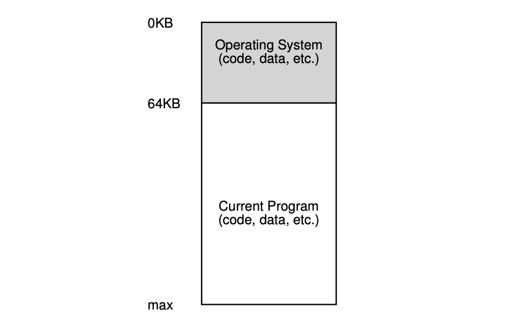
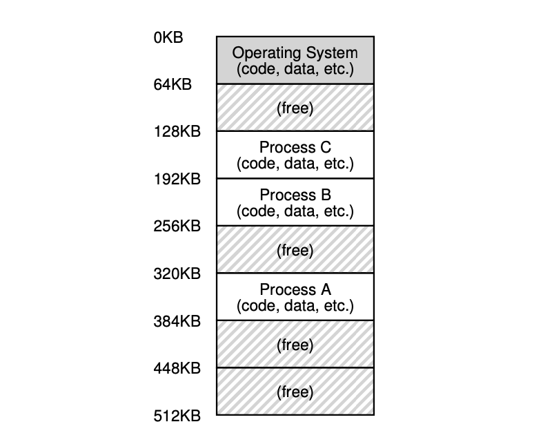
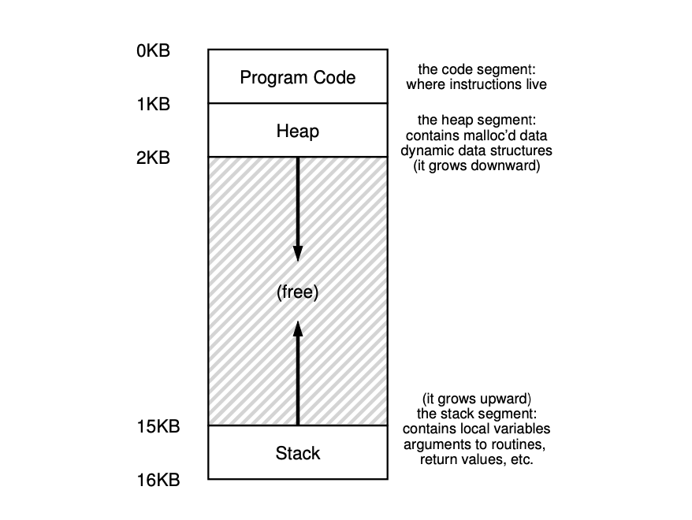

# 13. The Abstraction: Address Spaces

## 13.1 Early Systems

*Operating Systems: The Early Days*.



Early machines didn’t provide much of an abstraction to users.

The OS was a set of routines that sat in memory, and there would be one running
program (a process) that currently sat in physical memory (starting at physical
address 64k in this example) and used the rest of memory.

## 13.2 Multiprogramming and Time Sharing

*Three Processes: Sharing Memory*.



- multiprogramming
- time sharing
- utilization
- efficiency
- interactivity

One way to implement time sharing would be to run one process for a short
while, giving it full access to all memory, then stop it, save all of its state
to some kind of disk, load some other process’s state, run it for a while, and
thus implement some kind of crude sharing of the machine.

Unfortunately, this approach is way too slow, particularly as memory grows.
While saving and restoring register-level state is relatively fast, saving the
entire contents of memory to disk is brutally non-performant. Thus, what we’d
rather do is leave processes in memory while switching between them, allowing
the OS to implement time sharing efficiently.

In the diagram, there are three processes (A, B, and C) and each of them have a
small part of the 512KB physical memory carved out for them. Assuming a single
CPU, the OS chooses to run one of the processes, while the others sit in the
ready queue waiting to run.

In particular, allowing multiple programs to reside concurrently in memory
makes protection an important issue: a process might able to read, or worse,
write some other process’s memory.

## 13.3 The Address Space

*An Example Address Space*.



We call this abstraction of physical memory the address space, and it is the
running program’s view of memory in the system.

The address space of a process contains all of the memory state of the running
program. The code of the program have to live in memory somewhere. The program,
while it is running, uses a stack to keep track of where it is in the function
call chain as well as to allocate local variables and pass parameters and
return values to and from routines. Finally, the heap is used for
dynamically-allocated, user-managed memory, such as that you might receive from
a call to `malloc()` in C or new in an object-oriented language such as C++ or
Java. There are other things in there too (e.g., statically-initialized
variables). For now just assume those three components: code, stack, and heap.

In the Figure, we have a tiny address space (only 16KB). The program code lives
at the top of the address space (starting at 0 in this example, and is packed
into the first 1K of the address space). Code is static, so we can place it at
the top of the address space and know that it won’t need any more space as the
program runs.

Next, we have the two regions of the address space that may grow (and shrink)
while the program runs. Those are the heap (at the top) and the stack (at the
bottom). We place them like this because each wishes to be able to grow, and by
putting them at opposite ends of the address space, we can allow such growth:
they just have to grow in opposite directions. The heap thus starts just after
the code (at 1KB) and grows downward (say when a user requests more memory via
`malloc()`); the stack starts at 16KB and grows upward (say when a user makes a
procedure call). However, this placement of stack and heap is just a
convention.

When we describe the address space, what we are describing is the abstraction
that the OS is providing to the running program. The program really isn’t in
memory at physical addresses 0 through 16KB; rather it is loaded at some
arbitrary physical address(es). And hence the problem: **HOW TO VIRTUALIZE
MEMORY**

### TIP: THE PRINCIPLE OF ISOLATION

If two entities are properly isolated from one another, this implies that one
can fail without affecting the other. Operating systems strive to isolate
processes from each other and in this way prevent one from harming the other.
By using memory isolation, the OS further ensures that running programs cannot
affect the operation of the underlying OS. Some modern OS’s take isolation even
further, by walling off pieces of the OS from other pieces of the OS. Such
**microkernels** thus may provide greater reliability than typical monolithic
kernel designs.

## 13.4 Goals

To virtualize memory.

### Transparency

One major goal of a virtual memory (VM) system is **transparency**. The OS
should implement virtual memory in a way that is invisible to the running
program. Thus, the program shouldn’t be aware of the fact that memory is
virtualized; rather, the program behaves as if it has its own private physical
memory. Behind the scenes, the OS (and hardware) does all the work to multiplex
memory among many different jobs, and hence implements the illusion.

### Efficiency

Another goal of VM is **efficiency**. The OS should strive to make the
virtualization as efficient as possible, both in terms of time and space. In
implementing time-efficient virtualization, the OS will have to rely on
hardware support, including hardware features such as TLBs.

### Protection

Finally, a third VM goal is **protection**. The OS should make sure to protect
processes from one another as well as the OS itself from processes. When one
process performs a load, a store, or an instruction fetch, it should not be
able to access or affect in any way the memory contents of any other process or
the OS itself. Protection thus enables us to deliver the property of isolation
among processes; each process should be running in its own isolated cocoon,
safe from the ravages of other faulty or even malicious processes.

### EVERY ADDRESS YOU SEE IS VIRTUAL

In fact, any address you can see as a programmer of a user-level program is a
virtual address. It’s only the OS, through its tricky techniques of
virtualizing memory, that knows where in the physical memory of the machine
these instructions and data values lie. So never forget: if you print out an
address in a program, it’s a virtual one, an illusion of how things are laid
out in memory; only the OS (and the hardware) knows the real truth.

Here’s a little program (va.c) that prints out the locations of the `main()`
routine, the value of a heap-allocated value returned from `malloc()`, and the
location of an integer on the stack:

```c
#include <stdio.h>
#include <stdlib.h>

int main(int argc, char *argv[])
{
    printf("location of code : %p\n", main);
    printf("location of heap : %p\n", malloc(100e6));
    int x = 3;
    printf("location of stack: %p\n", &x);
    return 0;
}
```

## 13.5 Summary

The VM (virtual memory) system is responsible for providing the illusion of a
large, sparse, private address space to programs, which hold all of their
instructions and data therein. The OS will take each of these virtual memory
references, and turn them into physical addresses. The OS will do this for many
processes at once, making sure to protect programs from one another, as well as
protect the OS.

## Homework

- The `free` command
- The `pmap` command
