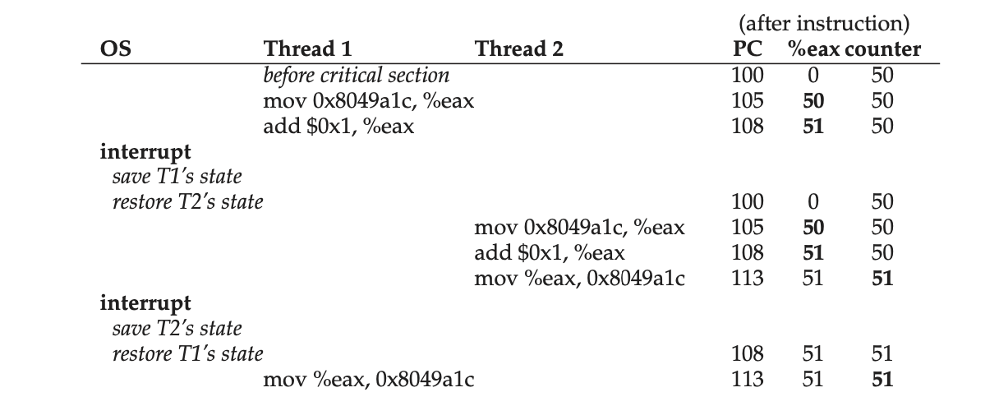

# 26. Concurrency: An Introduction

**Thread** is very much like a separate process, except for one difference:
they share the same address space and thus can access the same data.

The state of a single thread is thus very similar to that of a process. It has
a program counter (PC) that tracks where the program is fetching instructions
from. Each thread has its own private set of registers it uses for computation;
thus, if there are two threads that are running on a single processor, when
switching from running one (T1) to running the other (T2), a **context switch**
must take place. The context switch between threads is quite similar to the
context switch between processes, as the register state of T1 must be saved and
the register state of T2 restored before running T2. With processes, we saved
state to a **process control block (PCB)**; now, we’ll need one or more
**thread control blocks (TCBs)** to store the state of each thread of a
process. There is one major difference, though, in the context switch we
perform between threads as compared to processes: the address space remains the
same (i.e., there is no need to switch which page table we are using).

*26.1 Single-Threaded And Multi-Threaded Address Spaces*.


One other major difference between threads and processes concerns the stack. In
our simple model of the address space of a classic process (which we can now
call a **single-threaded** process), there is a single stack, usually residing
at the bottom of the address space (Figure 26.1, left).

However, in a multi-threaded process, each thread runs independently and of
course may call into various routines to do whatever work it is doing. Instead
of a single stack in the address space, there will be one per thread. Let’s say
we have a multi-threaded process that has two threads in it; the resulting
address space looks different (Figure 26.1, right).

In this figure, you can see two stacks spread throughout the address space of
the process. Thus, any stack-allocated variables, parameters, return values,
and other things that we put on the stack will be placed in what is sometimes
called thread-local storage.

## 26.1 Why Use Threads?

There are at least two major reasons you should use threads.

- The first is simple: **parallelism**. The task of transforming your standard
  **single-threaded** program into a program that does this sort of work on
  multiple CPUs is called **parallelization**, and using a thread per CPU to do
  this work is a natural and typical way to make programs run faster on modern
  hardware.
- The second reason is a bit more subtle: to avoid blocking program progress
  due to slow I/O. Many modern server-based applications (web servers, database
  management systems, and the like) make use of threads in their
  implementations.

Threads share an address space and thus make it easy to share data, and hence
are a natural choice when constructing these types of programs.

Processes are a more sound choice for logically separate tasks where little
sharing of data structures in memory is needed.

## 26.2 An Example: Thread Creation

```c
#include <stdio.h>
#include <stdlib.h>
#include <pthread.h>

#include "common.h"
#include "common_threads.h"

void *mythread(void *arg)
{
    printf("%s\n", (char *)arg);
    return NULL;
}

int main(int argc, char *argv[])
{
    if (argc != 1)
    {
        fprintf(stderr, "usage: main\n");
        exit(1);
    }

    pthread_t p1, p2;
    printf("main: begin\n");
    Pthread_create(&p1, NULL, mythread, "A");
    Pthread_create(&p2, NULL, mythread, "B");
    // join waits for the threads to finish
    Pthread_join(p1, NULL);
    Pthread_join(p2, NULL);
    printf("main: end\n");
    return 0;
}
```

Once a thread is created, it may start running right away (depending on the
whims of the scheduler); alternately, it may be put in a “ready” but not
“running” state and thus not run yet. Of course, on a multiprocessor, the
threads could even be running at the same time.

After creating the two threads (let’s call them T1 and T2), the main thread
calls `pthread_join()`, which waits for a particular thread to complete. It
does so twice, thus ensuring T1 and T2 will run and complete before finally
allowing the main thread to run again; when it does, it will print “main: end”
and exit. Overall, three threads were employed during this run:
`the main thread`, `T1`, and `T2`.

In fact, given a sequence of instructions, there are quite a few, depending on
which thread the scheduler decides to run at a given point. Once a thread is
created, it may run immediately.

*Thread Trace (1)*.

```trace
main                                Thread 1        Thread 2
----                                --------        --------
starts running
prints "main: begin"
creates Thread 1
creates Thread 2
waits for T1
                                    runs
                                    prints "A"
                                    returns
waits for T2
                                                    runs
                                                    prints "B"
                                                    returns
prints "main: end"
```

*Thread Trace (2)*.

```trace
main                                Thread 1        Thread 2
----                                --------        --------
starts running
prints "main: begin"
creates Thread 1
                                    runs
                                    prints "A"
                                    returns
creates Thread 2
                                                    runs
                                                    prints "B"
                                                    returns
waits for T1
  returns imdmdiately; T1 is done
waits for T2
  returns imdmdiately; T2 is done
prints "main: end"
```

*Thread Trace (3)*.

```trace
main                                Thread 1        Thread 2
----                                --------        --------
starts running
prints "main: begin"
creates Thread 1
creates Thread 2
                                                    runs
                                                    prints "B"
                                                    returns
waits for T1
                                    runs
                                    prints "A"
                                    returns
waits for T2
  returns imdmdiately; T2 is done
prints "main: end"
```

We also could even see “B” printed before “A” if the scheduler decided to run
Thread 2 first even though Thread 1 was created earlier; there is no reason to
assume that a thread that is created first will run first.

As you might be able to see, one way to think about thread creation is that it
is a bit like making a function call; however, instead of first executing the
function and then returning to the caller, the system instead creates a new
thread of execution for the routine that is being called, and it runs
independently of the caller, perhaps before returning from the create, but
perhaps much later. What runs next is determined by the OS **scheduler**, and
although the scheduler likely implements some sensible algorithm, it is hard to
know what will run at any given moment in time.

Threads make life complicated: it is already hard to tell what will run when!
Computers are hard enough to understand without concurrency. Unfortunately,
with concurrency, it simply gets worse.

## 26.3 Why It Gets Worse: Shared Data

```c
#include <stdio.h>
#include <stdlib.h>
#include <pthread.h>

#include "common.h"
#include "common_threads.h"

int max;
volatile int counter = 0; // shared global variable

void *mythread(void *arg)
{
    char *letter = arg;
    int i; // stack (private per thread)
    printf("%s: begin [addr of i: %p]\n", letter, &i);
    for (i = 0; i < max; i++)
    {
        counter = counter + 1; // shared: only one
    }
    printf("%s: done\n", letter);
    return NULL;
}

int main(int argc, char *argv[])
{
    if (argc != 2)
    {
        fprintf(stderr, "usage: main-first <loopcount>\n");
        exit(1);
    }
    max = atoi(argv[1]);

    pthread_t p1, p2;
    printf("main: begin [counter = %d] [%x]\n", counter,
           (unsigned int)&counter);
    Pthread_create(&p1, NULL, mythread, "A");
    Pthread_create(&p2, NULL, mythread, "B");
    // join waits for the threads to finish
    Pthread_join(p1, NULL);
    Pthread_join(p2, NULL);
    printf("main: done\n [counter: %d]\n [should: %d]\n",
           counter, max * 2);
    return 0;
}
```

A simple example where two threads wish to update a global shared variable.

The desired final result is: Twice as the input number.

Unfortunately, sometimes we get:

```sh
gcc -o t1 t1.c -Wall -pthread
./t1

./t1 100000
main: begin [counter = 0] [5e69048]
A: begin [addr of i: 0x70000814ef9c]
B: begin [addr of i: 0x7000081d1f9c]
A: done
B: done
main: done
 [counter: 117271]
 [should: 200000]
```

### Tools

- Disassembler: `objdump`
- Debugger: `gdb`
- Memory profiler: `valgrind`, `purify`

## 26.4 The Heart Of The Problem: Uncontrolled Scheduling

In this case, we wish to simply add a number (1) to counter. Thus, the code
sequence for doing so might look something like this (in x86);

```asm
mov 0x8049a1c, %eax
add $0x1, %eax
mov %eax, 0x8049a1c
```

In this three-instruction sequence, the x86 `mov` instruction is used
first to get the memory value at the address and put it into register `eax`.
Then, the add is performed, adding 1 (0x1) to the contents of the `eax`
register, and finally, the contents of `eax` are stored back into memory at the
same address.

Let us imagine one of our two threads (Thread 1) enters this region of code,
and is thus about to increment `counter` by one. It loads the value of `counter`
(let’s say it’s 50 to begin with) into its register `eax`. Thus, `eax=50` for
Thread 1. Then it adds one to the register; thus `eax=51`. Now, something
unfortunate happens: a timer interrupt goes off; thus, the OS saves the state
of the currently running thread (its PC, its registers including `eax`, etc.)
to the thread’s TCB.

Now something worse happens: Thread 2 is chosen to run, and it enters this same
piece of code. It also executes the first instruction, getting the value of
`counter` and putting it into its `eax` (remember: each thread when running has
its own private registers; the registers are virtualized by the context-switch
code that saves and restores them). The value of `counter` is still 50 at this
point, and thus Thread 2 has `eax=50`. Let’s then assume that Thread 2 executes
the next two instructions, incrementing `eax` by 1 (thus `eax=51`), and then
saving the contents of eax into `counter` (address 0x8049a1c). Thus, the global
variable `counter` now has the value 51.

Finally, another context switch occurs, and Thread 1 resumes running. Recall
that it had just executed the `mov` and `add`, and is now about to perform the
final `mov` instruction. Recall also that `eax=51`. Thus, the final `mov`
instruction executes, and saves the value to memory; the `counter` is set to 51
again.

Put simply, what has happened is this: the code to increment `counter` has been
run twice, but `counter`, which started at 50, is now only equal to 51. A
“correct” version of this program should have resulted in the variable counter
equal to 52.

Assume, for this example, that the above code is loaded at address 100 in
memory, like the following sequence:

```asm
100 mov   0x8049a1c, %eax
105 add   $0x1, %eax
108 mov   %eax, 0x8049a1c
```

*The Problem: Up Close and Personal*.



What we have demonstrated here is called a **race condition** (or, more
specifically, a **data race**): the results depend on the timing execution of
the code. Instead of a nice deterministic computation, we call this result
indeterminate, where it is not known what the output will be and it is indeed
likely to be different across runs.

Because multiple threads executing this code can result in a race condition, we
call this code a **critical section** (临界区). A critical section is a piece of
code that accesses a shared variable (or more generally, a shared resource) and
must not be concurrently executed by more than one thread.

What we really want for this code is what we call **mutual exclusion**. This
property guarantees that if one thread is executing within the critical
section, the others will be prevented from doing so.

Virtually all of these terms were coined by Edsger Dijkstra, who was a pioneer
in the field and indeed won the Turing Award.

## 26.5 The Wish For Atomicity

### USE ATOMIC OPERATIONS

```txt
Atomic operations are one of the most powerful underlying techniques in
building computer systems, from the computer architecture, to concurrent code,
to file systems, database management systems, and even distributed systems.

The idea behind making a series of actions **atomic** is simply expressed with
the phrase “all or nothing”. Sometimes, the grouping of many actions into a
single atomic action is called a transaction.

For example, file systems use techniques such as journaling or copy-on-write in
order to atomically transition their on-disk state, critical for operating
correctly in the face of system failures.
```

One way to solve this problem would be to have more powerful instructions that,
in a single step, did exactly whatever we needed done and thus removed the
possibility of an untimely interrupt. For example, what if we had a super
instruction that looked like this: `memory-add 0x8049a1c, $0x1`.

Assume this instruction adds a value to a memory location, and the hardware
guarantees that it executes **atomically**; when the instruction executed, it
would perform the update as desired. It could not be interrupted
mid-instruction, because that is precisely the guarantee we receive from the
hardware: when an interrupt occurs, either the instruction has not run at all,
or it has run to completion; there is no in-between state.

In the general case, we won’t have such an instruction. Imagine we were
building a concurrent B-tree, and wished to update it; would we really want the
hardware to support an “atomic update of B-tree” instruction? Probably not, at
least in a sane instruction set.

Thus, what we will instead do is ask the hardware for a few useful instructions
upon which we can build a general set of what we call
**synchronization primitives** (同步原语). By using this hardware support, in
combination with some help from the operating system, we will be able to build
multi-threaded code that accesses critical sections in a synchronized and
controlled manner, and thus reliably produces the correct result despite the
challenging nature of concurrent execution.

THE CRUX: **HOW TO SUPPORT SYNCHRONIZATION**

## 26.6 One More Problem: Waiting For Another

There is another common interaction that arises, where one thread must wait for
another to complete some action before it continues. This interaction arises,
for example, when a process performs a disk I/O and is put to sleep; when the
I/O completes, the process needs to be roused from its slumber so it can
continue.

## 26.7 Summary: Why in OS Class?

Why are we studying this in OS class? “History” is the one-word answer; the OS
was the first concurrent program, and many techniques were created for use
within the OS. Later, with multi-threaded processes, application programmers
also had to consider such things.

Not surprisingly, page tables, process lists, file system structures, and
virtually every kernel data structure has to be carefully accessed, with the
proper synchronization primitives, to work correctly.

## KEY CONCURRENCY TERMS

- A **critical section (临界区)** is a piece of code that accesses a shared
  resource, usually a variable or data structure.
- A **race condition (条件竞争)** (or data race) arises if multiple threads of
  execution enter the critical section at roughly the same time; both attempt
  to *update* the shared data structure, leading to a surprising outcome.
- An **indeterminate (不确定性)** program consists of one or more race
  conditions; the output of the program varies from run to run, depending on
  which threads ran when. The outcome is thus not deterministic, something we
  usually expect from computer systems.
- To avoid these problems, threads should use some kind of
  **mutual exclusion (互斥)** primitives; doing so guarantees that only a
  single thread ever enters a critical section, thus avoiding races, and
  resulting in deterministic program outputs.

## Homework (Simulation)

1. `./x86.py -p loop.s -t 1 -i 100 -R dx`
2. `./x86.py -p loop.s -t 2 -i 100 -a dx=3,dx=3 -R dx`
3. `./x86.py -p loop.s -t 2 -i 3 -r -a dx=3,dx=3 -R dx`
4. `./x86.py -p looping-race-nolock.s -t 1 -M 2000`
5. `./x86.py -p looping-race-nolock.s -t 2 -a bx=3 -M 2000`
6. `./x86.py -p looping-race-nolock.s -t 2 -M 2000 -i 4 -r -s 0`
7. `./x86.py -p looping-race-nolock.s -a bx=1 -t 2 -M 2000 -i 1`
8. `./x86.py -p looping-race-nolock.s -a bx=100 -t 2 -M 2000 -i 1`
9. `./x86.py -p wait-for-me.s -a ax=1,ax=0 -R ax -M 2000`
10. `./x86.py -p wait-for-me.s -a ax=0,ax=1 -R ax -M 2000`
