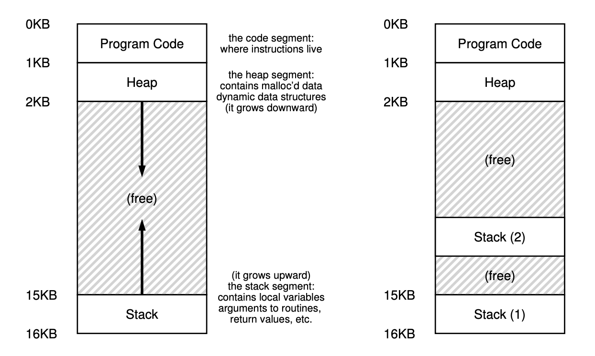

# 26. Concurrency: An Introduction

**Thread** is very much like a separate process, except for one difference:
they share the same address space and thus can access the same data.

The state of a single thread is thus very similar to that of a process. It has
a program counter (PC) that tracks where the program is fetching instructions
from. Each thread has its own private set of registers it uses for computation;
thus, if there are two threads that are running on a single processor, when
switching from running one (T1) to running the other (T2), a **context switch**
must take place. The context switch between threads is quite similar to the
context switch between processes, as the register state of T1 must be saved and
the register state of T2 restored before running T2. With processes, we saved
state to a **process control block (PCB)**; now, we’ll need one or more
**thread control blocks (TCBs)** to store the state of each thread of a
process. There is one major difference, though, in the context switch we
perform between threads as compared to processes: the address space remains the
same (i.e., there is no need to switch which page table we are using).

*26.1 Single-Threaded And Multi-Threaded Address Spaces*.

One other major difference between threads and processes concerns the stack. In
our simple model of the address space of a classic process (which we can now
call a **single-threaded** process), there is a single stack, usually residing
at the bottom of the address space (Figure 26.1, left).

However, in a multi-threaded process, each thread runs independently and of
course may call into various routines to do whatever work it is doing. Instead
of a single stack in the address space, there will be one per thread. Let’s say
we have a multi-threaded process that has two threads in it; the resulting
address space looks different (Figure 26.1, right).

In this figure, you can see two stacks spread throughout the address space of
the process. Thus, any stack-allocated variables, parameters, return values,
and other things that we put on the stack will be placed in what is sometimes
called thread-local storage.

## 26.1 Why Use Threads?

There are at least two major reasons you should use threads.

- The first is simple: **parallelism**. The task of transforming your standard
  **single-threaded** program into a program that does this sort of work on
  multiple CPUs is called **parallelization**, and using a thread per CPU to do
  this work is a natural and typical way to make programs run faster on modern
  hardware.
- The second reason is a bit more subtle: to avoid blocking program progress
  due to slow I/O. Many modern server-based applications (web servers, database
  management systems, and the like) make use of threads in their
  implementations.

Threads share an address space and thus make it easy to share data, and hence
are a natural choice when constructing these types of programs.

Processes are a more sound choice for logically separate tasks where little
sharing of data structures in memory is needed.

## 26.2 An Example: Thread Creation
