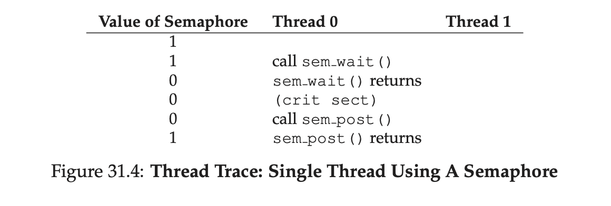
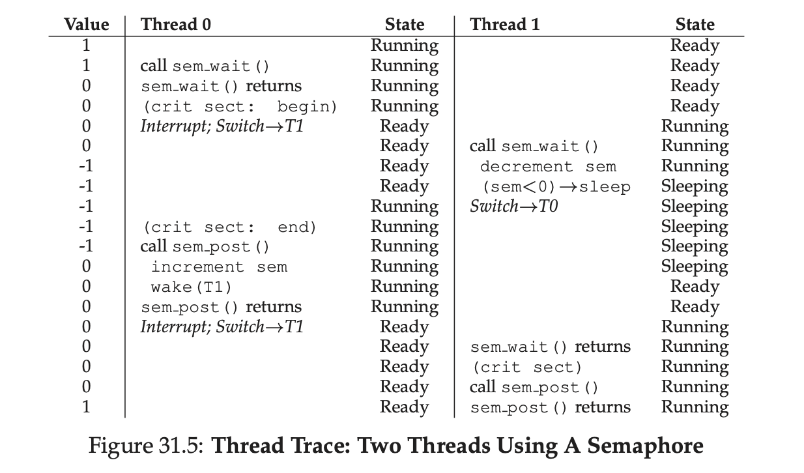
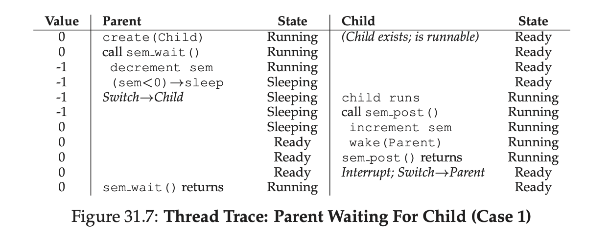
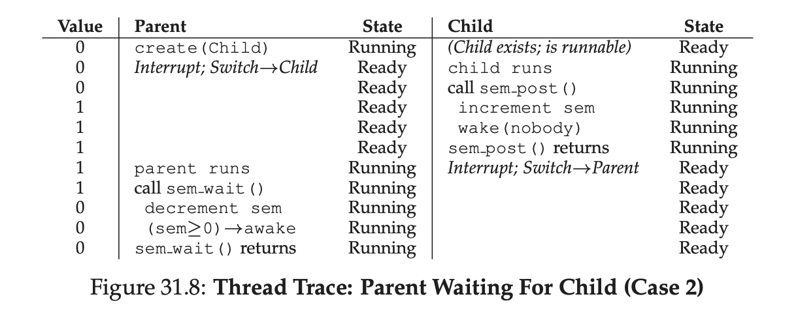
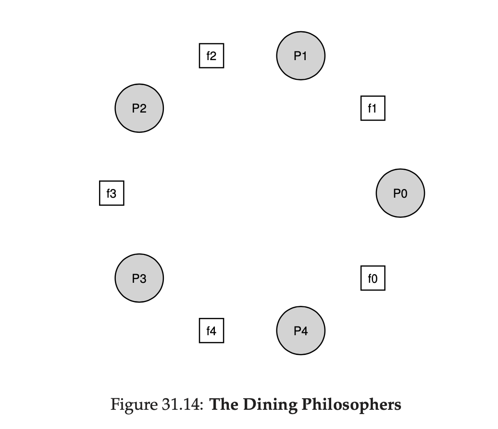

# 31. Semaphores

As we know now, one needs both locks and condition variables to solve a broad
range of relevant and interesting concurrency problems. One of the first people
to realize this years ago was **Edsger Dijkstra** (though it is hard to know
the exact history), known among other things for his famous “shortest paths”
algorithm in graph theory, an early polemic on structured programming entitled
“Goto Statements Considered Harmful”, and, in the case we will study here, the
introduction of a synchronization primitive called the **semaphore**. Indeed,
Dijkstra and colleagues invented the semaphore as a single primitive for all
things related to synchronization; as you will see, one can use semaphores as
both locks and condition variables.

THE CRUX: **HOW TO USE SEMAPHORES**

How can we use semaphores instead of locks and condition variables? What is the
definition of a semaphore? What is a binary semaphore? Is it straightforward to
build a semaphore out of locks and condition variables? To build locks and
condition variables out of semaphores?

## 31.1 Semaphores: A Definition

A semaphore is an object with an integer value that we can manipulate with two
routines; in the POSIX standard, these routines are `sem_wait()` (`P()`) and
`sem_post()` (`V()`). Because the initial value of the semaphore determines its
behavior, before calling any other routine to interact with the semaphore, we
must first initialize it to some value, as the code in Figure 31.1 does.

Figure 31.1: **Initializing A Semaphore**

```c
#include <semaphore.h>
sem_t s;
sem_init(&s, 0, 1);
```

Historically, `sem_wait()` was called `P()` by Dijkstra and `sem_post()` called
`V()`. `P()` comes from "prolaag", a contraction of "probeer" (Dutch for “try”)
and "verlaag" ("decrease"); `V()` comes from the Dutch word "verhoog" which
means "increase". Sometimes, people call them down and up. Use the Dutch
versions to impress your friends, or confuse them, or both.

In the figure, we declare a semaphore `s` and initialize it to the value 1 by
passing 1 in as the third argument. The second argument to `sem_init()` will be
set to 0 in all of the examples we’ll see; this indicates that the semaphore is
shared between threads in the same process. See the man page for details on
other usages of semaphores (namely, how they can be used to synchronize access
across *different* processes), which require a different value for that second
argument.

After a semaphore is initialized, we can call one of two functions to interact
with it, `sem_wait()` or `sem_post()`. The behavior of these two functions is
seen in Figure 31.2.

Figure 31.2: **Semaphore: Definitions Of Wait And Post**

```c
int sem_wait(sem_t *s)
{
    // decrement the value of semaphore s by one
    // wait if value of semaphore s is negative
}

int sem_post(sem_t *s)
{
    // increment the value of semaphore s by one
    // if there are one or more threads waiting, awake one
}
```

For now, we are not concerned with the implementation of these routines, which
clearly requires some care; with multiple threads calling into `sem_wait()` and
`sem_post()`, there is the obvious need for managing these critical sections.
We will now focus on how to *use* these primitives; later we may discuss how
they are built.

We should discuss a few salient aspects of the interfaces here.

- First, we can see that `sem_wait()` will either return right away (because
  the value of the semaphore was one or higher when we called `sem_wait()`), or
  it will cause the caller to suspend execution waiting for a subsequent post.
  Of course, multiple calling threads may call into `sem_wait()`, and thus all
  be queued waiting to be woken.
- Second, we can see that `sem_post()` does not wait for some particular
  condition to hold like `sem_wait()` does. Rather, it simply increments the
  value of the semaphore and then, if there is a thread waiting to be woken,
  wakes one of them up.
- Third, the value of the semaphore, when negative, is **equal to the number of
  waiting threads**. Though the value generally isn’t seen by users of the
  semaphores, this invariant is worth knowing and perhaps can help you remember
  how a semaphore functions.

Don’t worry (yet) about the seeming race conditions possible within the
semaphore; assume that the actions they make are performed atomically. We will
soon use locks and condition variables to do just this.

## 31.2 Binary Semaphores (Locks)

Our first use will be one with which we are already familiar: using a semaphore
as a lock. See Figure 31.3 for a code snippet; therein, you’ll see that we
simply surround the critical section of interest with a `sem_wait()` /
`sem_post()` pair. Critical to making this work, though, is the initial value
of the semaphore `m` (initialized to `X` in the figure). What should X be?

Figure 31.3: **A Binary Semaphore (That Is, A Lock)**

```c
sem_t m;
sem_init(&m, 0, X); // initialize semaphore to X; what should X be?

sem_wait(&m);
// critical section here
sem_post(&m);
```

Looking back at definition of the `sem_wait()` and `sem_post()` routines above,
we can see that the initial value should be 1.

To make this clear, let’s imagine a scenario with two threads. The first thread
(Thread 0) calls `sem_wait()`; it will first decrement the value of the
semaphore, changing it to 0. Then, it will wait only if the value is not
greater than or equal to 0. Because the value is 0, `sem_wait()` will simply
return and the calling thread will continue; Thread 0 is now free to enter the
critical section. If no other thread tries to acquire the lock while Thread 0
is inside the critical section, when it calls `sem_post()`, it will simply
restore the value of the semaphore to 1 (and not wake a waiting thread, because
there are none). Figure 31.4 shows a trace of this scenario.

Figure 31.4: **Thread Trace: Single Thread Using A Semaphore**



A more interesting case arises when Thread 0 “holds the lock” (i.e., it has
called `sem_wait()` but not yet called `sem_post()`), and another thread
(Thread 1) tries to enter the critical section by calling `sem_wait()`. In this
case, Thread 1 will decrement the value of the semaphore to -1, and thus wait
(putting itself to sleep and relinquishing the processor). When Thread 0 runs
again, it will eventually call `sem_post()`, incrementing the value of the
semaphore back to zero, and then wake the waiting thread (Thread 1), which will
then be able to acquire the lock for itself. When Thread 1 finishes, it will
again increment the value of the semaphore, restoring it to 1 again.

Figure 31.5 shows a trace of this example. In addition to thread actions, the
figure shows the **scheduler state** of each thread: Running, Ready (i.e.,
runnable but not running), and Sleeping. Note in particular that Thread 1 goes
into the sleeping state when it tries to acquire the already-held lock; only
when Thread 0 runs again can Thread 1 be awoken and potentially run again.

Figure 31.5: **Thread Trace: Two Threads Using A Semaphore**



If you want to work through your own example, try a scenario where multiple
threads queue up waiting for a lock. What would the value of the semaphore be
during such a trace?

Thus we are able to use semaphores as locks. Because locks only have two states
(held and not held), we sometimes call a semaphore used as a lock a
*binary semaphore**. Note that if you are using a semaphore only in this binary
fashion, it could be implemented in a simpler manner than the generalized
semaphores we present here.

## 31.3 Semaphores For Ordering

Semaphores are also useful to order events in a concurrent program. For
example, a thread may wish to wait for a list to become non-empty, so it can
delete an element from it. In this pattern of usage, we often find one thread
*waiting* for something to happen, and another thread making that something
happen and then *signaling* that it has happened, thus waking the waiting
thread. We are thus using the semaphore as an **ordering primitive** (similar
to our use of **condition variables** earlier).

A simple example is as follows. Imagine a thread creates another thread and
then wants to wait for it to complete its execution (Figure 31.6). When this
program runs, we would like to see the following:

```order
parent: begin
child
parent: end
```

Figure 31.6: **A Parent Waiting For Its Child**

```c
sem_t s;

void *child(void *arg)
{
    printf("child\n");
    sem_post(&s); // signal here: child is done
    return NULL;
}

int main(int argc, char *argv[])
{
    sem_init(&s, 0, X); // what should X be?
    printf("parent: begin\n");
    pthread_t c;
    Pthread_create(&c, NULL, child, NULL);
    sem_wait(&s); // wait here for child
    printf("parent: end\n");
    return 0;
}
```

The question, then, is how to use a semaphore to achieve this effect; as it
turns out, the answer is relatively easy to understand. As you can see in the
code, the parent simply calls `sem_wait()` and the child `sem_post()` to wait
for the condition of the child finishing its execution to become true. However,
this raises the question: what should the initial value of this semaphore be?

The answer, of course, is that the value of the semaphore should be set to is
`0`. There are two cases to consider. First, let us assume that the parent
creates the child but the child has not run yet (i.e., it is sitting in a ready
queue but not running). In this case (Figure 31.7, page 6), the parent will
call `sem_wait()` before the child has called `sem_post()`; we’d like the
parent to wait for the child to run. The only way this will happen is if the
value of the semaphore is not greater than 0; hence, 0 is the initial value.
The parent runs, decrements the semaphore (to -1), then waits (sleeping). When
the child finally runs, it will call `sem_post()`, increment the value of the
semaphore to 0, and wake the parent, which will then return from `sem_wait()`
and finish the program.

Figure 31.7: **Thread Trace: Parent Waiting For Child (Case 1)**



The second case (Figure 31.8, page 6) occurs when the child runs to completion
before the parent gets a chance to call `sem_wait()`. In this case, the child
will first call `sem_post()`, thus incrementing the value of the semaphore from
0 to 1. When the parent then gets a chance to run, it will call `sem_wait()`
and find the value of the semaphore to be 1; the parent will thus decrement the
value (to 0) and return from `sem_wait()` without waiting, also achieving the
desired effect.

Figure 31.8: **Thread Trace: Parent Waiting For Child (Case 2)**



## 31.4 The Producer/Consumer (Bounded Buffer) Problem

The next problem we will confront in this chapter is known as the
**producer/consumer** problem, or sometimes as the **bounded buffer** problem.
This problem is described in detail in the previous chapter on condition
variables; see there for details.

### First Attempt

Our first attempt at solving the problem introduces two semaphores, `empty` and
`full`, which the threads will use to indicate when a buffer entry has been
emptied or filled, respectively. The code for the put and get routines is in
Figure 31.9, and our attempt at solving the producer and consumer problem is in
Figure 31.10.

Figure 31.9: **The Put And Get Routines**

```c
int buffer[MAX];
int fill = 0;
int use = 0;

void put(int value)
{
    buffer[fill] = value;    // Line F1
    fill = (fill + 1) % MAX; // Line F2
}

int get()
{
    int tmp = buffer[use]; // Line G1
    use = (use + 1) % MAX; // Line G2
    return tmp;
}
```

Figure 31.10: **Adding The Full And Empty Conditions**

```c
sem_t empty;
sem_t full;

void *producer(void *arg)
{
    int i;
    for (i = 0; i < loops; i++)
    {
        sem_wait(&empty); // Line P1
        put(i);           // Line P2
        sem_post(&full);  // Line P3
    }
}

void *consumer(void *arg)
{
    int i, tmp = 0;
    while (tmp != -1)
    {
        sem_wait(&full);  // Line C1
        tmp = get();      // Line C2
        sem_post(&empty); // Line C3
        printf("%d\n", tmp);
    }
}

int main(int argc, char *argv[])
{
    // ...
    sem_init(&empty, 0, MAX); // MAX buffers are empty to begin with...
    sem_init(&full, 0, 0);    // ...and 0 are full
}
```

In this example, the producer first waits for a buffer to become empty in order
to put data into it, and the consumer similarly waits for a buffer to become
filled before using it. Let us first imagine that `MAX=1` (there is only one
buffer in the array), and see if this works.

Imagine again there are two threads, a producer and a consumer. Let us examine
a specific scenario on a single CPU. Assume the consumer gets to run first.
Thus, the consumer will hit Line C1 in Figure 31.10, calling `sem_wait(&full)`.
Because full was initialized to the value 0, the call will decrement `full` (to
-1), block the consumer, and wait for another thread to call `sem_post()` on
`full`, as desired.

Assume the producer then runs. It will hit Line P1, thus calling the
`sem_wait(&empty)` routine. Unlike the consumer, the producer will continue
through this Line, because empty was initialized to the value MAX (in this
case, 1). Thus, empty will be decremented to 0 and the producer will put a data
value into the first entry of buffer (Line P2). The producer will then continue
on to P3 and call `sem_post(&full)`, changing the value of the full semaphore
from -1 to 0 and waking the consumer (e.g., move it from blocked to ready).

In this case, one of two things could happen. If the producer continues to run,
it will loop around and hit Line P1 again. This time, however, it would block,
as the empty semaphore’s value is 0. If the producer instead was interrupted
and the consumer began to run, it would call `sem_wait(&full)` (Line C1) and
find that the buffer was indeed full and thus consume it. In either case, we
achieve the desired behavior.

You can try this same example with more threads (e.g., multiple producers, and
multiple consumers). It should still work.

Let us now imagine that `MAX` is greater than 1 (say `MAX = 10`). For this
example, let us assume that there are multiple producers and multiple
consumers. We now have a problem: a race condition. Do you see where it occurs?
If you can’t see it, here’s a hint: look more closely at the `put()` and `get()`
code.

Imagine two producers (Pa and Pb) both calling into `put()` at roughly the same
time. Assume producer Pa gets to run first, and just starts to fill the first
buffer entry (fill = 0 at Line F1). Before Pa gets a chance to increment the
fill counter to 1, it is interrupted. Producer Pb starts to run, and at Line F1
it also puts its data into the 0th element of buffer, which means that the old
data there is overwritten! This is a no-no; we don’t want any data from the
producer to be lost.

### A Solution: Adding Mutual Exclusion

As you can see, what we’ve forgotten here is *mutual exclusion*. The filling of
a buffer and incrementing of the index into the buffer is a critical section,
and thus must be guarded carefully. So let’s use our friend the binary
semaphore and add some locks. Figure 31.11 shows our attempt.

Figure 31.11: **Adding Mutual Exclusion (Incorrectly)**

```c
sem_t empty;
sem_t full;
sem_t mutex;

void *producer(void *arg)
{
    int i;
    for (i = 0; i < loops; i++)
    {
        sem_wait(&mutex); // Line P0 (NEW LINE)
        sem_wait(&empty); // Line P1
        put(i);           // Line P2
        sem_post(&full);  // Line P3
        sem_post(&mutex); // Line P4 (NEW LINE)
    }
}

void *consumer(void *arg)
{
    int i;
    for (i = 0; i < loops; i++)
    {
        sem_wait(&mutex); // Line C0 (NEW LINE)
        sem_wait(&full);  // Line C1
        int tmp = get();  // Line C2
        sem_post(&empty); // Line C3
        sem_post(&mutex); // Line C4 (NEW LINE)
        printf("%d\n", tmp);
    }
}

int main(int argc, char *argv[])
{
    // ...
    sem_init(&empty, 0, MAX); // MAX buffers are empty to begin with...
    sem_init(&full, 0, 0);    // ... and 0 are full
    sem_init(&mutex, 0, 1);   // mutex=1 because it is a lock (NEW LINE)
    // ...
}
```

Now we’ve added some locks around the entire `put()/get()` parts of the code,
as indicated by the `NEW LINE` comments. That seems like the right idea, but it
also doesn’t work. Why? Deadlock. Why does deadlock occur? What sequence of
steps must happen for the program to deadlock?

### Avoiding Deadlock

OK, now that you figured it out, here is the answer. Imagine two threads, one
producer and one consumer. The consumer gets to run first. It acquires the
mutex (Line C0), and then calls `sem_wait()` on the full semaphore (Line C1);
because there is no data yet, this call causes the consumer to block and thus
yield the CPU; importantly, though, the consumer still holds the lock.

A producer then runs. It has data to produce and if it were able to run, it
would be able to wake the consumer thread and all would be good. Unfortunately,
the first thing it does is call `sem_wait()` on the binary mutex semaphore
(Line P0). The lock is already held. Hence, the producer is now stuck waiting
too.

There is a simple cycle here. The consumer holds the mutex and is *waiting* for
the someone to signal full. The producer could *signal* full but is *waiting*
for the mutex. Thus, the producer and consumer are each stuck waiting for each
other: a classic deadlock.

### At Last, A Working Solution

To solve this problem, we simply must reduce the scope of the lock. Figure
31.12 shows the correct solution. As you can see, we simply move the mutex
acquire and release to be just around the critical section; the full and empty
wait and signal code is left outside. The result is a simple and working
bounded buffer, a commonly-used pattern in multi-threaded programs. Understand
it now; use it later.

Figure 31.12: **Adding Mutual Exclusion (Correctly)**

```c
sem_t empty;
sem_t full;
sem_t mutex;

void *producer(void *arg)
{
    int i;
    for (i = 0; i < loops; i++)
    {
        sem_wait(&empty); // Line P1
        sem_wait(&mutex); // Line P1.5 (Moved MUTEX HERE...)
        put(i);           // Line P2
        sem_post(&mutex); // Line P2.5 (... AND HERE)
        sem_post(&full);  // Line P3
    }
}

void *consumer(void *arg)
{
    int i;
    for (i = 0; i < loops; i++)
    {
        sem_wait(&full);  // Line C1
        sem_wait(&mutex); // Line C1.5 (MOVED MUTEX HERE...)
        int tmp = get();  // Line C2
        sem_post(&mutex); // Line C2.5 (... AND HERE)
        sem_post(&empty); // Line C3
        printf("%d\n", tmp);
    }
}

int main(int argc, char *argv[])
{
    // ...
    sem_init(&empty, 0, MAX); // MAX buffers are empty to begin with...
    sem_init(&full, 0, 0);    // ... and 0 are full
    sem_init(&mutex, 0, 1);   // mutex=1 because it is a lock (NEW LINE)
    // ...
}
```

## 31.5 Reader-Writer Locks

Another classic problem stems from the desire for a more flexible locking
primitive that admits that different data structure accesses might require
different kinds of locking. For example, imagine a number of concurrent list
operations, including inserts and simple lookups. While inserts change the
state of the list (and thus a traditional critical section makes sense),
lookups simply *read* the data structure; as long as we can guarantee that no
insert is on-going, we can allow many lookups to proceed concurrently. The
special type of lock we will now develop to support this type of operation is
known as a **reader-writer lock**. The code for such a lock is available in
Figure 31.13.

Figure 31.13: **A Simple Reader-Writer Lock**

```c
typedef struct _rwlock_t
{
    sem_t lock;      // binary semaphore (basic lock)
    sem_t writelock; // used to allow ONE writer or MANY readers
    int readers;     // count of readers reading in critical section
} rwlock_t;

void rwlock_init(rwlock_t *rw)
{
    rw->readers = 0;
    sem_init(&rw->lock, 0, 1);
    sem_init(&rw->writelock, 0, 1);
}

void rwlock_acquire_readlock(rwlock_t *rw)
{
    sem_wait(&rw->lock);
    rw->readers++;
    if (rw->readers == 1)
        sem_wait(&rw->writelock); // first reader acquires writelock
    sem_post(&rw->lock);
}

void rwlock_release_readlock(rwlock_t *rw)
{
    sem_wait(&rw->lock);
    rw->readers--;
    if (rw->readers == 0)
        sem_post(&rw->writelock); // last reader releases writelock
    sem_post(&rw->lock);
}

void rwlock_acquire_writelock(rwlock_t *rw)
{
    sem_wait(&rw->writelock);
}

void rwlock_release_writelock(rwlock_t *rw)
{
    sem_post(&rw->writelock);
}
```

The code is pretty simple. If some thread wants to update the data structure in
question, it should call the new pair of synchronization operations:
`rwlock_acquire_writelock()`, to acquire a write lock, and
`rwlock_release_writelock()`, to release it. Internally, these simply use the
`writelock` semaphore to ensure that only a single writer can acquire the lock
and thus enter the critical section to update the data structure in question.

More interesting is the pair of routines to acquire and release read locks.
When acquiring a read lock, the reader first acquires `lock` and then
increments the `readers` variable to track how many readers are currently
inside the data structure. The important step then taken within
`rwlock_acquire_readlock()` occurs when the first reader acquires the lock; in
that case, the reader also acquires the write lock by calling `sem_wait()` on
the `writelock` semaphore, and then releasing the `lock` by calling
`sem_post()`.

Thus, once a reader has acquired a read lock, more readers will be allowed to
acquire the read lock too; however, any thread that wishes to acquire the write
lock will have to wait until *all* readers are finished; the last one to exit
the critical section calls `sem_post()` on “writelock” and thus enables a
waiting writer to acquire the lock.

This approach works (as desired), but does have some negatives, especially when
it comes to fairness. In particular, it would be relatively easy for readers to
starve writers. More sophisticated solutions to this problem exist; perhaps you
can think of a better implementation? Hint: think about what you would need to
do to prevent more readers from entering the lock once a writer is waiting.

Finally, it should be noted that reader-writer locks should be used with some
caution. They often add more overhead (especially with more sophisticated
implementations), and thus do not end up speeding up performance as compared to
just using simple and fast locking primitives. Either way, they showcase once
again how we can use semaphores in an interesting and useful way.

TIP: **SIMPLE AND DUMB CAN BE BETTER (HILL’S LAW)**

You should never underestimate the notion that the simple and dumb approach can
be the best one. With locking, sometimes a simple spin lock works best, because
it is easy to implement and fast. Although something like reader/writer locks
sounds cool, they are complex, and complex can mean slow. Thus, always try the
simple and dumb approach first.

This idea, of appealing to simplicity, is found in many places. One early
source is Mark Hill’s dissertation, which studied how to design caches for
CPUs. Hill found that simple direct-mapped caches worked better than fancy
set-associative designs (one reason is that in caching, simpler designs enable
faster lookups). As Hill succinctly summarized his work: “Big and dumb is
better.” And thus we call this similar advice **Hill’s Law**.

## 31.6 The Dining Philosophers

One of the most famous concurrency problems posed, and solved, by Dijkstra, is
known as the **dining philosopher’s problem**. The problem is famous because it
is fun and somewhat intellectually interesting; however, its practical utility
is low. However, its fame forces its inclusion here; indeed, you might be asked
about it on some interview, and you’d really hate your OS professor if you miss
that question and don’t get the job. Conversely, if you get the job, please
feel free to send your OS professor a nice note, or some stock options.

The basic setup for the problem is this (as shown in Figure 31.14): assume
there are five “philosophers” sitting around a table. Between each pair of
philosophers is a single fork (and thus, five total). The philosophers each
have times where they think, and don’t need any forks, and times where they
eat. In order to eat, a philosopher needs two forks, both the one on their left
and the one on their right. The contention for these forks, and the
synchronization problems that ensue, are what makes this a problem we study in
concurrent programming.

Figure 31.14: **The Dining Philosophers**



Here is the basic loop of each philosopher:

```c
while (1) {
    think();
    getforks();
    eat();
    putforks();
}
```

The key challenge, then, is to write the routines `getforks()` and `putforks()`
such that there is no deadlock, no philosopher starves and never gets to eat,
and concurrency is high (i.e., as many philosophers can eat at the same time as
possible).

Following Downey’s solutions, we’ll use a few helper functions to get us
towards a solution. They are:

```c
int left(int p) { return p; }
int right(int p) { return (p + 1) % 5; }
```

When philosopher `p` wishes to refer to the fork on their left, they simply
call `left(p)`. Similarly, the fork on the right of a philosopher `p` is
referred to by calling `right(p)`; the modulo operator therein handles the one
case where the last philosopher (`p=4`) tries to grab the fork on their right,
which is fork 0.

We’ll also need some semaphores to solve this problem. Let us assume we have
five, one for each fork: `sem_t forks[5]`.

### Broken Solution

We attempt our first solution to the problem. Assume we initialize each
semaphore (in the `forks` array) to a value of 1. Assume also that each
philosopher knows its own number (`p`). We can thus write the `getforks()` and
`putforks()` routine as shown in Figure 31.15.

Figure 31.15: **The getforks() And putforks() Routines**

```c
void getforks()
{
    sem_wait(forks[left(p)]);
    sem_wait(forks[right(p)]);
}
void putforks()
{
    sem_post(forks[left(p)]);
    sem_post(forks[right(p)]);
}
```

The intuition behind this (broken) solution is as follows. To acquire the
forks, we simply grab a “lock” on each one: first the one on the left, and then
the one on the right. When we are done eating, we release them. Simple, no?
Unfortunately, in this case, simple means broken. Can you see the problem that
arises? Think about it.

The problem is **deadlock**. If each philosopher happens to grab the fork on
their left before any philosopher can grab the fork on their right, each will
be stuck holding one fork and waiting for another, forever. Specifically,
philosopher 0 grabs fork 0, philosopher 1 grabs fork 1, philosopher 2 grabs
fork 2, philosopher 3 grabs fork 3, and philosopher 4 grabs fork 4; all the
forks are acquired, and all the philosophers are stuck waiting for a fork that
another philosopher possesses. We’ll study deadlock in more detail soon; for
now, it is safe to say that this is not a working solution.

### A Solution: Breaking The Dependency

The simplest way to attack this problem is to change how forks are acquired by
at least one of the philosophers; indeed, this is how Dijkstra himself solved
the problem. Specifically, let’s assume that philosopher 4 (the highest
numbered one) acquires the forks in a *different* order. The code to do so is
as follows:

```c
void getforks()
{
    if (p == 4)
    {
        sem_wait(forks[right(p)]);
        sem_wait(forks[left(p)]);
    }
    else
    {
        sem_wait(forks[left(p)]);
        sem_wait(forks[right(p)]);
    }
}
```

Because the last philosopher tries to grab right before left, there is no
situation where each philosopher grabs one fork and is stuck waiting for
another; the cycle of waiting is broken. Think through the ramifications of
this solution, and convince yourself that it works.

There are other “famous” problems like this one, e.g., the
**cigarette smoker’s problem** or the **sleeping barber problem**. Most of them
are just excuses to think about concurrency; some of them have fascinating
names. Look them up if you are interested in learning more, or just getting
more practice thinking in a concurrent manner.

## 31.7 How To Implement Semaphores

Finally, let’s use our low-level synchronization primitives, locks and
condition variables, to build our own version of semaphores called ...
**Zemaphores**. This task is fairly straightforward, as you can see in Figure
31.16.

Figure 31.16: **Implementing Zemaphores With Locks And CVs**

```c
typedef struct __Zem_t
{
    int value;
    pthread_cond_t cond;
    pthread_mutex_t lock;
} Zem_t;

// only one thread can call this
void Zem_init(Zem_t *s, int value)
{
    s->value = value;
    Cond_init(&s->cond);
    Mutex_init(&s->lock);
}

void Zem_wait(Zem_t *s)
{
    Mutex_lock(&s->lock);
    while (s->value <= 0)
        Cond_wait(&s->cond, &s->lock);
    s->value--;
    Mutex_unlock(&s->lock);
}

void Zem_post(Zem_t *s)
{
    Mutex_lock(&s->lock);
    s->value++;
    Cond_signal(&s->cond);
    Mutex_unlock(&s->lock);
}
```

As you can see from the figure, we use just one lock and one condition
variable, plus a state variable to track the value of the semaphore. Study the
code for yourself until you really understand it.

One subtle difference between our Zemaphore and pure semaphores as defined by
Dijkstra is that we don’t maintain the invariant that the value of the
semaphore, when negative, reflects the number of waiting threads; indeed, the
value will never be lower than zero. This behavior is easier to implement and
matches the current Linux implementation.

TIP: **BE CAREFUL WITH GENERALIZATION**

The abstract technique of generalization can thus be quite useful in systems
design, where one good idea can be made slightly broader and thus solve a
larger class of problems. However, be careful when generalizing; as Lampson
warns us “Don’t generalize; generalizations are generally wrong”.

One could view semaphores as a generalization of locks and condition variables;
however, is such a generalization needed? And, given the difficulty of
realizing a condition variable on top of a semaphore, perhaps this
generalization is not as general as you might think.

Curiously, building condition variables out of semaphores is a much trickier
proposition. Some highly experienced concurrent programmers tried to do this in
the Windows environment, and many different bugs ensued. Try it yourself, and
see if you can figure out why building condition variables out of semaphores is
more challenging than it might appear.

## 31.8 Summary

Semaphores are a powerful and flexible primitive for writing concurrent
programs. Some programmers use them exclusively, shunning locks and condition
variables, due to their simplicity and utility.

In this chapter, we have presented just a few classic problems and solutions.
If you are interested in finding out more, there are many other materials you
can reference. One great (and free reference) is Allen Downey’s book on
concurrency and programming with semaphores. This book has lots of puzzles you
can work on to improve your understanding of both semaphores in specific and
concurrency in general. Becoming a real concurrency expert takes years of
effort; going beyond what you learn in this class is undoubtedly the key to
mastering such a topic.

## Homework (Code)

> untouched
