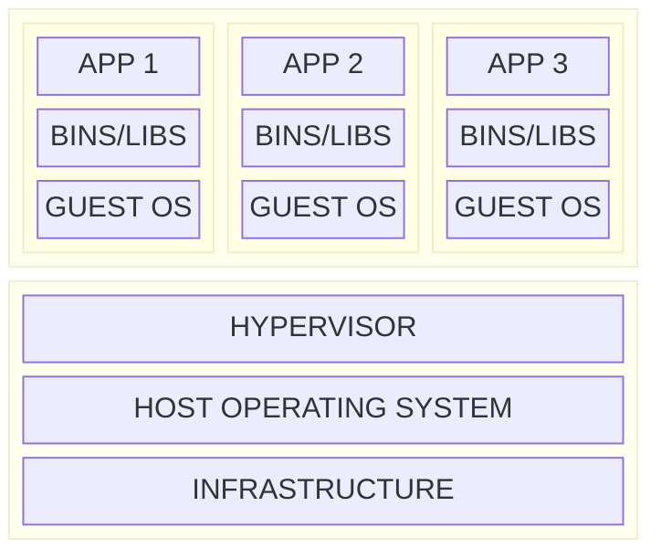
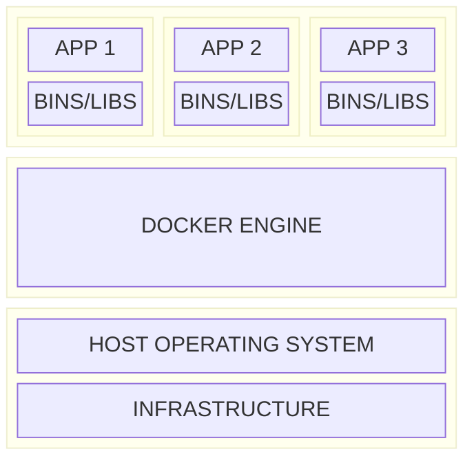

# 第1章 容器与开发语言

- [第1章 容器与开发语言](#第1章-容器与开发语言)
  - [1.1 Docker](#11-docker)
    - [1.1.1 简介](#111-简介)
    - [1.1.2 容器和虚拟机比较](#112-容器和虚拟机比较)
    - [1.1.3 容器加速开发效率](#113-容器加速开发效率)
    - [1.1.4 利用容器合作开发](#114-利用容器合作开发)
    - [1.1.5 利用容器快速扩容](#115-利用容器快速扩容)
    - [1.1.6 安装使用 Docker](#116-安装使用-docker)
  - [1.2 Go](#12-go)
    - [1.2.1 描述](#121-描述)
    - [1.2.2 安装 Go](#122-安装-go)
    - [1.2.3 配置 GOPATH](#123-配置-gopath)
  - [1.3 小结](#13-小结)

## 1.1 Docker

### 1.1.1 简介

Docker wraps all these elements within an entire file system, including:

- Application codes
- Runtime tools
- System tools
- System dependencies

All containers share the same kernel.

Characteristics:

- **Lightweight**: they share the host OS kernel. Images are made up of layered
  file system, allowing them to share the same files.
- **Open**: based on open standards.
- **Secure**: containers are isolated from each other and from the host OS.

### 1.1.2 容器和虚拟机比较

虚拟机：

容器：

### 1.1.3 容器加速开发效率

### 1.1.4 利用容器合作开发

通过 Docker Hub 共享镜像。

### 1.1.5 利用容器快速扩容

秒级启用和停止，可以快速扩容。

### 1.1.6 安装使用 Docker

## 1.2 Go

- 静态强类型
- 编译
- 并发
- 垃圾回收

### 1.2.1 描述

### 1.2.2 安装 Go

### 1.2.3 配置 GOPATH

- `GOPATH` 是真正存放代码的路径：
  - `src`: 存放源代码
  - `pkg`: 存放编译后生成的文件
  - `bin`: 存放编译后的可执行文件
- `go env`

## 1.3 小结
