# Benchmarking BSD and Linux

> <http://bulk.fefe.de/scalability/>
>
> Author: Felix von Leitner
>
> Snapshotted on 2021-10-10 by [Octobug](https://github.com/Octobug)

To contact me, send an email to *felix-benchmark at fefe.de*.

[[here is the code](http://bulk.fefe.de/scalability/#code), and new
measurements will be appended [at the bottom of this page](http://bulk.fefe.de/scalability/#newdata)]

## News

- [NetBSD](http://bulk.fefe.de/scalability/#netbsd2) now scales better than
  even FreeBSD 5!
- [FreeBSD 4.9](http://bulk.fefe.de/scalability/#freebsd) benchmarked as well.
  While some aspects may be more well-tuned, FreeBSD 5.1 scales better.

## Introduction

These benchmarks are the result of my scalable network programming research. My
interest in this area is to see how scalable and fast network applications can
be on standard PC hardware.

I have done most of my research on Linux 2.4, 2.5 and 2.6 kernels using a
home-grown distribution I affectionately call "Leanux". I have experimented
with several APIs and methods to try and get the most scalability and
performance out of a web server. The ultimate goal, however, is to demonstrate
scalability by surviving a [Slashdotting](http://ssadler.phy.bnl.gov/adler/SDE/SlashDotEffect.html)
(Octobug: this link is not reachable anymore).

Please note that most of the sites succumb not only because of bad software but
also because of their internet connectivity being saturated. Besides choosing
an ISP with small bandwidth costs, there is only so much I can do about this. I
hope this ISP can handle the load.

During my research I experimented with several APIs on what abstraction to
choose for the different scalable event notification mechanisms. In the end, I
settled on [Dan Bernstein's IO library interface](http://cr.yp.to/lib/io.html),
which I slightly extended to include an abstraction around `writev` and
`sendfile`. When my implementation worked on Linux, I decided to port the API
to BSD as well, to finally get some real benchmark data into the eternal
flamewar on which IP stack scales best.

To that end, I installed FreeBSD, OpenBSD and NetBSD on my notebook, so all
benchmarks would run on the same hardware.

## About the hardware

The benchmark hardware is a Dell Inspiron 8000 with a 900 MHz Pentium 3 and
256 MB RAM. The network chip is a MiniPCI Intel eepro100 card, which is
supported and well tuned on all operating systems.

Since my intention is to benchmark the software and not the hardware, I didn't
care that it was only a single, slow CPU with slow memory and a slow IDE hard
disk. Real server machines built for high scalability will probably use more
powerful hardware than this.

## Common settings

On all of the operating systems, I took the default settings. If I had to turn
a knob to get PCI IDE DMA enabled, I did so. If the OS had power management
support, I did not disable that. I enabled (and used) IPv6 support on all
operating systems.

## Linux 2.4

I benchmarked a stock Linux 2.4.22 kernel.

## Linux 2.6

I benchmarked a stock Linux 2.6.0-test7 kernel.

## OpenBSD 3.4

I benchmarked an OpenBSD 3.4-CURRENT. I directly installed -CURRENT to get
patched up openssl and openssh versions. The first OpenBSD installation was
wasted because the stupid boot loader (after installing everything) did not
want to boot from the partition, apparently because it is beyond cylinder 1024.
In my opinion, this is absolutely unexcusable for a modern operating system in
the year 2003, and the OpenBSD people should be ashamed of themselves. Linux
and the other BSDs did not have a problem booting from high places.

I ended up reinstalling OpenBSD in the swap partition from my Linux
installation. In the end I had so little space that I had to copy the logs over
to my desktop box after each benchmark, otherwise the filesystem would be full.

OpenBSD also caused a lot of grief on the IPv6 front. The OpenBSD guys
intentionally broke their IPv6 stack to not allow IPv4 connections to and from
IPv6 sockets using the IPv4 mapped addresses that the IPv6 standard defines for
thus purpose. I find this behaviour of pissing on internet standards despicable
and unworthy of free operating systems.

OpenBSD had lots of performance and scalability issues. Particularly
embarassing is the fact that even NetBSD outperforms it on a few benchmarks.
OpenBSD is a fork of NetBSD, so I expected it to be no worse than it's ancestor
in all key areas. I was wrong.

**[Update Oct 22 2003]:** While I received a lot of verbal abuse from OpenBSD
users, the OpenBSD project itself is focusing on solving the issues; the 1024
cylinder limit is apparently being worked on, and the fork panic has been
reproduced and a bug has been opened in the bug tracking system.

**[Update Oct 23 2003]:** Please see [this update](http://bulk.fefe.de/scalability/#bsdforks)
as well. The OpenBSD project has several patches pending in -CURRENT to speed
up bottlenecks identified in these benchmarks, so the next update will probably
look much better for OpenBSD.

**[Update Nov 1 2003]:** To my knowledge OpenBSD still has not integrated all
the patches, so I have not redone all my benchmarks. However, Ted Unangst wrote
me to explain the weird touch-after-mmap behaviour. It turns out that OpenBSD's
buffer cache is not unified in that if you read something with read/pread and
then mmap and touch it, the value is read from disk again. OpenBSD apparently
has a unified buffer cache in the works, but it is not there. Ted suggested
changing my mmap benchmark to improve the OpenBSD graph, but I think that would
not be fair. I, for once, have always used `cat` to put databases into the
buffer cache that are later accessed by a process with random access patters
(djbdns, openldap).

So what my mmap benchmark actually measures on OpenBSD is the disk access time.
This is curious because I ran all the benchmarks 5 times and took the average
time, and it was still zig-zag for all five, which means even if I prime the
mmap cache, OpenBSD will still not cache the whole file. I hope OpenBSD will
use this benchmark as incentive to try integrating the unified buffer cache
again, as it is clearly worth it.

## FreeBSD 5.1

I installed a FreeBSD 5.1-RELEASE on a free partition. However, the kernel
turned out to be unstable under load and would panic or even freeze under load.
So I reluctantly upgraded the kernel to 5.1-CURRENT, which fixed the problems
and proved to be a very stable kernel.

I also upgraded openssl and openssh on this installation. And I amended my
library to use the IPV6_V6ONLY sockopt to get proper IPv6 behaviour from
FreeBSD.

Apart from the stability issues in 5.1-RELEASE, FreeBSD turned out to be very
stable and the fastest and most scalable BSD.

## NetBSD 1.6.1

I installed a NetBSD 1.6.1-RELEASE on a free partition. The kernel was very
stable and had a much snappier feeling to it than OpenBSD, which was the first
BSD I tried out, and I somehow expected NetBSD to be slower than OpenBSD in
every respect. The opposite was true: in particular disk and file system
performance appears to be much better in NetBSD.

Unfortunately, the IPV6_V6ONLY sockopt did not work on NetBSD. One has to use a
sysctl to get the proper IPv6 behaviour. That is unfortunate but bearable.

Since NetBSD did not start any network services per default, I did not feel
obliged to upgrade openssl and openssh. Since the kernel was so stable, I did
not feel I had to try the -CURRENT version. In the mean time I heard that the
-CURRENT version of NetBSD has over two years worth of improvements in it, so
it probably is even better than NetBSD 1.6.1, which already surprised me with
its good performance (although it is clearly outperformed by FreeBSD).

## The socket benchmark

My first benchmark was calling [socket](http://www.opengroup.org/onlinepubs/007904975/functions/socket.html)
ten thousand times. I normally use [gettimeofday](http://www.opengroup.org/onlinepubs/007904975/functions/gettimeofday.html)
for taking the time in benchmarks, but in this case the results were so close
and small that I switched to reading the CPU cycle counter, which has 900 times
finer resolution on my notebook, but makes the results not so easily comparable.

The task we are benchmarking here is the kernel allocating a socket data
structure in kernel (which is easy to do) and selecting the lowest unused file
descriptor (which is not so easy).

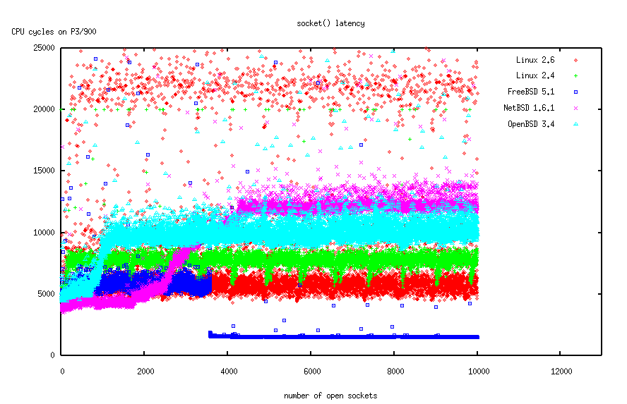

On this benchmark you can see that all the operating systems scale quite well.
While there are variations, there is no O(n) or even worse implementation. I
find the FreeBSD graph particularly interesting, because it indicates some sort
of "cheating" by suddenly being so much faster than all the others (and itself
a few sockets earlier). This looks like the kernel starts pre-allocating file
descriptors when a process has more than 3500 descriptors open or so. I didn't
look in the code, though, and after all there is nothing wrong with this kind
of tweaking.

Conclusion: FreeBSD outperforms all other operating systems in this benchmark.
However, all contestants scale equally well, there are no clear losers. And the
overall latency in this benchmark is so low that the results are
interchangeable in practice. (Note: this initially said "NetBSD" instead of
"FreeBSD". That was a brain fart, sorry, and thanks to Maxwell on Slashdot for
pointing this out)

## The bind benchmark

The second benchmark is calling [bind](http://www.opengroup.org/onlinepubs/007904975/functions/bind.html)
with port 0 on each of the sockets. This was actually done in the same
benchmark program than the previous benchmark, and in the same run.

This benchmark is not important for scalable web servers, but it is important
for proxy servers, FTP servers and load balancers. Oh, and for our http
benchmark program, of course.

The task we are benchmarking here is the kernel selecting an unused TCP port.
There are 65535 TCP port. Traditionally, ports greater than 1024 are selected
here, but at least on Linux this range is configurable
(`/proc/sys/net/ipv4/ip_local_port_range`, which is set to 32768 - 61000 per
default). This task is actually easier than selecting the first unused file
descriptor, but since it is not so important for web servers, some operating
systems decided not to optimize it.

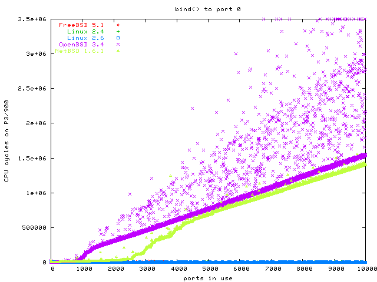

In this graph you cannot see FreeBSD and Linux 2.4, because they are overdrawn
by the Linux 2.6 graph. All three graphs are in the same area, scaling equally
well: O(1).

The dents in the graphs for OpenBSD and NetBSD are normally a sign for a data
structure becoming so big that it does not fit into the L1 cache any more (or
L2 cache). You can see that NetBSD and OpenBSD scale O(n) here, while Linux and
FreeBSD scale O(1). Since OpenBSD has so many data points with dramatically
higher latency, it is the clear loser in this benchmark.

## The fork benchmark

This benchmark creates a pipe and then opens many child processes, which each
write one byte into the pipe and then hang around until they are killed. After
creating each child, the benchmark waits until it can read the one byte from
the new child process from the pipe and takes the time from the fork until
having read the byte.

This way we measure how fast [fork](http://www.opengroup.org/onlinepubs/007904975/functions/fork.html)
is implemented, and we measure the scheduler performance as well, because the
scheduler's job becomes more difficult if there are more processes.

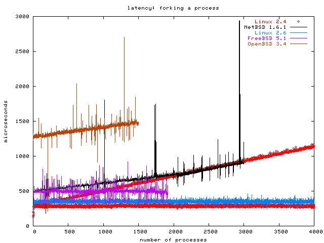

The OpenBSD and FreeBSD graphs stop early because OpenBSD crashed when I forked
more processes, and I couldn't find out how to increase FreeBSD's system limit
on the number of processes (sysctl said the value was read-only)
**[Update Oct 19 2003:** I was told that I have to put `kern.maxproc=100000`
into /boot/loader.conf to do this].

Please note that the benchmark process was linked dynamically. The Linux 2.4
graph is very peculiar, because it looks like two graphs. All of the graphs in
all of the benchmarks here are taken five times and I initially planned to show
the average values with error margins. The Linux 2.4 data from this benchmark
were the reason I didn't; now I just plot all the values for each of the five
runs. You might guess that the first run of the benchmark on Linux 2.4 produced
the O(n) graph and the others were O(1), maybe because some internal data
structure was continuously enlarged during the first run, but that is wrong.
Each of the five benchmark runs on Linux 2.4 alternated randomly between a
point in the O(1) graph and one in the O(n) graph. I have no explanation for
this.

The clear winner in the graph is Linux 2.6. OpenBSD does not scale at all, and
even panics under high load. NetBSD scales O(n), which is respectable for the
grandfather of all the BSDs, but it is not a winning performance. Linux 2.4
shows that there is work to be done; I give it the third place. FreeBSD looks
like it would scale O(1) if I could create more processes with it, but as long
as I can't confirm it, I can only give it the second place.

## The static fork benchmark

fork has more work to do when the processes are dynamically linked. So I reran
the fork benchmark with a statically linked binary, but only on FreeBSD and
Linux 2.6, the winners of the previous benchmark. To show you the difference, I
plottet the new results besides the old results in this graph.


As you can see, linking statically almost halves the fork latency on both
systems.

## The mmap benchmark

It is important for databases and large web and proxy servers to map files into
memory instead of having a buffer and reading the file contents into the
buffer. If you map the file into memory directly, the operating system has more
memory left for I/O buffering.

The Unix syscall for memory mapping files is called [mmap](http://www.opengroup.org/onlinepubs/007904975/functions/mmap.html).
The performance aspect we are benchmarking here is the efficiency of the data
structures the kernel uses to manage the page tables. Memory is managed in
units of "pages", with one page typically being 4k. Many architectures
(including x86) can to 4 MB pages as well for special occasions. On some SPARC
CPUs the page size is 8k, on IA-64 it can be 4k to 16k.

The operating system needs to maintain two data structures for memory mapped
files: one system wide "page table" for all the pages, because more than one
process may do a shared mapping of the same page, plus one table for each
process. The process specific table is what fork copies.

This benchmark takes a 200 MB file and mmaps other second 4k page of it into
its address space. To make sure we measure the mmap data structure and not the
hard disk, the benchmark starts by reading every of those pages once, so they
are in the buffer cache. Then this benchmark takes the time it takes to mmap
each page, and the time it takes to read the first byte of each page.

The point is that the operating system does not actually need to map a page
into the address space when we mmap it. Only when we access that page, the
process local page table needs to get updated. The MMU will signal an exception
to the operating system as soon as the process touches the mmapped page that
the OS did not actually map yet.

**[Update 20 Oct 2003]** I was asked what the point of this benchmark is, why I
do not mmap the whole file sequentially. The reason is that I want to simulate
a web server that mmaps a lot of small files (Apache has an mmap module that
does this), without having to create a million small files for the benchmark.
It is easier to simulate the pressure on the mmap data structures this way.

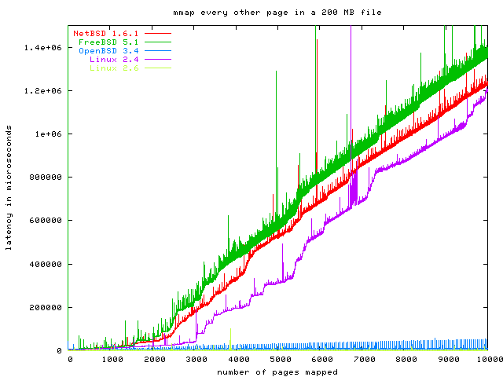

As you can see, we have three clear losers in this benchmark: Linux 2.4, NetBSD
and FreeBSD. The OpenBSD graph scales much better than these, but wait until
you see the second part of this benchmark. The clear winner is Linux 2.6.

Here is a graph of Linux and FreeBSD latency for touching a page.

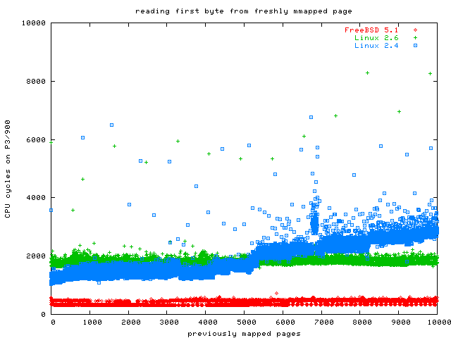

As you can see, Linux 2.4 appears to scale O(n), while Linux 2.6 is O(1).
FreeBSD looks to be much faster than Linux 2.6, but you need to keep in mind
that FreeBSD took an extraordinary time to do the actual mmap, so this good
result does not save the day for FreeBSD.

So where are the others?

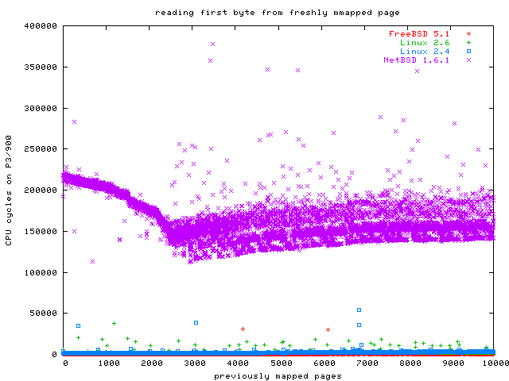

Here are the same results, but this time with NetBSD. As you can see, NetBSD is
significantly slower than Linux and FreeBSD for this benchmark, but at least it
does not get much slower when more pages are mmapped.

And now the final graph, with OpenBSD:

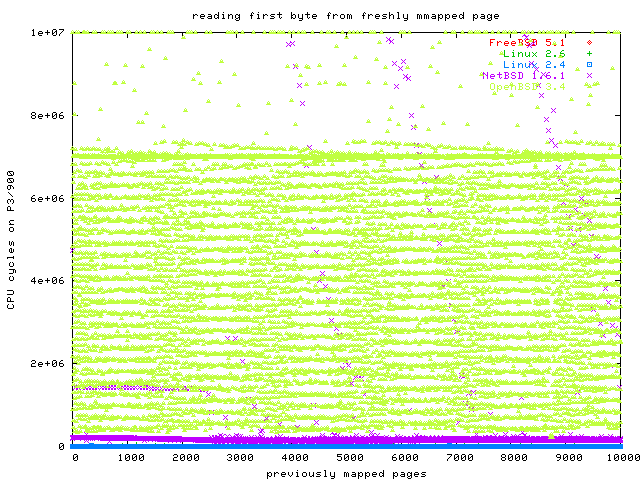

Whoa! Obviously, something is seriously broken in the OpenBSD memory
management. OpenBSD is so incredibly slow that compared to this performance,
NetBSD looks like Warp 9, and Linux is not even on the same chart.

Conclusion: Linux 2.6 is the clear winner, scaling O(1) in every respect. The
clear loser is OpenBSD; I have never seen bad performance of this magnitude.
Even Windows would probably outperform OpenBSD. NetBSD performance leaves a lot
to be desired as well. This mmap graph is the only part of the whole benchmark
suite where FreeBSD did not perform top notch. If the FreeBSD people fix this
one dark spot, they will share the top space with Linux 2.6.

**[Update: Oct 19 2003]** Moshe Bar just wrote me that most commercial
databases do not actually use mmap but regular read and write. And he should
know, he is the maintainer of [OpenMOSIX](http://openmosix.sourceforge.net/).

## Fragmentation

I would like to show you one more graph, although it is not OS specific. The
next graph shows the effect of file system fragmentation and of I/O scheduling.

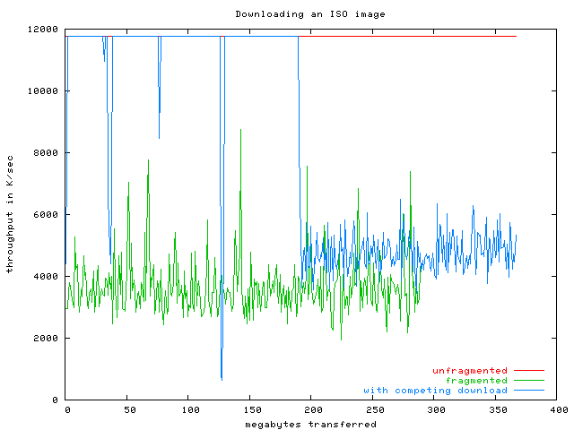

The red graph shows one client downloading one big CD image over a dedicated
Fast Ethernet connection. As expected, the Ethernet is completely saturated,
and the throughput is 11 MB/sec sustained. This was measured on Linux 2.6, but
all the other operating systems (except OpenBSD) were also able to saturate the
Fast Ethernet. OpenBSD had big performance drops in the process, adding to the
previous embarassment with mmap. I can really only warn of using OpenBSD for
scalable network servers.

Anyway, the green graph shows a badly fragmented file (I downloaded another ISO
image using an old version of BitTorrent). Although the IDE disk is slow, it is
not that slow. It can read a sustained 25 MB/sec linearly. But on modern hard
disks the throughput is only good as long as you don't have to seek around on
disk, which basically means that large files need to be non-fragmented. For
this fragmented file, the throughput drops to about 4 MB/sec (which already has
the positive effects of the Linux 2.6 I/O scheduler, it's more like 1.5 MB/sec
on Linux 2.4!).

Another way to get the disk head to seek around is to have two people download
different large files at the same time. The blue graph shows this: at first it
also gets 11 MB/sec throughput, but as soon as someone else downloads
something, the head has to move around, killing the throughput for the poor
guy. Please note that the second download was a rate limited 4 MB/sec download
over the loopback interface, so what you see here was not Ethernet saturation,
it was latency from the hard disk. By the way: the blue graph downloads the
same file as the red graph.

## The connect latency benchmark

We are ultimately interested in the performance of HTTP requests. There are two
parts to that: the [connect](http://www.opengroup.org/onlinepubs/007904975/functions/connect.html)
latency and the latency for answering the actual HTTP request. The connect
latency is the time it takes for the server to notice the connection attempt
and call [accept](http://www.opengroup.org/onlinepubs/007904975/functions/accept.html).

This time is largely dominated by the event notification. Accepting a
connection does not actually do anything besides sending a TCP packet and
allocating a file descriptor. The socket benchmark already showed that
allocating a file descriptor is O(1) for each OS in the test. So it is
reasonable to expect this benchmark to show that the operating systems with
special event notification APIs scale O(1) (Linux 2.4: SIGIO, Linux 2.6: epoll,
FreeBSD+OpenBSD: kqueue) and the rest to scale O(n) (NetBSD). My benchmark http
server is called gatling and it makes use of SIGIO, epoll and kqueue if
available, but falls back to [poll](http://www.opengroup.org/onlinepubs/007904975/functions/poll.html)
if not.

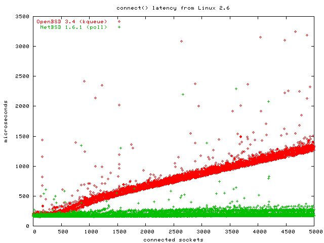

I omitted the graphics for Linux and FreeBSD because they were O(1), as
expected. As you can see, it was OpenBSD that showed the O(n) graph, and NetBSD
that has the O(1) graph here. I am as surprised as you. Believe me, I double
and triple checked that gatling used kqueue on OpenBSD and that I hadn't
switched the results or graphs somehow.

The clear loser is, again, OpenBSD. Don't use OpenBSD for network servers.
NetBSD appears to have found some clever hack to short-circuit poll if there
only are events for one of the first descriptors in the array.

## Measuring HTTP request latency

This final benchmark measures how long it takes for the http server to answer a
request. This does not include the connect latency, which I showed you in the
previous graph.

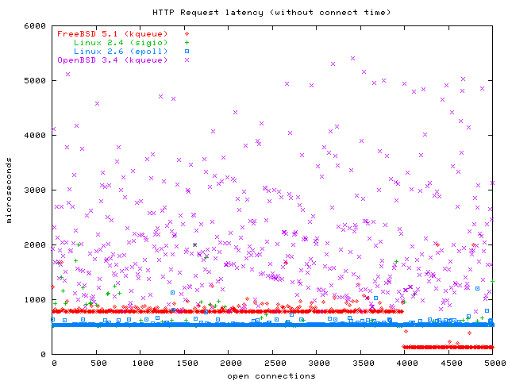

This graph shows that Linux 2.4 and Linux 2.6 perform equally O(1) here.
FreeBSD is a little slower for the first 4000 connections and becomes faster
after that. I am at a loss how to explain that. The FreeBSD guys appear to have
found some really clever shortcuts. The Linux 2.4 graph is overdrawn by the
Linux 2.6 graph here. OpenBSD data points are all over the place in this graph;
again, I would advise against using OpenBSD for scalable network servers.
NetBSD is missing on this graph, but here is a graph with NetBSD:

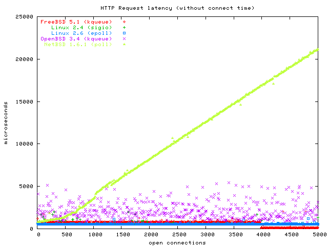

The clear loser of this benchmark is NetBSD, because they simply don't offer a
better API than poll. As I wrote in the introduction, I only benchmarked the
stable NetBSD 1.6.1 kernel here, and I assume they have included kqueue in
their -CURRENT kernel. I will try to update my NetBSD installation and rerun
the benchmarks on it.

## Conclusion

Linux 2.6 scales O(1) in all benchmarks. Words fail me on how impressive this
is. If you are using Linux 2.4 right now, switch to Linux 2.6 now!

FreeBSD 5.1 has very impressive performance and scalability. I foolishly
assumed all BSDs to play in the same league performance-wise, because they all
share a lot of code and can incorporate each other's code freely. I was wrong.
FreeBSD has by far the best performance of the BSDs and it comes close to Linux
2.6. If you run another BSD on x86, you should switch to FreeBSD!

Linux 2.4 is not too bad, but it scales badly for mmap and fork.

NetBSD 1.6.1 was treated unfairly by me because I only tested the stable
version, not the unstable source tree. I originally only wanted to benchmark
stable versions, but deviated with OpenBSD and then with FreeBSD. I should have
upgraded NetBSD then, too. Nonetheless, NetBSD feels snappy, performs well
overall, although it needs work in the scalability department, judging from the
old version I was using. Please note that NetBSD was the only BSD that never
crashed or panicked on me, so it gets favourable treatment for that.

OpenBSD 3.4 was a real stinker in these tests. The installation routine sucks,
the disk performance sucks, the kernel was unstable, and in the network
scalability department it was even outperformed by it's father, NetBSD. OpenBSD
also gets points deducted for the sabotage they did to their IPv6 stack. If you
are using OpenBSD, you should move away now.

## The Code

I used my experimental web server *gatling* to measure these numbers. All the
benchmark programs are also part of the gatling package.

You can download gatling via anonymous cvs from:

```sh
% cvs -d :pserver:cvs@cvs.fefe.de:/cvs -z9 co libowfat
% cvs -d :pserver:cvs@cvs.fefe.de:/cvs -z9 co gatling
```

libowfat contains my implementation of the IO API, gatling is the webserver.
You need to build libowfat first. If you are using Linux, also check out

```sh
% cvs -d :pserver:cvs@cvs.fefe.de:/cvs -z9 co dietlibc
```

## Remarks

Slashdot accepted the story, and this site is being slashdotted as of
Oct 19 2003. Here are a few answers to questions that have been raised in the
Slashdot forums:

1. *Did he disable debugging in FreeBSD 5?*
  
    Yes.

2. *comparing epoll to kqueue isn't fair because Linux 2.6 is a development
    platform*

    You could say so. On the other hand, my graphs show that SIGIO performs
    equally well, it's just not so nice to use. And since Linus has declared
    feature freeze a long time ago, and the kernel hackers on Linux Kongress
    agreed that Linux 2.6 is actually more stable than Linux 2.4, I thought it's
    OK. And it would have been sad not to benchmark Linux 2.6 because of that.
    After all, I also benchmarked FreeBSD 5.1-CURRENT.

3. *Why did he use FreeBSD 5 at all and not FreeBSD 4.8?*

    Because I read that they did many exciting scalability improvements in
    FreeBSD 5, and that's what this is about, after all.

4. *FreeBSD is getting so fast under load, did he make sure the calls actually
    succeeded?*

    Yes. But please don't take my word for it, download the benchmark sources
    (see above).

5. *All he does is bash BSD all the time*

    Sorry if you get that impression. The opposite is true: I was extremely
    impressed with FreeBSD performance and I also found NetBSD to be quite
    snappy.

6. *The 1024 cylinder boot restriction has been fixed for a while in OpenBSD*

    Then apparently some evil infiltrator meaning harm to the OpenBSD project
    sabotaged my -CURRENT download set from Oct 4 2003.

7. *The OpenBSD IPv6 problem is for security, not evilness*

    That's what itojun has said for ages. When I challenged him to point to
    even one case that demonstrated anyone was ever negatively impacted by the
    normal behaviour, he posted a message to bugtraq asking for people to step
    forward. Nobody did.

    By the way: Linux Kongress had an own talk about how to use autoconf macros
    to write portable IPv6 applications. This is because the API got
    fragmented, which is a very bad thing, especially for something new we want
    people to adopt. Like IPv6.

8. *Why is there no real network load?*

    Because I don't have gigabit ethernet at home. I'm working on it. If you
    are a big hardware vendor and would like to lend me some server hardware
    for testing, please contact me! Non-x86 is also welcome.

9. *Where are the file system benchmarks?*

    There are none, because this is very difficult to do in a fair way. I am
    considering a few micro benchmarks here, but I haven't decided yet.
    Suggestions are welcome!

10. *Why did you not tune the kernels?*

    I did some tuning (like increasing kernel limits), but it was a conscious
    decision not to try to tune kernels, because I am not proficient enough
    with all the operating systems to make this fair. Also, tuning can only
    reduce latency a little, it won't turn O(n) into O(1). In the end, I'm not
    going to do any benchmarks on tuned kernels unless there is a way for me to
    avoid being accused of trying to make one OS look bad. I could ask all the
    kernel teams to give me tuning instructions for their OS, but then I would
    open myself up to accusations of trying to make myself more important than
    I am. Again, suggestions on how to do this properly are welcome.

11. *OpenBSD looks slow because the disk was full!*

    Actually, no. All the benchmarks are conducted in a way that preloads all
    the accessed portions from disk into the buffer cache, so there are no disk
    accesses during the benchmarks, and only in the
    [new manymap open benchmark](http://bulk.fefe.de/scalability/#openbench)
    file system code is benchmarked at all.

For some reason, nobody asked for a Windows benchmark. That is strange because
everybody else I showed this to asked me about this. The reason is the same as
for DragonflyBSD: I don't have more space on my hard disk. But please, run the
benchmarks yourself and send me the graphs!

The slashdotting also revealed a problem in gatling or Linux, I can't tell yet:
sendfile (although on a non-blocking socket, or so it should be) suddenly
blocks, which blocks the whole server. I will investigate further... ;)

By the way, if you have any grief with how and on what configurations I ran my
benchmarks, please scroll up a little and download the sources. Then run them
yourself and send me a link to your results, so I can link them from here.

## New Measurements

### NetBSD-CURRENT

**[Oct 20 2003]** I just upgraded my NetBSD 1.6.1 to NetBSD-CURRENT and reran
the benchmarks. The upgrade build process did not run smoothly, the NetBSD
crowd will have to review that (e.g. I got a /usr/src/usr.bin/ktrace/ktrace/
directory from CVS, which the make clean run in build.sh tried to rm -f
(without -r), and that caused the whole build to abort) (sorry, it's not
kqueue, it's ktrace as I initially wrote).

Anyway, here are the graphs comparing NetBSD 1.6.1 with NetBSD-CURRENT as of
today, Oct 20 2003:

- [socket](http://bulk.fefe.de/scalability/netbsd/socket-netbsd-current.png):
  whoa, someone broke something here. While the bulk of the time is still spent
  on the same graph as for 1.6.1, there are several shadow graphs above it.
- [bind](http://bulk.fefe.de/scalability/netbsd/bind-netbsd-current.png):
  looks about the same, but the graph goes up earlier, so apparently the size
  of the data structure increased slightly, causing it to leave the CPU cache
  earlier.
- [connect](http://bulk.fefe.de/scalability/netbsd/connectlat-netbsd-current.png):
  same.
- [fork](http://bulk.fefe.de/scalability/netbsd/fork-netbsd-current.png):
  The scalability actually deteriorated for this benchmark. It's still O(n).
  When running the fork benchmark, the system became unresponsive (fix this!).
  Here is a [graph for static linking](http://bulk.fefe.de/scalability/netbsd/forks-netbsd-current.png)
  that looks not so grim, so the dynamically linked fork is apparenty caused by
  libc becoming more bloated.
- [mmap](http://bulk.fefe.de/scalability/netbsd/mmap-netbsd-current.png):
  basically the same graph, the tendency is a very slight improvement.
- [touch after mmap](http://bulk.fefe.de/scalability/netbsd/mmaptouch-netbsd-current.png):
  BIG improvement here!
- [http request latency](http://bulk.fefe.de/scalability/netbsd/httpreq-netbsd-current.png):
  it sure shows that NetBSD-CURRENT now has kqueue!

**[Nov 1 2003]** I got an email suggesting that I re-check NetBSD. The results
are nothing short of astonishing. In two weeks time the NetBSD team made
dramatic improvements.

- [socket](http://bulk.fefe.de/scalability/netbsd/netbsd-socket.png):
  previously O(n), now O(1).
- [bind](http://bulk.fefe.de/scalability/netbsd/netbsd-bind.png):
  greatly improved, but still O(n). Much less steep, though.
- [fork](http://bulk.fefe.de/scalability/netbsd/netbsd-fork.png):
  a modest O(n) for dynamically linked programs, O(1) for statically linked.
- [mmap](http://bulk.fefe.de/scalability/netbsd/netbsd-mmap.png):
  a bad O(n) before, now O(1) with a small O(n) shadow.
- [touch after mmap](http://bulk.fefe.de/scalability/netbsd/netbsd-mmaptouch.png):
  a bad strange graph in 1.6.1, a modest O(n) a week ago, now O(1).
- [http request latency](http://bulk.fefe.de/scalability/netbsd/httpreq-netbsd-current.png):
  previously O(n), now O(1).

Congratulations, NetBSD! NetBSD now has better scalability than FreeBSD.

### OpenBSD

**[Oct 20 2003]** I was asked by a few OpenBSD people why I'm even comparing
them here, since "everyone knows" they don't scale well and their goal is
security and not scalability. The answer is: I didn't know that OpenBSD did not
try to improve scalability as well. But even if I did know that, I would still
have benchmarked them, if only to give people some numbers on how much less
scalability they should expect. Knowing how much less scalability you get is
also an important part of the decision process. And I also hope that security
and scalability are not mutually exclusive and some volunteer veteran OpenBSD
users will now be motivated to help port some scalability enhancements from
FreeBSD and NetBSD to OpenBSD. My "fork crashes" problem was already reproduced
and the OpenBSD people are working on it. That was fast! ;)

### FreeBSD

**[Oct 22 2003]** I was asked many times to also benchmark FreeBSD 4-STABLE,
because people thought it was more optimized than the unstable development
branch FreeBSD 5-CURRENT. Yesterday I downloaded the ISO and today I installed
and benchmarked 4.9-RC3. As for NetBSD, I plotted the graphs for 4.9 against
the graphs for 5.1-CURRENT. Here are the results:

- [socket latency](http://bulk.fefe.de/scalability/freebsd/socket-freebsd-current.png)

    This graph is interesting because 4.9 is the inverse of the 5.1 here.
    Scalability is still very good.

- [bind to port 0 latency](http://bulk.fefe.de/scalability/freebsd/bind-freebsd-current.png)

    This graph looks quite strange. I don't know what is wrong with FreeBSD 4.9
    here, but look at the scale! These numbers are actually worse than the
    NetBSD numbers. I took this benchmark five times and got the same numbers
    in all runs, so this is systemic and looks like it needs fixing.

- [fork latency](http://bulk.fefe.de/scalability/freebsd/fork-freebsd-current.png)

    This graph shows how much improved the scalability and latency of FreeBSD
    5-CURRENT is. It even looks like the FreeBSD 4 graph is worse than O(n).
    Maybe someone with one or two gigs of RAM can run this benchmark further
    and send me the graph?

- [mmap latency](http://bulk.fefe.de/scalability/freebsd/mmap-freebsd-current.png)

    This graph actually has FreeBSD 4 ahead of FreeBSD 5. It looks like some
    the size of each element in a central VM data structure has doubled in size
    or so. Still, the general scalability is the same.

- [touch-after-mmap latency](http://bulk.fefe.de/scalability/freebsd/mmaptouch-freebsd-current.png)

    No change.

- [connect latency](http://bulk.fefe.de/scalability/freebsd/connectlat-freebsd-current.png)

    No change.

- [http request latency](http://bulk.fefe.de/scalability/freebsd/httpreq-freebsd-current.png)

    Here FreeBSD 4 does not have the curious sudden performance improvement
    after 4000 open connections. Other than that, both have O(1) scalability.

Conclusion: FreeBSD 5 is faster and more scalable. If what people have been
claiming is true, that FreeBSD 5 is unoptimized and has lots of debug code, we
have a lot to look forward to once FreeBSD 5 becomes stable.

### fork cleanup

**[Oct 23 2003]** Niels Provos suggested also measuring the fork cleanup time
by killing the process.
[The graph](http://bulk.fefe.de/scalability/fork-cleanup2.png)
is indeed quite interesting
([zoomed version without NetBSD](http://bulk.fefe.de/scalability/fork-cleanup1.png)).

You have to read this graph backwards. A position 0 we have lots of processes,
so killing and waiting is expensive. As we kill off one process after the
other, it becomes less and less expensive. Since fork is benchmarked a lot, it
is optimized well, but cleaning up after fork is equally important but not
benchmarked at all.

I could only run OpenBSD up to 2000 processes, and NetBSD up to 4000 processes,
but important is not the length of each graph, but the angle. This is the first
graph where Linux 2.6 does not perform O(1), by the way!

### fork latency revisited

**[Oct 23 2003]** It turns out that my fork benchmark was unfair to the BSDs. I
neglected to measure fork latency for statically linked binaries on NetBSD and
OpenBSD, because I assumed the fork latency was because of a bad fork
implementation. As [this graph](http://bulk.fefe.de/scalability/forks-bsd.png)
shows, fork is O(1) on all BSDs if the binaries are statically linked! This
still indicates a bad fork implementation, but this means it can be worked
around in practice.

I apologize to NetBSD and OpenBSD for only noticing this now.

### mmapping many small files

**[Oct 23 2003]** Thor Lancelot Simon suggested that my mmap benchmark (mapping
every other page from a big file) was actually taking a different code path
than what I wanted to benchmark: mmapping many small files. I updated the CVS
to include a program to create many small files and a variant of the mmap
benchmark to mmap these in order.

If you want to repeat this test, please make sure you read README.manymapbench
first!

Since this benchmark also opens many files, I also did an open test on this,
which is purely informational because it uses ext2fs on OpenBSD instead of the
native UFS (because of my partition space problems, see above), but I thought
you might be interested anyway. Again, all the files and directories are
read-only and in the buffer cache, so journaling and softupdates do not
influence this graph.

Here is [the open graph](http://bulk.fefe.de/scalability/manymap/open.png).

As you can see, Linux 2.6 appears to be the only one achieving O(1) here. There
are 10000 files total, 100 of them in one subdirectory (this is how actual
applications like squid or qmail do it, putting a 10000 files in one directory
has been benchmarked by others), so this should be pretty close to O(1) except
for the cost of allocating the file descriptor maybe.

After opening each file, the benchmark mmaps the whole file (each file is about
150 bytes, so mmapping the complete file maps one page). Here is
[the mmap graph](http://bulk.fefe.de/scalability/manymap/manymap-mmap2.png)
([zoomed version with only OpenBSD and Linux 2.6](http://bulk.fefe.de/scalability/manymap/manymap-mmap1.png)).

After mmapping each file, the benchmark again reads one byte from each page to
cause a page fault. One obvious optimization for this case (mmapping the whole
file, and it is very small) would be to directly map the page, not wait for the
page fault, and that appears to be what FreeBSD is doing. Here is
[the manymap touch graph](http://bulk.fefe.de/scalability/manymap/manymap-touch2.png)
([zoomed version without OpenBSD](http://bulk.fefe.de/scalability/manymap/manymap-touch1.png)).
This graph shows the curious behaviour that the strange OpenBSD pattern only
occurs starting at file 6600 or so, so OpenBSD's performance in this case is OK
if you can limit yourself to 6500 or less pages.
