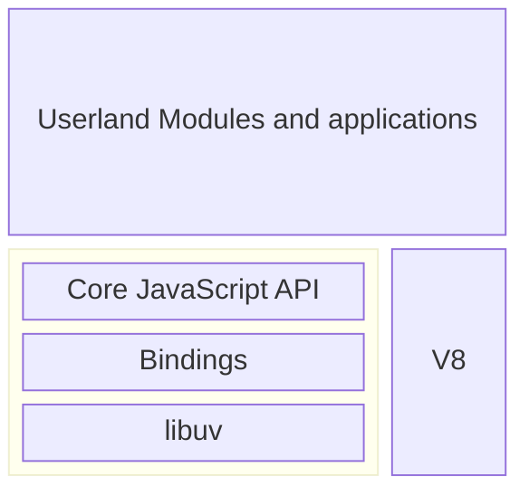

# Chapter 1: The Node.js Platform

- [Chapter 1: The Node.js Platform](#chapter-1-the-nodejs-platform)
  - [The Node.js philosophy](#the-nodejs-philosophy)
    - [Small core](#small-core)
    - [Small modules](#small-modules)
    - [Small surface area](#small-surface-area)
    - [Simplicity and pragmatism](#simplicity-and-pragmatism)
  - [How Node.js works](#how-nodejs-works)
    - [I/O is slow](#io-is-slow)
    - [Blocking I/O](#blocking-io)
    - [Non-blocking I/O](#non-blocking-io)
    - [Event demultiplexing](#event-demultiplexing)
    - [The reactor pattern](#the-reactor-pattern)
    - [Libuv, the I/O engine of Node.js](#libuv-the-io-engine-of-nodejs)
    - [The recipe for Node.js](#the-recipe-for-nodejs)
  - [JavaScript in Node.js](#javascript-in-nodejs)
    - [Run the latest JavaScript with confidence](#run-the-latest-javascript-with-confidence)
    - [The module system](#the-module-system)
    - [Full access to operating system services](#full-access-to-operating-system-services)
    - [Running native code](#running-native-code)
  - [Summary](#summary)

## The Node.js philosophy

### Small core

Its foundations built on a few principles:

- Having the smallest possible set of functionalities, while leaving the rest
  to the so-called userland (or userspace), which is the ecosystem of modules
  living outside the core.

### Small modules

In Node.js, one of the most evangelized principles is designing small modules
(and packages), not only in terms of raw code size, but, most importantly, in
terms of scope.

This principle has its roots in the Unix philosophy, and particularly in two of
its precepts:

- "Small is beautiful."
- "Make each program do one thing well."

Besides the clear advantage in terms of reusability, a small module is also:

- Easier to understand and use
- Simpler to test and maintain
- Small in size and perfect for use in the browser

### Small surface area

In addition to being small in size and scope, a desirable characteristic of
Node.js modules is exposing a minimal set of functionalities to the outside
world.

### Simplicity and pragmatism

- Keep It Simple, Stupid (KISS) principle

> The design must be simple, both in implementation and interface. It is more
> important for the implementation to be simple than the interface. Simplicity
> is the most important consideration in a design.
>
> — Richard P. Gabriel

## How Node.js works

### I/O is slow

- Accessing the RAM is in the order of nanoseconds (10E-9 seconds). RAM has a
  transfer rate consistently in the order of GB/s.
- Accessing data on the disk or the network is in the order of milliseconds
  (10E-3 seconds). The disk or network varies from MB/s to optimistically GB/s.

### Blocking I/O

The following pseudocode shows a typical blocking thread performed against a
socket:

```js
// blocks the thread until the data is available
data = socket.read()
// data is available
print(data)
```

A web server that is implemented using blocking I/O will not be able to handle
multiple connections in the same thread. The traditional approach to solving
this problem is to use a separate thread (or process) to handle each concurrent
connection.

### Non-blocking I/O

In non-blocking I/O operating mode, the system call always returns immediately
without waiting for the data to be read or written. If no results are available
at the moment of the call, the function will simply return a predefined
constant, indicating that there is no data available to return at that moment.

In Unix operating systems, the `fcntl()` function is used to manipulate an
existing file descriptor to change its operating mode to non-blocking (with the
`O_NONBLOCK` flag). Once the resource is in non-blocking mode, any read
operation will fail with the return code `EAGAIN` if the resource doesn't have
any data ready to be read.

The most basic pattern for dealing with this type of non-blocking I/O is to
actively poll the resource within a loop until some actual data is returned.
This is called **busy-waiting**:

```js
resources = [socketA, socketB, fileA]
while (!resources.isEmpty()) {
  for (resource of resources) {
    // try to read
    data = resource.read()
    if (data === NO_DATA_AVAILABLE) {
      // there is no data to read at the moment
      continue
    }
    if (data === RESOURCE_CLOSED) {
      // the resource was closed, remove it from the list
      resources.remove(i)
    } else {
      //some data was received, process it
      consumeData(data)
    }
  }
}
```

This simple technique is still not efficient: The loop will only consume
precious CPU for iterating over resources that are unavailable most of the time.

### Event demultiplexing

Most modern operating systems provide a native mechanism to handle concurrent
non-blocking resources in an efficient way — the
**synchronous event demultiplexer** (also known as the
**event notification interface**).

In telecommunications, **multiplexing** refers to the method by which multiple
signals are combined into one so that they can be easily transmitted over a
medium with limited capacity.

**Demultiplexing** refers to the opposite operation, whereby the signal is
split again into its original components. Both terms are used in other areas
to describe the general operation of combining different things into one and
vice versa.

The synchronous event demultiplexer watches multiple resources and returns a
new event (or set of events) when a read or write operation executed over one
of those resources completes. The advantage here is that the synchronous event
demultiplexer is synchronous, so it blocks until there are new events to
process. The following is the pseudocode of an algorithm that uses a generic
synchronous event demultiplexer to read from two different resources:

```js
watchedList.add(socketA, FOR_READ)                      // (1)
watchedList.add(fileB, FOR_READ)
while (events = demultiplexer.watch(watchedList)) {     // (2)
  // event loop
  for (event of events) {                               // (3)
    // This read will never block and will always return data
    data = event.resource.read()
    if (data === RESOURCE_CLOSED) {
      // the resource was closed, remove it from the watched list
      demultiplexer.unwatch(event.resource)
    } else {
      // some actual data was received, process it
      consumeData(data)
    }
  }
}
```

1. The resources are added to a data structure, associating each one of them
   with a specific operation.
2. The demultiplexer is set up with the group of resources to be watched. The
   call to `demultiplexer.watch()` is synchronous and blocks until any of the
   watched resources are ready for `read`. When this occurs, the event
   demultiplexer returns from the call and a new set of events is available to
   be processed.
3. Each event returned by the event demultiplexer is processed. At this point,
   the resource associated with each event is guaranteed to be ready to read
   and to not block during the operation. When all the events are processed,
   the flow will block again on the event demultiplexer until new events are
   again available to be processed. This is called the **event loop**.

With this pattern, we can now handle several I/O operations inside a single
thread, without using the busy-waiting technique.

But this is not the only reason for choosing this I/O model. In fact, having a
single thread also has a beneficial impact on the way programmers approach
concurrency in general.

### The reactor pattern

The main idea behind the reactor pattern is to have a handler associated with
each I/O operation. A handler in Node.js is represented by a `callback`
function.

The handler will be invoked as soon as an event is produced and processed by
the event loop.

This is what happens in an application using the reactor pattern:

1. The application generates a new I/O operation by submitting a request to the
   **Event Demultiplexer**. The application also specifies a handler, which
   will be invoked when the operation completes. Submitting a new request to
   the **Event Demultiplexer** is a non-blocking call and it immediately
   returns control to the application.
2. When a set of I/O operations completes, the **Event Demultiplexer** pushes a
   set of corresponding events into the **Event Queue**.
3. At this point, the **Event Loop** iterates over the items of the
   **Event Queue**.
4. For each event, the associated handler is invoked.
5. The handler, which is part of the application code, gives back control to
   the **Event Loop** when its execution completes. While the handler executes,
   it can request new asynchronous operations, causing new items to be added to
   the **Event Demultiplexer**.
6. When all the items in the **Event Queue** are processed, the **Event Loop**
   blocks again on the **Event Demultiplexer**, which then triggers another
   cycle when a new event is available.

📝 **The reactor pattern**

Handles I/O by blocking until new events are available from a set of observed
resources, and then reacts by dispatching each event to an associated handler.

### Libuv, the I/O engine of Node.js

Each operating system has its own interface for the event demultiplexer:

- `epoll` on Linux
- `kqueue` on macOS
- `IOCP` (I/O completion port) API on Windows

On top of that, each I/O operation can behave quite differently depending on
the type of resource, even within the same operating system. In Unix operating
systems, for example, regular filesystem files do not support non-blocking
operations, so in order to simulate non-blocking behavior, it is necessary to
use a separate thread outside the event loop.

All these inconsistencies across and within the different operating systems
required a higher-level abstraction to be built for the event demultiplexer.
This is exactly why the Node.js core team created a native library called
**libuv**. Libuv represents the low-level I/O engine of Node.js and is probably
the most important component that Node.js is built on.

Libuv also implements the reactor pattern, providing an API for creating event
loops, managing the event queue, running asynchronous I/O operations, and
queuing other types of task.

### The recipe for Node.js

The reactor pattern and libuv are the basic building blocks of Node.js, but we
need three more components to build the full platform:

- A set of bindings responsible for wrapping and exposing `libuv` and other
  low-level functionalities to JavaScript.
- **V8**, the JavaScript engine originally developed by Google for the Chrome
  browser.
- A core JavaScript library that implements the high-level Node.js API.



## JavaScript in Node.js

The most obvious difference is that in Node.js we don't have a DOM and we don't
have a `window` or a `document`.

### Run the latest JavaScript with confidence

Please bear in mind that if we are developing a library meant to be used by
third parties, we still have to take into account that our code may run on
different versions of Node.js. The general pattern in this case is to target
the oldest active **long-term support (LTS)** release and specify the engines
section in our `package.json`, so that the package manager will warn the user
if they are trying to install a package that is not compatible with their
version of Node.js.

### The module system

The original Node.js module system is called CommonJS and it uses the `require`
keyword to import functions, variables, and classes exported by built-in
modules or other modules located on the device's filesystem.

CommonJS was a revolution for the JavaScript world in general, as it started to
get popular even in the client-side world, where it is used in combination with
a module bundler (such as Webpack or Rollup) to produce code bundles that are
easily executable by the browser. CommonJS was a necessary component for
Node.js to allow developers to create large and better organized applications
on a par with other server-side platforms.

Today, JavaScript has the so-called ES modules syntax (the `import`) from which
Node.js inherits just the syntax, as the underlying implementation is somewhat
different from that of the browser. In fact, while the browser mainly deals
with remote modules, Node.js, at least for now, can only deal with modules
located on the local filesystem.

### Full access to operating system services

We can also access some of the V8 internals (the v8 module) or run code in a
different V8 context (with the `vm` module).

### Running native code

One of the most powerful capabilities offered by Node.js is certainly the
possibility to create userland modules that can bind to native code. This gives
to the platform a tremendous advantage as it allows us to reuse existing or new
components written in C/C++. Node.js officially provides great support for
implementing native modules thanks to the N-API interface.

But what's the advantage?

- First of all, it allows us to reuse with little effort a vast amount of
  existing open source libraries, and most importantly, it allows a company to
  reuse its own C/C++ legacy code without the need to migrate it.
- Another important consideration is that native code is still necessary to
  access low-level features such as communicating with hardware drivers or with
  hardware ports (for example, USB or serial). In fact, thanks to its ability
  to link to native code, Node.js has become popular in the world of the
  **Internet of things (IoT)** and homemade robotics.
- Finally, even though V8 is very fast at executing JavaScript, it still has a
  performance penalty to pay compared to executing native code. In everyday
  computing, this is rarely an issue, but for CPU-intensive applications, such
  as those with a lot of data processing and manipulation, delegating the work
  to native code can make tons of sense.

Nowadays, most JavaScript **virtual machines (VMs)** (and also Node.js) support
**WebAssembly (Wasm)**, a low-level instruction format that allows us to
compile languages other than JavaScript (such as C++ or Rust) into a format
that is "understandable" by JavaScript VMs. This brings many of the advantages
we have mentioned, without the need to directly interface with native code.

## Summary
