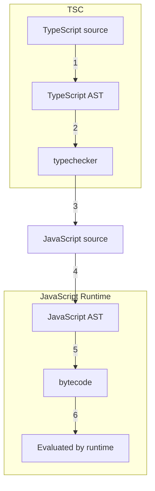

# Chapter 2 TypeScript: A 10_000 Foot View

- [Chapter 2 TypeScript: A 10\_000 Foot View](#chapter-2-typescript-a-10_000-foot-view)
  - [The Compiler](#the-compiler)
  - [The Type System](#the-type-system)
    - [TypeScript Versus JavaScript](#typescript-versus-javascript)
      - [How are types bound?](#how-are-types-bound)
      - [Are types automatically converted?](#are-types-automatically-converted)
      - [When are types checked?](#when-are-types-checked)
      - [When are errors surfaced?](#when-are-errors-surfaced)
  - [Code Editor Setup](#code-editor-setup)
    - [tsconfig.json](#tsconfigjson)
    - [tslint.json](#tslintjson)
  - [index.ts](#indexts)
  - [Exercisess](#exercisess)

## The Compiler

When you run a program, what you’re really doing is telling the runtime to
evaluate the bytecode generated by the compiler from the AST parsed from your
source code. For most languages this is an accurate high-level view:

1. Program is parsed into an **AST (abstract syntax tree)**.
2. AST is compiled to **bytecode**.
3. Bytecode is evaluated by the **runtime**.

Instead of compiling straight to bytecode, TypeScript compiles to JavaScript
code!

After the TypeScript Compiler generates an AST for your program — but before it
emits code — it ***typechecks*** your code.

Including typechecking and JavaScript emission, the process of compiling
TypeScript now looks roughly like:



JavaScript compilers and runtimes tend to be smushed into a single program
called an engine:

- V8 (the engine powering NodeJS, Chrome, and Opera)
- SpiderMonkey (Firefox)
- JSCore (Safari)
- Chakra (Edge)

When TSC compiles your code from TypeScript to JavaScript, it won’t look at your
types. That means your program’s types will never affect your program’s
generated output, and are only used for typechecking.

## The Type System

- **Type system**: A set of rules that a typechecker uses to assign types to
  your program.

There are generally two kinds of type systems:

- type systems in which you have to tell the compiler what type everything is
  with explicit syntax
- type systems that infer the types of things for you automatically.

There are languages all over this spectrum:

- JavaScript, Python, and Ruby infer types at runtime;
- Haskell and OCaml infer and check missing types at compile time;
- Scala and TypeScript require some explicit types and infer and check the rest
  at compile time;
- Java and C need explicit annotations for almost everything, which they check
  at compile time.

TypeScript is inspired by both kinds of type systems: you can explicitly
annotate your types, or you can let TypeScript infer most of them for you.

```ts
let a: number = 1                   // a is a number
let b: string = 'hello'             // b is a string
let c: boolean[] = [true, false]    // c is an array of booleans
```

Or let TypeScript to infer your types for you:

```ts
let a = 1               // a is a number
let b = 'hello'         // b is a string
let c = [true, false]   // c is an array of booleans
```

💡 **In general, it is good style to let TypeScript infer as many types as it can
for you, keeping explicitly typed code to a minimum**.

### TypeScript Versus JavaScript

TableComparing JavaScript’s and TypeScript’s type systems:

| Type system feature       | JavaScript          | TypeScript               |
| ------------------------- | ------------------- | ------------------------ |
| How are types bound?      | Dynamically         | Statically               |
| Are types auto-converted? | Yes                 | No (mostly)              |
| When are types checked?   | At runtime          | At compile time          |
| When are errors surfaced? | At runtime (mostly) | At compile time (mostly) |

#### How are types bound?

- ***Dynamic type*** binding means that JavaScript needs to actually run your
  program to know the types of things in it.
- TypeScript is a ***gradually typed*** language. That means that TypeScript
  works best when it knows the types of everything in your program at compile
  time, but it doesn’t have to know every type in order to compile your program.

This gradual typing is really useful for migrating legacy codebases from untyped
JavaScript to typed TypeScript, but you should aim for 100% type coverage.

#### Are types automatically converted?

***In short, if you must convert types, do it explicitly***.

#### When are types checked?

#### When are errors surfaced?

When JavaScript throws exceptions or performs implicit type conversions, it does
so at runtime. This means you have to actually run your program to get a useful
signal back that you did something invalid.

- To be sure, JavaScript surfaces syntax errors and a few select bugs after it
  parses your program, but before it runs it. If you parse your JavaScript as
  part of your build process (e.g., with Babel), you can surface these errors at
  build time.

TypeScript throws both **syntax-related** errors and **type-related** errors at
compile time. In practice, that means those kinds of errors will show up in your
code editor.

There are lots of errors that TypeScript can’t catch for you at compile time
— things like stack overflows, broken network connections, and malformed user
inputs — that will still result in runtime exceptions.

## Code Editor Setup

TSC is itself a command-line application written in TypeScript.

```sh
# Create a new folder
mkdir chapter-2
cd chapter-2

# Initialize a new NPM project (follow the prompts)
npm init

# Install TSC, TSLint, and type declarations for NodeJS
npm install --save-dev typescript tslint @types/node
```

### tsconfig.json

Every TypeScript project should include a file called `tsconfig.json` in its
root directory. This `tsconfig.json` is where TypeScript projects define things
like which files should be compiled, which directory to compile them to, and
which version of JavaScript to emit.

```json
{
    "compilerOptions": {
        // Which APIs should TSC assume exist in the environment you’ll be
        //  running your code in?
        // This includes things like ES5’s Function.prototype.bind, ES2015’s
        //  Object.assign, and the DOM’s document.querySelector.
        "lib": ["es2015"],
        // Which module system should TSC compile your code to (CommonJS,
        //  SystemJS, ES2015, etc.)?
        "module": "commonjs",
        // Which folder should TSC put your generated JavaScript code in?
        "outDir": "dist",
        "sourceMap": true,
        // Be as strict as possible when checking for invalid code. This option
        //  enforces that all of your code is properly typed.
        "strict": true,
        // Which JavaScript version should TSC compile your code to (ES3, ES5,
        //  ES2015, ES2016, etc.)?
        "target": "es2015"
    },
    // Which folders should TSC look in to find your TypeScript files?
    "include": [
        "src"
    ]
}
```

TSC’s built-in initialize command: `./node_modules/.bin/tsc --init`.

### tslint.json

Using TSLint is optional, but it’s strongly recommend for all TypeScript
projects to enforce a consistent coding style.

```sh
./node_modules/.bin/tslint --init
```

```json
{
    "defaultSeverity": "error",
    "extends": [
        "tslint:recommended"
    ],
    "rules": {
        "semicolon": false,
        "trailing-comma": false
    }
}
```

## index.ts

```sh
# Compile your TypeScript with TSC
./node_modules/.bin/tsc
# Run your code with NodeJS
node ./dist/index.js
```

- Install `ts-node`, and use it to compile and run your TypeScript with a
  single command.
- Use a scaffolding tool like `typescript-node-starter` to quickly generate
  your folder structure for you.

## Exercisess

```ts
let a = 1 + 2
let b = a + 3
let c = {
    apple: a,
    banana: b
}
let d = c.apple * 4
```
