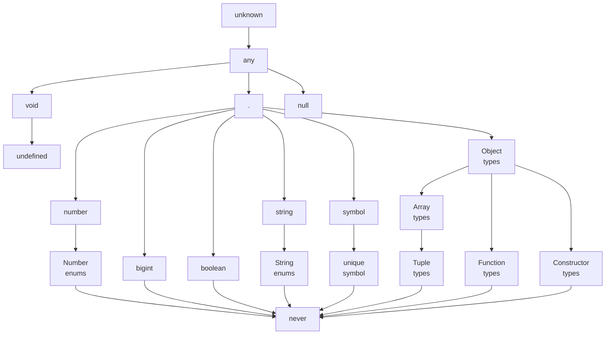

# Chapter 3: All About Types

- [Chapter 3: All About Types](#chapter-3-all-about-types)
  - [Talking About Types](#talking-about-types)
  - [The ABCs of Types](#the-abcs-of-types)
    - [any](#any)
      - [TSC Flag: `noImplicitAny`](#tsc-flag-noimplicitany)
    - [unknown](#unknown)
    - [boolean](#boolean)
    - [number](#number)
    - [bigint](#bigint)
    - [string](#string)
    - [symbol](#symbol)
    - [Objects](#objects)
      - [Structural typing](#structural-typing)
      - [Type Inference When Declaring Objects with const](#type-inference-when-declaring-objects-with-const)
      - [Definite Assignment](#definite-assignment)
      - [Index Signatures](#index-signatures)
    - [Intermission: Type Aliases, Unions, and Intersections](#intermission-type-aliases-unions-and-intersections)
      - [Type aliases](#type-aliases)
      - [Union and intersection types](#union-and-intersection-types)
    - [Arrays](#arrays)
    - [Tuples](#tuples)
      - [Read-only arrays and tuples](#read-only-arrays-and-tuples)

***Type***: A set of values and the things you can do with them. e.g.

- The boolean type is the set of all booleans (`true` and `false`) and the
  operations you can perform on them (like `||`, `&&`, and `!`).

Types available in TypeScript:



## Talking About Types

```ts
function squareOf(n) {
  return n * n
}
squareOf(2)   // evaluates to 4
squareOf('z') // evaluates to NaN
```

```ts
function squareOf(n: number) {
  return n * n
}
squareOf(2)   // evaluates to 4
squareOf('z') // Error TS2345: Argument of type '"z"' is not assignable to
              // parameter of type 'number'.
```

## The ABCs of Types

💡 You should let TypeScript infer the type for you whenever you can.

### any

`any` is the Godfather of types. `any` is the default type when you and
the typechecker can’t figure out what type something is.

⚠️ It’s a last resort type, and you should avoid it when possible.

- `any` is the set of all values, and you can do anything with `any`.
- `any` makes your value behave like it would in regular JavaScript, and totally
  prevents the typechecker from working its magic.

On the rare occasion that you do need to use it, you do it like this:

```ts
let a: any = 666        // any
let b: any = ['danger'] // any
let c = a + b           // any
```

💡 If you want to use `any`, you have to be explicit about it.

By explicitly annotating `a` and `b` with the `any` type, you avoid the
exception thrown by the typechecker — it’s your way of telling TypeScript that
you know what you’re doing.

#### TSC Flag: `noImplicitAny`

By default, TypeScript is permissive, and won’t complain about values that it
infers as `any`. To get TypeScript to complain about implicit anys, be sure to
enable the `noImplicitAny` flag in your `tsconfig.json`.

`noImplicitAny` is part of the strict family of TSC flags, so if you already
enabled `strict` in your `tsconfig.json`, you’re good to go.

### unknown

For the few cases where you have a value whose type you really don’t know ahead
of time, don’t use `any`, and instead reach for `unknown`. Like `any`, it
represents any value, but TypeScript won’t let you use an `unknown` type until
you refine it by checking what it is.

You can compare unknown values (with `==`, `===`, `||`, `&&`, and `?`), negate
them (with `!`), and refine them with JavaScript’s `typeof` and `instanceof`
operators. Use `unknown` like this:

```ts
let a: unknown = 30           // unknown
let b = a === 123             // boolean
let c = a + 10                // Error TS2571: Object is of type 'unknown'.
if (typeof a === 'number') {
  let d = a + 10              // number
}
```

How to use unknown:

1. TypeScript will never infer something as `unknown` — you have to explicitly
   annotate it (`a`).
   - Almost. When `unknown` is part of a union type, the result of the union
     will be `unknown`.
2. You can compare values to values that are of type `unknown` (`b`).
3. But, you can’t do things that assume an `unknown` value is of a specific type
   (`c`); you have to prove to TypeScript that the value really is of that type
   first (`d`).

### boolean

```ts
let a = true            // boolean
var b = false           // boolean
const c = true          // true
let d: boolean = true   // boolean
let e: true = true      // true
let f: true = false     // Error TS2322: Type 'false' is not assignable
                        // to type 'true'.
```

1. You can let TypeScript infer that your value is a `boolean`. (`a` and `b`)
2. You can let TypeScript infer that your value is a specific `boolean`. (`c`)
3. You can tell TypeScript explicitly that your value is a `boolean`. (`d`)
4. You can tell TypeScript explicitly that your value is a specific `boolean`
   (`e` and `f`).

Very rarely, you’ll use the fourth way — only when it buys you extra type
safety. You will almost never use the third way.

By using a value as a type, I essentially limited the possible values for `e`
and `f` from all booleans to one specific boolean each. This feature is called
***type literals***.

***Type literal***: A type that represents a single value and nothing else.

### number

```ts
let a = 1234                  // number
var b = Infinity * 0.10       // number
const c = 5678                // 5678
let d = a < b                 // boolean
let e: number = 100           // number
let f: 26.218 = 26.218        // 26.218
let g: 26.218 = 10            // Error TS2322: Type '10' is not assignable
                              // to type '26.218'.
```

There are four ways to type something as a `number`:

1. You can let TypeScript infer that your value is a `number` (`a` and `b`).
2. You can use `const` so TypeScript infers that your value is a specific
   `number` (`c`).
   - At the time of writing, you can’t use `NaN`, `Infinity`, or `-Infinity` as
     type literals.
3. You can tell TypeScript explicitly that your value is a `number` (`e`).
4. You can tell TypeScript explicitly that your value is a specific number (`f`
   and `g`).

💡 There is no good reason to explicitly type something as a `number` (the third
way).

💡 When working with long numbers, use numeric separators to make those numbers
easier to read. You can use numeric separators in both type and value positions:

```ts
let oneMillion = 1_000_000            // Equivalent to 1000000
let twoMillion: 2_000_000 = 2_000_000
```

### bigint

While the `number` type can only represent whole numbers up to $2^{53}$,
`bigint` can represent integers bigger than that too.

```ts
let a = 1234n           // bigint
const b = 5678n         // 5678n
var c = a + b           // bigint
let d = a < 1235        // boolean
let e = 88.5n           // Error TS1353: A bigint literal must be an integer.
let f: bigint = 100n    // bigint
let g: 100n = 100n      // 100n
let h: bigint = 100     // Error TS2322: Type '100' is not assignable
                        // to type 'bigint'.
```

⚠️ If your application relies on bigint, be careful to check whether or not it’s
supported by your target platform.

### string

```ts
let a = 'hello'           // string
var b = 'billy'           // string
const c = '!'             // '!'
let d = a + ' ' + b + c   // string
let e: string = 'zoom'    // string
let f: 'john' = 'john'    // 'john'
let g: 'john' = 'zoe'     // Error TS2322: Type "zoe" is not assignable
                          // to type "john".
```

### symbol

Symbols are used as an alternative to string keys in objects and maps, in places
where you want to be extra sure that people are using the right well-known key
and didn’t accidentally set the key — think setting a default iterator for your
object (`Symbol.iterator`), or overriding at runtime whether or not your object
is an instance of something (`Symbol.hasInstance`). Symbols have the type
`symbol`, and there isn’t all that much you can do with them:

```ts
let a = Symbol('a')           // symbol
let b: symbol = Symbol('b')   // symbol
var c = a === b               // boolean
let d = a + 'x'               // Error TS2469: The '+' operator cannot be applied
                              // to type 'symbol'.
```

The way `Symbol('a')` works in JavaScript is by creating a new `symbol` with
the given name; that symbol is unique, and will not be equal (when compared
with `==` or `===`) to any other `symbol` (even if you create a second `symbol`
with the same exact name!). When you declare it with `const`, symbols are
inferred to be of type symbol but can be explicitly typed as `unique symbol`:

```ts
const e = Symbol('e')               // typeof e
const f: unique symbol = Symbol('f')// typeof f
let g: unique symbol = Symbol('f')  // Error TS1332: A variable whose type is a
                                    // 'unique symbol' type must be 'const'.
let h = e === e       // boolean
let i = e === f       // Error TS2367: This condition will always return
                      // 'false' since the types 'unique symbol' and
                      // 'unique symbol' have no overlap.
```

1. When you declare a new `symbol` and assign it to a `const` variable,
   TypeScript will infer its type as `unique symbol`. It will show up as
   `typeof yourVariableName`, not `unique symbol`, in your code editor.
2. You can explicitly annotate a `const` variable’s type as `unique symbol`.
3. A `unique symbol` is always equal to itself.
4. TypeScript knows at compile time that a `unique symbol` will never be equal
   to any other `unique symbol`.

Think of `unique symbols` like other literal types, like `1`, `true`, or
"`literal`". They’re a way to create a type that represents a particular
inhabitant of `symbol`.

### Objects

TypeScript’s object types specify the shapes of objects. Notably, they can’t
tell the difference between simple objects and more complicated ones (the kind
you create with `new`). This is by design: JavaScript is generally structurally
typed, so TypeScript favors that style of programming over a nominally typed
style.

#### Structural typing

> A style of programming where you just care that an object has certain
> properties, and not what its name is (nominal typing). Also called
> `duck typing` in some languages.

```ts
let a: object = {
  b: 'x'
}

a.b   // Error TS2339: Property 'b' does not exist on type 'object'.
```

In fact, `object` is a little narrower than `any`, but not by much. `object`
just tells you that the value is a JavaScript `object` (and that it’s not
`null`).

```ts
let a = {
  b: 'x'
}           // {b: string}
a.b         // string

let b = {
  c: {
    d: 'f'
  }
}           // {c: {d: string}}
```

```ts
let a: {b: number} = {
  b: 12
}           // {b: number}
```

#### Type Inference When Declaring Objects with const

```ts
const a: {b: number} = {
  b: 12
}          // Still {b: number}
```

Unlike the primitive types — `boolean`, `number`, `bigint`, `string`, and
`symbol` — declaring an object with `const` won’t hint to TypeScript to infer
its type more narrowly. That’s because JavaScript objects are mutable, and for
all TypeScript knows you might update their fields after you create them.

```ts
let c: {
  firstName: string
  lastName: string
} = {
  firstName: 'john',
  lastName: 'barrowman'
}

class Person {
  constructor(
    public firstName: string,   // public is shorthand for
                                // this.firstName = firstName
    public lastName: string
  ) {}
}
c = new Person('matt', 'smith') // OK
```

`{firstName: string, lastName: string}` describes the *shape* of an object, and
both the object literal and the class instance from the last example satisfy
that shape, so TypeScript lets us assign a `Person` to `c`.

```ts
let a: {b: number}
a = {}    // Error TS2741: Property 'b' is missing in type '{}'
          // but required in type '{b: number}'.
a = {
  b: 1,
  c: 2    // Error TS2322: Type '{b: number; c: number}' is not assignable
}         // to type '{b: number}'. Object literal may only specify known
          // properties, and 'c' does not exist in type '{b: number}'.
```

#### Definite Assignment

```ts
let i: number
let j = i * 3   // Error TS2454: Variable 'i' is used
                // before being assigned.
let i
let j = i * 3   // Error TS2532: Object is possibly
                // 'undefined'.
```

Can you tell TypeScript that something is optional, or that there might be more
properties than you planned for?

```ts
let a: {
  b: number
  c?: string
  [key: number]: boolean
}

a = {b: 1}
a = {b: 1, c: undefined}
a = {b: 1, c: 'd'}
a = {b: 1, 10: true}
a = {b: 1, 10: true, 20: false}
a = {10: true}          // Error TS2741: Property 'b' is missing in type
                        // '{10: true}'.
a = {b: 1, 33: 'red'}   // Error TS2741: Type 'string' is not assignable
                        // to type 'boolean'.
```

#### Index Signatures

The `[key: T]: U` syntax is called an index signature, and this is the way you
tell TypeScript that the given object might contain more keys.

```ts
let airplaneSeatingAssignments: {
  [seatNumber: string]: string
} = {
  '34D': 'Boris Cherny',
  '34E': 'Bill Gates'
}
```

You can also mark fields as read-only:

```ts
let user: {
  readonly firstName: string
} = {
  firstName: 'abby'
}

user.firstName                      // string
user.firstName = 'abbey with an e'  // Error TS2540: Cannot assign to
                                    // 'firstName' because it is a read-only
                                    // property.
```

Object literal notation has one special case: empty object types (`{}`). Every
type — except `null` and `undefined` — is assignable to an empty object type,
which can make it tricky to use. Avoid empty `object` types when possible:

```ts
let danger: {}
danger = {}
danger = {x: 1}
danger = []
danger = 2
```

One last way of typing something as an `object`: `Object`. This is pretty much
the same as using `{}`, and is best avoided.

- There’s one minor technical difference: `{}` lets you define whatever types
  you want for built-in methods on the `Object` prototype, like `.toString` and
  `.hasOwnProperty`, while `Object` enforces that the types you declare are
  assignable to those on Object’s prototype. For example, this code typechecks:
  `let a: {} = {toString() { return 3 }}`. But if you change the type
  annotation to `Object`, TypeScript complains:
  `let b: Object = {toString() { return 3 }}` results in
  `Error TS2322: Type 'number' is not assignable to type 'string'`.

To summarize, there are four ways to declare objects in TypeScript:

1. Object literal notation (like `{a: string}`), also called a *shape*. Use
   this when you know which fields your object could have, or when all of your
   `object`’s values will have the same type.
2. Empty object literal notation (`{}`). Try to avoid this.
3. The `object` type. Use this when you just want an `object`, and don’t care
   about which fields it has.
4. The `Object` type. Try to avoid this.

In your TypeScript programs, you should almost always stick to the first way
and the third way.

Is the value a valid object?

| Value           | {}  | object | Object |
| --------------- | --- | ------ | ------ |
| {}              | Yes | Yes    | Yes    |
| ['a']           | Yes | Yes    | Yes    |
| function () {}  | Yes | Yes    | Yes    |
| new String('a') | Yes | Yes    | Yes    |
| 'a'             | Yes | No     | Yes    |
| 1               | Yes | No     | Yes    |
| Symbol('a')     | Yes | No     | Yes    |
| null            | No  | No     | No     |
| undefined       | No  | No     | No     |

### Intermission: Type Aliases, Unions, and Intersections

💡 If you have a type, you can perform some operations on it too.

#### Type aliases

You can declare a type alias that points to a type. It looks like this:

```ts
type Age = number

type Person = {
  name: string
  age: Age
}
```

💡 Aliases are never inferred by TypeScript, so you have to type them
explicitly:

```ts
let age: Age = 55

let driver: Person = {
  name: 'James May'
  age: age
}
```

Because `Age` is just an alias for `number`, that means it’s also assignable to
`number`, so we can rewrite this as:

```ts
let age = 55

let driver: Person = {
  name: 'James May'
  age: age
}
```

You can’t declare a type twice:

```ts
type Color = 'red'
type Color = 'blue' // Error TS2300: Duplicate identifier 'Color'.
```

And like `let` and `const`, type aliases are block-scoped:

```ts
type Color = 'red'

let x = Math.random() < .5

if (x) {
  type Color = 'blue'     // This shadows the Color declared above.
  let b: Color = 'blue'
} else {
  let c: Color = 'red'
}
```

💡 Type aliases are useful for DRYing up repeated complex types, and for making
it clear what a variable is used for. When deciding whether or not to alias a
type, use the same judgment as when deciding whether or not to pull a value out
into its own variable.

- The acronym DRY stands for “Don’t Repeat Yourself”.

#### Union and intersection types

- `|` for union and
- `&` for intersection

Since types are a lot like sets, we can think of them in the same way:

```ts
type Cat = {name: string, purrs: boolean}
type Dog = {name: string, barks: boolean, wags: boolean}
type CatOrDogOrBoth = Cat | Dog
type CatAndDog = Cat & Dog
```

```ts
// Cat
let a: CatOrDogOrBoth = {
  name: 'Bonkers',
  purrs: true
}

// Dog
a = {
  name: 'Domino',
  barks: true,
  wags: true
}

// Both
a = {
  name: 'Donkers',
  barks: true,
  purrs: true,
  wags: true
}
```

```ts
let b: CatAndDog = {
  name: 'Domino',
  barks: true,
  purrs: true,
  wags: true
}
```

Unions come up naturally a lot more often than intersections do:

```ts
function trueOrNull(isTrue: boolean) {
  if (isTrue) {
    return 'true'
  }
  return null
}
```

We can express its return type as:

```ts
type Returns = string | null
```

```ts
function (a: string, b: number) {
  return a || b
}
```

The last place where unions come up naturally is in arrays (specifically the
heterogeneous kind).

### Arrays

```ts
let a = [1, 2, 3]         // number[]
var b = ['a', 'b']        // string[]
let c: string[] = ['a']   // string[]
let d = [1, 'a']          // (string | number)[]
const e = [2, 'b']        // (string | number)[]

let f = ['red']
f.push('blue')
f.push(true)              // Error TS2345: Argument of type 'true' is not
                          // assignable to parameter of type 'string'.

let g = []                // any[]
g.push(1)                 // number[]
g.push('red')             // (string | number)[]

let h: number[] = []      // number[]
h.push(1)                 // number[]
h.push('red')             // Error TS2345: Argument of type '"red"' is not
                          // assignable to parameter of type 'number'.
```

TypeScript supports two syntaxes for arrays:

- `T[]`
- `Array<T>`

They are identical both in meaning and in performance.

💡 The general rule of thumb is to keep arrays homogeneous. Or you need to do
something like this:

```ts
let d = [1, 'a']

d.map(_ => {
  if (typeof _ === 'number') {
    return _ * 3
  }
  return _.toUpperCase()
})
```

⚠️ Like with objects, creating arrays with `const` won’t hint to TypeScript to
infer their types more narrowly. That’s why TypeScript inferred both `d` and `e`
to be arrays of `number | string`.

`g` is the special case: As you manipulate the array and add elements to it,
TypeScript starts to piece together your array’s type. Once your array leaves
the scope it was defined in (for example, if you declared it in a function,
then returned it), TypeScript will assign it a final type that can’t be
expanded anymore:

```ts
function buildArray() {
  let a = []                // any[]
  a.push(1)                 // number[]
  a.push('x')               // (string | number)[]
  return a
}

let myArray = buildArray()  // (string | number)[]
myArray.push(true)          // Error 2345: Argument of type 'true' is not
                            // assignable to parameter of type
                            // 'string | number'.
```

### Tuples

Tuples are subtypes of `array` that have fixed lengths, where the values at
each index have specific, known types.

Unlike most other types, tuples have to be explicitly typed when you declare
them.

```ts
let a: [number] = [1]

// A tuple of [first name, last name, birth year]
let b: [string, string, number] = ['malcolm', 'gladwell', 1963]

b = ['queen', 'elizabeth', 'ii', 1926]  // Error TS2322: Type 'string' is not
                                        // assignable to type 'number'.

// An array of train fares, which sometimes vary depending on direction
let trainFares: [number, number?][] = [
  [3.75],
  [8.25, 7.70],
  [10.50]
]

// Equivalently:
let moreTrainFares: ([number] | [number, number])[] = [
  // ...
]
```

💡 Tuples also support rest elements, which you can use to type tuples with
minimum lengths:

```ts
// A list of strings with at least 1 element
let friends: [string, ...string[]] = ['Sara', 'Tali', 'Chloe', 'Claire']

// A heterogeneous list
let list: [number, boolean, ...string[]] = [1, false, 'a', 'b', 'c']
```

#### Read-only arrays and tuples
