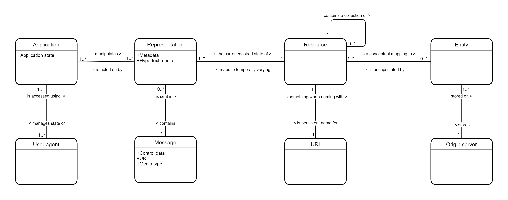

# REpresentational State Transfer

> <https://en.wikipedia.org/wiki/Representational_state_transfer>

- [REpresentational State Transfer](#representational-state-transfer)
  - [History](#history)
  - [Architectural concepts](#architectural-concepts)
  - [Architectural properties](#architectural-properties)
  - [Architectural constraints](#architectural-constraints)
  - [Classification models](#classification-models)

**Representational state transfer (REST)** is a software architectural style
that was created to guide the design and development of the architecture for
the World Wide Web. REST defines a set of constraints for how the architecture
of an Internet-scale distributed hypermedia system, such as the Web, should
behave. The REST architectural style emphasises the scalability of interactions
between components, uniform interfaces, independent deployment of components,
and the creation of a layered architecture to facilitate caching components to
reduce user-perceived latency, enforce security, and encapsulate legacy systems.

A web API that obeys the REST constraints is informally described as RESTful.
RESTful web APIs are typically loosely based on HTTP methods to access
resources via URL-encoded parameters and the use of JSON or XML to transmit data.

"Web resources" were first defined on the World Wide Web as documents or files
identified by their URLs. Today, the definition is much more generic and
abstract and includes every thing, entity, or action that can be identified,
named, addressed, handled, or performed in any way on the Web. In a RESTful Web
service, requests made to a resource's URI elicit a response with a payload
formatted in HTML, XML, JSON, or some other format. The most common protocol
for these requests and responses is HTTP. It provides operations (HTTP methods)
such as GET, POST, PUT, and DELETE. By using a stateless protocol and standard
operations, RESTful systems aim for fast performance, reliability, and the
ability to grow by reusing components that can be managed and updated without
affecting the system as a whole, even while it is running.

The goal of REST is to increase **performance**, **scalability**,
**simplicity**, **modifiability**, **visibility**, **portability**, and
**reliability**. This is achieved through following REST principles such as a
client–server architecture, statelessness, cacheability, use of a layered
system, support for code on demand, and using a uniform interface. These
principles must be followed for the system to be classified as RESTful.

## History

Roy Fielding defined REST in his 2000 PhD dissertation "Architectural Styles
and the Design of Network-based Software Architectures" at UC Irvine.

Architectural styles are independent of any specific implementation, and while
REST was created as part of the development of the Web standards, the
implementation of the Web does not obey every constraint in the REST
architectural style. Mismatches can occur due to ignorance or oversight, but
the existence of the REST architectural style means that they can be identified
before they become standardised. For example, Fielding identified the embedding
of session information in URIs as a violation of the constraints of REST which
can negatively affect shared caching and server scalability. HTTP cookies also
violated REST constraints because they can become out of sync with the
browser's application state, making them unreliable; they also contain opaque
data that can be a concern for privacy and security.

## Architectural concepts

The REST architectural style is designed for network-based applications,
specifically client-server applications. But more than that, it is designed for
Internet-scale usage, so the coupling between the user agent (client) and the
origin server must be as lightweight (loose) as possible to facilitate
large-scale adoption. This is achieved by creating a layer of abstraction on
the server by defining resources that encapsulate entities (e.g. files) on the
server and so hiding the underlying implementation details (file server,
database, etc.). But the definition is even more general than that: any
information that can be named can be a resource: an image, a database query, a
temporal service (e.g. “today’s weather in London”), or even a collection of
other resources. This approach allows the greatest interoperability between
clients and servers in a long-lived Internet-scale environment which crosses
organisational (trust) boundaries.

Clients can only access resources using URIs. In other words, the client
requests a resource using a URI and the server responds with a representation
of the resource. A representation of a resource is another important concept in
REST; to ensure responses can be interpreted by the widest possible number of
client applications a representation of the resource is sent in hypertext
format. Thus, a resource is manipulated through hypertext representations
transferred in messages between the clients and servers.

The strong decoupling of client and server together with the text-based
transfer of information using a uniform addressing protocol provided the basis
for meeting the requirements of the Web: robustness (anarchic scalability),
independent deployment of components, large-grain data transfer, and a
low-entry barrier for content readers, content authors and developers alike.

## Architectural properties

The constraints of the REST architectural style affect the following
architectural properties:

- **performance** in component interactions, which can be the dominant factor in
  user-perceived performance and network efficiency;
- **scalability** allowing the support of large numbers of components and
  interactions among components;
- **simplicity** of a uniform interface;
- **modifiability** of components to meet changing needs (even while the
  application is running);
- **visibility** of communication between components by service agents;
- **portability** of components by moving program code with the data;
- **reliability** in the resistance to failure at the system level in the
  presence of failures within components, connectors, or data.

## Architectural constraints

>>>>> progress

The REST architectural style defines six guiding constraints. When these
constraints are applied to the system architecture, it gains desirable
non-functional properties, such as performance, scalability, simplicity, modifiability, visibility, portability, and reliability.[1] A system that complies with some or all of these constraints is loosely referred to as RESTful.

The formal REST constraints are as follows:

Client–server architecture
See also: Client–server model
The client-server design pattern enforces the principle of separation of concerns: separating the user interface concerns from the data storage concerns. Portability of the user interface is thus improved. In the case of the Web, a plethora of web browsers have been developed for most platforms without the need for knowledge of any server implementations. Separation also simplifies the server components, improving scalability, but more importantly it allows components to evolve independently (anarchic scalability), which is necessary in an Internet-scale environment that involves multiple organisational domains.

Statelessness
See also: Stateless protocol
In computing, a stateless protocol is a communications protocol in which no session information is retained by the receiver, usually a server. Relevant session data is sent to the receiver by the client in such a way that every packet of information transferred can be understood in isolation, without context information from previous packets in the session. This property of stateless protocols makes them ideal in high volume applications, increasing performance by removing server load caused by retention of session information.

Cacheability
See also: Web cache
As on the World Wide Web, clients and intermediaries can cache responses. Responses must, implicitly or explicitly, define themselves as either cacheable or non-cacheable to prevent clients from providing stale or inappropriate data in response to further requests. Well-managed caching partially or completely eliminates some client–server interactions, further improving scalability and performance.

Layered system
See also: Layered system
A client cannot ordinarily tell whether it is connected directly to the end server or to an intermediary along the way. If a proxy or load balancer is placed between the client and server, it won't affect their communications, and there won't be a need to update the client or server code. Intermediary servers can improve system scalability by enabling load balancing and by providing shared caches. Also, security can be added as a layer on top of the web services, separating business logic from security logic.[9] Adding security as a separate layer enforces security policies. Finally, intermediary servers can call multiple other servers to generate a response to the client.

Code on demand (optional)
See also: Client-side scripting
Servers can temporarily extend or customize the functionality of a client by transferring executable code: for example, compiled components such as Java applets, or client-side scripts such as JavaScript.

Uniform interface
The uniform interface constraint is fundamental to the design of any RESTful system.[1] It simplifies and decouples the architecture, which enables each part to evolve independently. The four constraints for this uniform interface are:

Resource identification in requests - Individual resources are identified in requests, for example using URIs in RESTful Web services. The resources themselves are conceptually separate from the representations that are returned to the client. For example, the server could send data from its database as HTML, XML or as JSON—none of which are the server's internal representation.
Resource manipulation through representations - When a client holds a representation of a resource, including any metadata attached, it has enough information to modify or delete the resource's state.
Self-descriptive messages - Each message includes enough information to describe how to process the message. For example, which parser to invoke can be specified by a media type.[1]
Hypermedia as the engine of application state (HATEOAS) - Having accessed an initial URI for the REST application—analogous to a human Web user accessing the home page of a website—a REST client should then be able to use server-provided links dynamically to discover all the available resources it needs. As access proceeds, the server responds with text that includes hyperlinks to other resources that are currently available. There is no need for the client to be hard-coded with information regarding the structure or dynamics of the application.[10]

## Classification models
Several models have been developed to help classify REST APIs according to their adherence to various principles of REST design, such as the Richardson Maturity Model.[11]

Applied to web services
Web service APIs that adhere to the REST architectural constraints are called RESTful APIs.[12] HTTP-based RESTful APIs are defined with the following aspects:[13]

a base URI, such as http://api.example.com/;
standard HTTP methods (e.g., GET, POST, PUT, and DELETE);
a media type that defines state transition data elements (e.g., Atom, microformats, application/vnd.collection+json,[13]: 91–99  etc.). The current representation tells the client how to compose requests for transitions to all the next available application states. This could be as simple as a URI or as complex as a Java applet.[14]
Semantics of HTTP methods
The following table shows how HTTP methods are intended to be used in HTTP APIs, including RESTful ones.

Semantics of HTTP methods
HTTP method	Description
GET[2]: §4.3.1 	Get a representation of the target resource’s state.
POST[2]: §4.3.3 	Let the target resource process the representation enclosed in the request.
PUT[2]: §4.3.4 	Create or replace the state of the target resource with the state defined by the representation enclosed in the request.
DELETE[2]: §4.3.5 	Delete the target resource’s state.
The GET method is safe, meaning that applying it to a resource does not result in a state change of the resource (read-only semantics).[2]: §4.2.1  The GET, PUT, and DELETE methods are idempotent, meaning that applying them multiple times to a resource results in the same state change of the resource as applying them once, though the response might differ.[2]: §4.2.2  The GET and POST methods are cacheable, meaning that responses to them are allowed to be stored for future reuse.[2]: §4.2.3 

Discussion
Unlike SOAP-based web services, there is no "official" standard for RESTful web APIs. This is because REST is an architectural style, while SOAP is a protocol. REST is not a standard in itself, but RESTful implementations make use of standards, such as HTTP, URI, JSON, and XML. Many developers describe their APIs as being RESTful, even though these APIs do not fulfill all of the architectural constraints described above (especially the uniform interface constraint).[14]
