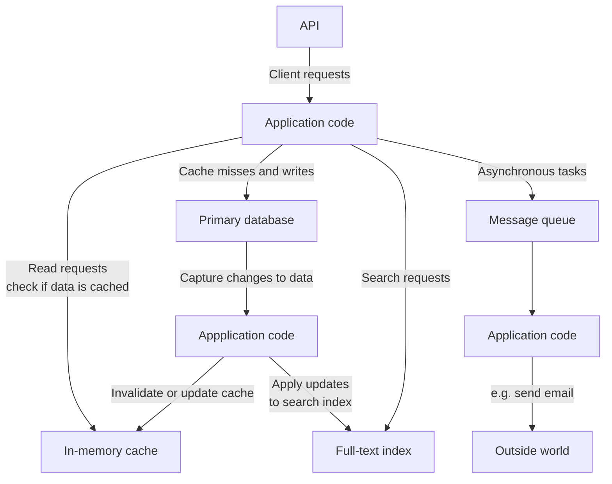

# 1. Reliable, Scalable, and Maintainable Applications

- [1. Reliable, Scalable, and Maintainable Applications](#1-reliable-scalable-and-maintainable-applications)
  - [Thinking About Data Systems](#thinking-about-data-systems)
  - [Reliability](#reliability)
    - [Hardware Faults](#hardware-faults)
    - [Software Errors](#software-errors)
    - [Human Errors](#human-errors)
    - [How Important Is Reliability](#how-important-is-reliability)
  - [Scalability](#scalability)
    - [Describing Load](#describing-load)
    - [Describing Performance](#describing-performance)
    - [Approaches for Coping with Load](#approaches-for-coping-with-load)
  - [Maintainability](#maintainability)
    - [Operability: Making Life Easy for Operations](#operability-making-life-easy-for-operations)
    - [Simplicity: Managing Complexity](#simplicity-managing-complexity)

A data-intensive application provides commonly needed functionalities:

- Store data (databases)
- Remember the result of an expensive operation to speed up reads (caches)
- Allow users to search data by keyword (search indexes)
- Send a message to another process, to be handled asynchronously (stream
  processing)
- Periodically crunch a large amount of data (batch processing)

## Thinking About Data Systems

If an application-managed caching layer, or a full-text search server was
separated from the main database, it is normally the application code's
responsibility to keep those caches and indexes in sync with the main database.

Three important concerns in most software systems:

- Reliability: The system should continue to work correctly.
- Scalability: As the system grows, there should be reasonable ways of dealing
  with that growth.
- Maintainability: Different people should be able to work on the system,

## Reliability

A ***fault*** is usually defined as one component of the system deviating from
its spec, whereas a ***failure*** is when the system as a whole stops providing
the required service to the user.

- It is impossible to reduce the probability of a fault to zero;
- It is usually best to design fault-tolerance machanisms that prevant faults
  from causing failures.

### Hardware Faults

- Hard disks
- RAM
- Network cable
- Power blackout

### Software Errors

- OS kernel bugs
- Infrastructures service bugs
- Application bugs

### Human Errors

Configuration errors by operators were the leading cause of outages, whereas
hardware faults played a role in only 10-25% of outages.

Several aspects concerning human errors:

- Design systems in good ways
- Decouple places where people tend to make mistakes
- Test thoroughly at all levels
- Allow quick and easy recovery from human errors
- Set up detailed and clear monitoring
- Implement good management practices and training

### How Important Is Reliability

It's all about trade-offs.

## Scalability

***Scalability*** describes a system's ability to cope with increased load.

### Describing Load

Load can be described with a few numbers called ***load parameters***.
The best choice of parameters depends on the architecture.

e.g. Twitter's Timeline posts of a user. There are broadly two ways of
implementing it:

1. Do SQL JOIN query on `users` table and `tweets` table.
2. Insert new posts into the home timeline caches of a user's followers.

Approach 2 is better because the average rate of published tweets
(4.6k requests/s) is almost two orders of magnitude lower than the rate of home
timeline reads (300k requests/s).

The downside of approach 2 is that posting a tweet requires a lot of extra work.

This distribution of followers per user is a **key load parameter** for
discussing scalability.

> 💡 Twitter at last combined both approaches together. For those tweets which
> are from users with a large number of followers, they were query through
> approach 1 then merged with results from approach 2.

### Describing Performance

- **throughput**
  - batch processing systems
- **response time**
  - online systems

It is usually better to use ***percentiles*** to illustrate response times
than to use mean response time. Because it tells you how many users actually
experienced that delay.

- `p50`: 50%
- `p99`: 99%
- `p999`: 99.9%

Percentiles are often used in ***service level objectives (SLOs)*** and
***service level agreements (SLAs)***, contracts that define the expected
performance and availability of a service.

### Approaches for Coping with Load

- scaling up: vertical scaling
- scaling out: horizontal scaling (shared-nothing)

## Maintainability

Three design principles for software systems:

- **Operability**: make it easy for operations teams to keep the system running
  smoothly.
- **Simplicity**: make it easy for new engineers to understand the system, by
  removing as much complexity as possible from the system.
- **Evolvability**: make it easy for engineers to make changes to the system
  in the future, adapting it for unanticipated use cases as requirements change.
  Also known as *extensibility*, *modifiability*, or *plasticity*.

### Operability: Making Life Easy for Operations

A good operations team typically is responsible for the following, and more:

- Monitoring quick restoring
- Tracking down problems
- Keeping things up to date
- Keeping tabs on how different systems affect each other
- Anticipating future problems and solving them early
- Establishing good practices and tools for deployment, configuration management
  , and more
- Performing complex maintenance tasks
- Secure the system
- Defining processes on dealing with operation problems
- Preserving the organization's knowledge

How to:

- Providing visibility (behavior and internals of the system)
- Providing good support for automation and integration
- Avoiding dependency on individual machine
- Providing good documentation
- Providing good default behavior
- Self-healing
- Exhibiting predictable behavior

### Simplicity: Managing Complexity

