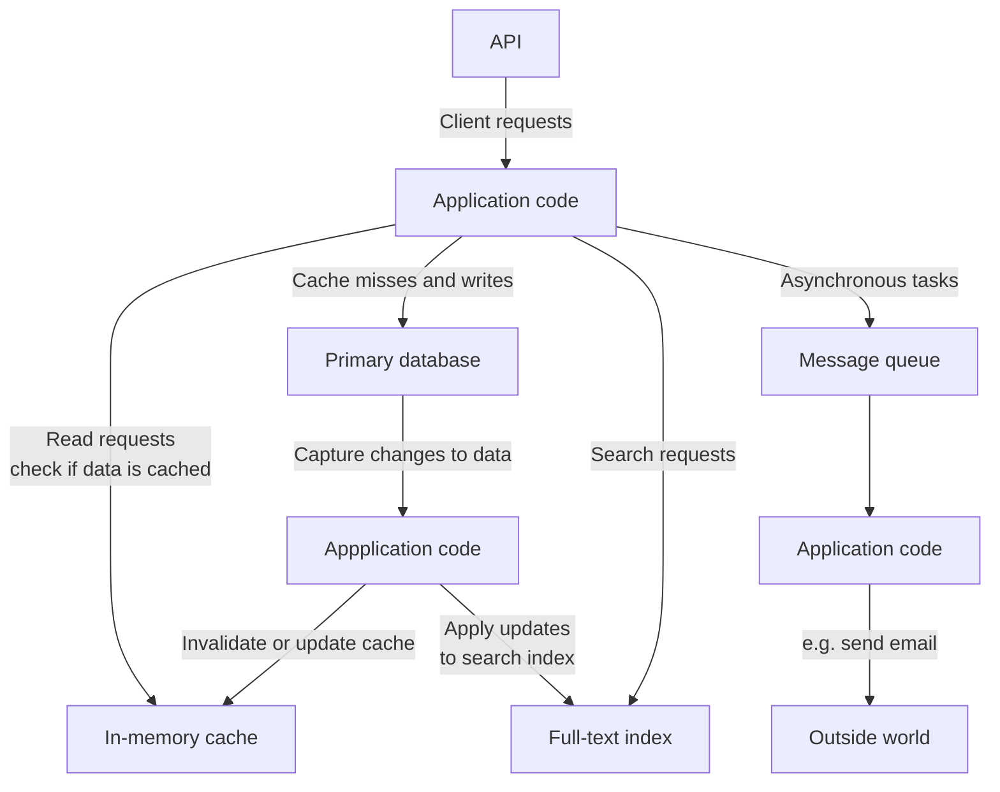

# 1. Reliable, Scalable, and Maintainable Applications

- [1. Reliable, Scalable, and Maintainable Applications](#1-reliable-scalable-and-maintainable-applications)
  - [Thinking About Data Systems](#thinking-about-data-systems)
  - [Reliability](#reliability)
    - [Hardware Faults](#hardware-faults)
    - [Software Errors](#software-errors)

A data-intensive application provides commonly needed functionalities:

- Store data (databases)
- Remember the result of an expensive operation to speed up reads (caches)
- Allow users to search data by keyword (search indexes)
- Send a message to another process, to be handled asynchronously (stream
  processing)
- Periodically crunch a large amount of data (batch processing)

## Thinking About Data Systems

If an application-managed caching layer, or a full-text search server was
separated from the main database, it is normally the application code's
responsibility to keep those caches and indexes in sync with the main database.

Three important concerns in most software systems:

- Reliability: The system should continue to work correctly.
- Scalability: As the system grows, there should be reasonable ways of dealing
  with that growth.
- Maintainability: Different people should be able to work on the system,

## Reliability

A ***fault*** is usually defined as one component of the system deviating from
its spec, whereas a ***failure*** is when the system as a whole stops providing
the required service to the user.

- It is impossible to reduce the probability of a fault to zero;
- It is usually best to design fault-tolerance machanisms that prevant faults
  from causing failures.

### Hardware Faults

- Hard disks
- RAM
- Network cable
- Power blackout

### Software Errors

>>>>> progress
