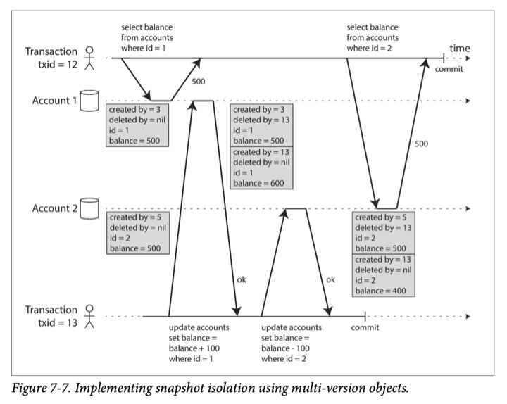

# 7. Transactions

- [7. Transactions](#7-transactions)
  - [The Slippery Concept of a Transaction](#the-slippery-concept-of-a-transaction)
    - [The Meaning of ACID](#the-meaning-of-acid)
      - [Atomicity](#atomicity)
      - [Consistency](#consistency)
      - [Isolation](#isolation)
      - [Durability](#durability)
      - [Replication and Durability](#replication-and-durability)
    - [Single-Object and Multi-Object Operations](#single-object-and-multi-object-operations)
      - [Single-object writes](#single-object-writes)
      - [The need for multi-object transactions](#the-need-for-multi-object-transactions)
      - [Handling errors and aborts](#handling-errors-and-aborts)
  - [Weak Isolation Levels](#weak-isolation-levels)
    - [Read Committed](#read-committed)
      - [No dirty reads](#no-dirty-reads)
      - [No dirty writes](#no-dirty-writes)
      - [Implementing read committed](#implementing-read-committed)
    - [Snapshot Isolation and Repeatable Read](#snapshot-isolation-and-repeatable-read)
      - [Implementing snapshot isolation](#implementing-snapshot-isolation)
      - [Visibility rules for observing a consistent snapshot](#visibility-rules-for-observing-a-consistent-snapshot)
      - [Indexes and snapshot isolation](#indexes-and-snapshot-isolation)
      - [Repeatable read and naming confusion](#repeatable-read-and-naming-confusion)
    - [Preventing Lost Updates](#preventing-lost-updates)
      - [Atomic write operations](#atomic-write-operations)
      - [Explicit locking](#explicit-locking)
      - [Automatically detecting lost updates](#automatically-detecting-lost-updates)
      - [Compare-and-set](#compare-and-set)
      - [Conflict resolution and replication](#conflict-resolution-and-replication)
    - [Write Skew and Phantoms](#write-skew-and-phantoms)
      - [Characterizing write skew](#characterizing-write-skew)
      - [More examples of write skew](#more-examples-of-write-skew)

A ***transaction*** is a way for an application to group several reads and
writes together into a logical unit. All the reads and writes in a transaction
are executed as one operation: either the entire transaction succeeds (`commit`)
or it fails (`abort`, `rollback`).

Transactions were created to simplify the programming model for applications
accessing a database. By using transactions, the application is free to ignore
certain potential error scenarios and concurrency issues, because the database
takes care them instead.

Sometimes there are advantages to weakening transactional guarantees or
abandoning them entirely.

## The Slippery Concept of a Transaction

In the late 2000s, nonrelational (NoSQL) databases started gaining popularity.
Many of this new generation of databases abandoned transactions entirely, or
redefined the word to describe a much weaker set of guarantees than had
previously been understood.

### The Meaning of ACID

The safety guarantees provided by transactions are described by the well-known
acronym ***ACID***.

- Atomicity
- Consistency
- Isolation (there is a lot of ambiguity around the meaning)
- Durability

Systems that do not meet the ACID critera are sometimes called *BASE*, even more
vague than the definition of ACID:

- Basically Available
- Soft state
- Eventual consistency

#### Atomicity

In the context of ACID, atomicity is **not** about concurrency. It does not
describe what happens if several processes try to access the same data at the
same time, which is covered under **Isolation**.

Rather, atomicity describes what hapeens if a client wants to make several
writes, but a fault occurs after some of the writes have been processed.

Perhaps ***abortability*** would have neem a better term than *atomicity*.

#### Consistency

In the context of ACID, ***consistency*** refers to an application-specific
notion of the database being in a "good state".

The idea of *consistency* is that you have certain statements about your data
that must always be true.

This idea of consistency depends on the application's notion of invariants, and
it's the application's responsibility to define its transactions correctly.

***Atomicity***, ***isolation***, and ***durability*** are properties of the
database, whereas consistency is a property of the application. The application
may rely on the database's atomicity and isolation properties to achieve
consistency. The letter C doesn't really belong in ACID.

#### Isolation

```graph
            get counter: 42 + 1 = 43, set counter = 43
[User 1]    \    ^ 42                 \    ^
             \  /                      \  / ok
[Database]    --     --                 --    --
                    /  \                     /  \ ok
[User 2]           /    v 42                /    v
                  get counter: 42 + 1 = 43, set counter = 43
```

***Isolation*** means that concurrently executing transactions are isolated from
each other.

The classic database textbooks formalize isolation as ***serializability***,
which means that each transaction can pretend that it is the only transaction
running on the entire database. The database ensures that when the transactions
have commited, the result is the same as if they had run *serially*.

However, in practice, serializable isolation is rarely used, because it carries
a performance penalty. In Oracle there is an isolation level called
"serializable", but it actually implements something called
***snapshot isolation***, which is a weaker guarantee than serializability.

#### Durability

***Durability*** is the promise that once a transaction has committed
successfully, any data it has written will not be forgotten.

In a single-node database, durability means that the data has been written to
nonvolatile storage. It usually involves a write-ahead log or similar, which
allows recovery in the event that the data structures on disk are corrupted.

In a replicated database, durability may mean that the data has been
successfully copied to some number of nodes.

#### Replication and Durability

Recently, durability has been adapted to mean replication.

### Single-Object and Multi-Object Operations

In ACID, atomicity and isolation describe what the database should do if a
client makes several writes within the same transaction:

- Atomicity: giving an all-or-nothing guarantee
- Isolation: if one transaction makes several writes, then another transaction
  should see either all or none of those writes, but not some subset.

***Dirty read***: one transaction reads another transaction's uncommitted
writes.

Multi-object transactions require some way of determining which read and write
operations belong to the same transaction.

#### Single-object writes

Atomicity and isolation also apply when a single object is being changed.
Because it also takes a period of time to write a single object. storage engines
almost universally aim to provide atomiticy and isolation on the level of a
single object on one node.

- Atomicity can be implemented using a log for crash recovery.
- Isolation can be implemented using a lock on each object, allowing only one
  thread to access an object at any one time.

These single-object operations are useful, however, they are not transactions in
the usual sense of the word. Compare-and set (which allows a write to happen
only if the value has not been concurrently changed by someone else) and other
single-object operations have been dubbed "*lightweight-transactions".

#### The need for multi-object transactions

Many distributed datastores have abandoned multi-object transactions becuase
they are difficult to implement across partitions, and they can be a problem in
some scenarios where very high availability or performance is required.

Is multi-object transactions necessary? Is it possible to implement any
application with only a key-value data model and single-object operation?

- In a relational data model, multi-object transactions allow you to ensure that
  a row which has a foreign key reference to a row in another table remain
  valid.
- In a document data model, fields within the same document are treated as a
  single object. However, when denormalized information needs to be updated, you
  need to update several documents in one go.
- In databases with secondary indexes, the indexes also need to be updated every
  time you change a value.

Such applications can still be implemented without transactions with much more
complicated error handling.

#### Handling errors and aborts

In particular, datastores with leaderless replication work much more on a
"best effort" basis, so it's the application's responsibility to recover from
errors.

The whole point of aborts is to enable safe retries (in my opinion, prompt the
errors to the user is acceptable).

Auto-retrying could be a problem:

- The transaction actually succeeded, but a network failure makes it a false
  failure in the client's view.
- If the error is due to overload, retrying the transaction will make the
  problem worse. Limiting the numebr of retries is needed.
- Retrying a permanent error is pointless.
- If the transaction has side effects outside of the database (e.g. sending an
  email), those side effects may happen again when retrying the transaction.
  If you want to make sure that several different systems either commit or abort
  together, two-phase commit can help.

## Weak Isolation Levels

Concurrency issues (race conditions) only come into play when one transaction
reads data that is concurrently modified by another transaction, or when two
transactions try to simultaneously modify the same data.

Concurrency bugs are hard to find by testing, because such bugs are only
triggered when you get unlucky with the timing.

***Serializable*** isolation means that the database guarantees that
transactions have the same effect as if they ran *serially*.

In practice however, isolation is not that simple. Serializable isolation has a
performance cost. Many databases (even relational) use weaker levels of
isolation, which protect against *some* concurrency issues, but not all. Those
levels of isolation are harder to understand and more easily lead to subtle
bugs.

### Read Committed

The most basic level of transaction isolation is ***read committed***. It makes
two guarantees:

1. When reading from the database, you will only see data that has been
   committed (no ***dirty reads***)
2. When writing to the database, you will only overwrite data that has been
   committed (no ***dirty writes***)

#### No dirty reads

***Dirty read***: a transaction can see uncommitted data changed by another
transaction.

Any writes by a transaction only become visible to others when that transaction
commits.

Why prevent dirty reads:

- Seeing the database in a partially updated state is confusing to users and may
  cause other transactions to take incorrect decisions.
- A transaction may see data that is later rolled back.

#### No dirty writes

We normally assume that a later write overwrites an earlier write.

***Dirty write***: if the earlier write is part of a transaction that has not
yet committed, and the later write overwrites an uncommitted value.

Transactions running at the read committed isolation level must prevent dirty
writes, usually by delaying the second write until the first write's transaction
has committed or aborted.

Why prevent dirty writes:

- Conflicting writes from different transactions can be mixed up.

However, read committed does not prevent the race condition between two counter
increments. In this case, the second write happens after the first transaction
has committed, so it's not a dirty write. But it's still incorrect for a
different reason.

#### Implementing read committed

Read committed is the default setting in Oracle 11g, PostgreSQL, and many other
databases.

Most commonly, databases prevent dirty writes by using row-level locks: when a
transaction wants to modify a particular object (row or document), it must hold
a lock on that object until the transaction is over. If another transaction
wants to write to the same object, it must wait until it can acquire the lock.

How to prevent dirty reads?

- One option would be to use the same lock, and to require any transaction that
  wants to read an object to brifly acquire the lock and then release it again
  after reading.
  - This approach does not work well in practice, because one long-running write
    transaction can force many read-only transactions to wait.
- Most databases prevent dirty reads using this approach:
  - for every object that is written, the database remembers both the old
    committed value and the new value set by the one holding the lock,
  - while the transaction is ongoing, any other transactions are simply given
    the old value.

In around 2017, the only mainstream databases that use locks for read committed
isolation are IBM DB2 and Microsoft SQL Server in the
`read_committed_snapshot=off` configuration.

### Snapshot Isolation and Repeatable Read

Read committed isolation is not enough:

- Alice's Account 1: `balance = 500`
- Alice's Account 2: `balance = 500`
- Alice (transaction 1):
  - `select balance from accounts where id = 1;` returns `500`
- Transfer (transaction 2):
  - `update accounts set balance = balance + 100 where id = 1;`
  - Account 1: `balance = 600`
  - `update accounts set balance = balance - 100 where id = 2;`
  - Account 2: `balance = 400`
  - `commit`
- Alice (transaction 1):
  - `select balance from accounts where id = 2;` returns `400`
  - `commit`

The anomaly above is called a ***nonrepeatable read*** or ***read skew***.

Some situations cannot tolerate such temporary inconsistency:

- Backups: taking a backup requires making a copy of the entire database. During
  the time that the backup process is running, write will continue to be made to
  the database. Thus, you could end up with some parts of the backup containing
  an older version of the data, and other parts containing a newer version.
- Analytic queries and integrity checks: these queries are likely to return
  nonsensical results if they observe parts of the database at different points
  in time.

***Snapshot isolation*** is the most common solution to nonrepeatable read. The
idea is that each transaction reads from a ***consistent snapshot*** of the
database -- that is, the transaction sees all the data that was committed in the
database at the start of the transaction. Each transaction sees only the old
data from that particular point in time.

Snapshot isolation is a boon for long-running, read-only queries such as backups
and analytics.

#### Implementing snapshot isolation

Implementations of snapshot isolation typically use write locks to prevent dirty
writes, which means that a transaction that makes a write can block the progress
of another transaction that writes to the same object.

However, reads do not require any locks.

A key principle of snapshot isolation is *readers never block writers*, and
*writers never block readers*.

To implement snapshot isolation, databases use a generalization of the mechanism
for preventing dirty reads. The database must potentially keep several different
committed versions of an object, because various in-progress transactions may
need to see the state of the database at different points in time.

- Because it maintains several versions of an object side by side, this
  technique is known as ***multi-version concurrency control (MVCC)***.

For read committed isolation, it would be sufficient to keep two versions of an
object: the committed version and the overwritten-but-not-yet-committed version.

- 💡 However, storage engines that support snapshot isolation typically use MVCC
  for their read committed isolation level as well.
- A typical approach is that
  - read committed uses a separate snapshot for each query, while
  - snapshot isolation uses the same snapshot for an entire transaction.

How to implement MVCC-based snapshot isolation (PostgreSQL):

- When a transaction is started, it is given a unique, increasing transacion ID
- Whenever a transaction writes anything to the database, the data it writes is
  tagged with the transaction ID of the writer.



- A garbage collection process in the database removes any rows marked for
  deletion and frees their space.
- An update is internally transalated into a delete and a create.

#### Visibility rules for observing a consistent snapshot

Transaction IDs are used to decide which objects it can read. Visibility rules
are as follows:

1. At the start of each transactions, the database makes a list of all the other
   transactions that are in progress at that time. Any writes that those
   transactions have made are ignored, even if the transactions subsequently
   commit.
2. Any writes made by aborted transactions are ignored.
3. Any writes made by transactions with a later transaction ID are ignored,
   regardless of whether those transactions have committed.
4. All other writes are visible to the application's queries.

These rules apply to both creation and deletion of objects. Put another way, an
object is visible if both of the following conditions are true:

- At the time when the reader's transaction started, the transaction that
  created the object had already committed.
- The object is not marked for deletion, or if it is, the transaction that
  requested deletion had not yet committed at the time when the reader's
  transaction started.
  - e.g. in the snapshot isolation figure, the

    ```txt
    created by = 3
    deleted by = 13
    id = 1
    balance = 500
    ```

    can be seen by transaction 12.

By never updating values in place but instead creating a new version every time
a value is changed, the database can provide a consistent snapshot while
incurring only a small overhead.

#### Indexes and snapshot isolation

How do indexes work in a multi-version database?

- One option is to have the index simply point to all versions of an object and
  require an index query to filter out any object versions that are not visible
  to the current transaction.
  - When garbage collection removes old object versions that are no longer
    visible to any transactoin, the corresponding index entries can also be
    removed.
- Another approach is used in CouchDB and others. Although they also use
  B-trees, they use an *append-only/copy-on-write* variant that does not
  overwrite pages of the tree when they are updated, but instead creates a new
  copy of each modified page. Parent pages up to the root are copied and updated
  to point to the new versions of their child pages.

With append-only B-trees, every write transaction creates a new B-tree root, and
a particular root is a consistent snapshot of the database at the point in time
when it was created.

- There is not need to filter out objects based on transaction IDs because
  subsequent writes cannot modify an existing B-tree; they can only create new
  tree roots.

#### Repeatable read and naming confusion

Snapshot isolation is useful especially for read-only transactions. Many
databases call it by different names. In Oracle it is called *serializable*, and
in PostgreSQL and MySQL it is called *repeatable read*.

System R's 1975 defined *repeatable read*, which looks superficially similar to
snapshot isolation.

| Database        | Default         | Maximum            |
| --------------- | --------------- | ------------------ |
| MySQL 5.6       | Repeatable Read | Serializability    |
| SQL Server 2012 | Read Committed  | Serializability    |
| Oracle 11g      | Read Committed  | Snapshot Isolation |
| Postgres 9.2.2  | Read Committed  | Serializability    |
| VoltDB          | Serializability | Serializability    |

Isolation levels:

- `RC`: Read Committed
- `RR`: Repeatable Read
- `SI`: Snapshot Isolation
- `S`: Serializability
- `CS`: Cursor Stability
- `CR`: Consistent Read

### Preventing Lost Updates

The lost update problem can occur if an application reads some value from the
database, modifies it, and writes back the modified value
(a *read-modify-write style*). It occurs in various different scenarios:

- Incrementing a counter or updating an account balance (requires reading the
  current value, calculating the new value, and writing back the updated value)
- Making a local change to a complex value (requires parsing the document,
  making the change, and writing back the modified document)
- Two users editing a wiki page at the same time, where each user saves their
  changes by sending the entire page contents to the server, overwriting
  whatever is currently in the database

#### Atomic write operations

Many databases provide atomic update operations, which remove the need to
implement *read-modify-write* cycles in application code. The following
instruction is concurrency-safe in most relational databases:

```sql
UPDATE counters SET value = value + 1 WHERE key = 'foo';
```

Document databases such as MongoDB provide atomic operations for making local
modifications to a part of a JSON document, and Redis provides atomic operations
for modifying data structures such as priority queues.

Atomic operations are usually implemented by

- ***cursor stability***: taking an exclusive lock on the object when it is
  read so that that no other transaction can read it until the update has been
  applied.
- another option is to simply force all atomic operations to be executed on a
  single thread.

⚠️ Object-relational mapping frameworks make it easy to accidentally write code
that performs unsafe read-modify-write cycles instead of using atomic operations
provided by the database.

#### Explicit locking

The application can explicitly lock objects that are going to be updated to
prevent lost updates. Then the application can perform a read-modify-write
cycle, any other transaction trying to read the same object is forced to wait
until the lock is freed.

For some cases that need to do some checks on data returned by a query in the
same transaction, an atomic operation is not sufficient:

```sql
BEGIN TRANSACTION;

SELECT * FROM figures
  WHERE name = 'robot' AND game_id = 222
  FOR UPDATE; -- This FOR UPDATE clause indicates that the database should take
              --  a lock on all rows returned by this query.

-- Check whether move is valid, then update the position of the piece that was
--  returned by the previous SELECT.

UPDATE figures SET position = 'c4' WHERE id = 1234;

COMMIT;
```

#### Automatically detecting lost updates

An alternative is to allow *read-modify-write* cycles to execute in parallel
and, if the transaction manager detects a lost update, abort the transaction and
force it to retry.

An advantage of this approach is that databases can perform this check
efficiently in conjunction with snapshot isolation.

- PostgreSQL's repeatable read, Oracle's serializable, and SQL Server's snapshot
  isolation levels automatically detect when a lost update has occurred and
  abort the offending transaction.
- MySQL InnoDB's repeatable read does not detect lost updates.

#### Compare-and-set

In databases that don't provide transaction, there is an atomic
*compare-and-set* operation. It avoids lost updates by allowing an update to
happen only if the value has not changed since you last read it. If the current
value does not match what was previously read, the update has not effect, and
the read-modify-write cycle must be retried. e.g.

```sql
-- This may or may not be safe, depending on the database implementation
UPDATE wiki_pages SET content = 'new content'
  WHERE id = 1234 AND content = 'old content';
```

You need to check whether the update took effect and retry if necessary.

- ⚠️ If the database allows the `WHERE` clause to read from an old snapshot,
  this statement may not prevent lost updates, because the condition may be true
  even though another concurrent write is occurring.

#### Conflict resolution and replication

In replicated databases, they have copies of the data on multiple nodes, and the
data can potentially be modified concurrently on different nodes, some
additional steps need to be taken to prevent lost updates.

Locks and compare-and-set operations assume that there is a single up-to-date
copy of the data. However, Databases with multi-leader or leaderless usually
allow several writes to happen concurrently and replicate them asynchronously,
so they cannot guarantee that there is a single up-to-date copy of the data.
Thus, techniques based on locks or compare-and-set do not apply in this context.

A common approach in such replicated databases is to allow concurrent writes to
create several conflicting versions of a value (know as *siblings*), and to use
application code or special data structures to resolve and merge these versions
after the fact.

Atomic operations can work well in a replicated context, especially if they are
commutative in order (e.g. incrementing a counter).

- When a value is concurrently updated by different clients, Riak automatically
  merges together the updates in such a way that no updates are lost.

⚠️ The *last write wins* conflict resolution method is prone to lost updates.
But unfortunately, it is the default in many replicated databases.

### Write Skew and Phantoms

e.g. Imagine that Alice and Bob are two on-call doctors for a shift. Both are
feeling unwell, so they both decide to request leave. They happen to click the
button to go off call at the same time. What happens next?

Alice:

```sql
begin transacton;

currently_on_call = (
  select count(*) from doctors
  where on_call = true
  and shift_id = 1234
); -- Now current_on_call = 2

if (currently_on_call >= 2) (
  update doctors
  set on_call = false
  where name = 'Alice'
  and shift_id = 1234
);

commit transaction;
```

Bob:

```sql
begin transacton;

currently_on_call = (
  select count(*) from doctors
  where on_call = true
  and shift_id = 1234
); -- Now current_on_call = 2

if (currently_on_call >= 2) (
  update doctors
  set on_call = false
  where name = 'Bob'
  and shift_id = 1234
);

commit transaction;
```

Now it ends up unexpectedly that no doctor is on call.

This is called ***write skew***. It is neither a dirty write nor a lost update,
because the two transactions are updating two different objects. But it's
definitely a race condition: if the two transaction had run one after another,
the second doctor would have been prevented from going off call.

#### Characterizing write skew

Write skew can be treated as a generalization of the lost update problem. Write
skew can occur if two transactions read the same objects, and then update some
of those objects.

- In the special case where different transactions update the same object, you
  get a dirty write or lost update.

With write skew:

- Atomic single-object operations don't help, as multiple objects are involved.
- The automatic detection of lost updates in snapshot isolation doesn't help
  either: Automatically preventing write skew requires true serializable
  isolation.
- Most databases do not have built-in support for a constraint that involves
  multiple objects. You may have to implement them with triggers or materialized
  views.
- If you can't use a serializable isolation level, the second-best option in
  this case is probably to explicitly lock the rows that the transaction depends
  on:

  ```sql
  BEGIN TRANSACTION;
  
  SELECT * FROM doctors
    WHERE on_call = true
    AND shift_id = 1234 FOR UPDATE;
    -- FOR UPDATE tells the database to lock all rows returned by this query.

  UPDATE doctors
    SET on_call = false
    WHERE name = 'Alice'
    AND shift_id = 1234;

  COMMIT;
  ```

#### More examples of write skew
