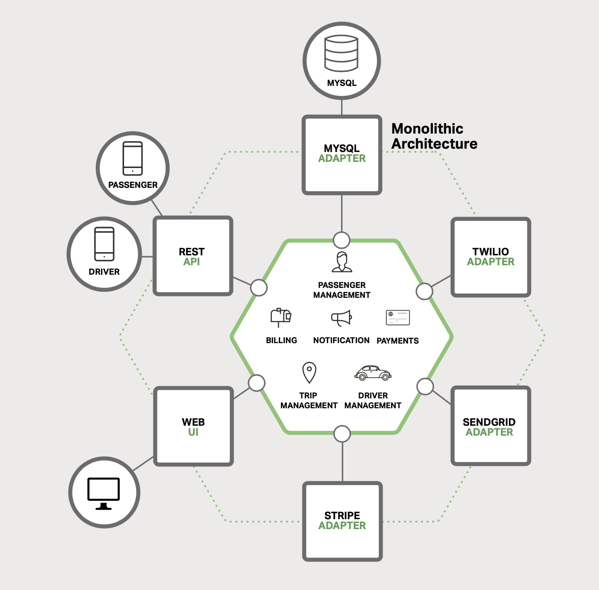

# 1 Introduction to Microservices

## Building Monolithic Applications

A sample taxi-hailing application.

Despite having a logically modular architecture, the application is packeged and
deployed as a monolith.

- simple to develop
- simple to test
- simple to deploy
- simple to scale

## Marching Toward Monolithic Hell

- application becomes large, complex
- hard to fully understand
- slows down development
- long start-up times, low performance
- hinder continuous deployment
- difficult to push changes into production many times a day
- have to do extensive manual testing
- difficult to scale
- low reliability
- difficult to adopt new frameworks and languages

## Microservices - Tackling the Complexity
