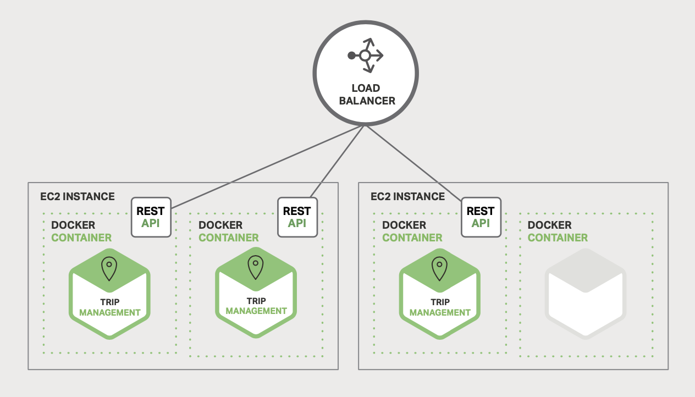

# 1 Introduction to Microservices

## Building Monolithic Applications

*A sample taxi-hailing application*.

Despite having a logically modular architecture, the application is packeged and
deployed as a monolith.

- simple to develop
- simple to test
- simple to deploy
- simple to scale

## Marching Toward Monolithic Hell

- application becomes large, complex
- hard to fully understand
- slows down development
- long start-up times, low performance
- hinder continuous deployment
- difficult to push changes into production many times a day
- have to do extensive manual testing
- difficult to scale
- low reliability
- difficult to adopt new frameworks and languages

## Microservices - Tackling the Complexity

*A monolithic application decomposed into microservices*.

### API Gateway

Mobile Apps used by users may not have direct access to the backend services.
The communication is mediated by an intermediary known as an **API Gateway**.
The API Gateway is responsible for tasks such as load balancing, caching, access
control, API metering, and monitoring.

### Scalability

*The Scale Cube, used in both development and delivery*.

- X-axis: running multiple identical copies of the applicatiion behind a load
  balancer.
- Y-axis: the Microservices Architecture pattern, decomposes the application
  into microservices
- Z-axis: data partitioning, where an attribute of the request is used to route
  the request to a particular server

*Deploying the Trip Management Service using Docker*.

*Database architecture for the taxi-hailing application*.

Rather than sharing a single database schema with other services, each service
has its own database schema. Moreover, a service can use a type of database that
is best suited to its needs, the so-called polyglot persistence architecture.

The Microservices Architecture pattern is similar to SOA (Service-oriented
architecture). With both approaches, the architecture consists of a set of
services. Microservice-based applications favor simpler, lightweight protocols
such as REST, rather than WS-* (Web service specifications). The Microservices
Architecture pattern also rejects other parts of SOA, such as the concept of a
canonical schema for data access.

## The Benefits of Microservices

1. It tackles the problems of complexity by decomposing a monolithic application
    into a set of services.
2. It enables each service to be developed independently by a team that is
    focused on that service. The developers are free to choose whatever
    technologies make sense. Since services are relativley small, it becomes
    more feasible to rewrite an old service using current technology.
3. It enables each microservice to be deployed independantly, makes continuous
    deployment possible.
4. It enables each service to be scaled independently.

## The Drawbacks of Microservices

*There are no silver bullets*.

1. The name itself: the term *microservice* places excessive emphasis on service
    size.

    Remember: Small services are a means to an end, not the primary goal. The
    goal of microservices is to sufficiently decomposes the application in order
    to facilitate agile application development and deployment.

2. Complexity of a microservices application as a distributed system.
    Inter-process communication error must be handled.
3. Partitioned database architecture is not easy. Transactions are common while
    their data entities are splitted in serveral different databases.
4. Testing a microservices application is much more complex. It need to launch
    services that it depends upon, or at least configure stubs for thoes
    services.
5. Changes might span multiple services.
6. Deploying a microservices application is much more complex.
7. Each service will have multiple runtime instances, which require many more
    moving parts that need to be configured, deployed, scaled, and monitored.
    Traditional trouble ticket-based and manual approaches to operations cannot
    scale to this level of complexity.
