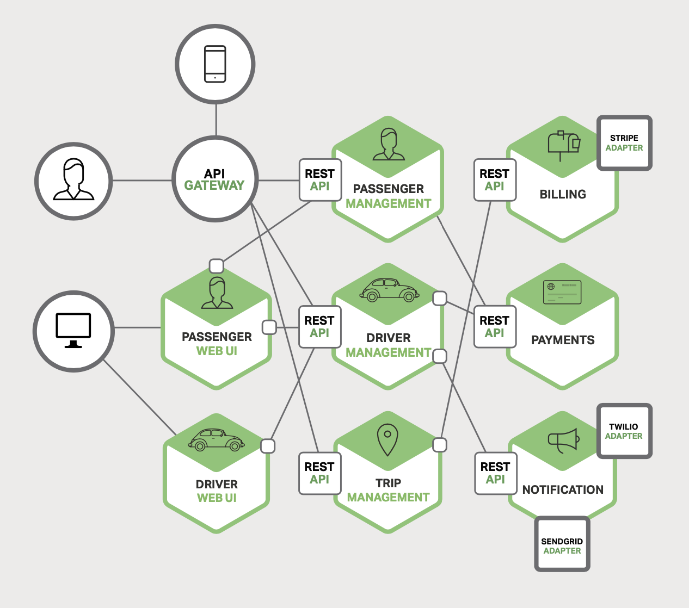
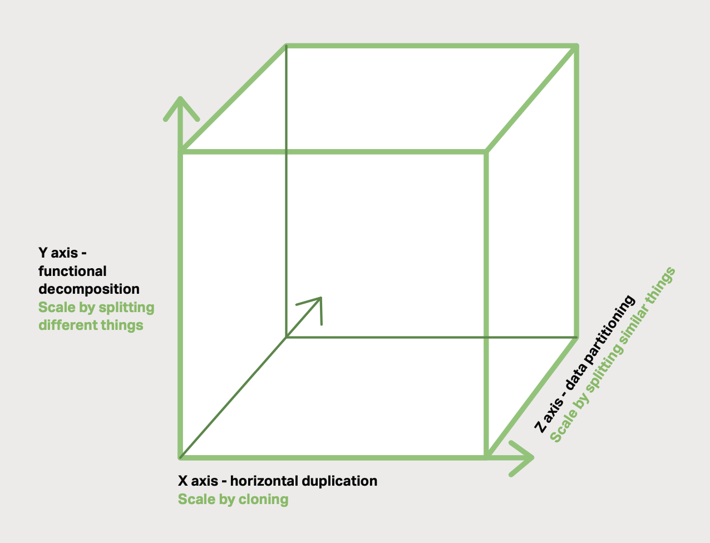
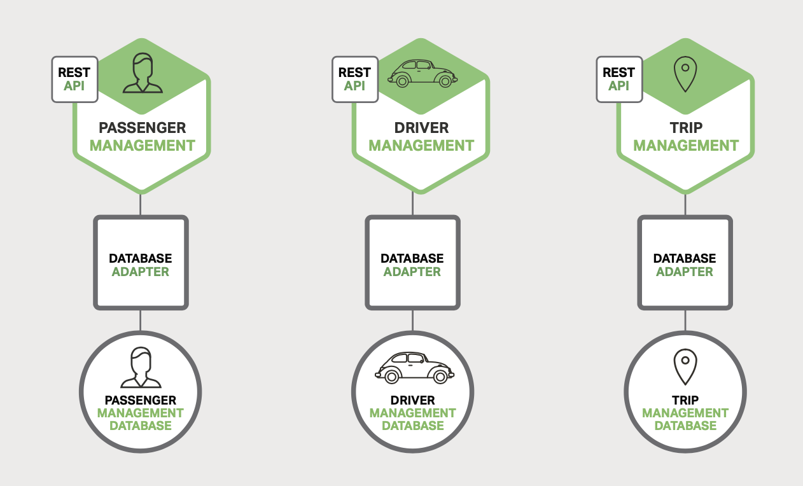

# 1 Introduction to Microservices

- [1 Introduction to Microservices](#1-introduction-to-microservices)
  - [Building Monolithic Applications](#building-monolithic-applications)
  - [Marching Toward Monolithic Hell](#marching-toward-monolithic-hell)
  - [Microservices - Tackling the Complexity](#microservices---tackling-the-complexity)
    - [API Gateway](#api-gateway)
    - [Scalability](#scalability)
  - [The Benefits of Microservices](#the-benefits-of-microservices)
  - [The Drawbacks of Microservices](#the-drawbacks-of-microservices)

## Building Monolithic Applications

*Figure 1-1. A sample taxi-hailing application*.

- Twilio: provides programmable communication tools for making and receiving
  phone calls, sending and receiving text messages, and performing other
  communication functions using its web service APIs.
- SendGrid: provides a cloud-based service that assists businesses with email
  delivery.
- Stripe: offers payment processing software and application programming
  interfaces (APIs) for e-commerce websites and mobile applications.

Despite having a logically modular architecture, the application is packeged and
deployed as a monolith.

- simple to develop
- simple to test
- simple to deploy
- simple to scale

## Marching Toward Monolithic Hell

- application becomes large, complex
  - hard to fully understand
  - slows down development
  - long start-up time, low performance
- hinder continuous deployment
  - difficult to push changes into production many times a day
  - have to do extensive manual testing
- difficult to scale
  - cannot choose different hardwares for defferent jobs respectively
- low reliability
  - one bug might influence the entire process
- difficult to adopt new frameworks and languages

## Microservices - Tackling the Complexity

*Figure 1-2. A monolithic application decomposed into microservices*.

### API Gateway

Mobile Apps used by users do not have direct access to the backend services.
The communication is mediated by an intermediary known as an **API Gateway**.
The API Gateway is responsible for tasks such as load balancing, caching, access
control, API metering, and monitoring.

### Scalability

*Figure 1-3. The Scale Cube, used in both development and delivery*.

- X-axis: Horizontal duplication, scale by **cloning**. That is running
  multiple identical copies of the applicatiion behind a load balancer.
- Y-axis: Functional decomposition, scale by **splitting different things**.
  That is what the Microservices Architecture pattern does, it decomposes the
  application into microservices.
- Z-axis: Data partitioning, scale by **splitting similar things**. Where an
  attribute of the request is used to route the request to a particular server

*Figure 1-4. Deploying the Trip Management service using Docker*.

*Figure 1-5. Database architecture for the taxi-hailing application*.

Rather than sharing a single database schema with other services, each service
has its own database schema. Moreover, a service can use a type of database that
is best suited to its needs, the so-called polyglot persistence architecture.

The Microservices Architecture pattern is similar to SOA (Service-oriented
architecture). With both approaches, the architecture consists of a set of
services. Microservice-based applications favor simpler, lightweight protocols
such as REST, rather than WS-* (Web service specifications). The Microservices
Architecture pattern also rejects other parts of SOA, such as the concept of a
[canonical schema](https://en.wikipedia.org/wiki/Canonical_schema_pattern)
for data access.

## The Benefits of Microservices

- It tackles the problem of complexity by decomposing a monolithic application
  into a set of services.
  - Individual services are faster to develop, easier to understand and
    maintain.
- It enables each service to be developed independently by a team that is
  focused on that service.
  - The developers are free to choose whatever technologies make sense.
  - Since services are relativley small, it becomes more feasible to rewrite an
    old service using current technology.
- It enables each microservice to be deployed independantly.
  - Makes continuous deployment easier.
  - Deployment on different hardwares is possible.
- It enables each service to be scaled independently.

## The Drawbacks of Microservices

*There are no silver bullets*.

- The name itself: the term *microservice* places excessive emphasis on service
  size. Small services are a means to an end, not the primary goal. The goal of
  microservices is to sufficiently decompose the application in order to
  facilitate agile application development and deployment.
- Complexity of a microservices application as a distributed system.
  Inter-process communication error must be handled.
- Partitioned database architecture is not easy. Transactions are common while
  their data entities are splitted in several different databases.
- Testing a microservices application is much more complex. It needs to launch
  services that it depends upon, or at least configure stubs for thoes services.
- Changes might span multiple services. Updates need to be done in specific
  order.
- Deploying a microservices application is much more complex.
  - Each service will have multiple runtime instances, which require many more
    moving parts that need to be configured, deployed, scaled, and monitored.
    Traditional trouble ticket-based and manual approaches to operations cannot
    scale to this level of complexity.
