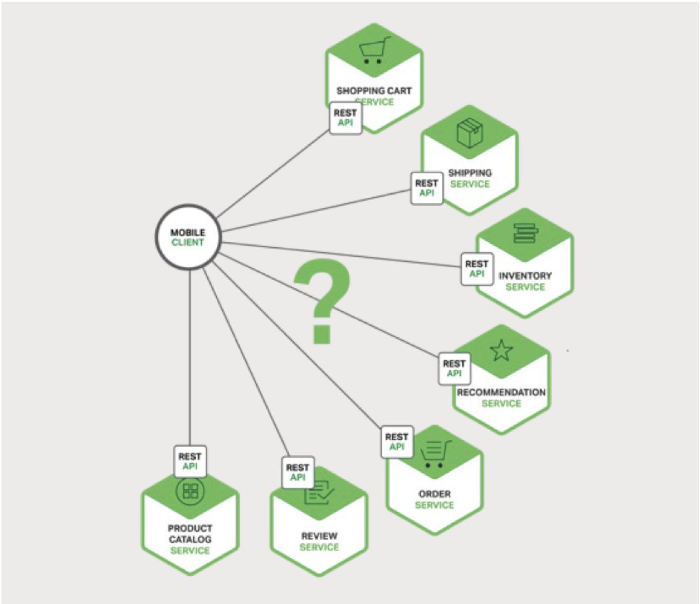
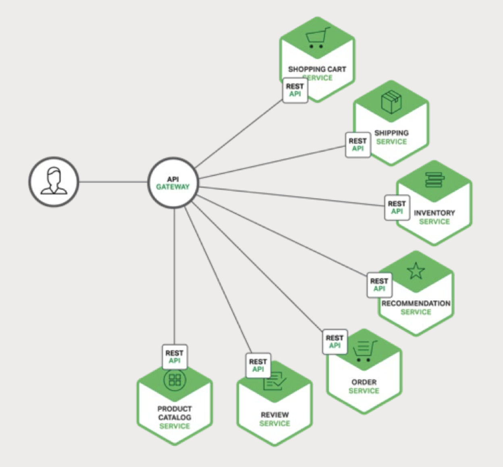

# 2 Using an API Gateway

- [2 Using an API Gateway](#2-using-an-api-gateway)
  - [Introduction](#introduction)
    - [A sample shopping application](#a-sample-shopping-application)
  - [Direct Client-to-Microservice Communication](#direct-client-to-microservice-communication)
  - [Using an API Gateway](#using-an-api-gateway)
  - [Benefits and Drawbacks of an API Gateway](#benefits-and-drawbacks-of-an-api-gateway)
  - [Implementing an API Gateway](#implementing-an-api-gateway)
    - [Performance and Scalability](#performance-and-scalability)
    - [Using a Reactive Programming Model](#using-a-reactive-programming-model)
    - [Service Invocation](#service-invocation)
    - [Service Discovery](#service-discovery)
    - [Handling Partial Failures](#handling-partial-failures)
    - [开源 API Gateway](#开源-api-gateway)

It's a question about how your application's clients interact with the
microservices.

## Introduction

### A sample shopping application

A product details page may display a lot of information:

1. Number of items in the shopping cart
2. Order history
3. Customer reviews
4. Low inventory warning
5. Shipping options
6. Various recommendations, including other products this product is frequently
    bought with, ...
7. Alternative purchasing options

When using a monolithic application architecture, a mobile client retrieves data
by making a single REST call to the application, such as:

```http
GET api.company.com/productdetails/productId
```

A load balancer routes the request to one of serveral identical application
instances. The application then queries various database tables and return the
response to the client.

When using the microservices architecture, the data displayed on the product
details page may be owned by multiple microservices:

- Shopping Cart Service - Number of items in the shopping cart
- Order Service - Order history
- Catalog Service - Basic product information, such as product name, image, and
  price
- Review Service - Customer reviews
- Inventory Service - Low inventory warning
- Shipping Service - Shipping options, deadlines, and costs, drawn separately
  from the shipping provider's API
- Recommendation Service(s) - Suggested items

*Figure 2-2. Mapping a mobile client’s needs to relevant microservices*.



So, how the mobile client accesses these services?

## Direct Client-to-Microservice Communication

In theory, a client could make requests to each of the microservices directly.
Each microservice would have a public endpoint:

```url
https://serviceName.api.company.name
```

Challenges and limitations:

- The client has to make multiple separate requests
- It makes the client code much more complex
- The microservices might use protocols that are not web-friendly
- It makes refactoring the microservices harder
- It makes authentication harder

## Using an API Gateway

An API Gateway is a server that is the single entry point into the system.

The API Gateway encapsulates the internal system architecture and provides an
API that is tailored to each client. It is responsible for request routing,
composition, and protocol translation.

It might have other responsibilities such as authentication, monitoring, load
balancing, caching, request shaping and management, and static response
handling.

*Figure 2-3. Using an API Gateway with microservices*.



All requests from clients first go through the API Gateway. It then routes
requests to the appropriate microservices. And handles the request by invoking
the various services - product information, reviews, etc. - and combining the
results.

## Benefits and Drawbacks of an API Gateway

Benefits:

- It encapsulates the internal structure of the application.
- It simplifies the client code.

Drawbacks:

- It is a highly available component that must be developed, deployed, and
  managed.
- It might become a development bottleneck, developers must update it in order
  to expose each microservice's endpoints.

## Implementing an API Gateway

### Performance and Scalability

- Asynchronous, non-blocking I/O
- NIO-based frameworks on JVM
- Node.js, a popular option, on non-JVM
- NGINX Plus

### Using a Reactive Programming Model

The API Gateway handles requests by invoking multiple backend services and
aggregating the results. In order to minimize response time, it should perform
independent requests concurrentlt. However, there are dependencies between
requests. Using traditional asynchronous callback approach will lead you to
callback hell. A better approach is to write API Gateway code in a declarative
style using a reactive approach.

### Service Invocation

There are two styles of inter-process communication.

- Asynchronous, messaging-based mechanism
- synchronous mechanism, such as HTTP

### Service Discovery

Application services might have dynamically assigned locations. The set of
instances of a service changes dynamically because of autoscaling and upgrades.
The API Gateway should be able to discover these instances either by sever-side
discovery or client-side discovery.

### Handling Partial Failures

The API Gateway should never block indefinitely waiting for a downstream
service. How it handles the failure depends on the specific scenario and which
service is failing.

### 开源 API Gateway

- Tyk
- Kong
- Orange
- Netflix Zuul
- apiaxle
