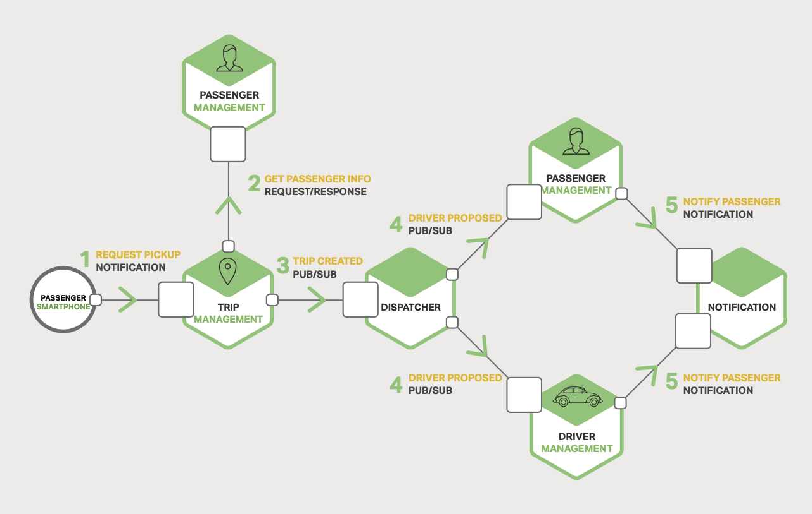

# 3 Inter-Process Communication

- [3 Inter-Process Communication](#3-inter-process-communication)
  - [Introduction](#introduction)
  - [Interaction Styles](#interaction-styles)
  - [Defining APIs](#defining-apis)
  - [Evolving APIs](#evolving-apis)
  - [Handling Partial Failure](#handling-partial-failure)
  - [IPC Technologies](#ipc-technologies)
  - [Asynchronous, Message-Based Communication](#asynchronous-message-based-communication)
  - [Synchronous, Request/Response IPC](#synchronous-requestresponse-ipc)
    - [REST](#rest)
    - [Thrift](#thrift)
  - [Message Formats](#message-formats)

## Introduction

A microservices-based application is a distributed system running on multiple
machines. Thus services must interact using an inter-process communication (IPC)
mechanism.

*Figure 3-1. Microservices use inter-process communication to interact*.


## Interaction Styles

Interaction styles are categorized along two dimensions:

- one-to-one or one-to-many:
  - One-to-one: Each client request is processed by exactly one service
    instance.
  - One-to-many: Each request is processed by multiple service instances.
- whether the interaction is synchronous or asynchronous
  - Synchronous: The client expects a timely response from the service and might
    even block while it waits.
  - Asynchronous: The client doesn't block while waiting for a response, and the
    response isn't necessarily sent immediately.

*Table 3-1. Inter-process communication styles*.

| \            | ONE-TO-ONE             | ONE-TO-MANY             |
| ------------ | ---------------------- | ----------------------- |
| SYNCHRONOUS  | Request/response       | -                       |
| ASYNCHRONOUS | Notification           | Publish/subscribe       |
|              | Request/async response | Publish/async responses |

*Figure 3-2. Using multiple IPC mechanisms for service interactions*.



## Defining APIs

It's important to precisely define a service's API using some kind of interface
definition language (IDL). The nature of API definition depends on which IPC
mechanism you are using. If you are using messaging, the API consists of the
message channels and the message types. If you are using HTTP, the API consists
of the URLs and the request and response formats.

## Evolving APIs

A service's API invariably changes over time. In a monolithic application it is
straightforward to change the API and update all the callers. In a
microservices-based application, clients that use an older API should continue
to work with the new version of the service. **The service provides default
values for the missing request attributes** and the clients ignore any extra
response attributes.

Sometimes major, incompatible changes to an API have to be made. A service must
support older versions of the API for some period of time. For HTTP-based API,
one approach is to embed the version number in the URL.

## Handling Partial Failure

*Figure 3-3. Threads block due to an unresponsive service*.


The strategies for dealing with partial failures include:

- **Network timeouts**: Never block indefinitely and always use timeouts when
  waiting for a response.
- **Limiting the number of outstanding requests**: Impose an upper bound on the
  number of outstanding requests that a client can have with a particular
  service. If the limit has been reached, it is probably pointless to make
  additional requests, and those attempts need to fail immediately.
- **Circuit breaker pattern**: Track the number of successful and failed
  requests. If the error rate exceeds a configured threshold, trip (断开) the
  circuit breaker so that further attempts fail immediately. After a timeout
  period, the client should try again and, if successful, close the circuit
  breaker.
- **Provide fallbacks**: Perform fallback logic when a request fails. For
  example, return cached data or a default value.

## IPC Technologies

- synchronous
  - request/response-based
    - HTTP-based REST
    - Apache Thrift
- asynchronous
  - message-based
    - AMQP
    - STOMP

## Asynchronous, Message-Based Communication

A client makes a request to a service by sending it a message. If the service is
expected to reply, it does so by sending a separate message back to the client.
The client is written assuming that the reply will not be received immediately.

A message consists of headers and a message body. Messages are exchanged over
channels. There are two kinds of channels:

- **point-to-point** channel: it delevers a message to exactly one of the
  consumers that are reading from the channel. Services use point-to-point
  channels for the one-to-one interaction style.
- **publish-subscribe** channel: it delivers each message to all of the attached
  consumers. Services use publish-subscribe for the one-to-many interaction
  style.

*Figure 3-4. Using publish-subscribe channels in a taxi-hailing application*.


Open source messaging systems:

- RabbitMQ
- Apache Kafka
- Apache ActiveMQ
- NSQ

Advantages to using messaging:

- **Decouples the client from the service**: A client makes a request simply by
  sending a message to the appropriate channel. It dose not need to use
  discovery mechanism to determine the location of a service instance.
- **Message buffering**: A message broker queues up the messages written to a
  channel until the consumer can process them.
- **Flexible client-service interactions**: Messaging supports many kinds of
  interaction styles.
- **Explicit inter-process communication**: Messaging makes inter-process
  communication explicit so developers are not lulled into a false sense of
  security.

Downsides to using messaging:

- **Additional operational complexity**: The message broker is yet another
  system component that must be managed.
- **Complexity of implementing request/response-based interaction**:
  Each request message must contain a reply channel identifier and a correlation
  identifier.

## Synchronous, Request/Response IPC

When using a synchronous, request/response-based IPC mechanism, unlike when
using messaging, the client assumes that the response will arrive in a timely
fashion.

There are two popular protocols, REST and Thrift.

### REST

A key concept in REST is a resource, which typically represents a business
object or a collection of such bussiness objects. REST uses the HTTP verbs
for manipulating resources, which are referenced using a URL.

*Figure 3-5. A taxi-hailing application uses RESTful interaction*.


*Leonard Richardson* defines a very useful maturity model for REST that consists
of the following levels:

- **Level 0**: Clients of a level 0 API invoke the service by making HTTP `POST`
  request to its sole URL endpoint. Each request specifies the action to
  perform, the target of the action, and any parameters.

  ```http
  POST /receive

  {
    "action": "add_user",
    "user": {
      ...
    }
  }

  POST /receive
  {
    "action": "del_user",
    "user_id": 1
  }
  ```

- **Level 1**: A level 1 API supports the idea of resources. To perform an
  action on a resource, a client makes a `POST` request that specifies the
  action to perform and any parameters.

  ```http
  POST /users/1

  {
    "action": "delete"
  }

  POST /users/2
  {
    "action": "update"
    "user": {
      "name": "xiaoming",
      ...
    }
  }
  ```

- **Level 2**: A level 2 API uses HTTP verbs to perform actions: `GET` to
  retrieve, `POST` to create, and `PUT` to update. The request query parameters
  and body specify the action's parameters. This enables services to leverage
  web infrastructure such as caching for `GET` requests.

  ```http
  GET /users/1

  DELETE /users/2

  PUT /users/2
  {
    "name": "xiaoming",
    ...
  }
  ```

- **Level 3**: The design of a level 3 API is based on the terribly named
  principle, HATEOAS (Hypertext As The Engine Of Application State). The basic
  idea is that the representation of a resource returned by a `GET` request
  contains links for performing the allowable actions on that resource.

  ```http
  GET /api/v1/users/1
  {
    "actions": {
      "UPDATE": "https://1.a.com/api/v1/users/2"
    }
  }

  GET /api/v1/users/2
  {
    "actions": {
      "UPDATE": "https://1.a.com/api/v1/users/2"
      "DELETE": "https://1.a.com/api/v2/users/2",
    }
  }
  ```

  Benefits of HATEOAS:
  
  - Need not to hardcode many URLs into client.
  - The client does not have to guess what actions can be performed on a
    resource.

Benefits to using a protocol that is based on HTTP:

- HTTP is simple and familiar.
- It is easy to test an HTTP API (postman, curl, ...).
- It directly supports request/response-style communication.
- HTTP is firewall-friendly.
- It doesn't require an intermediate broker, which simplifies the system's
  architecture.

Drawbacks to using HTTP:

- HTTP only directly supports the request/response style of interaction.
- The client and service communicate directly without an intermediary to buffer
  messages.
- The client must know the location (URL) of each service instance. Clients must
  use a service discovery mechanism to locate service instances.

There are interface definition languages like **RAML** and **Swagger** for
RESTful APIs.

### Thrift

Apache Thrift is a framework for writing cross-language RPC clients and servers.
It provides a C-style IDL for defining APIs.

## Message Formats

>>>>> progress
